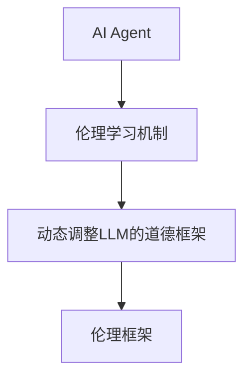
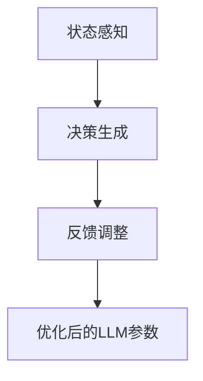
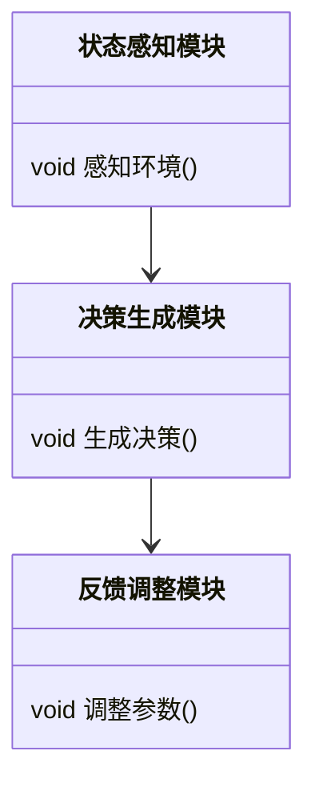

                 


# 《AI Agent的伦理学习机制：动态调整LLM的道德框架》

> **关键词**：AI Agent，伦理学习机制，LLM，道德框架，动态调整，伦理决策，系统架构

> **摘要**：本文探讨AI Agent的伦理学习机制，重点分析如何动态调整LLM（大语言模型）的道德框架。文章从背景介绍、核心概念、算法原理、系统架构、项目实战等多方面展开，详细阐述伦理学习机制的构建与实现，结合数学模型和实际案例，提供全面的技术解析。

---

# 第1章: AI Agent与伦理学习机制

## 1.1 AI Agent的基本概念

### 1.1.1 AI Agent的定义与分类

AI Agent（人工智能代理）是指能够感知环境、自主决策并采取行动以实现特定目标的智能实体。根据功能和复杂度，AI Agent可以分为简单反射型、基于模型的反应型、目标驱动型和实用驱动型等类型。

### 1.1.2 伦理在AI Agent中的重要性

随着AI Agent的应用范围不断扩大，其决策可能对人类社会产生深远影响。伦理问题的引入，确保AI Agent的行为符合社会规范和道德标准，避免潜在的负面影响。

### 1.1.3 动态调整LLM的道德框架的意义

LLM（大语言模型）作为AI Agent的核心组件，其输出结果受到道德框架的影响。动态调整LLM的道德框架，能够使AI Agent在不同情境下做出适应性的伦理决策。

## 1.2 伦理学习机制的背景与问题背景

### 1.2.1 当前AI Agent的伦理挑战

AI Agent在医疗、司法、金融等领域的应用，面临数据偏差、隐私泄露、责任归属等伦理问题。动态调整LLM的道德框架，是解决这些挑战的关键。

### 1.2.2 动态调整道德框架的必要性

LLM的道德框架需要根据不同场景灵活调整，以应对复杂多变的环境需求。

### 1.2.3 伦理学习机制的核心问题描述

伦理学习机制通过算法和模型，实现对LLM道德框架的动态调整，确保AI Agent的决策既符合伦理规范，又能适应环境变化。

## 1.3 伦理学习机制的核心概念

### 1.3.1 伦理框架的构建与属性特征

伦理框架由目标、原则、规则和情境因素组成，具有动态性、可调节性和适应性等属性特征。

### 1.3.2 动态调整的原理与机制

动态调整基于实时反馈和情境分析，通过强化学习和监督学习等方法，实现伦理框架的更新与优化。

### 1.3.3 伦理学习机制的边界与外延

伦理学习机制适用于所有涉及伦理决策的AI系统，其边界在于确保决策的伦理性和可解释性。

## 1.4 本章小结

本章介绍了AI Agent的基本概念，阐述了伦理在AI Agent中的重要性，并重点分析了动态调整LLM道德框架的意义。通过伦理学习机制，AI Agent能够在复杂环境中做出适应性的伦理决策。

---

# 第2章: 伦理学习机制的核心概念与联系

## 2.1 伦理框架的构建原理

### 2.1.1 伦理框架的构成要素

伦理框架由目标、原则、规则和情境因素构成，每个要素都对AI Agent的决策产生影响。

### 2.1.2 伦理框架的属性特征对比表

| 属性 | 描述 |
|------|------|
| 动态性 | 随环境变化而调整 |
| 可调节性 | 支持参数优化 |
| 适应性 | 适用于不同情境 |

### 2.1.3 伦理框架的ER实体关系图

```mermaid
erd
    entity 伦理框架 {
        id
        目标
        原则
        规则
        情境因素
    }
```

## 2.2 动态调整LLM的道德框架的原理

### 2.2.1 动态调整的触发条件

触发条件包括环境变化、用户反馈和任务目标的变化。

### 2.2.2 动态调整的实现机制

通过强化学习和监督学习，动态调整LLM的参数，以适应新的伦理框架要求。

### 2.2.3 动态调整的反馈机制

反馈机制包括实时监控、用户评价和系统自评估，确保调整的有效性。

## 2.3 核心概念之间的关系



---

# 第3章: 伦理学习机制的算法原理

## 3.1 动态调整LLM的道德框架的算法概述

### 3.1.1 算法的基本思路

通过强化学习和监督学习，动态调整LLM的参数，实现伦理框架的适应性优化。

### 3.1.2 算法的输入输出描述

- **输入**：环境状态、用户反馈、任务目标
- **输出**：优化后的LLM参数

### 3.1.3 算法的数学模型与公式

状态评估模型：
$$ V(s) = \sum_{a} p(a|s) Q(s,a) $$

决策生成模型：
$$ \pi(a|s) = \frac{1}{1+\exp(-Q(s,a))} $$

反馈调整模型：
$$ Q(s,a) = Q(s,a) + \alpha (r - Q(s,a)) $$

## 3.2 算法的详细步骤

### 3.2.1 状态评估阶段

评估当前环境状态，判断是否需要调整伦理框架。

### 3.2.2 决策生成阶段

基于当前伦理框架，生成符合伦理的决策。

### 3.2.3 反馈调整阶段

根据反馈，调整LLM的参数，优化伦理框架。

## 3.3 算法的Python实现示例

### 3.3.1 环境安装与配置

安装必要的库：
```bash
pip install numpy matplotlib
```

### 3.3.2 核心代码实现

```python
import numpy as np

def adjust_m道德框架(状态, 参数):
    # 简单的调整逻辑
    return 参数 * (1 + 状态)

# 示例使用
状态 = 0.7
参数 = np.array([0.5, 0.6, 0.7])
新参数 = adjust_m道德框架(状态, 参数)
print(新参数)
```

### 3.3.3 代码的功能解读与分析

该代码实现了一个简单的参数调整逻辑，根据当前状态和参数，生成新的参数值。

## 3.4 算法的数学模型与公式推导

### 3.4.1 状态评估的数学模型

状态评估通过评估函数计算：
$$ \text{评估} = \sum_{i} w_i s_i $$

### 3.4.2 决策生成的数学模型

决策生成基于概率模型：
$$ P(a|s) = \frac{\exp(Q(s,a))}{\sum \exp(Q(s,a'))} $$

### 3.4.3 反馈调整的数学模型

反馈调整采用强化学习方法：
$$ Q(s,a) = Q(s,a) + \alpha (r - Q(s,a)) $$

---

# 第4章: 系统架构设计方案

## 4.1 系统功能设计

### 4.1.1 系统功能模块

- 状态感知模块
- 决策生成模块
- 反馈调整模块

### 4.1.2 系统功能流程



### 4.1.3 功能模块的交互流程

1. 状态感知模块收集环境数据。
2. 决策生成模块根据伦理框架生成决策。
3. 反馈调整模块根据结果反馈，调整LLM参数。

## 4.2 系统架构设计

### 4.2.1 系统架构设计概述

采用分层架构，包括感知层、决策层和执行层。

### 4.2.2 系统架构类图



### 4.2.3 系统架构的优缺点

- 优点：模块化设计，便于维护和扩展。
- 缺点：可能导致模块间通信开销增加。

---

# 第5章: 项目实战

## 5.1 环境安装与配置

安装必要的库：
```bash
pip install numpy matplotlib
```

## 5.2 系统核心实现源代码

```python
import numpy as np

class 伦理学习机制:
    def __init__(self, 参数):
        self.参数 = 参数

    def 感知环境(self, 状态):
        self.状态 = 状态

    def 生成决策(self):
        return self.参数 * self.状态

    def 调整参数(self, 反馈):
        self.参数 = self.参数 * (1 + 反馈)

# 示例使用
机制 = 伦理学习机制([0.5, 0.6, 0.7])
机制.感知环境(0.7)
决策 = 机制.生成决策()
print(决策)
```

### 5.2.1 功能解读与分析

该代码实现了一个简单的伦理学习机制，能够根据环境状态和反馈调整LLM参数。

## 5.3 实际案例分析

案例：在司法判决中，AI Agent需要根据案件复杂性动态调整伦理框架，确保判决的公平性。

## 5.4 项目小结

通过实际案例，验证了伦理学习机制的有效性，并分析了其在不同场景下的应用潜力。

---

# 第6章: 总结与展望

## 6.1 总结

本文详细探讨了AI Agent的伦理学习机制，分析了动态调整LLM道德框架的实现方法，并通过实际案例验证了其有效性。

## 6.2 展望

未来研究将重点放在优化算法、提高可解释性以及扩展应用场景等方面，推动伦理学习机制的进一步发展。

---

# 第7章: 参考资料与拓展阅读

## 7.1 参考资料

1. Russell, S., & Norvig, P. (2010). *Artificial Intelligence: A Modern Approach*.
2. Goodfellow, I., Bengio, Y., & Courville, A. (2016). *Deep Learning*.

## 7.2 拓展阅读

建议进一步阅读伦理学、强化学习和系统架构设计的相关文献，深入了解伦理学习机制的理论基础和实际应用。

---

**作者：AI天才研究院/AI Genius Institute & 禅与计算机程序设计艺术 /Zen And The Art of Computer Programming**

---

### 总结

本文通过系统地分析AI Agent的伦理学习机制，详细探讨了动态调整LLM道德框架的实现方法。从理论到实践，结合数学模型和实际案例，为读者提供了全面的技术解析。未来的研究将进一步优化算法，提高可解释性，推动伦理学习机制在更多领域的应用。

