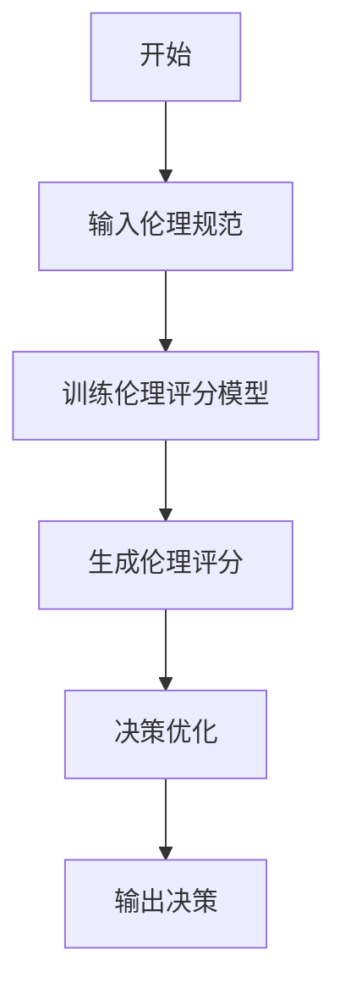
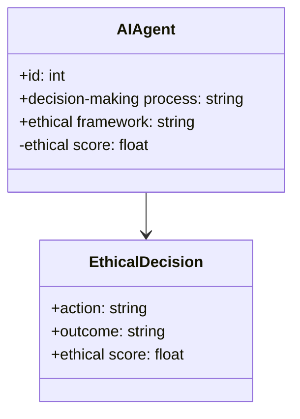
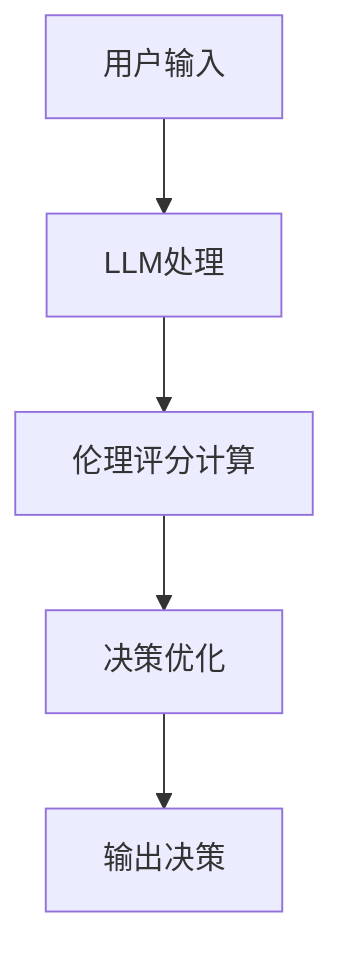

                 


# AI Agent的伦理学习：在LLM中植入道德决策框架

> 关键词：AI Agent，伦理学习，LLM，道德决策框架，人工智能，伦理决策

> 摘要：本文探讨了在大语言模型（LLM）中植入道德决策框架的重要性，分析了伦理学习的核心概念，详细讲解了算法原理和数学模型，并通过系统架构设计和项目实战展示了如何在AI Agent中实现伦理决策。本文旨在为AI开发者和研究人员提供一套在LLM中嵌入伦理决策的系统化方法。

---

## 第一部分：AI Agent与伦理学习的背景介绍

### 第1章：AI Agent与伦理学习的背景

#### 1.1 问题背景

- **1.1.1 AI Agent的定义与核心功能**
  AI Agent是一种智能体，能够感知环境、自主决策并执行任务，具备学习和推理能力，广泛应用于自动驾驶、智能助手、机器人等领域。

- **1.1.2 当前AI Agent面临的伦理挑战**
  AI Agent的决策可能引发伦理问题，如自动驾驶中的事故责任分配、智能助手的隐私泄露等，这些问题可能带来法律和道德风险。

- **1.1.3 伦理学习的重要性与必要性**
  伦理学习是确保AI Agent行为符合伦理规范的关键，避免决策失误带来的负面影响，提升用户信任。

#### 1.2 问题描述

- **1.2.1 AI Agent决策的潜在伦理风险**
  例如，自动驾驶在紧急情况下可能需要在不同后果中选择，这种决策涉及复杂的伦理判断。

- **1.2.2 用户需求与伦理决策的矛盾**
  用户可能希望AI Agent优先完成任务，而忽视潜在的伦理问题，导致决策冲突。

- **1.2.3 伦理框架在AI Agent中的缺失问题**
  当前AI Agent的决策机制多基于任务优化，缺乏系统化的伦理评估，可能导致负面后果。

#### 1.3 问题解决

- **1.3.1 伦理学习的目标与意义**
  通过伦理学习，AI Agent能够理解并遵循伦理规范，做出符合道德标准的决策。

- **1.3.2 在LLM中植入伦理决策框架的可行性**
  利用LLM的自然语言处理能力，可以将伦理框架嵌入模型，使其在生成决策时考虑伦理因素。

- **1.3.3 伦理学习的核心技术与实现路径**
  包括伦理知识的表示、伦理评分机制的设计、伦理决策的训练方法。

#### 1.4 边界与外延

- 伦理学习的边界：明确伦理决策的适用范围，如仅限于特定场景或任务类型。
- 伦理学习的外延：探讨伦理决策与其他AI功能（如推荐系统、对话生成）的结合。

---

## 第二部分：伦理学习的核心概念与联系

### 第2章：伦理学习的核心概念

#### 2.1 核心概念原理

- 伦理学习的核心是将伦理规范转化为可计算的表示，整合到AI Agent的决策过程中。

#### 2.2 概念属性特征对比

| 概念       | 属性特征                   |
|------------|---------------------------|
| 伦理决策   | 基于伦理规范的判断         |
| 传统监督学习 | 基于任务目标的优化         |
| 强化学习    | 基于奖励机制的策略优化       |

#### 2.3 ER图展示

```mermaid
erd
  entity AI Agent {
    id
    decision-making process
    ethical framework
  }
  entity Ethical Decision {
    action
    outcome
    ethical score
  }
  AI Agent --> Ethical Decision
```

---

## 第三部分：算法原理讲解

### 第3章：伦理评分机制的实现

#### 3.1 算法流程



#### 3.2 Python代码实现

```python
def ethical_score(action, context, framework):
    # 根据伦理框架评估行动的伦理得分
    score = 0
    for rule in framework:
        if rule.applies_to(context):
            score += rule.evaluate(action, context)
    return score

# 示例伦理框架
class Rule:
    def applies_to(self, context):
        # 定义规则适用的条件
        pass

    def evaluate(self, action, context):
        # 定义规则的评估方法
        pass

# 训练伦理评分模型
def train_ethical_model(data, framework):
    model = ...  # 初始化模型
    for example in data:
        score = ethical_score(example.action, example.context, framework)
        model.update(score, example.outcome)
    return model
```

#### 3.3 数学模型

$$ \text{伦理评分} = \sum_{i=1}^{n} w_i \cdot r_i $$

其中，$w_i$ 是权重，$r_i$ 是规则评分。

---

## 第四部分：系统分析与架构设计

### 第4章：系统架构设计

#### 4.1 领域模型设计



#### 4.2 系统架构设计



---

## 第五部分：项目实战

### 第5章：项目实战

#### 5.1 环境安装

安装所需的库：

```bash
pip install transformers mermaid4jupyter
```

#### 5.2 核心代码实现

```python
def ethical_agent():
    # 初始化LLM模型
    model = AutoModelForCausalLM.from_pretrained('gpt2')
    # 定义伦理框架
    framework = {
        'rule1': Rule1(),
        'rule2': Rule2()
    }
    # 训练伦理评分模型
    ethical_model = train_ethical_model(train_data, framework)
    # 进行决策
    decision = make_decision(input, ethical_model)
    return decision
```

#### 5.3 代码解读与分析

- 初始化LLM模型：加载预训练模型，准备进行伦理评分计算。
- 定义伦理框架：根据具体场景定义伦理规则。
- 训练伦理评分模型：通过训练数据优化模型参数。
- 决策过程：结合伦理评分和任务目标，生成最终决策。

#### 5.4 案例分析

- **案例1**：自动驾驶在紧急情况下的决策。
- **案例2**：智能助手在用户隐私问题上的处理。

#### 5.5 项目小结

通过实际项目，验证了在LLM中植入伦理框架的有效性，提高了AI Agent的伦理决策能力。

---

## 第六部分：总结与展望

### 第6章：总结与展望

#### 6.1 小结

本文详细探讨了在LLM中植入伦理决策框架的必要性与实现方法，展示了如何通过算法和系统设计确保AI Agent的伦理决策能力。

#### 6.2 注意事项

- 伦理框架需根据具体场景调整。
- 道德决策的边界需明确，避免过度干预。

#### 6.3 拓展阅读

推荐相关书籍和论文，深入探讨伦理学习的前沿研究。

---

# 作者：AI天才研究院/AI Genius Institute & 禅与计算机程序设计艺术 /Zen And The Art of Computer Programming

