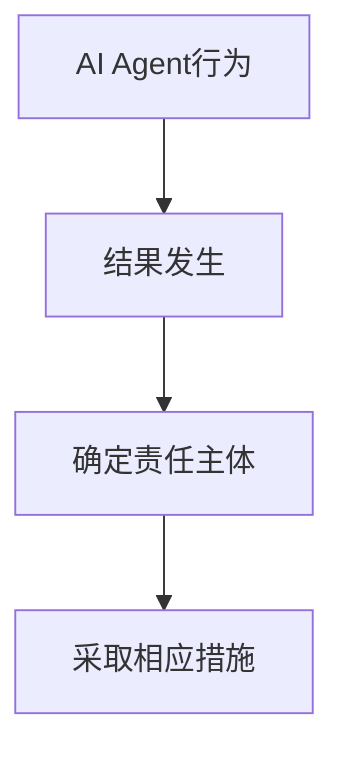
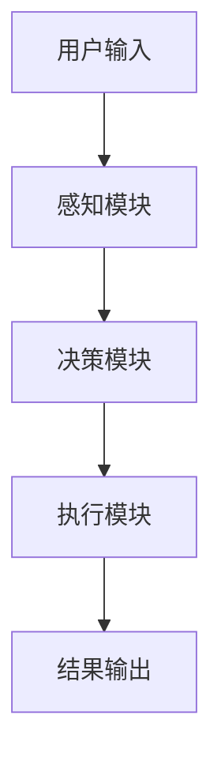
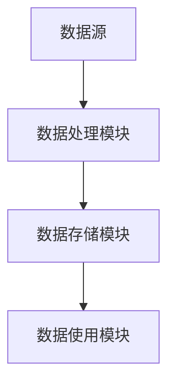

                 


# AI Agent的伦理设计：遵循AI伦理准则

---

## 关键词：AI Agent, 伦理设计, 人工智能, 数据隐私, 责任追溯, 透明性, 伦理准则

---

## 摘要

AI Agent作为人工智能技术的核心组成部分，正在逐步渗透到我们生活的方方面面。从智能音箱到自动驾驶汽车，从医疗诊断系统到金融投资顾问，AI Agent的应用场景越来越广泛。然而，随着AI Agent的智能化和自主化程度的提升，其在实际应用中也暴露出了一系列伦理问题。这些伦理问题不仅关系到技术的健康发展，更关系到人类社会的和谐与进步。本文将从AI Agent的伦理设计角度出发，系统地探讨其背后的伦理原则、决策机制、系统架构以及实际案例，旨在为AI Agent的开发者和研究者提供一份全面的伦理设计指南。

---

## 第1章：AI Agent与伦理设计概述

### 1.1 AI Agent的基本概念

#### 1.1.1 AI Agent的定义与分类

AI Agent（人工智能代理）是指能够感知环境并采取行动以实现目标的智能实体。根据其智能水平和应用领域，AI Agent可以分为以下几类：

1. **反应式AI Agent**：基于当前感知做出实时反应，适用于简单任务，如智能音箱。
2. **认知式AI Agent**：具备复杂推理和规划能力，适用于自动驾驶汽车、医疗诊断系统等复杂场景。
3. **协作式AI Agent**：能够与其他AI Agent或人类进行协作，完成分布式任务，如多智能体系统。

#### 1.1.2 AI Agent的核心特征

AI Agent的核心特征包括：

1. **自主性**：能够在没有外部干预的情况下独立运行。
2. **反应性**：能够实时感知环境并做出响应。
3. **目标导向性**：通过目标驱动行为，实现预定任务。
4. **学习能力**：能够通过数据和经验优化自身行为。

#### 1.1.3 伦理设计的必要性

AI Agent的广泛应用带来了诸多伦理挑战，例如数据隐私、责任追溯、算法偏见等。伦理设计不仅是技术发展的需要，更是社会对AI技术的信任基础。通过伦理设计，可以确保AI Agent的行为符合社会规范和人类价值观。

---

## 第2章：AI伦理的核心原则

### 2.1 透明性

透明性是AI Agent伦理设计的基础原则之一，要求AI Agent的行为和决策过程对用户和利益相关者公开、可解释。以下是透明性在AI Agent中的具体体现：

1. **用户知情权**：用户需要了解AI Agent的工作原理和数据使用方式。
2. **可解释性**：AI Agent的决策过程需要能够被人类理解和解释。

**对比表格：透明性与其他伦理原则的对比**

| 原则 | 定义 | 目的 |
|------|------|------|
| 透明性 | 公开AI Agent的行为和决策过程 | 建立用户信任，确保可解释性 |
| 责任 | 明确AI Agent及其开发者/使用者的责任归属 | 确保 accountability 和追责机制 |

### 2.2 责任与可追溯性

责任与可追溯性是AI Agent伦理设计中的关键原则，主要解决以下问题：

1. **责任分配**：当AI Agent的行为导致负面结果时，如何确定责任归属？
2. **可追溯性**：如何通过技术手段记录AI Agent的行为，以便于事后追溯？

**Mermaid图：责任分配的流程图**



### 2.3 隐私与数据安全

隐私与数据安全是AI Agent伦理设计中的核心问题，主要涉及以下方面：

1. **数据收集与使用**：AI Agent在运行过程中会收集大量数据，如何确保这些数据的隐私性？
2. **数据保护**：如何防止数据泄露或被恶意利用？

**数学模型：数据隐私保护的数学模型**

假设我们有一个AI Agent，其行为受到数据隐私保护的约束。我们可以用以下公式表示：

$$
\text{Privacy} = \sum_{i=1}^{n} \text{Data}_i \times \text{Protection}_i
$$

其中，$\text{Data}_i$ 表示第i个数据的敏感性，$\text{Protection}_i$ 表示第i个数据的保护强度。

---

## 第3章：AI Agent的决策机制

### 3.1 算法嵌入伦理准则

AI Agent的决策机制需要将伦理准则嵌入到算法设计中。以下是几种常见的算法嵌入方式：

1. **基于规则的嵌入**：通过预定义的伦理规则约束AI Agent的决策空间。
2. **基于目标的嵌入**：通过优化目标函数，将伦理准则转化为数学约束条件。

**Python代码示例：基于规则的伦理决策算法**

```python
def ethical_decision(rules, context):
    for rule in rules:
        if rule.applies_to(context):
            return rule.recommended_action(context)
    # 如果没有适用的规则，返回默认行为
    return default_behavior(context)
```

### 3.2 数学模型与公式

在AI Agent的决策过程中，我们需要用数学模型来量化伦理准则的影响。例如，我们可以用以下公式表示AI Agent的决策风险：

$$
\text{Risk} = \sum_{i=1}^{n} \text{Ethical}_i \times \text{Probability}_i
$$

其中，$\text{Ethical}_i$ 表示第i个决策的伦理影响，$\text{Probability}_i$ 表示第i个决策发生的概率。

---

## 第4章：AI系统的架构设计

### 4.1 系统架构设计

AI Agent的系统架构设计需要考虑伦理准则的融入。以下是常见的系统架构设计方法：

1. **模块化设计**：将伦理准则模块化，独立于其他功能模块。
2. **分层设计**：将伦理准则嵌入到不同层次的系统模块中。

**Mermaid图：AI Agent的系统架构设计**



### 4.2 数据流分析

AI Agent的数据流分析需要考虑隐私和数据安全问题。以下是数据流的分析步骤：

1. **数据收集**：明确数据收集的范围和方式。
2. **数据处理**：对数据进行清洗、转换和分析。
3. **数据存储**：确保数据的存储安全。

**Mermaid图：数据流分析**



---

## 第5章：案例分析与实际应用

### 5.1 自动驾驶汽车

自动驾驶汽车是一个典型的AI Agent应用案例。以下是其伦理设计的关键点：

1. **紧急情况下的决策**：当自动驾驶汽车面临紧急情况时，如何在有限时间内做出符合伦理的决策？
2. **责任分配**：当自动驾驶汽车发生事故时，责任如何分配？

**案例分析：自动驾驶汽车的伦理决策**

自动驾驶汽车在紧急情况下需要在毫秒级别做出决策。我们可以用以下公式表示决策过程：

$$
\text{Decision} = \argmin_{a} \text{Risk}(a)
$$

其中，$\text{Risk}(a)$ 表示选择行动$a$带来的风险。

### 5.2 医疗AI系统

医疗AI系统在伦理设计中需要考虑患者隐私和数据安全问题。以下是其关键点：

1. **患者数据的隐私保护**：如何确保患者数据的隐私性？
2. **医疗决策的可解释性**：如何确保医疗AI系统的决策过程对医生和患者透明？

---

## 第6章：法律与社会影响

### 6.1 法律法规

AI Agent的伦理设计需要遵守相关法律法规。以下是需要考虑的主要法律法规：

1. **数据隐私法**：如欧盟的GDPR（通用数据保护条例）。
2. **人工智能法规**：如欧盟的人工智能法案。

### 6.2 社会影响

AI Agent的伦理设计不仅影响技术的发展，还会影响社会的价值观和伦理观念。以下是需要考虑的主要社会影响：

1. **就业市场的变化**：AI Agent的应用可能会影响某些行业的就业。
2. **社会信任**：公众对AI Agent的信任程度直接影响其广泛应用。

---

## 第7章：未来展望与挑战

### 7.1 未来发展方向

AI Agent的伦理设计未来将朝着以下方向发展：

1. **更加智能化**：AI Agent将具备更强的自主学习和决策能力。
2. **更加人性化**：AI Agent的行为将更加符合人类的价值观和伦理规范。

### 7.2 挑战与应对

AI Agent的伦理设计面临以下主要挑战：

1. **技术复杂性**：如何在复杂环境下确保AI Agent的伦理行为？
2. **社会接受度**：如何提高公众对AI Agent的信任和接受度？

---

## 附录

### 附录A：AI伦理准则清单

1. **透明性**：公开AI Agent的行为和决策过程。
2. **责任**：明确AI Agent及其开发者的责任归属。
3. **隐私**：保护用户的隐私和数据安全。

### 附录B：工具推荐

1. **伦理审查工具**：用于审查AI Agent的伦理设计。
2. **隐私保护工具**：用于保护用户数据的隐私。

### 附录C：进一步阅读

1. **书籍**：《AI Ethics: A Guide to the Future》
2. **论文**：《Ethical Considerations in AI Development》

---

## 参考文献

1. Russell, S. (2019). *Human Compatible: AI and the Problem of Control*. W.W. Norton & Company.
2. Floridi, L., Cowls, J., Beltrametti, M., Chatila, R., Chazerand, B., Dignum, V., ... & Vayena, E. (2020). AI4People—An ethical framework for a good AI society: Opportunities, risks, principles, and recommendations. *Minds and Machines, 30*(4), 681-706.
3. Brynjolfsson, E., & McAfee, A. (2014). *The Second Machine Age: Work, Progress, and Prosperity in a Time of Brilliant Technologies*. W.W. Norton & Company.

---

## 作者：AI天才研究院/AI Genius Institute & 禅与计算机程序设计艺术/Zen And The Art of Computer Programming

---

**备注**：本文是对AI Agent伦理设计的系统性探讨，旨在为AI技术的开发者和研究者提供一份全面的伦理设计指南。通过理论与实践的结合，本文试图回答AI Agent在实际应用中面临的伦理挑战，并提出可行的解决方案。

