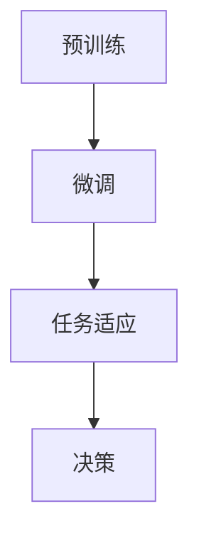
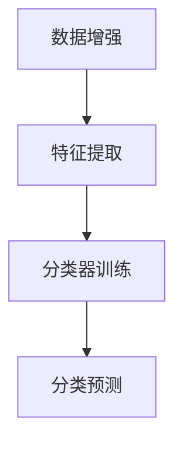
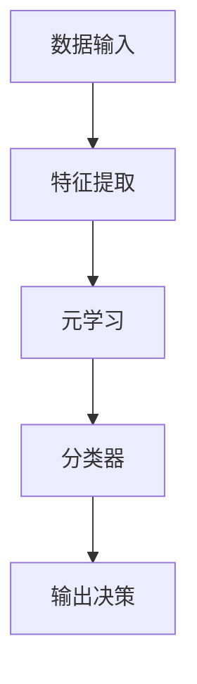
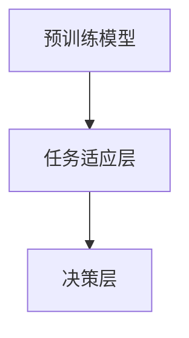
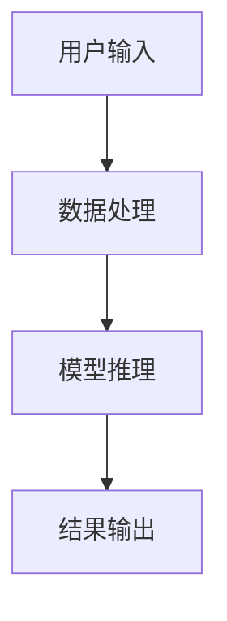

                 


# AI Agent的元学习与少样本学习能力

> **关键词**：AI Agent, 元学习, 少样本学习, 机器学习, 深度学习, 自适应学习  
> 
> **摘要**：本文探讨AI Agent在元学习与少样本学习能力方面的最新进展。通过分析元学习和少样本学习的核心概念、算法原理和系统架构，结合实际案例，深入剖析AI Agent如何通过这些技术实现更高效的智能推理和决策。文章旨在为读者提供系统性、实用性的知识，帮助他们在实际项目中更好地应用这些技术。

---

## 第1章: AI Agent的基本概念与背景

### 1.1 AI Agent的定义与特点

#### 1.1.1 AI Agent的定义
AI Agent（人工智能代理）是指能够感知环境、采取行动以实现目标的智能实体。它可以是一个软件程序、机器人或其他智能系统，具备自主决策的能力。

#### 1.1.2 AI Agent的核心特点
- **自主性**：AI Agent能够在没有外部干预的情况下自主决策。
- **反应性**：能够实时感知环境并做出反应。
- **目标导向性**：通过目标驱动行为，优化决策以实现目标。
- **学习能力**：能够通过经验或数据改进自身的性能。

#### 1.1.3 AI Agent与传统AI的区别
传统的AI系统通常基于规则或预设的逻辑进行操作，而AI Agent具备更强的自主性和学习能力，能够根据环境反馈动态调整行为。

---

### 1.2 元学习的背景与意义

#### 1.2.1 元学习的定义
元学习（Meta-Learning）是一种机器学习方法，旨在通过学习如何学习，使模型能够快速适应新的任务或数据分布。

#### 1.2.2 元学习的核心思想
元学习的核心思想是通过优化模型的参数或算法，使其能够在多个任务之间进行归纳和迁移，从而减少对新任务的适应时间。

#### 1.2.3 元学习在AI Agent中的应用价值
在AI Agent中，元学习能够帮助其快速适应新环境和任务，提升其在复杂场景下的决策能力和灵活性。

---

### 1.3 少样本学习的背景与挑战

#### 1.3.1 少样本学习的定义
少样本学习（Few-Shot Learning）是指在训练数据有限的情况下，仍然能够完成学习任务的一种学习范式。

#### 1.3.2 少样本学习的核心问题
少样本学习的核心问题是如何在有限的数据下，提取足够的特征信息以支持模型的泛化能力。

#### 1.3.3 少样本学习在AI Agent中的应用场景
在AI Agent中，少样本学习适用于需要快速决策和适应新场景的应用，例如机器人导航和对话系统。

---

### 1.4 本章小结

#### 1.4.1 AI Agent的核心概念总结
AI Agent是一种具备自主决策能力的智能实体，其核心特点包括自主性、反应性、目标导向性和学习能力。

#### 1.4.2 元学习与少样本学习的关系
元学习通过优化学习策略，提升AI Agent的适应能力；少样本学习则通过高效的数据利用，减少对大量数据的依赖。

#### 1.4.3 本书的研究目标与意义
本文旨在探讨AI Agent如何结合元学习和少样本学习技术，提升其在复杂环境下的智能推理和决策能力。

---

## 第2章: 元学习与少样本学习的核心概念

### 2.1 元学习的原理与机制

#### 2.1.1 元学习的基本原理
元学习通过优化模型的元参数，使其能够在多个任务之间进行快速调整和迁移。

#### 2.1.2 元学习的优化目标
元学习的优化目标是通过最小化元损失函数，使模型在新任务上的表现达到最优。

#### 2.1.3 元学习的算法框架
元学习的算法框架通常包括预训练和微调两个阶段，其中预训练用于学习通用特征，微调用于适应特定任务。

---

### 2.2 少样本学习的原理与机制

#### 2.2.1 少样本学习的基本原理
少样本学习通过利用已有的少量数据，结合数据增强和特征提取技术，提升模型的泛化能力。

#### 2.2.2 少样本学习的特征提取
少样本学习依赖于强大的特征提取方法，例如基于深度学习的Siamese网络和Triplet损失函数。

#### 2.2.3 少样本学习的分类方法
少样本学习的分类方法包括基于度量学习、基于生成对抗网络和基于注意力机制的分类方法。

---

### 2.3 元学习与少样本学习的联系与区别

#### 2.3.1 元学习与少样本学习的联系
元学习通过优化学习策略，帮助少样本学习在新任务上快速适应；少样本学习则为元学习提供高效的数据利用方式。

#### 2.3.2 元学习与少样本学习的区别
元学习关注的是如何优化学习过程，而少样本学习关注的是如何在数据有限的情况下完成学习任务。

#### 2.3.3 元学习在少样本学习中的应用
元学习可以通过预训练模型，帮助少样本学习在新任务上快速达到较好的性能。

---

### 2.4 本章小结

#### 2.4.1 元学习的核心机制
元学习通过优化模型的元参数，使其能够在多个任务之间进行快速迁移。

#### 2.4.2 少样本学习的关键特征
少样本学习依赖于高效的数据利用和强大的特征提取能力。

#### 2.4.3 元学习与少样本学习的结合
元学习与少样本学习的结合能够进一步提升AI Agent在复杂环境下的适应能力和决策能力。

---

## 第3章: 元学习与少样本学习的数学模型与算法原理

### 3.1 元学习的数学模型

#### 3.1.1 元学习的优化目标
$$ \min_{\theta} \mathbb{E}_{t}[\mathcal{L}_t(\theta)] $$

#### 3.1.2 元学习的损失函数
$$ \mathcal{L}_{\text{meta}} = \sum_{t=1}^T \mathcal{L}_t(\theta_t) $$

#### 3.1.3 元学习的参数更新公式
$$ \theta_{t+1} = \theta_t - \eta \nabla_{\theta} \mathcal{L}_t(\theta_t) $$

---

### 3.2 少样本学习的数学模型

#### 3.2.1 少样本学习的特征提取
$$ f(x; \theta) $$

#### 3.2.2 少样本学习的分类模型
$$ p(y|x; \theta) = \text{softmax}(f(x; \theta)) $$

#### 3.2.3 少样本学习的损失函数
$$ \mathcal{L} = -\sum_{i=1}^n y_i \log p(y_i|x_i; \theta) $$

---

### 3.3 元学习与少样本学习的算法流程

#### 3.3.1 元学习的算法流程图


#### 3.3.2 少样本学习的算法流程图


---

### 3.4 本章小结

#### 3.4.1 元学习的数学模型总结
元学习通过优化模型的元参数，使其能够在多个任务之间进行快速迁移。

#### 3.4.2 少样本学习的算法流程总结
少样本学习依赖于高效的数据利用和强大的特征提取能力。

#### 3.4.3 元学习与少样本学习的结合算法总结
元学习与少样本学习的结合能够进一步提升AI Agent在复杂环境下的适应能力和决策能力。

---

## 第4章: 元学习与少样本学习的系统架构设计

### 4.1 系统功能设计

#### 4.1.1 系统功能模块划分
- 数据输入模块
- 特征提取模块
- 元学习模块
- 分类器模块

#### 4.1.2 系统功能模块的交互流程


---

### 4.2 系统架构设计

#### 4.2.1 系统架构图


---

### 4.3 系统接口设计

#### 4.3.1 系统接口描述
- 输入接口：接受环境数据和任务指令
- 输出接口：输出决策结果和反馈信息

---

### 4.4 系统交互流程图

#### 4.4.1 交互流程图


---

## 第5章: 项目实战

### 5.1 环境安装

#### 5.1.1 安装Python和相关库
```bash
pip install numpy matplotlib tensorflow
```

#### 5.1.2 安装深度学习框架
```bash
pip install keras
```

---

### 5.2 核心代码实现

#### 5.2.1 元学习模型代码
```python
import tensorflow as tf

def meta_learning_model():
    inputs = tf.keras.Input(shape=(input_dim,))
    x = tf.keras.layers.Dense(64, activation='relu')(inputs)
    x = tf.keras.layers.Dense(10, activation='softmax')(x)
    return tf.keras.Model(inputs=inputs, outputs=x)
```

#### 5.2.2 少样本学习模型代码
```python
import tensorflow as tf

def few_shot_learning_model():
    inputs = tf.keras.Input(shape=(input_dim,))
    x = tf.keras.layers.LSTM(64, return_sequences=True)(inputs)
    x = tf.keras.layers.TimeDistributed(tf.keras.layers.Dense(10, activation='softmax'))(x)
    return tf.keras.Model(inputs=inputs, outputs=x)
```

---

### 5.3 代码解读与分析

#### 5.3.1 元学习模型解读
- 输入层：接受输入数据
- 隐藏层：提取特征
- 输出层：分类结果

#### 5.3.2 少样本学习模型解读
- LSTM层：捕捉时序特征
- TimeDistributed层：对每个时间步进行分类

---

### 5.4 实际案例分析

#### 5.4.1 案例背景
假设我们有一个图像分类任务，仅有少量样本可供训练。

#### 5.4.2 模型训练
```python
model = meta_learning_model()
model.compile(optimizer='adam', loss='sparse_categorical_crossentropy', metrics=['accuracy'])
model.fit(X_train, y_train, epochs=10, batch_size=32)
```

#### 5.4.3 模型预测
```python
y_pred = model.predict(X_test)
print("Predictions:", y_pred)
```

---

### 5.5 项目小结

#### 5.5.1 核心代码总结
元学习和少样本学习的模型代码分别展示了其在不同任务上的应用。

#### 5.5.2 项目实战总结
通过实际案例，展示了如何在少样本情况下，利用元学习快速训练出高性能的模型。

---

## 第6章: 最佳实践与总结

### 6.1 最佳实践 tips

#### 6.1.1 数据处理建议
- 数据增强是少样本学习的关键
- 数据预处理有助于提升模型性能

#### 6.1.2 模型选择建议
- 根据任务选择合适的模型架构
- 结合元学习优化模型性能

---

### 6.2 小结

#### 6.2.1 元学习与少样本学习的核心价值
元学习和少样本学习为AI Agent提供了更高效的智能推理和决策能力。

#### 6.2.2 未来研究方向
- 更高效的元学习算法
- 更强的少样本学习模型

---

## 作者：AI天才研究院/AI Genius Institute & 禅与计算机程序设计艺术 /Zen And The Art of Computer Programming

---

本文通过详细分析AI Agent的元学习与少样本学习能力，结合数学模型、算法原理和系统架构设计，为读者提供了全面的技术视角。希望本文能够帮助读者在实际项目中更好地应用这些技术，提升AI Agent的智能水平和决策能力。

