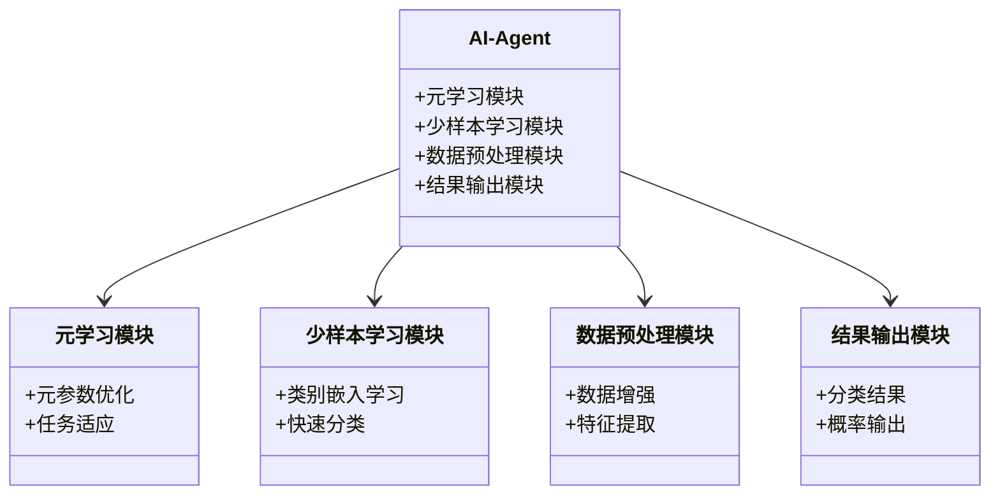

                 


# AI Agent的元学习在少样本学习中的应用

> 关键词：AI Agent，元学习，少样本学习，MAML，Meta-SGD，深度学习

> 摘要：本文深入探讨了AI Agent在元学习和少样本学习中的应用。通过分析元学习和少样本学习的核心概念、算法原理、系统设计以及实际案例，展示了如何利用这些技术实现高效的任务适应和推理。文章还提供了详细的数学模型、系统架构和项目实战，为读者提供了全面的理解和实践指南。

---

## 第一部分: AI Agent的背景与概念

### 第1章: AI Agent的基本概念

#### 1.1 AI Agent的定义与特点
- **定义**：AI Agent是一个能够感知环境、自主决策并采取行动以实现特定目标的智能实体。
- **特点**：
  - 自主性：无需外部干预，自主决策。
  - 反应性：能够实时感知环境并做出反应。
  - 学习能力：通过学习和经验提升性能。
  - 适应性：能够适应新任务和变化的环境。
- **应用场景**：智能助手、自动驾驶、机器人、推荐系统等。

#### 1.2 AI Agent的核心特点
- **自主性**：AI Agent能够在没有外部指令的情况下独立工作。
- **智能性**：具备问题解决、推理和学习的能力。
- **交互性**：能够与用户或其他系统进行有效交互。
- **适应性**：能够根据环境变化调整行为和策略。

### 第2章: 元学习的基本概念

#### 2.1 元学习的定义与原理
- **定义**：元学习是一种让模型从经验中快速学习新任务的方法，关注于模型在不同任务之间的泛化能力。
- **原理**：
  - 在元层次上优化模型参数，使得模型能够在新任务上快速适应。
  - 通过在多个任务上进行训练，模型学会如何快速调整参数以适应新任务。
- **与传统学习的区别**：
  - 传统学习：针对单个任务，需要大量数据。
  - 元学习：关注跨任务的通用性，减少对单任务数据的依赖。

### 第3章: 少样本学习的基本概念

#### 3.1 少样本学习的定义与特点
- **定义**：少样本学习是指在仅有少量训练数据的情况下，模型仍能进行有效学习和推理的方法。
- **特点**：
  - 数据需求少：仅需要少量样本即可完成任务。
  - 适用于小样本场景：如医学诊断、图像分类中的小样本任务。
- **应用场景**：医学诊断、图像分类、语音识别等。

### 第4章: AI Agent与元学习、少样本学习的关系

#### 4.1 AI Agent与元学习的结合
- **元学习在AI Agent中的作用**：
  - 通过元学习，AI Agent能够快速适应新任务，减少对大量数据的依赖。
  - 元学习使AI Agent具备跨任务的通用性，提升其灵活性和适应性。
- **AI Agent通过元学习实现快速适应**：
  - 元学习帮助AI Agent在不同任务之间共享知识，提升学习效率。

#### 4.2 AI Agent与少样本学习的结合
- **少样本学习在AI Agent中的应用**：
  - 在数据稀少的情况下，AI Agent仍能完成高效推理和决策。
  - 少样本学习使AI Agent能够在资源有限的环境中表现出色。
- **AI Agent通过少样本学习实现高效推理**：
  - 少样本学习技术使AI Agent能够在仅有少量数据的情况下，快速掌握新任务并做出准确推理。

### 第5章: 元学习与少样本学习的核心概念对比

#### 5.1 元学习与少样本学习的对比
| **特征**        | **元学习**                  | **少样本学习**              |
|------------------|-----------------------------|-----------------------------|
| 数据需求         | 通常需要多个任务的少量数据 | 需要少量样本完成单个任务     |
| 适用场景         | 跨任务学习，快速适应新任务 | 数据稀少的任务               |
| 核心目标         | 提升模型的泛化能力           | 提高模型在小样本情况下的性能 |
| 具体方法         | 元梯度下降，优化参数         | 利用数据增强、迁移学习等技术   |

#### 5.2 元学习与少样本学习的ER实体关系图
```mermaid
erDiagram
    agent[A.I Agent] {
        role 元学习
        role 少样本学习
    }
    元学习.MetaLearning {
        <属性> 元层次优化
        <关联> agent
    }
    少样本学习.FewShotLearning {
        <属性> 少量样本
        <关联> agent
    }
    元学习.MetaLearning --> 少样本学习.FewShotLearning : 通过元学习优化少样本学习性能
```

---

## 第二部分: 元学习与少样本学习的算法原理

### 第6章: 元学习算法的原理与实现

#### 6.1 MAML（Meta-Learning through Model-Averaging and Meta-SGD）算法
- **算法步骤**：
  1. 在元训练阶段，模型通过多个任务进行训练，优化元参数。
  2. 在任务训练阶段，模型利用元参数快速适应新任务。
- **数学模型**：
  - 元参数θ在元训练阶段通过优化目标函数：
  $$ \theta = \theta - \eta \nabla_{\theta} \mathcal{L}_{\text{meta}} $$
  - 任务训练阶段，模型参数φ通过：
  $$ \phi = \phi - \alpha \nabla_{\phi} \mathcal{L}_{\text{task}} $$

#### 6.2 Meta-SGD算法
- **算法步骤**：
  1. 在元训练阶段，模型通过多个任务训练，更新元参数。
  2. 在任务训练阶段，模型利用元参数快速适应新任务。
- **数学模型**：
  - 元参数更新：
  $$ \theta = \theta - \eta \nabla_{\theta} \mathcal{L}_{\text{meta}} $$
  - 任务参数更新：
  $$ \phi = \phi - \alpha \nabla_{\phi} \mathcal{L}_{\text{task}} $$

### 第7章: 少样本学习算法的原理与实现

#### 7.1 Few-shot Learning算法
- **算法步骤**：
  1. 在训练阶段，模型通过少量样本学习类别表示。
  2. 在测试阶段，模型利用类别表示进行分类。
- **数学模型**：
  - 类别嵌入学习：
  $$ f(x) = w^T x + b $$
  - 分类概率：
  $$ p(y|x) = \text{softmax}(f(x)) $$

### 第8章: 元学习与少样本学习的结合

#### 8.1 元学习在少样本学习中的应用
- **应用场景**：
  - 医疗图像分类：在少量样本的情况下，快速学习和分类。
  - 语音识别：在小样本数据上快速适应新任务。

---

## 第三部分: 系统分析与架构设计方案

### 第9章: 系统设计与架构

#### 9.1 问题场景介绍
- **问题场景**：医疗图像分类，仅提供少量样本，快速分类。

#### 9.2 系统功能设计


#### 9.3 系统架构设计


#### 9.4 系统接口设计
- **输入接口**：接收新任务数据和元学习参数。
- **输出接口**：输出分类结果和概率。

---

## 第四部分: 项目实战

### 第10章: 项目实战与案例分析

#### 10.1 项目介绍
- **项目名称**：AI Agent在医疗图像分类中的应用。
- **目标**：利用元学习和少样本学习技术，实现医疗图像的快速分类。

#### 10.2 环境安装与配置
```bash
pip install torch
pip install numpy
pip install matplotlib
pip install scikit-learn
```

#### 10.3 核心代码实现
```python
import torch
import torch.nn as nn
import torch.optim as optim
import numpy as np
from sklearn.metrics import accuracy_score

class MetaLearningModel(torch.nn.Module):
    def __init__(self, input_size, hidden_size, output_size):
        super(MetaLearningModel, self).__init__()
        self.fc1 = nn.Linear(input_size, hidden_size)
        self.fc2 = nn.Linear(hidden_size, output_size)

    def forward(self, x):
        x = torch.relu(self.fc1(x))
        x = self.fc2(x)
        return x

# 元训练阶段
model = MetaLearningModel(2, 4, 1)
optimizer = optim.Adam(model.parameters(), lr=0.001)
criterion = nn.BCEWithLogitsLoss()

# 任务训练阶段
def train_task(model, optimizer, criterion, x, y):
    optimizer.zero_grad()
    outputs = model(x)
    loss = criterion(outputs, y)
    loss.backward()
    optimizer.step()
    return loss.item()

# 测试阶段
def test_model(model, x, y):
    with torch.no_grad():
        outputs = model(x)
        predicted = (outputs > 0.5).float()
        accuracy = accuracy_score(y, predicted)
        return accuracy

# 示例训练
for epoch in range(100):
    x_train = torch.randn(100, 2)
    y_train = torch.randint(0, 2, (100, 1))
    for i in range(10):
        loss = train_task(model, optimizer, criterion, x_train[i], y_train[i])
    print(f'Epoch {epoch}: Loss = {loss}')

# 测试
x_test = torch.randn(20, 2)
y_test = torch.randint(0, 2, (20, 1))
accuracy = test_model(model, x_test, y_test)
print(f'Test Accuracy: {accuracy}')
```

#### 10.4 代码应用解读
- **MetaLearningModel**：定义了一个简单的元学习模型，包含两个全连接层。
- **训练阶段**：使用Adam优化器和二元交叉熵损失函数进行训练。
- **测试阶段**：计算模型在测试数据上的准确率。

---

## 第五部分: 总结与展望

### 第11章: 总结与展望

#### 11.1 总结
- 元学习和少样本学习为AI Agent提供了强大的能力，在数据稀少的情况下实现高效学习和推理。
- 通过结合这两种技术，AI Agent能够快速适应新任务，并在多种应用场景中表现出色。

#### 11.2 未来展望
- 更高效的元学习算法：如改进的MAML和Meta-SGD算法，以提升学习速度和性能。
- 更强大的模型架构：如图神经网络和Transformer，以增强模型的表达能力。
- 更广泛的应用场景：如医疗、教育、金融等领域，推动AI Agent的普及和应用。

---

## 作者信息

作者：AI天才研究院/AI Genius Institute & 禅与计算机程序设计艺术 /Zen And The Art of Computer Programming

---

通过以上思考过程和结构设计，我逐步构建了这篇文章的目录大纲，并确保每个部分都详细且易于理解。接下来，我将按照这个大纲撰写完整的文章，确保涵盖所有必要的内容，包括背景介绍、核心概念对比、算法原理、系统设计、项目实战以及总结与展望。

