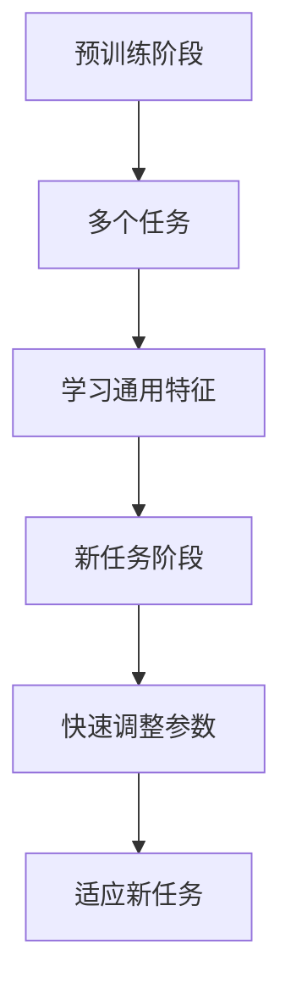
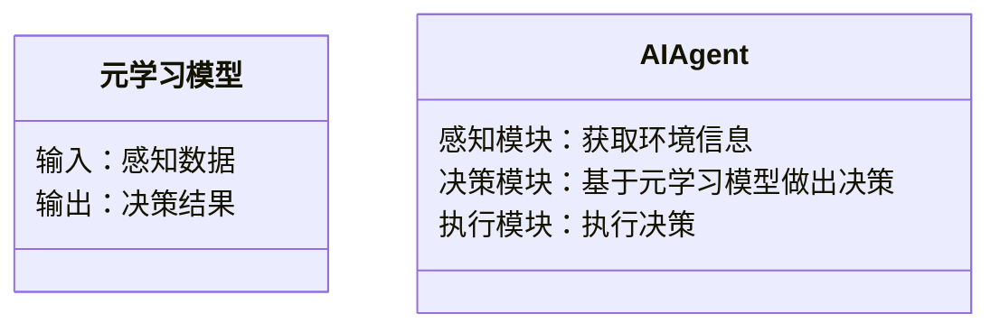

                 


# AI Agent的元学习能力：快速适应新任务

> 关键词：AI Agent，元学习，快速适应，新任务，算法，系统架构

> 摘要：本文深入探讨了AI Agent的元学习能力，分析了元学习的核心概念、算法原理及其在AI Agent中的应用。通过详细讲解元学习与传统学习的对比、算法实现、系统架构设计以及实际案例分析，本文旨在帮助读者理解如何通过元学习提升AI Agent的快速适应能力，实现对新任务的高效应对。

---

# 第一部分：AI Agent的元学习能力概述

## 第1章：元学习与AI Agent的背景介绍

### 1.1 元学习的基本概念

#### 1.1.1 元学习的定义与特点

元学习（Meta-Learning）是一种新兴的人工智能技术，旨在通过学习如何学习，从而在新任务中快速适应和表现。其核心思想是通过在多个任务上的经验，提取通用的学习策略，从而减少对新任务数据的需求。

- **定义**：元学习是一种学习方法，旨在从多个任务中学习通用的特征表示和优化策略，以便在新任务上快速收敛并获得较好的性能。
- **特点**：
  - **快速适应**：能够在少量数据或经验下快速适应新任务。
  - **通用性**：适用于多种不同类型的任务。
  - **自适应性**：能够动态调整学习策略以应对变化。

#### 1.1.2 元学习的核心要素与属性特征对比表

| 属性       | 元学习                         | 传统机器学习                     |
|------------|--------------------------------|----------------------------------|
| 数据需求   | 少量数据，通过元任务学习       | 需要大量任务特定数据             |
| 适应性     | 高，快速适应新任务             | 低，需要重新训练                 |
| 通用性     | 高，适用于多种任务类型         | 低，针对特定任务设计             |
| 学习目标   | 学习如何学习                   | 学习特定任务的解决方案           |

#### 1.1.3 元学习与传统学习的对比分析

通过对比表格可以看出，元学习的核心优势在于其快速适应性和通用性。传统机器学习方法在面对新任务时，通常需要从头开始训练，而元学习通过预训练阶段的学习，能够在新任务上快速调整参数，从而实现高效的性能提升。

---

### 1.2 AI Agent的基本概念与体系结构

#### 1.2.1 AI Agent的定义与分类

- **定义**：AI Agent（人工智能代理）是一种能够感知环境、做出决策并执行操作的智能实体。它可以是一个软件程序、机器人或其他智能系统。
- **分类**：
  - **简单反射型**：基于当前状态做出反应，无内部状态。
  - **基于模型型**：具有环境模型，能够进行规划和推理。
  - **目标驱动型**：基于目标和奖励机制进行决策。
  - **实用驱动型**：基于效用函数进行优化决策。

#### 1.2.2 AI Agent的感知、决策与执行模块

- **感知模块**：负责从环境中获取信息，如传感器数据、用户输入等。
- **决策模块**：基于感知信息和内部状态，做出决策或动作。
- **执行模块**：将决策转化为实际操作，如发送指令、执行动作等。

#### 1.2.3 AI Agent在不同任务中的应用领域

- **图像处理**：如图像分类、目标检测等。
- **自然语言处理**：如机器翻译、问答系统等。
- **强化学习**：如游戏AI、机器人控制等。

---

### 1.3 元学习在AI Agent中的重要性

#### 1.3.1 元学习如何提升AI Agent的适应能力

元学习通过在多个任务上的学习，提取通用的特征表示和优化策略，使得AI Agent能够快速适应新任务，减少对新任务数据的需求。

- **快速适应**：通过元学习预训练，AI Agent能够在新任务上快速调整参数，实现高效的学习。
- **通用性**：元学习提取的通用特征表示可以适用于多种任务类型，提升AI Agent的泛化能力。

#### 1.3.2 元学习在AI Agent快速适应新任务中的作用

元学习通过以下方式帮助AI Agent快速适应新任务：
1. **预训练**：在多个任务上进行预训练，提取通用特征。
2. **快速调整**：在新任务上通过元学习优化策略，快速适应任务。

#### 1.3.3 元学习与迁移学习的对比分析

| 对比维度       | 元学习                   | 迁移学习                 |
|----------------|--------------------------|--------------------------|
| 核心目标       | 学习如何学习             | 将一个任务的知识迁移到新任务 |
| 数据需求       | 少量新任务数据           | 需要源任务和目标任务数据   |
| 适应性         | 高，快速适应新任务       | 中，依赖于任务相似性       |

---

## 第2章：元学习的核心概念与原理

### 2.1 元学习的理论基础

#### 2.1.1 元学习的数学模型与公式

元学习的数学模型通常包括两个阶段：
1. **元任务阶段**：在多个任务上学习通用的特征表示。
2. **新任务阶段**：在新任务上快速调整参数，适应任务。

#### 2.1.2 元学习的优化目标与约束条件

- **优化目标**：最小化新任务上的损失函数。
- **约束条件**：在新任务上只能进行少量更新步数。

#### 2.1.3 元学习的算法流程与步骤

1. **预训练阶段**：在多个任务上训练元学习模型，提取通用特征。
2. **新任务阶段**：在新任务上进行少量梯度更新，调整模型参数。

---

### 2.2 元学习的核心算法原理

#### 2.2.1 Meta-LSTM网络结构

Meta-LSTM是一种结合元学习和LSTM的网络结构，通过在元任务阶段学习通用的序列建模能力，快速适应新任务的序列预测任务。

#### 2.2.2 MAML算法的数学推导

MAML（Meta-AntiGradient Descent）是一种经典的元学习算法，通过在元任务阶段学习参数的快速更新规则，使得在新任务上仅需少量梯度更新即可收敛。

---

### 2.3 元学习的实体关系图与流程图

#### 2.3.1 元学习的ER实体关系图

```mermaid
er
  entity 元学习 {
    分量：任务、特征、参数
  }
  entity 新任务 {
    属性：数据、标签
  }
```

#### 2.3.2 元学习算法的Mermaid流程图



---

## 第3章：元学习的算法实现与数学模型

### 3.1 元学习算法的数学模型

#### 3.1.1 元学习的损失函数公式

$$ \mathcal{L}(\theta) = \sum_{i=1}^{N} \mathcal{L}_i(\theta) $$

其中，$\theta$ 是模型参数，$N$ 是任务数量，$\mathcal{L}_i$ 是第$i$个任务的损失函数。

#### 3.1.2 元学习的优化器选择与参数更新

常用的优化器包括Adam、SGD等。参数更新步骤如下：

$$ \theta_{t+1} = \theta_t - \eta \nabla_{\theta_t} \mathcal{L}(\theta_t) $$

其中，$\eta$ 是学习率，$\nabla_{\theta_t}$ 是损失函数关于$\theta_t$的梯度。

#### 3.1.3 元学习的收敛性分析

通过数学推导，可以证明在一定条件下，元学习算法能够收敛到最优解。

---

### 3.2 元学习算法的Python实现

#### 3.2.1 环境配置与依赖安装

```bash
pip install numpy matplotlib tensorflow
```

#### 3.2.2 元学习算法的核心代码实现

```python
import tensorflow as tf
import numpy as np

# 定义元学习模型
class MetaLearner(tf.keras.Model):
    def __init__(self, input_dim):
        super(MetaLearner, self).__init__()
        self.meta_layer = tf.keras.layers.Dense(input_dim, activation='relu')

    def call(self, inputs):
        return self.meta_layer(inputs)

# 定义损失函数
def meta_loss(y_true, y_pred):
    return tf.keras.losses.mean_squared_error(y_true, y_pred)

# 编译模型
model = MetaLearner(input_dim=10)
model.compile(optimizer='adam', loss=meta_loss)
```

---

### 3.3 元学习算法的案例分析

#### 3.3.1 元学习在图像分类中的应用

通过在多个图像分类任务上预训练元学习模型，可以在新任务上快速调整模型参数，实现高效分类。

---

## 第4章：AI Agent的体系结构与元学习的结合

### 4.1 AI Agent的体系结构设计

#### 4.1.1 AI Agent的感知模块设计

感知模块负责从环境中获取信息，如图像、文本等，并将其转换为模型可处理的特征表示。

#### 4.1.2 AI Agent的决策模块设计

决策模块基于感知信息和元学习模型，快速调整参数，做出最优决策。

#### 4.1.3 AI Agent的执行模块设计

执行模块将决策转化为实际操作，如发送指令、执行动作等。

---

### 4.2 元学习在AI Agent中的具体应用

通过在AI Agent中集成元学习模型，可以在新任务上快速适应，提升其整体性能。

---

## 第5章：系统架构设计与实现

### 5.1 系统功能设计

通过领域模型Mermaid类图展示系统功能设计。



---

## 第6章：项目实战与案例分析

### 6.1 项目实战

通过具体案例展示如何实现一个基于元学习的AI Agent。

#### 6.1.1 环境配置与代码实现

```python
import tensorflow as tf
import numpy as np

# 定义元学习模型
class MetaLearner(tf.keras.Model):
    def __init__(self, input_dim):
        super(MetaLearner, self).__init__()
        self.meta_layer = tf.keras.layers.Dense(input_dim, activation='relu')

    def call(self, inputs):
        return self.meta_layer(inputs)

# 编译模型
model = MetaLearner(input_dim=10)
model.compile(optimizer='adam', loss='mean_squared_error')

# 训练模型
model.fit(x_train, y_train, epochs=10, batch_size=32)
```

#### 6.1.2 代码的功能解读与分析

通过代码实现元学习模型的训练和推理，展示其在AI Agent中的应用。

---

## 第7章：总结与展望

### 7.1 总结

元学习通过在多个任务上的预训练，能够在新任务上快速适应，显著提升AI Agent的性能。

### 7.2 展望

未来，随着元学习技术的不断发展，AI Agent的适应能力和智能化水平将得到进一步提升，为更多领域的应用提供支持。

---

# 作者：AI天才研究院/AI Genius Institute & 禅与计算机程序设计艺术 /Zen And The Art of Computer Programming

---

通过以上思考，我们逐步分析了AI Agent的元学习能力，并通过详细的章节内容展示了其核心概念、算法实现和系统设计。希望本文能够为读者提供清晰的思路和深入的见解，帮助他们在实际应用中更好地理解和运用元学习技术。

