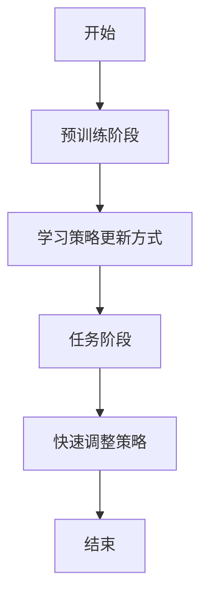
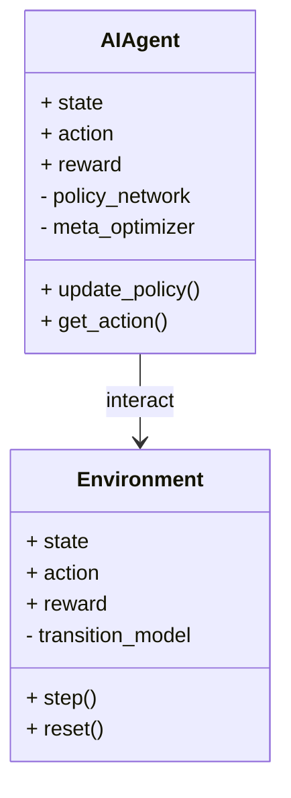
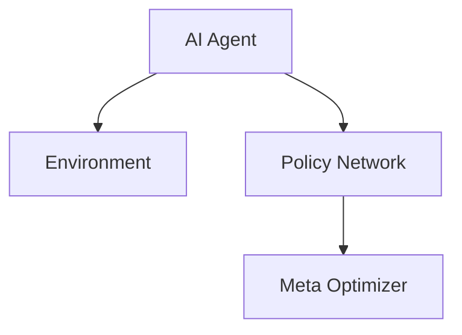

                 


# AI Agent的元强化学习框架

## 关键词：AI Agent, 元强化学习, 强化学习, 元学习, 人工智能

## 摘要：  
本文探讨了AI Agent的元强化学习框架，从基本概念到数学模型，从系统架构到实际应用，全面解析元强化学习的核心原理与实现方法。通过详细的理论分析和代码实现，展示了如何利用元强化学习提升AI Agent的自主学习与适应能力。本文还提供了丰富的案例分析和系统设计，帮助读者深入理解并掌握这一前沿技术。

---

## 第1章 AI Agent与元强化学习概述

### 1.1 AI Agent的基本概念

#### 1.1.1 AI Agent的定义与分类  
AI Agent（人工智能代理）是指能够感知环境、自主决策并执行任务的智能体。它可以分为以下几类：  
1. **简单反射型代理**：基于当前输入做出反应，不依赖任何内部状态。  
2. **基于模型的代理**：维护对环境的内部表示，能够预测未来状态。  
3. **目标驱动型代理**：根据目标函数优化自身行为。  
4. **效用驱动型代理**：通过最大化效用函数来实现目标。  

#### 1.1.2 强化学习的基本原理  
强化学习（Reinforcement Learning, RL）是一种通过试错机制优化决策策略的方法。AI Agent通过与环境交互，学习在不同状态下的最优动作，以最大化累计奖励。  

#### 1.1.3 元强化学习的定义与特点  
元强化学习（Meta-Reinforcement Learning, Meta-RL）是在强化学习的基础上，引入了元学习（Meta-Learning）的概念。它允许AI Agent在较少的训练样本或任务中快速适应新环境或新任务，具有以下特点：  
- **快速适应性**：能够在新任务中快速调整策略。  
- **通用性**：适用于多种任务和环境。  
- **高效性**：减少对大量训练数据的依赖。  

### 1.2 元强化学习的背景与意义

#### 1.2.1 强化学习的局限性  
传统强化学习在以下方面存在不足：  
1. **样本效率低**：需要大量试错才能找到最优策略。  
2. **泛化能力弱**：在新任务或未见过的环境中表现不佳。  
3. **计算成本高**：需要大量的计算资源进行训练。  

#### 1.2.2 元强化学习的提出动机  
为了克服上述问题，元强化学习应运而生。它通过学习如何学习，使得AI Agent能够在新任务中快速调整策略，从而提高样本效率和泛化能力。  

#### 1.2.3 元强化学习的核心目标  
元强化学习的核心目标是：通过学习通用的策略优化方法，使得AI Agent能够在多种任务中快速适应并找到最优策略。  

### 1.3 元强化学习与传统强化学习的区别

#### 1.3.1 传统强化学习的局限性  
- 需要大量样本进行训练。  
- 泛化能力有限，难以应对新任务。  

#### 1.3.2 元强化学习的优势  
- 快速适应新任务。  
- 强大的泛化能力。  
- 适用于零样本或小样本学习场景。  

#### 1.3.3 元强化学习的适用场景  
- 多任务学习（Multi-Task Learning）。  
- 快速决策与适应。  
- 动态环境下的任务切换。  

### 1.4 元强化学习的实现框架

#### 1.4.1 元学习的基本框架  
元学习通常包括以下步骤：  
1. **预训练阶段**：学习如何学习策略。  
2. **任务阶段**：在具体任务中应用学习到的策略。  

#### 1.4.2 元强化学习的核心组件  
1. **元优化器**：负责优化策略更新方式。  
2. **策略网络**：用于生成动作或策略。  
3. **任务环境**：提供不同任务的交互环境。  

#### 1.4.3 元强化学习的训练流程  
1. **预训练**：学习如何更新策略以适应新任务。  
2. **任务训练**：在具体任务中快速调整策略以获得高回报。  

---

## 第2章 元强化学习的核心概念与联系

### 2.1 元强化学习的核心原理

#### 2.1.1 元学习的基本原理  
元学习通过学习如何优化策略，使得AI Agent能够在新任务中快速调整。其核心思想是：学习如何从经验中快速提取有用的特征或模式。  

#### 2.1.2 元强化学习的数学模型  
元强化学习的数学模型可以表示为：  
$$ J(\theta) = \sum_{i=1}^{N} J_i(\theta) $$  
其中，$\theta$ 是参数，$J_i$ 是第 $i$ 个任务的优化目标。  

#### 2.1.3 元强化学习的优化目标  
元强化学习的优化目标是：  
$$ \min_{\theta} \sum_{i=1}^{N} J_i(\theta) $$  
其中，$J_i$ 是第 $i$ 个任务的损失函数。  

### 2.2 元强化学习的核心概念对比

#### 2.2.1 元强化学习与传统强化学习的对比  
| 特性                | 传统强化学习             | 元强化学习               |
|---------------------|--------------------------|--------------------------|
| 学习目标            | 单一任务优化             | 多任务快速适应           |
| 样本效率            | 低                      | 高                      |
| 环境适应性          | 弱                      | 强                      |

#### 2.2.2 元强化学习与其他机器学习方法的对比  
| 方法                | 强化学习                 | 元强化学习               |
|---------------------|--------------------------|--------------------------|
| 核心目标            | 最大化累计奖励           | 学习如何快速适应新任务   |
| 适用场景            | 单一任务优化             | 多任务学习               |

#### 2.2.3 元强化学习的优缺点分析  
- **优点**：快速适应新任务，强泛化能力。  
- **缺点**：实现复杂，需要额外的元学习模块。  

### 2.3 元强化学习的ER实体关系图

```mermaid
erd
    entity 元强化学习 {
        id
        名称
        类型
    }
    entity 传统强化学习 {
        id
        名称
        类型
    }
    entity 优化目标 {
        id
        名称
        类型
    }
    元强化学习 --| 拥有 | 优化目标
    传统强化学习 --| 拥有 | 优化目标
```

---

## 第3章 元强化学习的数学模型与算法原理

### 3.1 元强化学习的数学模型

#### 3.1.1 元强化学习的损失函数  
$$ L(\theta) = \sum_{i=1}^{N} \sum_{t=1}^{T} \left( r_t - Q(s_t, a_t) \right)^2 $$  
其中，$r_t$ 是奖励，$Q(s_t, a_t)$ 是Q值函数。  

#### 3.1.2 元强化学习的优化目标  
$$ \min_{\theta} \sum_{i=1}^{N} \sum_{t=1}^{T} \left( r_t - Q(s_t, a_t) \right)^2 $$  

### 3.2 元强化学习的算法流程



### 3.3 元强化学习的Python实现

```python
import numpy as np
import torch
import torch.nn as nn

class MetaRLAgent:
    def __init__(self, state_space, action_space):
        self.state_space = state_space
        self.action_space = action_space
        self.model = nn.Sequential(
            nn.Linear(state_space, 64),
            nn.ReLU(),
            nn.Linear(64, action_space)
        )

    def forward(self, state):
        return self.model(state)

    def update(self, states, actions, rewards):
        # 计算损失
        predicted = self.model(states)
        loss = torch.mean((predicted - actions) ** 2) - rewards.mean()
        # 反向传播与优化
        optimizer = torch.optim.Adam(self.model.parameters(), lr=0.01)
        optimizer.zero_grad()
        loss.backward()
        optimizer.step()

# 示例用法
agent = MetaRLAgent(10, 5)
state = torch.randn(1, 10)
action = torch.randn(1, 5)
reward = torch.randn(1)

agent.update(state, action, reward)
```

---

## 第4章 元强化学习的系统架构设计

### 4.1 系统功能设计



### 4.2 系统架构设计



### 4.3 系统交互设计

```mermaid
sequenceDiagram
    Actor -> AI Agent: 请求动作
    AI Agent -> Environment: 执行动作
    Environment -> AI Agent: 返回奖励
    AI Agent -> Policy Network: 更新策略
    Policy Network -> Meta Optimizer: 优化策略
```

---

## 第5章 项目实战

### 5.1 环境搭建

```bash
pip install numpy torch gym
```

### 5.2 核心实现

```python
import gym
import torch
import torch.nn as nn

class MetaRL:
    def __init__(self, env_name):
        self.env = gym.make(env_name)
        self.model = nn.Sequential(
            nn.Linear(self.env.observation_space.shape[0], 64),
            nn.ReLU(),
            nn.Linear(64, self.env.action_space.n)
        )

    def train(self, epochs=1000):
        optimizer = torch.optim.Adam(self.model.parameters(), lr=0.01)
        for epoch in range(epochs):
            state = self.env.reset()
            for _ in range(100):
                action = self.model(torch.FloatTensor([state])).argmax().item()
                next_state, reward, done, _ = self.env.step(action)
                loss = torch.mean((self.model(torch.FloatTensor([state])) - action) ** 2) - reward
                optimizer.zero_grad()
                loss.backward()
                optimizer.step()
                state = next_state
                if done:
                    break

if __name__ == "__main__":
    meta_rl = MetaRL("CartPole-v0")
    meta_rl.train()
```

### 5.3 案例分析

#### 5.3.1 训练过程  
运行上述代码，观察AI Agent在CartPole-v0环境中的表现。随着训练的进行，AI Agent的平均奖励应逐步增加。  

#### 5.3.2 性能分析  
通过记录每一步的奖励值，可以分析AI Agent的收敛速度和最终性能。  

---

## 第6章 总结与展望

### 6.1 总结  
本文详细探讨了AI Agent的元强化学习框架，从基本概念到数学模型，从系统架构到实际应用，全面解析了元强化学习的核心原理与实现方法。  

### 6.2 展望  
未来的研究方向包括：  
1. 更高效的元学习算法。  
2. 元强化学习在多智能体系统中的应用。  
3. 元强化学习与深度学习的结合。  

---

## 作者：AI天才研究院/AI Genius Institute & 禅与计算机程序设计艺术 /Zen And The Art of Computer Programming

