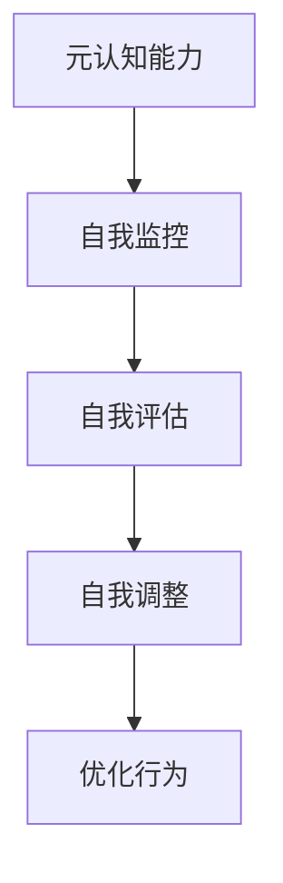
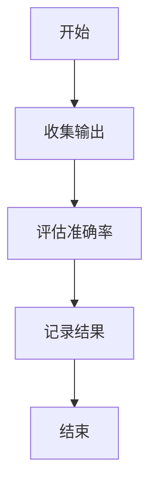
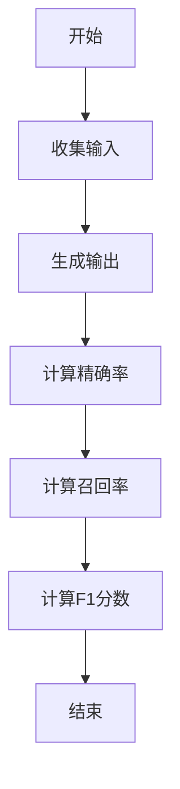
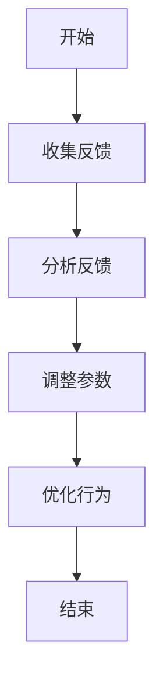
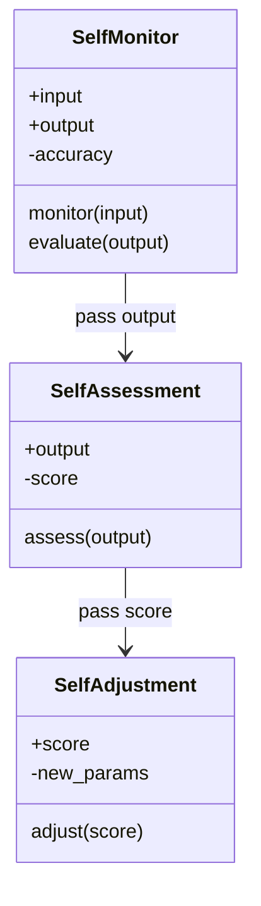
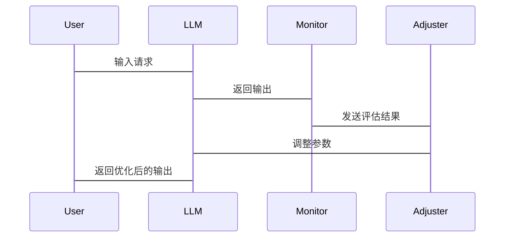

                 


# AI Agent的元认知能力：增强LLM的自我评估与调整

> 关键词：AI Agent，元认知能力，大语言模型，LLM，自我评估，自适应调整

> 摘要：本文探讨AI Agent的元认知能力，即其自我评估与调整的能力，如何增强大语言模型（LLM）的表现。通过分析元认知的核心概念、算法原理及系统架构，结合项目实战，阐述如何通过元认知能力提升LLM的自适应性和准确性。

---

# 目录大纲

## 第一章：AI Agent与元认知能力概述

1.1 AI Agent的基本概念  
1.2 问题背景与描述  
1.3 核心要素与概念结构  

## 第二章：元认知能力的核心原理

2.1 元认知的定义与属性  
2.2 元认知与AI Agent的结合  
2.3 元认知能力的层次结构  

## 第三章：LLM的自我评估机制

3.1 自我监控机制  
3.2 自我评估算法  
3.3 评估指标与数学模型  

## 第四章：基于反馈的自适应调整

4.1 自适应调整算法  
4.2 反馈机制与模型优化  
4.3 调整策略与实现示例  

## 第五章：系统分析与架构设计

5.1 问题场景介绍  
5.2 系统功能设计  
5.3 架构设计与接口设计  

## 第六章：项目实战

6.1 环境安装与准备  
6.2 核心功能实现  
6.3 代码解读与案例分析  

## 第七章：总结与展望

7.1 内容回顾与最佳实践  
7.2 未来发展方向与注意事项  
7.3 拓展阅读与深入学习  

---

# 第一章：AI Agent与元认知能力概述

## 1.1 AI Agent的基本概念

### 1.1.1 AI Agent的定义
AI Agent（人工智能代理）是指能够感知环境并采取行动以实现目标的智能实体。它具备自主性、反应性、目标导向性和社交能力等特性。

### 1.1.2 元认知能力的定义与特点
元认知能力是指AI Agent能够监控、评估和调整自身行为的能力。它包括自我监控、自我评估和自我调整三个核心环节。

### 1.1.3 元认知能力在AI Agent中的作用
元认知能力使AI Agent能够更好地理解自身状态，优化决策过程，并在动态环境中保持高效运作。

---

## 1.2 问题背景与描述

### 1.2.1 当前LLM的局限性
尽管大语言模型（LLM）在自然语言处理任务中表现出色，但它们缺乏对自身输出的监控和评估能力，容易产生错误或不符合上下文的输出。

### 1.2.2 元认知能力如何解决这些问题
通过引入元认知能力，AI Agent可以实时监控LLM的输出，评估其准确性，并根据反馈进行调整，从而提高整体性能。

### 1.2.3 元认知能力的边界与外延
元认知能力的边界在于其监控和评估的范围，外延则涉及与其他AI组件的交互和协作。

---

## 1.3 核心要素与概念结构

### 1.3.1 元认知能力的核心要素
- 自我监控：实时跟踪AI Agent的行为和输出。
- 自我评估：分析行为的有效性和结果的质量。
- 自我调整：根据评估结果优化后续行动。

### 1.3.2 概念结构与组成
通过ER实体关系图和对比表格，展示了元认知能力与其他AI能力的关系及其在整体系统中的位置。

### 1.3.3 对比分析
通过对比分析，明确了元认知能力与其他AI能力的区别和联系。

---

# 第二章：元认知能力的核心原理

## 2.1 元认知的定义与属性

### 2.1.1 元认知的定义
元认知是指AI Agent对自身认知过程的认知，包括对思维过程的监控和调节。

### 2.1.2 元认知的属性特征对比
通过对比表格，展示了元认知与其他认知能力在属性上的差异。

### 2.1.3 ER实体关系图解析
通过ER图展示了元认知能力在系统中的实体关系，明确了各部分的功能和交互。

---

## 2.2 元认知与AI Agent的结合

### 2.2.1 元认知在AI Agent中的应用
元认知能力被整合到AI Agent的决策过程中，使其能够动态调整策略。

### 2.2.2 元认知能力的层次结构
通过层次结构图，展示了元认知能力从底层到高层的各个层次及其相互关系。

---

## 2.3 元认知能力的层次结构

通过Mermaid流程图，展示了元认知能力在AI Agent中的层次结构和交互过程。



---

# 第三章：LLM的自我评估机制

## 3.1 自我监控机制

### 3.1.1 监控指标与方法
监控指标包括准确率、响应时间、用户反馈等。

### 3.1.2 监控流程图展示
通过Mermaid流程图展示了自我监控的步骤和逻辑。



### 3.1.3 代码实现示例
以下是一个简单的自我监控机制的Python代码示例：

```python
def self_monitor(input_text):
    # 收集模型输出
    output = generate_response(input_text)
    # 评估准确率
    accuracy = calculate_accuracy(input_text, output)
    # 记录结果
    record_result(accuracy)
    return output
```

---

## 3.2 自我评估算法

### 3.2.1 评估指标的选择
常用的评估指标包括精确率、召回率、F1分数等。

### 3.2.2 评估算法的数学模型
评估算法可以通过以下公式计算：

$$ F1 = 2 \times \frac{precision \times recall}{precision + recall} $$

### 3.2.3 评估流程图展示
通过Mermaid流程图展示了自我评估的步骤。



---

## 3.3 评估指标与数学模型

通过对比分析，明确了不同评估指标的适用场景和计算方法。

---

# 第四章：基于反馈的自适应调整

## 4.1 自适应调整算法

### 4.1.1 调整策略
调整策略包括参数微调、行为优化等。

### 4.1.2 调整流程图展示
通过Mermaid流程图展示了自适应调整的步骤。



### 4.1.3 代码实现示例
以下是一个自适应调整算法的Python代码示例：

```python
def adaptive_adjustment(feedback):
    # 分析反馈
    analysis = analyze_feedback(feedback)
    # 调整参数
    new_params = adjust_parameters(current_params, analysis)
    # 优化行为
    optimize_behavior(new_params)
    return new_params
```

---

## 4.2 反馈机制与模型优化

### 4.2.1 反馈机制
反馈机制包括用户反馈和系统反馈两种类型。

### 4.2.2 模型优化
通过反馈不断优化模型参数，提高模型的准确性和响应速度。

---

## 4.3 调整策略与实现示例

通过具体案例分析，展示了如何根据反馈调整模型参数，并优化行为。

---

# 第五章：系统分析与架构设计

## 5.1 问题场景介绍

### 5.1.1 问题场景
描述了一个AI Agent在动态环境中的应用场景，强调了元认知能力的重要性。

---

## 5.2 系统功能设计

### 5.2.1 功能模块
系统主要包括自我监控、自我评估、自我调整三个功能模块。

### 5.2.2 领域模型类图
通过Mermaid类图展示了系统的各个功能模块及其交互关系。



---

## 5.3 系统架构设计

### 5.3.1 架构设计
系统采用分层架构，包括数据层、业务逻辑层和应用层。

### 5.3.2 接口设计
定义了系统内部各个模块之间的接口和交互方式。

---

## 5.4 系统交互流程

通过Mermaid序列图展示了系统的交互流程。



---

# 第六章：项目实战

## 6.1 环境安装与准备

### 6.1.1 安装环境
需要安装Python、相关库和框架。

### 6.1.2 准备数据集
准备训练数据和测试数据。

---

## 6.2 核心功能实现

### 6.2.1 实现自我监控
编写代码实现自我监控功能。

### 6.2.2 实现自我评估
编写代码实现自我评估功能。

### 6.2.3 实现自适应调整
编写代码实现自适应调整功能。

---

## 6.3 代码解读与案例分析

### 6.3.1 代码解读
详细解读核心功能实现的代码，并解释每部分的功能。

### 6.3.2 案例分析
通过具体案例分析，展示了如何应用这些代码实现元认知能力的增强。

---

## 6.4 项目小结

总结了项目实现的关键点和经验教训。

---

# 第七章：总结与展望

## 7.1 内容回顾与最佳实践

### 7.1.1 内容回顾
总结了全文的主要内容和关键点。

### 7.1.2 最佳实践
提出了在实际应用中的一些最佳实践建议。

---

## 7.2 未来发展方向与注意事项

### 7.2.1 未来发展方向
探讨了元认知能力在AI Agent中的未来发展方向和研究热点。

### 7.2.2 注意事项
提醒读者在实际应用中需要注意的一些事项和潜在的问题。

---

## 7.3 拓展阅读与深入学习

### 7.3.1 拓展阅读
推荐了一些相关的书籍和论文，供读者进一步深入学习。

### 7.3.2 学习建议
给出了如何进一步提升元认知能力在AI Agent中的应用能力的学习路径。

---

# 作者：AI天才研究院/AI Genius Institute & 禅与计算机程序设计艺术 /Zen And The Art of Computer Programming

