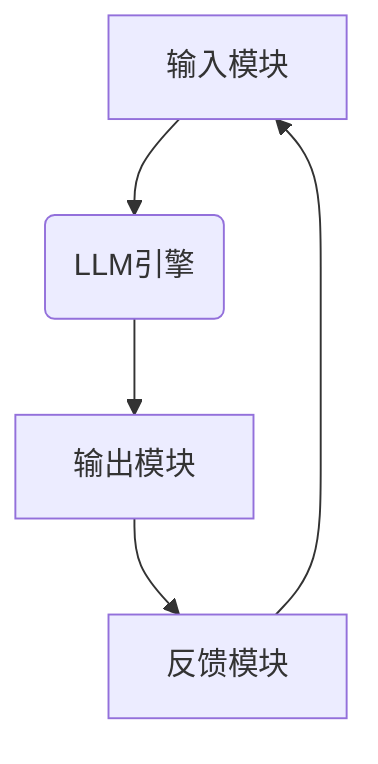

                 


# AI Agent的内容生成系统：多维度LLM创意输出

## 关键词：AI Agent, 大语言模型, 内容生成系统, 多维度创意输出, LLM算法原理, 系统架构设计

## 摘要：  
本文将深入探讨AI Agent如何通过大语言模型（LLM）实现多维度的内容生成，从基础概念到高级算法，从系统架构到项目实战，全面解析AI Agent的内容生成系统。通过分析LLM的创意输出机制，结合实际案例，为读者提供从理论到实践的详细指南。

---

# 第一部分: AI Agent与内容生成系统概述

## 第1章: AI Agent的基本概念与技术背景

### 1.1 AI Agent的核心概念  
#### 1.1.1 什么是AI Agent  
AI Agent（人工智能代理）是一种智能系统，能够感知环境、自主决策并执行任务，以实现特定目标。它可以是软件程序、机器人或其他智能设备。  

#### 1.1.2 AI Agent的核心特征  
- **自主性**：无需外部干预，自主执行任务。  
- **反应性**：能够实时感知环境并做出反应。  
- **目标导向性**：以目标为导向，优化决策过程。  
- **学习能力**：通过数据和经验不断优化自身能力。  

#### 1.1.3 AI Agent的分类与应用场景  
- **简单反射型AI Agent**：基于规则执行任务，适用于简单的自动化场景。  
- **基于模型的反射型AI Agent**：通过内部模型理解和决策，适用于复杂任务。  
- **目标驱动型AI Agent**：以目标为导向，优化行动路径。  
- **实用应用**：智能助手、推荐系统、自动化控制等。  

---

## 第2章: 内容生成系统的技术背景与核心优势

### 2.1 内容生成系统的定义与目标  
内容生成系统是指通过算法和模型生成文本、图像或其他形式内容的系统。其目标是模仿或超越人类在内容创作方面的能力。  

### 2.2 大语言模型（LLM）的核心技术特点  
- **大规模训练**：基于海量数据进行预训练，提升模型的通用性。  
- **深度学习架构**：采用Transformer架构，具备强大的序列建模能力。  
- **多任务适应性**：通过微调或提示工程技术，适用于多种任务。  

### 2.3 AI Agent与内容生成系统的结合  
- **创意输出**：通过LLM生成多样化的文本内容，如文章、诗歌、代码等。  
- **个性化推荐**：根据用户需求生成个性化推荐内容。  
- **自动化创作**：实现从需求到内容生成的自动化流程。  

---

# 第二部分: 多维度LLM创意输出的核心机制

## 第3章: 多维度内容生成的原理与实现

### 3.1 多维度内容生成的定义与优势  
#### 3.1.1 多维度创意输出的定义  
多维度内容生成是指通过结合多个信息源、上下文和用户需求，生成多样化的输出内容。  

#### 3.1.2 多维度创意输出的优势  
- **多样性**：能够生成多种风格和形式的内容。  
- **准确性**：结合多源信息，提升内容的准确性。  
- **适应性**：能够根据不同场景灵活调整输出内容。  

### 3.2 LLM在多维度创意输出中的作用  
- **文本生成**：通过LLM生成高质量的文本内容。  
- **思维链推理**：模拟人类思维过程，生成逻辑清晰的内容。  
- **情感表达**：通过情感分析和生成，实现情感丰富的输出。  

---

## 第4章: 多维度内容生成的算法原理与优化

### 4.1 LLM的数学模型与公式  
#### 4.1.1 Transformer模型的基本公式  
$$\text{输出} = \text{编码器} + \text{解码器}$$  
其中，编码器负责将输入序列映射到一个固定长度的向量，解码器负责根据编码结果生成输出序列。  

#### 4.1.2 注意力机制的公式  
$$\text{注意力权重} = \text{查询} \cdot \text{键}^T$$  
$$\text{注意力结果} = \sum_{i=1}^{n} \alpha_i \cdot \text{值}_i$$  

### 4.2 多维度生成的优化策略  
- **模型融合**：结合多个模型的输出，提升内容的多样性和质量。  
- **动态调整**：根据实时反馈动态调整生成策略。  
- **多目标优化**：在生成过程中同时优化多个目标，如准确性、多样性等。  

---

## 第5章: 系统架构设计与实现

### 5.1 系统组成与功能设计  
#### 5.1.1 系统组成  
- **输入模块**：接收用户需求或指令。  
- **LLM引擎**：负责内容生成的核心逻辑。  
- **输出模块**：将生成的内容输出给用户或下游系统。  
- **反馈模块**：收集用户反馈并优化生成策略。  

#### 5.1.2 功能设计  
- **多模态输入**：支持文本、图像等多种形式的输入。  
- **动态生成**：根据输入实时生成内容。  
- **结果优化**：通过反馈机制优化生成结果。  

### 5.2 系统架构的实现  
#### 5.2.1 系统架构图  


#### 5.2.2 接口设计  
- **输入接口**：接收用户需求或指令。  
- **输出接口**：返回生成内容或错误信息。  
- **反馈接口**：收集用户反馈并优化生成策略。  

---

## 第6章: 项目实战与优化

### 6.1 环境搭建与工具安装  
- **编程语言**：Python 3.8+  
- **深度学习框架**：TensorFlow或PyTorch  
- **LLM模型**：使用开源模型如GPT-3或BERT  

### 6.2 核心代码实现  
#### 6.2.1 LLM引擎实现  
```python
class LLMEngine:
    def __init__(self, model_path):
        self.model = load_model(model_path)
    
    def generate(self, input_text):
        return self.model.generate(input_text)
```

#### 6.2.2 多维度生成实现  
```python
class MultiDimensionalGenerator:
    def __init__(self, engines):
        self.engines = engines
    
    def generate(self, input_text):
        results = []
        for engine in self.engines:
            results.append(engine.generate(input_text))
        return results
```

### 6.3 案例分析与优化  
- **案例分析**：通过实际案例展示多维度生成的效果。  
- **优化建议**：根据案例分析结果提出优化建议。  

---

## 第7章: 总结与展望

### 7.1 核心概念回顾  
- AI Agent的内容生成系统通过多维度LLM实现创意输出。  
- LLM的数学模型和优化策略是实现多维度生成的关键。  

### 7.2 未来发展方向  
- **模型优化**：提升LLM的生成效率和质量。  
- **多模态生成**：结合图像、音频等多种形式的内容生成。  
- **人机协作**：增强人机协作的效率和体验。  

---

## 第8章: 最佳实践与注意事项

### 8.1 最佳实践  
- **模型选择**：根据需求选择合适的LLM模型。  
- **数据处理**：确保输入数据的多样性和质量。  
- **反馈优化**：及时收集用户反馈并优化生成策略。  

### 8.2 注意事项  
- **性能优化**：避免生成过程中的性能瓶颈。  
- **安全性**：确保生成内容的安全性和合规性。  
- **用户体验**：注重生成内容的可读性和实用性。  

---

## 作者：  
AI天才研究院/AI Genius Institute  
禅与计算机程序设计艺术 /Zen And The Art of Computer Programming

