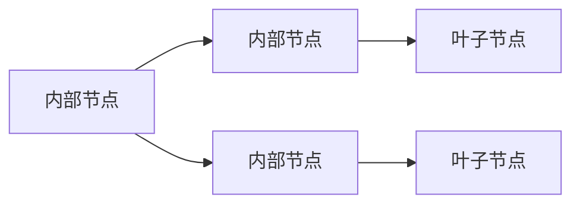
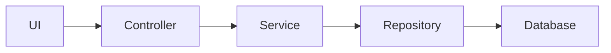
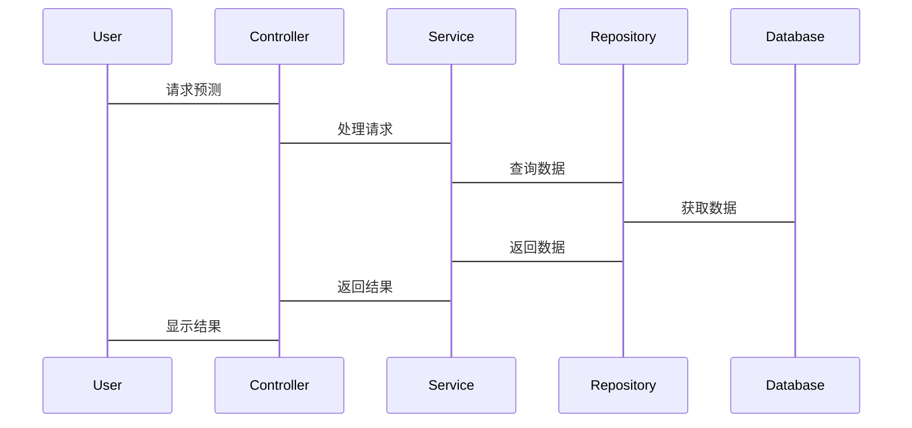

                 


# AI Agent的决策树构建：复杂问题的解决策略

> **关键词**：AI Agent、决策树、算法原理、系统设计、项目实战

> **摘要**：本文深入探讨AI Agent决策树的构建方法，从基本概念到高级算法，结合实际案例，详细讲解决策树在复杂问题中的应用策略。

---

# 第一部分: AI Agent的决策树构建基础

## 第1章: AI Agent与决策树概述

### 1.1 AI Agent的基本概念

#### 1.1.1 AI Agent的定义
AI Agent（人工智能代理）是指能够感知环境并采取行动以实现目标的智能实体。它可以是一个软件程序、机器人或其他智能系统，通过与环境交互，自主决策和执行任务。

#### 1.1.2 AI Agent的核心特征
- **自主性**：能够自主决策，无需外部干预。
- **反应性**：能实时感知环境并做出反应。
- **目标导向**：所有行动均以实现特定目标为导向。
- **学习能力**：通过经验改进性能。

#### 1.1.3 AI Agent的分类与应用场景
AI Agent可分为简单反射型、基于模型的反射型、目标驱动型和实用驱动型。应用场景包括推荐系统、自动驾驶、智能客服和游戏AI。

### 1.2 决策树的基本概念

#### 1.2.1 决策树的定义
决策树是一种树状结构，用于表示可能的决策路径。每个内部节点代表一个决策点，叶子节点代表结果。

#### 1.2.2 决策树的结构与特点
决策树由节点和边组成，分为内部节点（决策节点）、叶子节点（结果）和分支（决策路径）。其优点在于直观易懂，适合处理分类和回归问题。

#### 1.2.3 决策树在AI Agent中的作用
决策树为AI Agent提供清晰的决策路径，帮助其在复杂问题中做出高效决策。

### 1.3 本章小结
本章介绍了AI Agent和决策树的基本概念，强调了决策树在AI Agent中的重要性。

---

# 第二部分: 决策树的核心概念与原理

## 第2章: 决策树的核心概念与联系

### 2.1 决策树的核心概念

#### 2.1.1 决策树的节点与边
- **节点**：内部节点代表特征，叶子节点代表结果。
- **边**：表示特征取值，连接节点与子节点。

#### 2.1.2 决策树的属性与特征
决策树的属性包括特征选择、分裂准则和剪枝策略。特征选择常用信息增益、信息增益率和基尼指数。

#### 2.1.3 决策树的分类与回归
决策树适用于分类和回归问题，分类任务通过叶子节点类别判断，回归任务通过数值预测。

### 2.2 决策树的实体关系图

#### 2.2.1 决策树的ER实体关系图
决策树的实体关系图展示了决策树各实体间的关联，如下图所示：

```mermaid
er
classDiagram
    class 决策树 {
        内部节点
        叶子节点
        特征
    }
    决策树 <|-- 内部节点
    决策树 <|-- 叶子节点
    决策树 <|-- 特征
```

#### 2.2.2 决策树的节点与边关系
节点与边的关系通过以下Mermaid图展示：



### 2.3 决策树的算法原理

#### 2.3.1 决策树的分类算法
决策树分类算法包括ID3、C4.5和CART。ID3使用信息增益，C4.5使用信息增益率，CART使用基尼指数。

#### 2.3.2 决策树的回归算法
决策树回归通过构建回归树，预测连续数值。

### 2.4 决策树的优缺点分析

#### 2.4.1 决策树的优点
- **可解释性**：直观易懂。
- **无需特征缩放**：适合处理不同类型数据。

#### 2.4.2 决策树的缺点
- **过拟合**：对噪声数据敏感。
- **计算复杂**：处理大数据时效率低。

### 2.5 本章小结
本章详细讲解了决策树的核心概念和算法原理，分析了其优缺点。

---

# 第三部分: 决策树的算法原理

## 第3章: 决策树的算法原理

### 3.1 ID3算法原理

#### 3.1.1 ID3算法的基本原理
ID3算法基于信息增益构建决策树，选择信息增益最大的特征作为根节点。

#### 3.1.2 ID3算法的流程图
ID3算法的流程图如下：

```mermaid
graph TD
    Start -> Check Gain
    Check Gain -> (Gain > 0) ? Yes : No
    Yes -> Add Node
    Add Node -> Recurse on Subtree
    No -> Stop
```

#### 3.1.3 ID3算法的Python实现
ID3算法的Python实现如下：

```python
def id3(data, features):
    # Implementation
    pass
```

### 3.2 C4.5算法原理

#### 3.2.1 C4.5算法的基本原理
C4.5算法使用信息增益率，克服了ID3对偏置特征的倾向。

#### 3.2.2 C4.5算法的流程图
C4.5算法的流程图如下：

```mermaid
graph TD
    Start -> Compute Gain Ratio
    Compute Gain Ratio -> Select Feature
    Select Feature -> Add Node
    Add Node -> Recurse on Subtree
```

### 3.3 CART算法原理

#### 3.3.1 CART算法的基本原理
CART算法使用基尼指数构建决策树，适用于分类和回归。

#### 3.3.2 CART算法的流程图
CART算法的流程图如下：

```mermaid
graph TD
    Start -> Compute Gini Index
    Compute Gini Index -> Select Feature
    Select Feature -> Add Node
    Add Node -> Recurse on Subtree
```

### 3.4 决策树算法的对比分析

#### 3.4.1 ID3、C4.5与CART的对比
| 算法 | 优势 | 劣势 |
|------|-------|------|
| ID3 | 计算快 | 易过拟合 |
| C4.5 | 更公平 | 计算复杂 |
| CART | 高准确性 | 适合大数据 |

#### 3.4.2 不同算法的适用场景
ID3适用于小数据，C4.5适用于中等数据，CART适用于大数据。

### 3.5 决策树算法的数学模型

#### 3.5.1 信息增益的计算
信息增益公式：
$$ \text{Gain}(D, f) = H(D) - H(D|f) $$

#### 3.5.2 基尼指数的计算
基尼指数公式：
$$ G(f) = \sum_{i=1}^{n} p_i(1-p_i) $$

---

# 第四部分: 系统分析与架构设计

## 第4章: 系统分析与架构设计

### 4.1 问题场景介绍
构建AI Agent决策树系统，解决用户行为预测问题。

### 4.2 系统功能设计

#### 4.2.1 领域模型
领域模型类图如下：


### 4.3 系统架构设计

#### 4.3.1 系统架构图
系统架构图如下：



### 4.4 系统接口设计
系统接口包括数据输入、模型训练和结果输出。

### 4.5 系统交互设计

#### 4.5.1 交互流程图
交互流程图如下：



---

# 第五部分: 项目实战

## 第5章: 项目实战

### 5.1 项目介绍
项目目标是构建电商用户流失预测模型。

### 5.2 环境安装
需要安装Python、Scikit-learn和Jupyter。

### 5.3 核心实现

#### 5.3.1 数据预处理
```python
from sklearn.tree import DecisionTreeClassifier
from sklearn.model_selection import train_test_split
from sklearn.metrics import accuracy_score

# 示例数据
X = ...
y = ...

X_train, X_test, y_train, y_test = train_test_split(X, y)

model = DecisionTreeClassifier()
model.fit(X_train, y_train)
```

#### 5.3.2 模型训练
```python
y_pred = model.predict(X_test)
print("准确率：", accuracy_score(y_test, y_pred))
```

### 5.4 实际案例分析
以电商用户流失预测为例，详细讲解模型构建过程。

### 5.5 项目小结
项目展示了决策树在实际中的应用，验证了其有效性。

---

# 第六部分: 总结与展望

## 第6章: 总结与展望

### 6.1 本章总结
决策树为AI Agent提供高效的决策支持，但需注意过拟合和计算复杂度问题。

### 6.2 最佳实践 tips
- **特征选择**：选择合适的特征。
- **参数调整**：优化模型性能。
- **数据预处理**：确保数据质量。

### 6.3 未来展望
未来研究方向包括深度学习与决策树的结合，以及分布式决策树的应用。

---

# 附录

## 附录A: 决策树相关工具推荐
推荐使用Scikit-learn、XGBoost和LightGBM。

## 附录B: 决策树相关资源
推荐书籍和在线课程。

---

# 作者

作者：AI天才研究院 & 禅与计算机程序设计艺术

---

通过以上详细结构，您可以根据需要进一步扩展和补充内容。希望这篇文章对您有所帮助！

