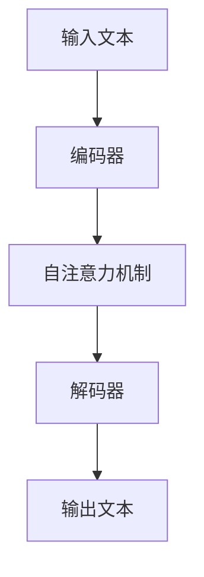
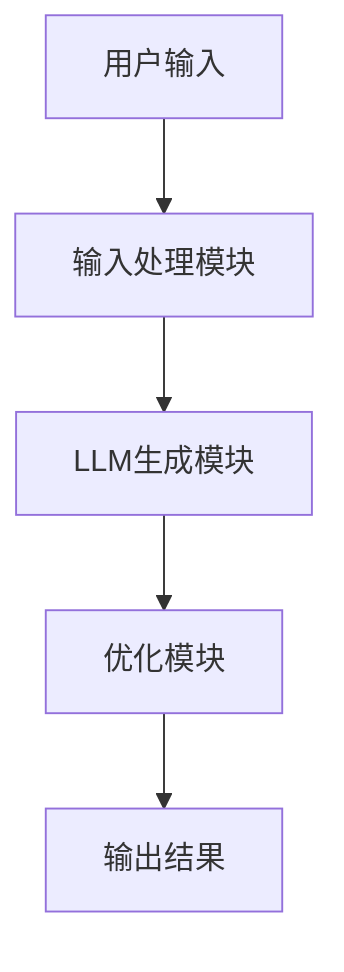

                 


# AI Agent的创造力：激发LLM的创新能力

## 关键词：
- AI Agent
- 大语言模型
- 创造力
- 创新能力
- 人工智能

## 摘要：
AI Agent与大语言模型（LLM）的结合为创造力的激发提供了新的可能性。本文从AI Agent和LLM的基本概念出发，分析创造力的定义与特征，探讨LLM在AI Agent中的应用，详细讲解激发LLM创造力的算法原理、系统架构设计及项目实战，最后总结最佳实践和未来发展方向。

---

## 第一部分: AI Agent与LLM的基本概念

### 第1章: AI Agent与LLM的定义与特点

#### 1.1 AI Agent的定义与特点
- **定义**: AI Agent是具备自主决策能力的智能实体，能够感知环境、执行任务并优化目标。
- **特点**: 智能性、自主性、反应性、目标导向。
- **与传统AI的区别**: 更加注重动态环境中的自主决策能力。

#### 1.2 LLM的定义与特点
- **定义**: 大语言模型是基于深度学习的自然语言处理模型，能够理解和生成人类语言。
- **特点**: 高准确性、多样化输出、上下文理解能力强。
- **与传统NLP模型的区别**: 强大的上下文理解和生成能力，参数量更大。

#### 1.3 AI Agent与LLM的关系
- **AI Agent的决策机制**: 基于LLM生成的多种可能性进行选择。
- **LLM在AI Agent中的作用**: 提供生成文本的能力，辅助决策。
- **协同工作模式**: AI Agent通过LLM生成创意，结合环境反馈优化决策。

---

### 第2章: 创造力的定义与特征

#### 2.1 创造力的定义与特征
- **定义**: 创造力是产生新颖且有价值想法的能力。
- **特征**: 新颖性、价值性、多样性。
- **评估标准**: 创新性、实用性、可实现性。

#### 2.2 AI Agent的创新潜力
- **来源**: LLM的生成能力和AI Agent的决策能力结合。
- **与传统AI的区别**: 更注重多样化和创新性输出。
- **边界与外延**: 受限于数据和模型能力，但可以通过优化扩展。

---

## 第二部分: 激发LLM创造力的算法原理

### 第3章: LLM的生成机制与数学模型

#### 3.1 LLM的生成机制
- **变压器模型结构**: 包括编码器和解码器。
- **自注意力机制**: 通过计算词与词之间的相关性生成上下文。
- **前馈网络**: 对输入进行非线性变换，生成输出。

#### 3.2 数学模型与公式
- **自注意力机制公式**：
  $$\text{Attention}(Q,K,V) = \text{softmax}\left(\frac{QK^T}{\sqrt{d_k}}\right)V$$
- **解码器输出**：
  $$\text{Output} = \text{FFN}(x)$$

#### 3.3 算法流程图


---

### 第4章: 激发LLM创造力的算法优化

#### 4.1 训练数据的多样性
- **数据来源**: 包括书籍、论文、网络文章等。
- **数据清洗**: 去除低质量数据，保留高质量内容。

#### 4.2 模型架构优化
- **引入新的层结构**: 如交叉注意力机制。
- **参数调整**: 增加生成层的参数量。

#### 4.3 多样性评估指标
- **困惑度**: 评估模型生成文本的多样性。
- **其他指标**: 如 BLEU、ROUGE 分值。

---

## 第三部分: 系统分析与架构设计

### 第5章: 系统功能设计

#### 5.1 问题场景
- **目标**: 构建一个具备创造力的AI Agent。
- **用户需求**: 提供多样化、创新性的解决方案。

#### 5.2 系统功能模块
- **输入处理模块**: 接收用户输入并解析。
- **生成模块**: 调用LLM生成多种方案。
- **优化模块**: 根据反馈优化生成内容。

#### 5.3 系统架构图


---

## 第四部分: 项目实战

### 第6章: 项目实现

#### 6.1 环境安装
- **Python版本**: 3.8+
- **依赖库**: transformers、numpy、torch。

#### 6.2 核心代码实现
```python
from transformers import AutoModelWithLMHead, AutoTokenizer

model = AutoModelWithLMHead.from_pretrained('gpt2')
tokenizer = AutoTokenizer.from_pretrained('gpt2')

def generate_text(prompt, length=50):
    inputs = tokenizer.encode(prompt, return_tensors='pt')
    outputs = model.generate(inputs, max_length=length, temperature=1.2)
    return tokenizer.decode(outputs[0], skip_special_tokens=True)
```

#### 6.3 实际案例分析
- **案例1**: 文本创作，生成小说情节。
- **案例2**: 编程辅助，生成算法伪代码。

---

## 第五部分: 总结与展望

### 第7章: 总结与最佳实践

#### 7.1 总结
- **核心观点**: AI Agent与LLM结合能够显著提升创造力。
- **关键点**: 数据多样性、模型优化、用户反馈。

#### 7.2 最佳实践
- **数据质量**: 确保训练数据的多样性和高质量。
- **模型调优**: 根据具体任务优化模型参数。
- **用户反馈**: 结合用户反馈不断改进生成结果。

#### 7.3 未来展望
- **更智能的模型**: 如GPT-4的发布。
- **更高效的算法**: 结合强化学习进一步优化生成质量。
- **多领域应用**: 在教育、医疗等领域发挥创造力。

---

## 作者：AI天才研究院/AI Genius Institute & 禅与计算机程序设计艺术 /Zen And The Art of Computer Programming

