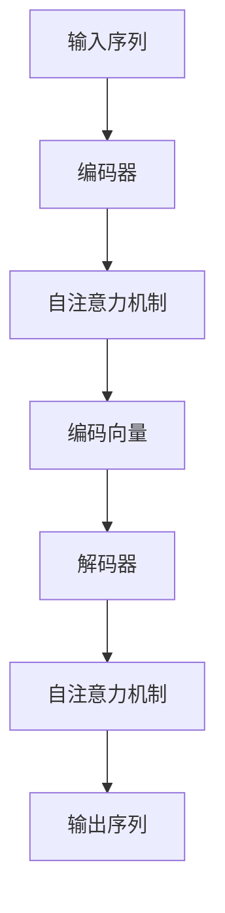
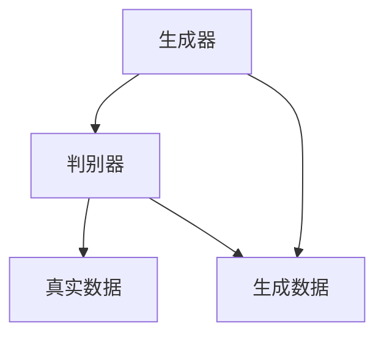
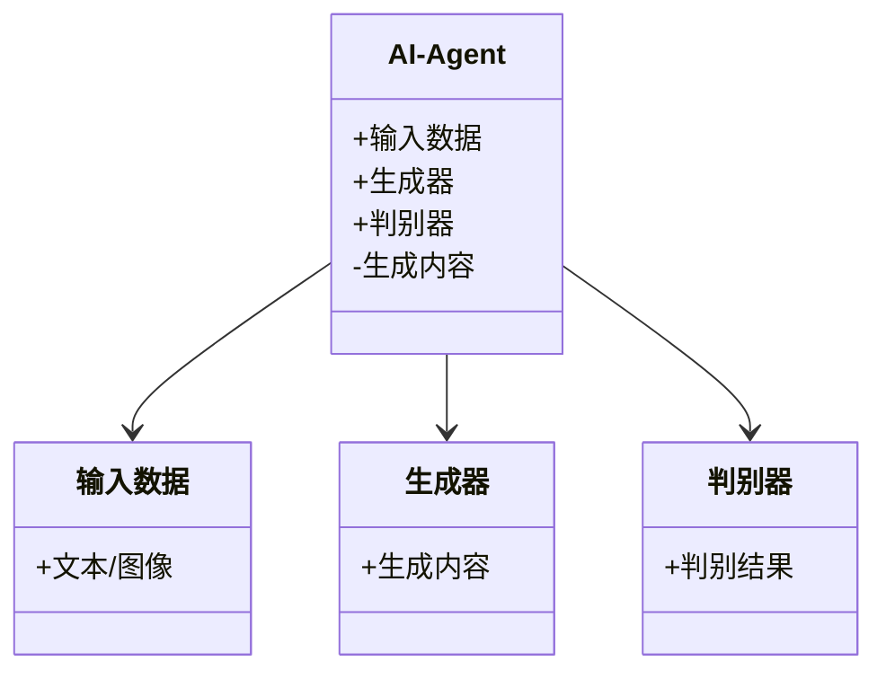
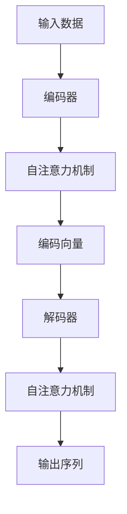
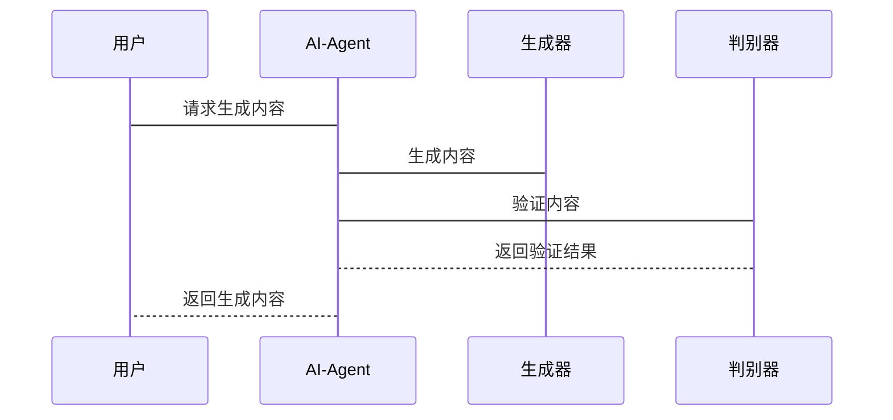

                 


# AI Agent的创造力：生成新颖内容

> **关键词**：生成式AI，Transformer模型，生成对抗网络，创造力评估，AI内容生成，自然语言处理，图像生成

> **摘要**：  
> 本文深入探讨了AI Agent在生成新颖内容方面的创造力，从生成式AI的核心原理到实际应用，全面分析了其技术基础、算法原理、系统设计和项目实现。通过详细讲解生成式AI的数学模型、算法流程以及实际案例，本文为读者提供了从理论到实践的完整视角，帮助理解AI Agent如何通过创造性思维生成高质量内容。

---

# 第1章：生成式AI的核心原理

## 1.1 生成式AI的定义与背景

### 1.1.1 生成式AI的定义

生成式AI是一种基于人工智能技术，能够自动生成新颖内容的模型。它不同于传统的检索式AI，生成式AI能够从输入数据中学习模式，并生成新的、未见过的数据，如文本、图像、音频和视频等。

**背景介绍**：  
生成式AI的发展得益于深度学习技术的突破，尤其是Transformer模型和生成对抗网络（GANs）的提出，使得生成高质量内容成为可能。生成式AI的应用场景广泛，包括自然语言处理、图像生成、音乐创作等领域。

### 1.1.2 生成式AI的核心特征

生成式AI的核心特征包括：  
1. **创造性**：生成从未见过的内容。  
2. **多样性**：能够生成多种不同的输出。  
3. **适应性**：可以根据输入条件生成特定类型的内容。  

### 1.1.3 生成式AI的创新点

生成式AI的创新点在于其能够通过学习数据分布，生成与训练数据分布相似的新内容。与传统基于规则的生成方法不同，生成式AI通过深度学习模型，能够自动优化生成过程，提高生成内容的质量和多样性。

---

## 1.2 生成式AI的关键技术

### 1.2.1 Transformer模型

**背景介绍**：  
Transformer模型由Vaswney等人提出，最初用于自然语言处理任务。其核心思想是通过自注意力机制，捕捉输入序列中元素之间的关系，从而生成高质量的输出。

**算法原理**：  
Transformer模型由编码器和解码器组成。编码器负责将输入序列编码为一个固定长度的向量，解码器则根据编码结果生成输出序列。自注意力机制是其关键部分，公式如下：

$$
\text{Attention}(Q, K, V) = \text{softmax}\left(\frac{QK^T}{\sqrt{d_k}}\right)V
$$

其中，$Q$、$K$、$V$分别是查询、键和值向量，$d_k$是键的维度。

**Mermaid图表**：  


### 1.2.2 生成对抗网络（GANs）

**背景介绍**：  
生成对抗网络由Goodfellow等人提出，是一种通过对抗训练生成数据的模型。GANs由生成器和判别器组成，生成器负责生成数据，判别器负责区分生成数据和真实数据。

**算法原理**：  
生成器的目标是最小化判别器的损失函数，而判别器的目标是最大化真实数据的判别准确率。通过交替优化生成器和判别器，GANs能够生成逼真的数据。损失函数如下：

$$
\mathcal{L}_{\text{GAN}} = \mathbb{E}_{x \sim p_{\text{data}}}[ \log D(x) ] + \mathbb{E}_{z \sim p_z}[ \log (1 - D(G(z))) ]
$$

**Mermaid图表**：  


---

## 1.3 生成式AI的核心算法

### 1.3.1 Transformer模型的数学公式

Transformer模型的自注意力机制可以通过以下公式表示：

$$
\text{Attention}(Q, K, V) = \text{softmax}\left(\frac{QK^T}{\sqrt{d_k}}\right)V
$$

其中，$Q$、$K$、$V$分别是查询、键和值向量，$d_k$是键的维度。

### 1.3.2 GANs的损失函数

生成对抗网络的损失函数如下：

$$
\mathcal{L}_{\text{GAN}} = \mathbb{E}_{x \sim p_{\text{data}}}[ \log D(x) ] + \mathbb{E}_{z \sim p_z}[ \log (1 - D(G(z))) ]
$$

---

# 第2章：生成式AI的系统设计与实现

## 2.1 系统功能设计

### 2.1.1 领域模型类图



### 2.1.2 系统架构图



### 2.1.3 系统交互图



---

## 2.2 项目实战

### 2.2.1 环境搭建

安装必要的库：

```bash
pip install tensorflow keras numpy matplotlib
```

### 2.2.2 核心代码实现

```python
import tensorflow as tf
from tensorflow import keras

# 定义生成器模型
def generator():
    model = keras.Sequential([
        keras.layers.Dense(256, activation='relu'),
        keras.layers.Dense(128, activation='relu'),
        keras.layers.Dense(784, activation='sigmoid')
    ])
    return model

# 定义判别器模型
def discriminator():
    model = keras.Sequential([
        keras.layers.Dense(256, activation='relu'),
        keras.layers.Dense(128, activation='relu'),
        keras.layers.Dense(1, activation='sigmoid')
    ])
    return model

# 定义GANs模型
def gan():
    discriminator = discriminator()
    discriminator.trainable = False
    model = keras.Sequential([generator(), discriminator()])
    return model
```

### 2.2.3 代码解读与分析

- **生成器**：通过多层感知机（MLP）生成数据，输出经过sigmoid激活函数，生成0-1之间的值。
- **判别器**：同样使用MLP结构，输出经过sigmoid激活函数，判断输入数据是否为真实数据。
- **GANs模型**：将生成器和判别器串联，训练时交替优化生成器和判别器。

### 2.2.4 实际案例分析

训练GANs模型生成MNIST手写数字：

```python
# 数据准备
(x_train, y_train), (x_test, y_test) = keras.datasets.mnist.load_data()
x_train = x_train.astype('float32') / 255.0

# 训练GANs模型
model = gan()
model.compile(optimizer='adam', loss='binary_crossentropy')
model.fit(x_train, epochs=10, batch_size=128)
```

---

## 2.3 最佳实践

### 2.3.1 生成式AI的评估指标

- **生成质量**：生成内容与真实数据的相似性。
- **多样性**：生成内容的多样性。
- **收敛速度**：模型训练的收敛速度。

### 2.3.2 生成式AI的优化技巧

- **调整超参数**：如学习率、批量大小等。
- **改进模型结构**：如使用更深的网络或引入残差连接。
- **数据增强**：通过数据增强提高生成内容的质量和多样性。

### 2.3.3 生成式AI的伦理与安全

- **版权问题**：生成内容的版权归属。
- **滥用风险**：防止生成式AI被用于恶意用途。

---

# 第3章：生成式AI的高级主题

## 3.1 多模态生成

### 3.1.1 多模态生成的定义

多模态生成是指生成多种类型的数据，如文本、图像和音频等。

### 3.1.2 多模态生成的挑战

- **数据一致性**：不同模态数据之间的协调。
- **模型复杂性**：需要处理多种数据类型。

## 3.2 创造力评估

### 3.2.1 创造力评估的指标

- **新颖性**：生成内容的独特性。
- **相关性**：生成内容与输入条件的相关性。

### 3.2.2 创造力评估的方法

- **人工评估**：通过人工评分。
- **自动评估**：通过算法评估生成内容的质量。

## 3.3 生成式AI的未来发展方向

### 3.3.1 更高质量的生成

通过改进模型结构和算法，提高生成内容的质量。

### 3.3.2 更强的创造力

通过引入更多的创新算法，增强生成式AI的创造力。

### 3.3.3 更广泛的应用

将生成式AI应用于更多的领域，如教育、医疗和艺术等。

---

# 第4章：总结与展望

## 4.1 生成式AI的核心内容回顾

生成式AI通过深度学习模型，能够生成高质量、多样化的内容，已在多个领域得到广泛应用。

## 4.2 生成式AI的未来展望

随着技术的不断发展，生成式AI将更加智能化和多样化，为人类创造更多的可能性。

## 4.3 生成式AI的注意事项

- **伦理问题**：生成式AI的滥用可能导致严重的伦理问题。
- **技术挑战**：生成式AI仍面临许多技术挑战，如生成质量、计算效率等。

---

# 作者

作者：AI天才研究院/AI Genius Institute & 禅与计算机程序设计艺术 /Zen And The Art of Computer Programming

