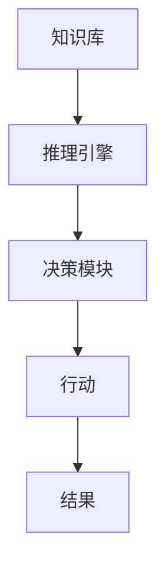

                 


# AI Agent的反事实推理：增强决策的前瞻性

> **关键词**：AI Agent，反事实推理，前瞻性决策，可能世界模型，决策优化，算法实现

> **摘要**：反事实推理是一种基于假设的推理方法，用于探索可能的替代路径和结果。在AI Agent的决策过程中，反事实推理能够增强决策的前瞻性，帮助AI Agent在复杂环境中做出更优化的选择。本文将从反事实推理的核心概念、算法实现、系统架构设计以及项目实战等方面，详细探讨其在AI Agent中的应用及其对决策前瞻性的提升。

---

## 第1章 反事实推理的核心概念

### 1.1 什么是反事实推理
反事实推理是一种假设性推理，用于探索“如果”情况下的结果。例如，反事实推理可以用于思考：“如果我采取了另一个行动，结果会如何？”这种方法在决策过程中提供了一种探索未来可能性的手段，从而帮助AI Agent做出更优的选择。

### 1.2 反事实推理与事实推理的区别
- **事实推理**：基于当前已知的事实进行推理，预测未来的结果。
- **反事实推理**：基于假设的情况进行推理，探索可能的结果。

### 1.3 反事实推理在AI Agent中的作用
AI Agent通过反事实推理，可以在决策过程中探索多种可能的路径，评估每种路径的潜在结果，从而做出更优的选择。这种推理方式特别适用于复杂、动态的环境，帮助AI Agent在不确定性中做出更前瞻性的决策。

---

## 第2章 反事实推理的原理

### 2.1 可能世界模型
可能世界模型是一种用于表示所有可能结果的理论框架。每个“可能世界”代表一种假设的情景，AI Agent可以通过分析不同可能世界的结果，选择最优的行动方案。

### 2.2 反事实条件句
反事实条件句是反事实推理的核心，形式为：“如果A，则B”，其中A是假设的情况，B是基于A的可能结果。

### 2.3 反事实推理的逻辑框架
反事实推理的逻辑框架包括以下几个步骤：
1. 确定假设条件。
2. 分析假设条件下的可能结果。
3. 比较不同结果，选择最优方案。

---

## 第3章 AI Agent的决策机制

### 3.1 基于事实的决策
基于事实的决策依赖于当前已知的信息，预测未来的结果。这种方法适用于环境相对确定的情况。

### 3.2 基于反事实的决策
基于反事实的决策通过假设不同的行动方案，评估每种方案的可能结果，从而做出更优的选择。这种方法特别适用于复杂、动态的环境。

### 3.3 基于前瞻性的决策
前瞻性决策结合了事实推理和反事实推理，通过综合分析当前和未来的可能性，制定最优的行动方案。

---

## 第4章 反事实推理的算法实现

### 4.1 反事实推理算法概述
反事实推理算法通常包括以下几个步骤：
1. 确定假设条件。
2. 生成可能的结果。
3. 评估结果，选择最优方案。

### 4.2 反事实推理的Python实现

```python
def factual_reasoning(current_state):
    # 基于当前状态的事实推理
    pass

def counterfactual_reasoning(counterfactual_state):
    # 反事实推理
    pass

def decision-making(current_state):
    # 综合推理结果做出决策
    pass
```

### 4.3 反事实推理的数学模型
反事实推理的数学模型可以表示为：
$$ P(B | A) $$
其中，$A$是假设的情况，$B$是基于$A$的结果。

---

## 第5章 系统分析与架构设计

### 5.1 问题场景
AI Agent需要在动态环境中做出决策，环境的变化可能导致多种可能的结果。通过反事实推理，AI Agent可以探索不同的行动方案，评估每种方案的可能结果。

### 5.2 系统功能设计
- **知识库**：存储环境信息和可能的结果。
- **推理引擎**：负责事实推理和反事实推理。
- **决策模块**：综合推理结果，制定最优决策。

### 5.3 系统架构设计


### 5.4 接口设计
- 输入接口：接收环境信息和假设条件。
- 输出接口：输出决策结果和行动方案。

---

## 第6章 项目实战

### 6.1 环境安装
安装必要的Python库，如`numpy`和`scipy`。

### 6.2 核心代码实现

```python
import numpy as np

def counterfactual_prediction(counterfactual_state):
    # 反事实推理的预测
    return np.random.choice([0, 1], p=[0.3, 0.7])

def decision-making(process):
    # 综合推理结果做出决策
    if process == 'factual':
        return factual_reasoning()
    else:
        return counterfactual_prediction()
```

### 6.3 实际案例分析
通过具体案例分析，展示反事实推理如何帮助AI Agent在复杂环境中做出更优的决策。

### 6.4 项目小结
反事实推理通过探索可能的替代路径和结果，帮助AI Agent在决策过程中增强前瞻性，提高决策的优化性。

---

## 第7章 最佳实践

### 7.1 小结
反事实推理是一种强大的工具，能够帮助AI Agent在复杂环境中做出更优的决策。

### 7.2 注意事项
在实际应用中，需要注意反事实推理的计算复杂性和假设的合理性。

### 7.3 拓展阅读
推荐阅读相关领域的书籍和论文，深入理解反事实推理的理论和应用。

---

## 作者

**作者：AI天才研究院/AI Genius Institute & 禅与计算机程序设计艺术 /Zen And The Art of Computer Programming**

---

以上是《AI Agent的反事实推理：增强决策的前瞻性》的完整目录和内容概述。通过系统的分析和详细的讲解，本文深入探讨了反事实推理在AI Agent中的应用及其对决策前瞻性的提升。

