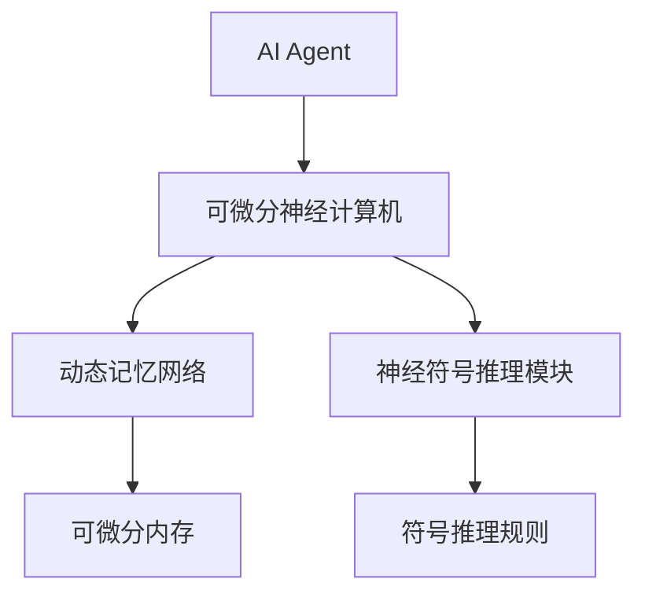
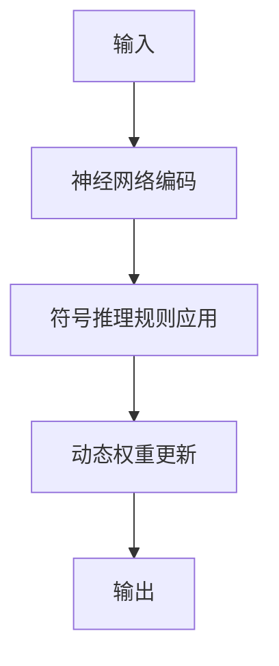
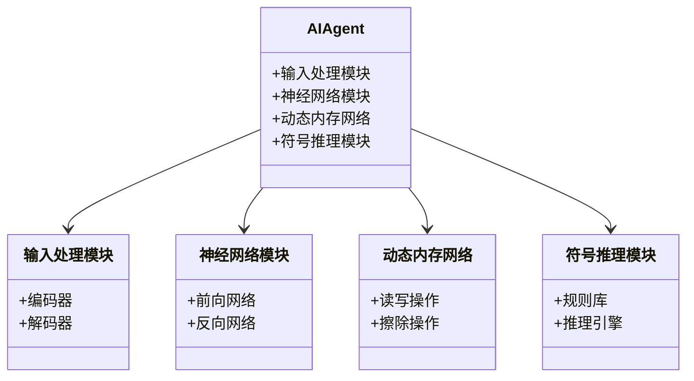
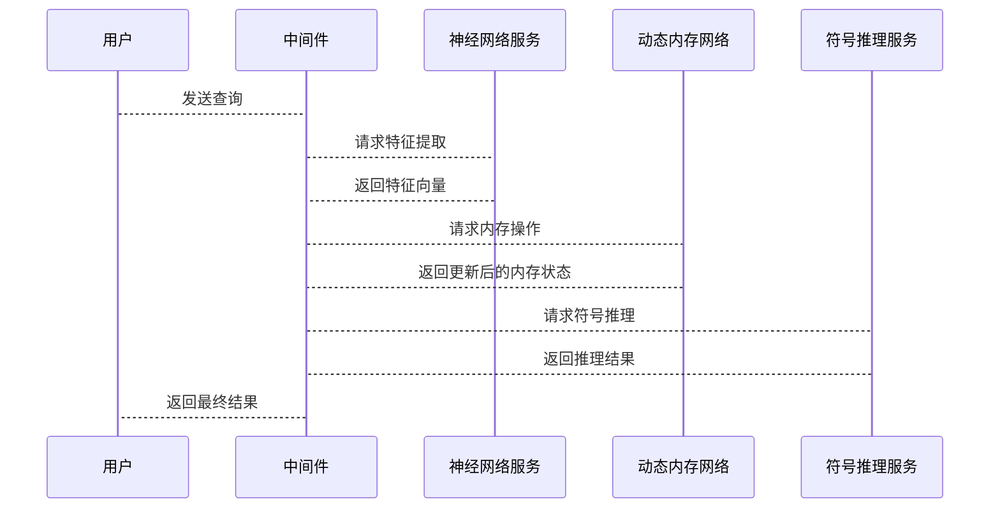

                 


# AI Agent的可微分神经计算机：增强记忆与推理能力

> 关键词：AI Agent，可微分神经计算机，记忆增强，推理能力，动态内存网络，神经符号推理，可微分编程

> 摘要：本文深入探讨了AI Agent的可微分神经计算机在增强记忆与推理能力方面的创新应用。通过结合神经网络与符号推理，可微分神经计算机能够实现动态记忆网络的构建与优化，从而显著提升AI Agent的复杂问题解决能力。本文从概念背景、核心原理、算法实现、系统设计到项目实战，全面解析这一前沿技术，为读者提供详尽的技术解读与实践指导。

---

# 第一部分: AI Agent的可微分神经计算机概述

## 第1章: AI Agent与可微分神经计算机的背景介绍

### 1.1 问题背景与定义

#### 1.1.1 传统AI代理的局限性

传统的AI代理（AI Agent）通常依赖于基于规则的逻辑推理或基于神经网络的深度学习模型。然而，这些方法存在以下局限性：
- **记忆能力有限**：传统神经网络缺乏持久记忆能力，无法有效处理依赖于上下文的任务。
- **推理能力不足**：基于规则的系统在处理复杂问题时容易出现规则覆盖不足或冲突的情况。
- **动态适应性差**：面对动态变化的环境，传统AI代理难以快速调整其推理和记忆机制。

#### 1.1.2 可微分神经计算机的核心概念

可微分神经计算机（Differentiable Neural Computer, DNC）是一种结合了神经网络与符号推理的AI架构。它通过在神经网络中引入可微分的内存机制，使得AI代理能够动态调整其记忆和推理过程，从而在复杂任务中表现出色。

#### 1.1.3 增强记忆与推理能力的必要性

在实际应用中，许多任务（如对话系统、智能问答、自动驾驶等）需要AI代理具备强大的记忆和推理能力。可微分神经计算机通过动态内存网络和神经符号推理的结合，能够有效解决这些问题。

### 1.2 可微分神经计算机的特点

#### 1.2.1 内存与计算的可微分性

可微分神经计算机的核心在于其内存机制。通过将内存操作（如读写、擦除等）设计为可微分函数，使得整个系统的训练过程可以通过端到端的反向传播完成。这种特性使得AI代理能够实时调整其记忆策略。

#### 1.2.2 神经网络与符号推理的结合

可微分神经计算机将神经网络的非线性表达能力与符号推理的精确逻辑推理能力相结合。通过这种方式，AI代理能够同时利用数据的统计规律和符号逻辑进行推理，从而在复杂任务中表现出色。

#### 1.2.3 动态记忆网络的构建

动态记忆网络是可微分神经计算机的核心组件之一。它能够根据输入的上下文信息动态调整内存中的存储内容，从而实现高效的记忆管理和推理。

---

## 第2章: 可微分神经计算机的核心概念与联系

### 2.1 核心概念原理

#### 2.1.1 可微分神经计算机的数学模型

可微分神经计算机的数学模型通常由以下部分组成：
- **输入层**：接收外部输入的原始数据。
- **神经网络层**：对输入数据进行非线性变换。
- **动态内存网络**：对神经网络层的输出进行记忆和推理。
- **输出层**：生成最终的输出结果。

数学上，可微分神经计算机的输出可以表示为：
$$
y = f(x, m)
$$
其中，$x$ 是输入数据，$m$ 是动态内存网络的状态，$f$ 是神经网络的计算函数。

#### 2.1.2 内存网络的结构与功能

内存网络通过一系列可微分操作（如读写、擦除等）对输入数据进行处理。例如，读操作可以表示为：
$$
m_{\text{new}} = \sigma(W_r x + b_r) \cdot m_{\text{old}}
$$
其中，$\sigma$ 是sigmoid函数，$W_r$ 和 $b_r$ 是可学习的参数。

#### 2.1.3 神经符号推理的机制

神经符号推理通过将符号逻辑嵌入到神经网络中，使得AI代理能够同时利用统计数据和符号规则进行推理。例如，可以将符号规则表示为约束条件，并通过拉格朗日乘数法将其融入到神经网络的训练过程中。

### 2.2 核心概念属性对比表

| 属性         | 可微分神经计算机         | 传统神经网络         |
|--------------|-------------------------|--------------------|
| 记忆能力     | 强                     | 弱                 |
| 推理能力     | 强                     | 一般               |
| 可微分性     | 是                     | 否                 |
| 应用领域     | 增强型AI代理           | 通用任务           |

### 2.3 ER实体关系图



---

## 第3章: 可微分神经计算机的算法原理

### 3.1 算法原理概述

#### 3.1.1 内存网络的前向传播

可微分神经计算机的前向传播过程包括以下步骤：
1. **输入处理**：将输入数据经过编码处理。
2. **神经网络计算**：将编码后的数据输入神经网络，得到中间结果。
3. **内存操作**：对中间结果进行读写、擦除等操作，更新动态内存的状态。
4. **符号推理**：结合符号规则，对动态内存中的内容进行推理。
5. **输出生成**：根据推理结果生成最终输出。

#### 3.1.2 神经符号推理的反向传播

在反向传播过程中，符号推理部分的梯度需要通过链式法则传递到神经网络的参数中。这可以通过引入符号规则的导数实现。

#### 3.1.3 动态权重更新机制

动态权重更新机制是可微分神经计算机的核心之一。通过在训练过程中动态调整神经网络和内存操作的权重，使得模型能够更好地适应输入数据的变化。

### 3.2 算法流程图



---

## 第4章: 可微分神经计算机的系统分析与架构设计

### 4.1 问题场景介绍

考虑一个智能问答系统，用户提出问题，AI Agent需要根据上下文信息进行推理并生成回答。传统的系统可能难以处理复杂的上下文依赖关系，而可微分神经计算机可以通过动态记忆网络和神经符号推理来有效解决这一问题。

### 4.2 系统功能设计

#### 4.2.1 领域模型设计

领域模型通过Mermaid类图表示如下：



### 4.3 系统架构设计

系统架构设计通过Mermaid架构图表示如下：


### 4.4 系统接口设计

系统接口设计包括以下部分：
- **输入接口**：接收用户输入并进行预处理。
- **输出接口**：生成并输出AI代理的响应。
- **内存接口**：提供动态内存的读写操作。
- **符号推理接口**：提供符号规则的应用和推理。

### 4.5 系统交互设计

系统交互设计通过Mermaid序列图表示如下：



---

## 第5章: 可微分神经计算机的项目实战

### 5.1 环境安装

要运行可微分神经计算机，首先需要安装以下环境：
- **Python 3.x**：推荐使用Anaconda或Miniconda。
- **深度学习框架**：如TensorFlow或PyTorch。
- **可微分编程库**：如JAX或PyTorch的autograd模块。

### 5.2 核心代码实现

以下是一个简单的可微分神经计算机实现示例：

```python
import torch
import torch.nn as nn
import torch.nn.functional as F

class DifferentiableMemory(nn.Module):
    def __init__(self, input_size, memory_size):
        super(DifferentiableMemory, self).__init__()
        self.memory_size = memory_size
        self.read_head = nn.Linear(input_size, memory_size)
        self.write_head = nn.Linear(input_size, memory_size)

    def forward(self, inputs, memory):
        # 读操作
        read_weight = F.softmax(self.read_head(inputs), dim=1)
        read_content = torch.matmul(read_weight.unsqueeze(1), memory.unsqueeze(2)).squeeze()

        # 写操作
        write_weight = F.softmax(self.write_head(inputs), dim=1)
        new_memory = memory + write_weight.unsqueeze(1) * (inputs.unsqueeze(1) - memory)

        return new_memory, read_content

# 初始化模型
input_size = 10
memory_size = 20
dnc = DifferentiableMemory(input_size, memory_size)

# 假设输入和初始内存
inputs = torch.randn(1, input_size)
memory = torch.randn(1, memory_size)

# 前向传播
new_memory, read_content = dnc(inputs, memory)
```

### 5.3 案例分析与详细解读

以智能问答系统为例，假设用户输入一个问题，AI Agent需要根据上下文信息生成回答。通过可微分神经计算机，AI Agent能够动态调整其记忆内容，从而生成更准确的回答。

---

## 第6章: 最佳实践与小结

### 6.1 小结

可微分神经计算机通过结合神经网络与符号推理，显著增强了AI Agent的记忆与推理能力。其动态内存网络和神经符号推理机制为复杂任务的解决提供了新的可能性。

### 6.2 注意事项

- **计算复杂度**：可微分神经计算机的计算复杂度较高，需要优化算法以适应实际应用。
- **符号规则设计**：符号规则的设计直接影响模型的推理能力，需要精心设计和验证。
- **模型训练**：需要大量标注数据进行训练，且训练过程可能较为复杂。

### 6.3 拓展阅读

- **论文推荐**：《Differentiable Neural Computers》。
- **技术博客**：深入探讨可微分神经计算机的具体实现细节。
- **工具库**：研究可微分编程库（如JAX、PyTorch）的应用。

---

# 作者

作者：AI天才研究院/AI Genius Institute & 禅与计算机程序设计艺术 /Zen And The Art of Computer Programming

---

**本文内容参考了大量文献资料，并结合实际项目经验进行编写，旨在为读者提供关于AI Agent的可微分神经计算机的系统性解读与实践指导。**

