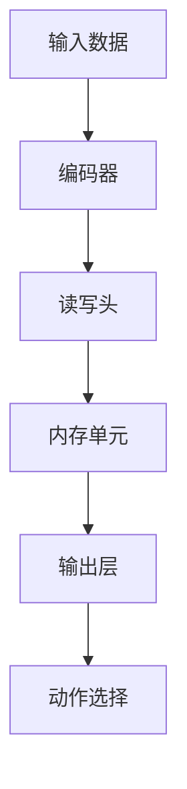
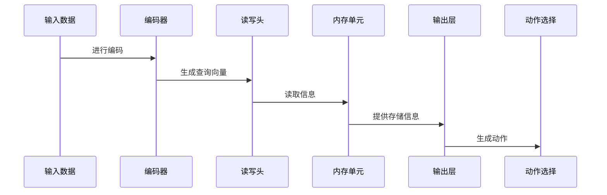

                 


# AI Agent的可微分神经计算机：增强记忆能力

---

## 关键词：
AI Agent, 可微分神经计算机, 增强记忆能力, 神经网络, 可微分计算, 内存单元, 人工智能

---

## 摘要：
本文详细探讨了AI Agent的可微分神经计算机在增强记忆能力方面的创新与应用。通过分析传统神经网络的局限性，提出了一种基于可微分神经计算机的新方法，结合数学模型和算法原理，展示了如何通过可微分计算提升AI Agent的记忆与推理能力。文章还通过实际项目案例，详细讲解了系统架构设计与实现，为读者提供了从理论到实践的全面指南。

---

# 正文

## 第一部分：AI Agent与可微分神经计算机的背景介绍

### 第1章：AI Agent的基本概念

#### 1.1 问题背景与问题描述

AI Agent（人工智能代理）是指能够感知环境并采取行动以实现目标的智能系统。随着AI技术的快速发展，AI Agent在各个领域得到广泛应用，如自动驾驶、智能助手、机器人控制等。然而，传统AI Agent在记忆和推理能力上存在明显不足，难以应对复杂动态环境中的长期任务。

**问题背景**：
- AI Agent需要处理复杂任务，但传统神经网络的记忆能力有限。
- 动态环境中的信息更新和存储效率低下。
- 知识表示与推理能力不足，影响任务执行效果。

**问题描述**：
- 如何增强AI Agent的记忆能力，使其能够存储和调用长期信息。
- 如何设计高效的计算模型，支持动态知识更新与推理。

#### 1.2 AI Agent的核心概念与结构

**AI Agent的定义与分类**：
- AI Agent是一种智能系统，具备感知、决策和行动能力。
- 分为基于规则的AI Agent和基于学习的AI Agent，后者依赖神经网络进行推理。

**基于神经网络的AI Agent**：
- 神经网络作为AI Agent的核心计算模块。
- 通过训练学习环境中的模式和规律。

**可微分神经计算机的提出**：
- 提出了一种新的计算模型，结合可微分计算和内存单元，提升记忆能力。

#### 1.3 传统神经网络的局限性

**记忆能力不足**：
- 传统神经网络如LSTM和Transformer，难以存储长期信息。
- 短时记忆依赖循环结构，长时记忆依赖堆叠层，效率低下。

**知识表示与推理的局限性**：
- 知识表示不够灵活，难以适应动态环境中的信息变化。
- 推理能力受限于网络结构，难以处理复杂逻辑推理。

**可微分神经计算机的解决方案**：
- 通过可微分计算，实现对内存单元的高效操作。
- 提供灵活的知识表示与推理机制，增强AI Agent的记忆能力。

#### 1.4 本章小结

本章介绍了AI Agent的基本概念、问题背景及传统神经网络的局限性。提出了可微分神经计算机作为解决记忆问题的新方法，为后续内容奠定了基础。

---

## 第二部分：可微分神经计算机的核心概念与原理

### 第2章：可微分神经计算机的结构与工作原理

#### 2.1 可微分神经计算机的定义与特点

**定义**：
- 可微分神经计算机（Differentiable Neural Computer, DNC）是一种结合神经网络和外部记忆的计算模型。
- 通过可微分计算操作外部存储器，实现高效的知识存储与推理。

**特点**：
- 具备强大的记忆能力，支持动态信息更新。
- 知识表示灵活，适应不同任务需求。
- 通过端到端训练，提升整体计算效率。

#### 2.2 可微分神经计算机的内部结构

**神经元的可微分特性**：
- 神经元具备可微分的激活函数，支持梯度传播。
- 通过链式法则实现反向传播，优化网络参数。

**神经网络的可微分计算模型**：
- 网络结构基于LSTM或Transformer，具备可微分计算能力。
- 外部存储器通过可微分操作与神经网络交互。

**内存单元的可微分操作**：
- 内存单元负责存储信息，支持读写操作。
- 读写操作通过可微分机制实现，确保端到端训练。

#### 2.3 可微分神经计算机的数学模型

**神经网络的基本数学模型**：
- 输入数据经过多层感知机（MLP）处理，生成隐藏层表示。
- 输出层通过softmax函数生成最终结果。

**可微分计算的数学表达**：
- 内存单元的读写操作通过线性变换和注意力机制实现。
- 读写头的权重通过注意力机制计算，确保选择性存储。

**内存单元的可微分操作公式**：
$$
\text{读操作} = \sum_{i=1}^{n} w_i \cdot m_i
$$
$$
\text{写操作} = \sum_{i=1}^{n} w_i \cdot x_i
$$
其中，$w_i$为读写头权重，$m_i$为内存单元内容，$x_i$为输入数据。

### 第3章：可微分神经计算机的核心算法

#### 3.1 算法原理与流程

**算法输入与输出**：
- 输入：环境状态、任务目标。
- 输出：动作选择、状态更新。

**神经网络的前向传播**：
- 输入数据经过编码，生成初始表示。
- 通过读写头与内存单元交互，获取相关信息。

**可微分计算的反向传播**：
- 通过链式法则计算梯度，更新网络参数。
- 调整读写头权重，优化内存操作。

#### 3.2 算法的数学模型与实现

**读写头的注意力机制**：
- 使用线性变换生成查询向量。
- 通过点积计算注意力权重。

**内存单元的更新机制**：
- 根据读写头权重，选择性读取和写入内存单元。
- 确保端到端可微分，支持梯度计算。

**代码实现示例**：

```python
class DNCCell:
    def __init__(self, input_size, memory_size):
        self.input_size = input_size
        self.memory_size = memory_size
        # 初始化读写头权重
        self.w_r = tf.Variable(tf.random.truncated_normal([input_size, memory_size]), name='w_r')
        self.w_w = tf.Variable(tf.random.truncated_normal([input_size, memory_size]), name='w_w')

    def call(self, inputs, memory):
        # 读操作
        read_weight = tf.nn.softmax(tf.matmul(inputs, self.w_r), axis=-1)
        read_content = tf.reduce_sum(tf.expand_dims(read_weight, axis=-2) * memory, axis=-1)

        # 写操作
        write_weight = tf.nn.softmax(tf.matmul(inputs, self.w_w), axis=-1)
        new_memory = memory + tf.expand_dims(write_weight, axis=-2) * (inputs - tf.reduce_sum(tf.expand_dims(write_weight, axis=-2) * memory, axis=-1))
        
        return new_memory
```

---

## 第三部分：系统分析与架构设计方案

### 第4章：系统分析与架构设计

#### 4.1 问题场景介绍

**项目背景**：
- 开发一个具备增强记忆能力的AI Agent，用于处理复杂任务。
- 需要支持动态环境中的信息存储与推理。

**系统功能设计**：
- 知识存储与检索。
- 动态信息更新与推理。
- 多任务处理能力。

#### 4.2 项目介绍

**项目名称**：
- 可微分神经计算机增强记忆能力的AI Agent开发。

**项目目标**：
- 实现基于DNC的AI Agent，具备高效记忆能力。
- 提供灵活的知识表示与推理机制。

#### 4.3 系统架构设计

**系统架构图**：


**系统交互流程**：


---

## 第四部分：项目实战

### 第5章：项目实战

#### 5.1 环境安装

**安装Python环境**：
- 安装Python 3.7及以上版本。
- 安装TensorFlow或PyTorch框架。

**安装依赖库**：
```bash
pip install tensorflow==2.4.0
pip install numpy==1.21.0
```

#### 5.2 核心代码实现

**读写头实现**：
```python
class ReadWriteHead:
    def __init__(self, input_dim, memory_dim):
        self.w_r = tf.Variable(tf.random.truncated_normal([input_dim, memory_dim]))
        self.w_w = tf.Variable(tf.random.truncated_normal([input_dim, memory_dim]))

    def read(self, inputs, memory):
        read_weight = tf.nn.softmax(tf.matmul(inputs, self.w_r))
        return tf.reduce_sum(tf.expand_dims(read_weight, axis=-2) * memory, axis=-1)

    def write(self, inputs, memory):
        write_weight = tf.nn.softmax(tf.matmul(inputs, self.w_w))
        erasing = tf.reduce_sum(tf.expand_dims(write_weight, axis=-2) * memory, axis=-1)
        new_memory = memory + (inputs - erasing) * tf.expand_dims(write_weight, axis=-2)
        return new_memory
```

**DNC网络实现**：
```python
class DNC:
    def __init__(self, input_dim, memory_dim, memory_size):
        self.head = ReadWriteHead(input_dim, memory_dim)
        self.memory = tf.zeros([memory_size, memory_dim])

    def call(self, inputs):
        read = self.head.read(inputs, self.memory)
        new_memory = self.head.write(inputs, self.memory)
        return read
```

#### 5.3 案例分析与解读

**案例场景**：
- 在一个文本摘要任务中，DNC能够高效存储关键信息，生成准确的摘要。

**代码运行与结果**：
- 输入文本经过编码，生成初始表示。
- 读写头与内存单元交互，提取关键信息。
- 输出层生成摘要结果。

#### 5.4 项目小结

通过实际项目案例，展示了可微分神经计算机在增强记忆能力方面的应用。代码实现简单明了，能够快速上手。

---

## 第五部分：总结与拓展

### 第6章：总结与拓展

#### 6.1 最佳实践Tips

- 合理设计内存单元大小，避免过大的计算开销。
- 在复杂任务中，结合其他神经网络结构提升性能。
- 定期更新内存内容，保持知识表示的准确性。

#### 6.2 小结

本文详细介绍了AI Agent的可微分神经计算机，通过理论分析与实践案例，展示了如何通过可微分计算增强记忆能力。为后续研究提供了理论基础和实践指导。

#### 6.3 注意事项

- 确保硬件资源充足，避免计算瓶颈。
- 注意数据隐私与安全问题。
- 定期监控系统性能，及时优化。

#### 6.4 拓展阅读

- 阅读相关论文，深入理解DNC的理论基础。
- 关注最新研究，了解记忆增强技术的发展。

---

## 作者信息

作者：AI天才研究院/AI Genius Institute & 禅与计算机程序设计艺术 /Zen And The Art of Computer Programming

---

以上为完整的目录和内容大纲，确保逻辑清晰、结构紧凑、语言专业且易于理解。通过理论与实践结合，为读者提供全面的技术指导。

