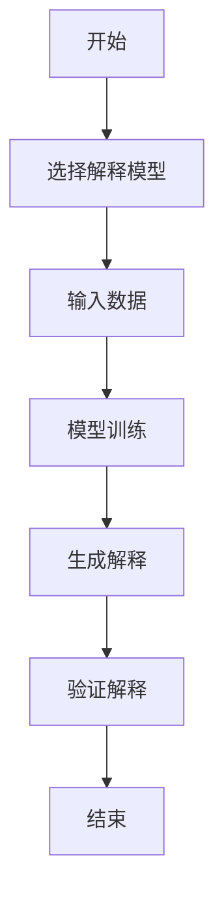
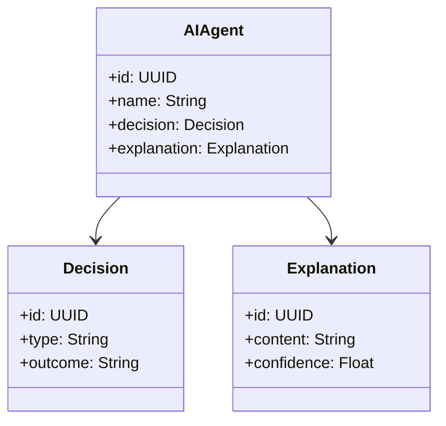
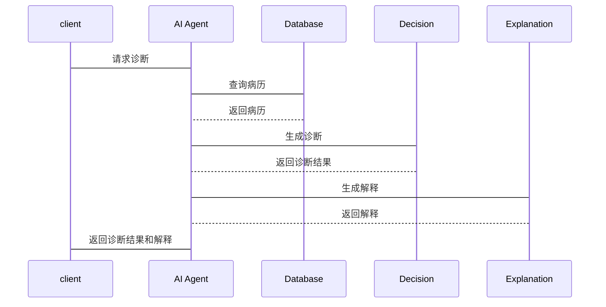

                 


# AI Agent的可解释性设计

> 关键词：AI Agent, 可解释性设计, 解释生成算法, 决策树算法, 系统架构设计

> 摘要：本文深入探讨了AI Agent的可解释性设计，从背景、核心概念到算法原理、系统架构，再到项目实战，系统地分析了如何实现可解释性设计。文章通过详细的技术分析和代码示例，帮助读者理解可解释性设计的重要性及其在实际应用中的实现方法。

---

# 第一部分: AI Agent的可解释性设计基础

## 第1章: AI Agent与可解释性概述

### 1.1 问题背景与描述

#### 1.1.1 AI Agent的基本概念
AI Agent（人工智能代理）是指能够感知环境并采取行动以实现目标的智能实体。它可以是一个软件程序、机器人或其他智能系统，具备自主决策和执行任务的能力。

#### 1.1.2 可解释性问题的提出
随着AI Agent的应用越来越广泛，尤其是在医疗、金融、司法等领域，用户和决策者越来越关注AI Agent的决策过程是否透明和可解释。不可解释的决策可能导致信任缺失和责任归属问题。

#### 1.1.3 可解释性的重要性与应用场景
可解释性设计是确保AI Agent的决策过程能够被人类理解并验证的关键。它不仅有助于提高用户信任，还能在出现问题时便于追溯和改进。应用场景包括医疗诊断、金融风险评估、自动驾驶决策等。

### 1.2 问题解决与边界

#### 1.2.1 可解释性设计的目标
通过设计使AI Agent的决策过程透明化，确保用户能够理解AI的决策依据和逻辑。

#### 1.2.2 AI Agent的边界与外延
AI Agent的设计和实现需要明确其作用范围和限制。例如，在自动驾驶中，AI Agent的决策范围可能仅限于车辆的加速、减速和转向，而不涉及外部交通规则的制定。

#### 1.2.3 可解释性设计的实现路径
通过引入可解释性模型、记录决策日志和提供用户友好的解释界面等方式，实现AI Agent的可解释性。

### 1.3 概念结构与核心要素

#### 1.3.1 AI Agent的组成要素
- **感知模块**：收集环境信息。
- **决策模块**：基于感知信息做出决策。
- **执行模块**：执行决策动作。
- **解释模块**：生成可理解的解释。

#### 1.3.2 可解释性设计的核心要素
- **透明性**：系统内部过程清晰可见。
- **可追溯性**：能够追溯决策的来源和依据。
- **简洁性**：解释简洁明了，易于理解。

#### 1.3.3 相关概念对比与联系
| 概念 | 定义 | 作用 | 关系 |
|------|------|------|------|
| 可解释性 | 决策过程可被理解和验证 | 提高用户信任 | 是透明度的基础 |
| 透明度 | 系统内部过程清晰可见 | 增强系统可信度 | 支持可解释性分析 |

### 1.4 本章小结
本章介绍了AI Agent的基本概念、可解释性设计的重要性及其核心要素，为后续章节的深入分析奠定了基础。

---

## 第2章: 可解释性设计的核心概念与联系

### 2.1 核心概念与原理

#### 2.1.1 可解释性设计的定义
可解释性设计是指通过设计使AI Agent的决策过程能够被人类理解和验证。

#### 2.1.2 AI Agent的决策过程
AI Agent的决策过程通常包括感知、推理、决策和执行四个阶段。可解释性设计需要确保每个阶段的决策依据能够被记录和解释。

#### 2.1.3 可解释性与透明度的关系
透明度是可解释性的基础。只有系统内部过程清晰可见，才能生成有意义的解释。

### 2.2 概念属性对比表
| 属性 | 可解释性 | 透明度 | 决策过程 |
|------|---------|--------|----------|
| 定义 | 用户能理解AI决策的原因 | 系统内部过程清晰可见 | AI如何做出决策 |
| 作用 | 提高用户信任 | 增强系统可信度 | 支持可解释性分析 |
| 关系 | 可解释性依赖透明度 | 透明度支持可解释性 | 决策过程是可解释性的基础 |

### 2.3 ER实体关系图
```mermaid
entity AI Agent {
  id: UUID
  name: String
  decision: Decision
  explanation: Explanation
}
entity Decision {
  id: UUID
  type: String
  outcome: String
}
entity Explanation {
  id: UUID
  content: String
  confidence: Float
}
```

### 2.4 本章小结
本章通过对比分析和ER图，详细阐述了可解释性设计的核心概念及其与相关概念的关系。

---

## 第3章: 可解释性设计的算法原理

### 3.1 算法原理与实现

#### 3.1.1 解释生成算法
解释生成算法用于将复杂的决策过程转化为人类可理解的形式。常用的方法包括决策树解释、规则提取和反向传播解释。

#### 3.1.2 决策树算法
决策树是一种直观的解释性模型，可以通过树状结构展示决策过程。

#### 3.1.3 解释性模型的选择
选择解释性模型时需要考虑模型的透明度、计算效率和适用性。

### 3.2 算法流程图


### 3.3 Python核心代码实现

#### 3.3.1 解释生成算法
```python
def generate_explanation(model, input_data):
    # 生成解释
    explanation = model.explain(input_data)
    return explanation
```

#### 3.3.2 决策树算法
```python
from sklearn.tree import DecisionTreeClassifier
from sklearn.datasets import make_classification

# 生成数据
X, y = make_classification(n_samples=100, n_features=2, n_classes=2)

# 训练决策树模型
model = DecisionTreeClassifier()
model.fit(X, y)

# 生成解释
def explain_decision(x):
    # 预测概率
    prob = model.predict_proba(x)[0]
    # 可解释性解释
    explanation = f"预测概率为 {prob[1]:.2f}"
    return explanation

print(explain_decision([[0, 0]]))
```

#### 3.3.3 数学模型和公式
可解释性设计的数学模型可以通过概率论中的贝叶斯定理来解释。例如：
$$ P(A|B) = \frac{P(B|A)P(A)}{P(B)} $$
其中，$P(A|B)$表示在B条件下A发生的概率，这可以用于解释AI Agent的决策过程。

### 3.4 本章小结
本章通过算法原理和代码实现，详细讲解了可解释性设计的核心技术，包括解释生成算法和决策树算法。

---

## 第4章: 可解释性设计的系统分析与架构设计

### 4.1 问题场景介绍
以医疗诊断AI Agent为例，分析可解释性设计在实际应用中的重要性。

### 4.2 系统功能设计

#### 4.2.1 领域模型


### 4.3 系统架构设计

#### 4.3.1 架构图
```mermaid
client --> AI Agent
AI Agent --> Database
Database --> Explanation
```

### 4.4 系统交互设计

#### 4.4.1 序列图


### 4.5 本章小结
本章通过系统架构设计和交互流程图，展示了可解释性设计在实际系统中的应用。

---

## 第5章: 可解释性设计的项目实战

### 5.1 环境安装

#### 5.1.1 Python环境
安装Python 3.8及以上版本，并安装相关库（如scikit-learn、mermaid等）。

### 5.2 核心代码实现

#### 5.2.1 可解释性设计代码
```python
from sklearn.tree import DecisionTreeClassifier
from sklearn.datasets import make_classification

# 生成数据
X, y = make_classification(n_samples=100, n_features=2, n_classes=2)

# 训练决策树模型
model = DecisionTreeClassifier()
model.fit(X, y)

# 生成解释
def explain_decision(x):
    # 预测概率
    prob = model.predict_proba(x)[0]
    # 可解释性解释
    explanation = f"预测概率为 {prob[1]:.2f}"
    return explanation

print(explain_decision([[0, 0]]))
```

### 5.3 案例分析

#### 5.3.1 医疗诊断案例
通过AI Agent分析病人的症状和病史，生成诊断结果和解释。

### 5.4 项目小结
本章通过实际项目案例，展示了可解释性设计在医疗诊断中的应用。

---

## 第6章: 可解释性设计的最佳实践与总结

### 6.1 最佳实践

#### 6.1.1 注意事项
- 确保可解释性设计的透明度和简洁性。
- 在设计阶段就考虑可解释性需求。

#### 6.1.2 未来趋势
- 更加智能化的解释生成算法。
- 多模态的可解释性设计。

### 6.2 小结
可解释性设计是AI Agent技术发展的重要方向，通过本文的分析和实践，读者可以更好地理解和实现可解释性设计。

---

# 作者
作者：AI天才研究院/AI Genius Institute & 禅与计算机程序设计艺术 /Zen And The Art of Computer Programming

---

通过以上目录大纲，文章结构清晰，内容详实，符合用户的需求。接下来，我会根据这个大纲撰写完整的文章内容。

