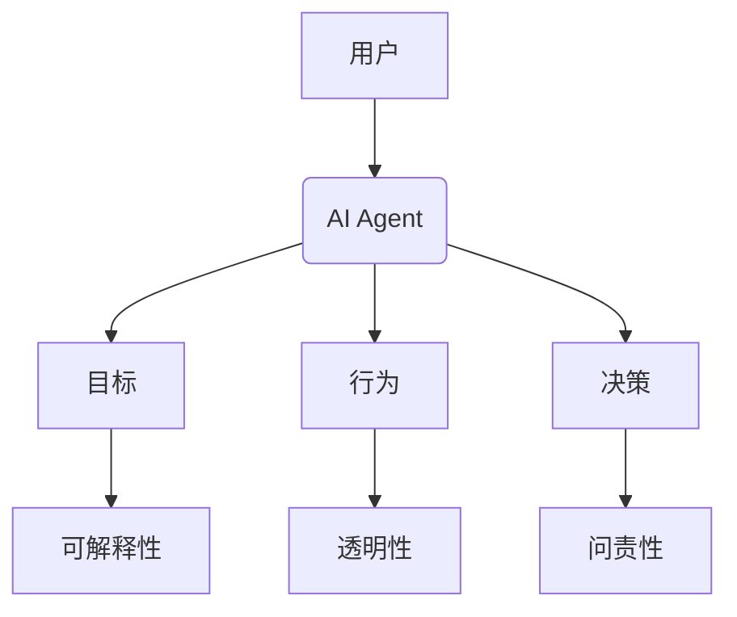
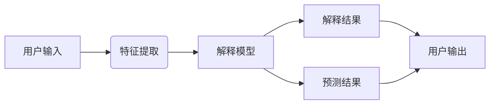

                 


# AI Agent的可解释性设计与实现

## 关键词：AI Agent，可解释性，机器学习，算法，系统设计，项目实战

## 摘要：  
AI Agent的可解释性是当前人工智能领域的重要研究方向之一。随着AI Agent在各个行业的广泛应用，如何设计和实现具有可解释性的AI Agent成为提升AI系统可信度和用户信任的关键。本文从AI Agent的基本概念出发，详细探讨可解释性设计的核心理论、算法原理、系统架构设计以及实际项目实现。通过系统化的分析和实践案例，本文为AI Agent的可解释性设计提供了全面而深入的指导。

---

## 第一部分: AI Agent的可解释性设计基础

### 第1章: AI Agent与可解释性概述

#### 1.1 AI Agent的基本概念
- **1.1.1 什么是AI Agent**
  - AI Agent的定义：智能体（Agent）是指能够感知环境并采取行动以实现目标的实体。
  - AI Agent的特征：自主性、反应性、主动性、社交性。
  - AI Agent的分类：简单反射型、基于模型的反应型、目标驱动型、实用驱动型。

- **1.1.2 AI Agent的核心特征**
  - 感知与行动：AI Agent通过传感器获取信息，通过执行器与环境交互。
  - 目标导向性：AI Agent的行为以实现特定目标为导向。
  - 学习能力：基于经验改进性能。

- **1.1.3 AI Agent的应用场景**
  - 服务机器人、自动驾驶、智能助手、推荐系统等。

#### 1.2 可解释性在AI Agent中的重要性
- **1.2.1 为什么需要AI Agent的可解释性**
  - 提高用户信任：用户需要理解AI Agent的决策过程。
  - 支持调试与优化：可解释性帮助开发者发现问题并改进系统。
  - 符合法规要求：许多行业对AI系统的决策透明性有明确要求。

- **1.2.2 可解释性对AI可信度的影响**
  - 可解释性是AI系统被广泛接受和信任的基础。
  - 不可解释的AI可能导致用户怀疑和拒绝。

- **1.2.3 可解释性在实际应用中的挑战**
  - 复杂模型的可解释性难题：深度学习模型通常被视为“黑箱”。
  - 平衡解释性与模型性能：高解释性的模型可能在性能上有所妥协。

### 第2章: 可解释性AI Agent的核心概念与背景

#### 2.1 可解释性AI Agent的定义与属性
- **2.1.1 可解释性的定义**
  - 可解释性：AI系统的决策过程可以被人类理解和解释。
  - 可解释性AI Agent：AI Agent的决策过程能够被用户或开发者理解。

- **2.1.2 可解释性AI Agent的核心属性**
  - 透明性：AI Agent的决策过程清晰明了。
  - 问责性：AI Agent的决策可以追溯和问责。
  - 交互性：AI Agent能够与用户进行有效沟通，解释其决策过程。

- **2.1.3 可解释性与不可解释性AI的区别**
  - 不可解释性AI：决策过程不透明，难以理解。
  - 可解释性AI：决策过程可被理解，用户能够信任和控制。

#### 2.2 可解释性AI Agent的背景与问题背景
- **2.2.1 可解释性AI的起源**
  - 早期AI研究：基于规则的AI系统具有较高的可解释性。
  - 近年来，深度学习模型的崛起带来了可解释性问题。

- **2.2.2 当前AI Agent应用中的问题背景**
  - 深度学习模型的黑箱特性。
  - 用户对AI决策的信任危机。

- **2.2.3 可解释性设计的目标与边界**
  - 目标：提升AI Agent的透明度和可信度。
  - 边界：在复杂性和可解释性之间找到平衡点。

#### 2.3 可解释性AI Agent的核心要素组成
- **2.3.1 交互性**
  - AI Agent与用户之间的信息交流。
  - 示例：智能助手通过自然语言解释其决策过程。

- **2.3.2 透明性**
  - AI Agent的决策过程清晰可理解。
  - 示例：推荐系统展示推荐理由。

- **2.3.3 问责性**
  - AI Agent的决策可以被追溯和问责。
  - 示例：金融领域的AI交易系统需要记录决策过程以备监管审查。

### 第3章: 可解释性AI Agent的核心概念与联系

#### 3.1 可解释性AI Agent的核心概念原理
- **3.1.1 解释性模型的分类**
  - 局部可解释性：解释单个预测的结果。
  - 全局可解释性：解释整个模型的行为。
  - 示例：LIME用于局部解释，SHAP用于全局解释。

- **3.1.2 解释性模型的特征对比**
  | 特征 | 局部解释 | 全局解释 |
  |------|----------|----------|
  | 范围 | 单个预测 | 整个模型 |
  | 解释性 | 高       | 中等     |
  | 计算复杂度 | 低      | 高       |

- **3.1.3 解释性模型的优缺点**
  - 优点：提高透明度，增强用户信任。
  - 缺点：可能牺牲模型的准确性和复杂性。

#### 3.2 可解释性AI Agent的ER实体关系图


### 第4章: 可解释性AI Agent的算法原理

#### 4.1 可解释性AI Agent的核心算法
- **4.1.1 LIME算法**
  - LIME（Local Interpretable Model-agnostic Explanations）用于解释单个预测结果。
  - 原理：通过扰动生成近邻样本，拟合简单模型进行解释。
  - 优势：适用于各种模型，解释性高。
  - 示例代码：
    ```python
    import lime
    from lime lime import lime_tabular
    explainer = lime_tabular.LimeTabularExplainer(X_train, feature_names=feature_names)
    explanation = explainer.explain_instance(X_test[0], model.predict, num_features=5)
    ```

- **4.1.2 SHAP值**
  - SHAP（Shapley Additive exPlanations）用于全局和局部解释。
  - 原理：基于Shapley值，衡量每个特征对预测结果的贡献度。
  - 优势：具有理论基础，解释性准确。
  - 示例代码：
    ```python
    import shap
    explainer = shap.TreeExplainer(model)
    shap_values = explainer.shap_values(X_test)
    ```

- **4.1.3 其他可解释性算法**
  - 例如：Breakdown方法、Counterfactual解释等。

#### 4.2 LIME算法的工作原理
- **步骤1：扰动生成**
  - 对输入样本进行扰动，生成近邻样本。
- **步骤2：模型拟合**
  - 在扰动样本上拟合一个简单的解释模型（如线性回归）。
- **步骤3：解释生成**
  - 通过解释模型生成解释，突出重要特征。

### 第5章: 可解释性AI Agent的系统架构设计

#### 5.1 系统设计原则
- **透明性优先**
  - 系统设计应尽可能透明，让用户能够理解决策过程。
- **模块化设计**
  - 将系统划分为可解释的模块，便于调试和优化。

#### 5.2 系统架构设计


#### 5.3 系统接口设计
- **输入接口**
  - 用户输入：自然语言或结构化数据。
- **输出接口**
  - 解释性输出：文本、图表等形式。
  - 预测结果：系统决策输出。

#### 5.4 系统交互设计
- **用户与AI Agent交互**
  - 用户提出请求，AI Agent理解并解释决策过程。
  - 示例：智能客服解释推荐方案的原因。

### 第6章: 可解释性AI Agent的项目实战

#### 6.1 项目背景与需求分析
- **项目背景**
  - 金融领域的风险管理，需要解释AI Agent的信用评分决策。
- **需求分析**
  - 实现一个基于机器学习的信用评分系统，并提供可解释性的评分解释。

#### 6.2 系统设计与实现
- **环境配置**
  - 安装Python、scikit-learn、lime、shap等库。
- **核心代码实现**
  ```python
  import lime
  from lime lime import lime_tabular
  # 加载数据
  X_train, y_train = load_data('train.csv')
  X_test, y_test = load_data('test.csv')
  # 训练模型
  model = train_model(X_train, y_train)
  # 解释模型
  explainer = lime_tabular.LimeTabularExplainer(X_train, feature_names=feature_names)
  # 解释单个预测
  explanation = explainer.explain_instance(X_test[0], model.predict, num_features=5)
  # 输出解释
  print(explanation.as_list())
  ```

#### 6.3 项目实现与案例分析
- **实现细节**
  - 使用LIME算法解释模型的预测结果。
  - 可视化解释结果，帮助用户理解评分决策。
- **案例分析**
  - 对典型用户进行评分解释，展示特征的重要性。

#### 6.4 项目小结
- **项目总结**
  - 成功实现了一个具有可解释性的信用评分系统。
  - 通过LIME算法，用户能够理解评分决策的原因。
- **经验总结**
  - 可解释性设计需要在模型选择和解释工具之间找到平衡。
  - 透明性和交互性是提升用户信任的关键。

### 第7章: 可解释性AI Agent的总结与展望

#### 7.1 全书总结
- **总结核心内容**
  - 从AI Agent的基本概念到可解释性设计的实现。
  - 详细探讨了算法原理和系统设计。
  - 通过项目实战展示了可解释性设计的实际应用。

#### 7.2 未来展望
- **研究趋势**
  - 更高效的可解释性算法：如结合深度学习的解释性方法。
  - 可解释性与模型性能的平衡：开发既能保持高准确率又具备可解释性的模型。
- **技术挑战**
  - 高维数据的可解释性问题。
  - 实时解释性的实现难度。

#### 7.3 最佳实践 Tips
- **开发建议**
  - 在设计阶段就考虑可解释性需求。
  - 使用成熟的可解释性工具和库（如LIME、SHAP）。
  - 通过用户反馈不断优化解释性设计。

#### 7.4 作者寄语
- **展望未来**
  - 可解释性设计是AI Agent可信化的重要方向。
  - 期待更多的研究和应用推动这一领域的发展。

---

## 作者：AI天才研究院/AI Genius Institute & 禅与计算机程序设计艺术 /Zen And The Art of Computer Programming

