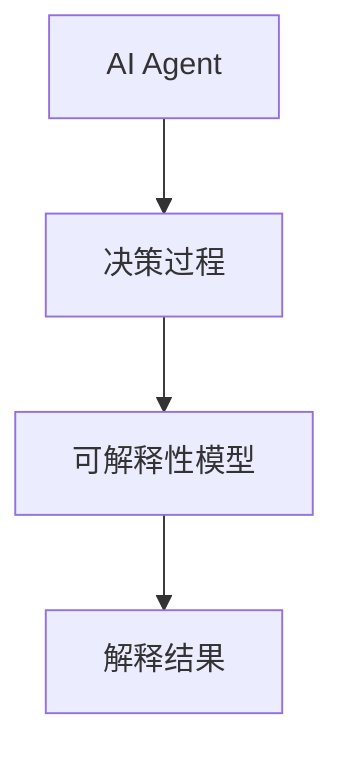
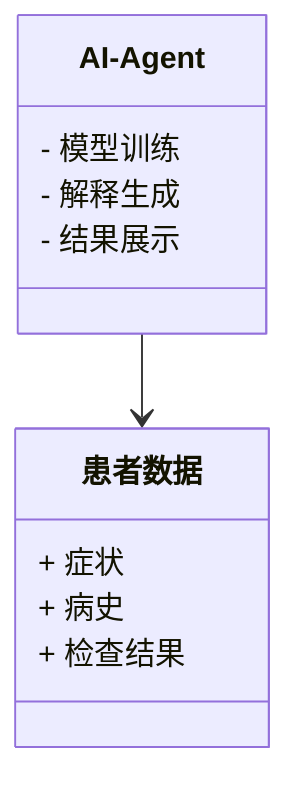
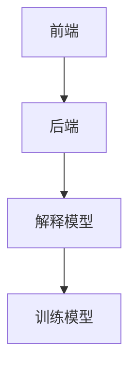
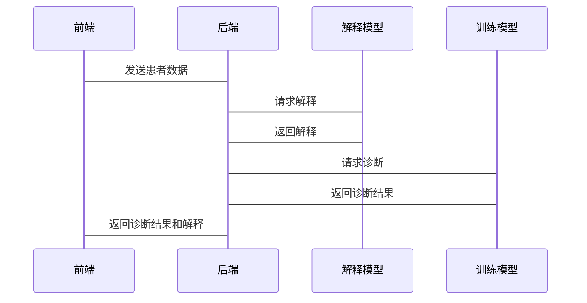

                 


# AI Agent的可解释性设计：提高模型决策的透明度

> 关键词：AI Agent，可解释性，模型透明度，决策透明度，算法解释性，系统架构

> 摘要：本文将深入探讨AI Agent的可解释性设计，从基本概念到核心算法，再到系统架构，最后结合实际项目案例，详细分析如何提高模型决策的透明度，确保AI系统的可信赖性。

---

## 第1章: AI Agent的可解释性概述

### 1.1 AI Agent的基本概念
#### 1.1.1 AI Agent的定义
AI Agent（智能体）是指能够感知环境并采取行动以实现目标的实体。它可以在智能助手、自动驾驶、推荐系统等领域中广泛应用。

#### 1.1.2 AI Agent的核心特征
- **自主性**：能够自主决策。
- **反应性**：能够实时感知环境并做出反应。
- **目标导向性**：所有行动都以实现特定目标为导向。
- **学习能力**：能够通过数据和经验不断优化自身。

#### 1.1.3 可解释性在AI Agent中的重要性
可解释性是指AI Agent的决策过程能够被人类理解和解释。在医疗、金融等高风险领域，可解释性是确保用户信任和合规性的重要前提。

---

### 1.2 可解释性在AI决策中的作用
#### 1.2.1 可解释性与模型透明度的关系
模型透明度是可解释性的基础。高度透明的模型更容易被解释和验证。

#### 1.2.2 用户信任与可解释性
用户只有理解AI的决策过程，才能真正信任AI系统。可解释性是建立用户信任的关键。

#### 1.2.3 可解释性对模型调试的价值
通过可解释性，开发者可以快速定位模型的错误或偏差，从而进行优化和改进。

---

### 1.3 本章小结
本章介绍了AI Agent的基本概念及其核心特征，并强调了可解释性在AI决策中的重要性。接下来将深入探讨可解释性的核心概念。

---

## 第2章: AI Agent可解释性的核心概念

### 2.1 可解释性模型的背景
#### 2.1.1 可解释性模型的发展历程
可解释性模型从早期的线性模型到现在的复杂深度学习模型，经历了从简单到复杂的演变。

#### 2.1.2 可解释性模型的分类
- **全局可解释性**：适用于整个模型的解释。
- **局部可解释性**：适用于单个预测的解释。

#### 2.1.3 可解释性模型的边界与外延
可解释性模型的边界在于其解释的范围和深度，而外延则涉及如何将解释结果应用于实际场景。

---

### 2.2 可解释性模型的核心要素
#### 2.2.1 模型的可解释性维度
- **透明性**：模型的结构和参数是否易于理解。
- **可理解性**：解释是否符合人类认知逻辑。
- **可验证性**：解释是否可以通过数据验证。

#### 2.2.2 模型的可解释性评估指标
- **准确性**：解释与实际结果的吻合程度。
- **可理解性**：解释是否易于人类理解。
- **稳定性**：解释在输入变化时的稳定性。

#### 2.2.3 可解释性模型的实体关系图


---

### 2.3 核心概念与联系
#### 2.3.1 可解释性模型的原理
可解释性模型通过简化或分解复杂的模型，提取关键特征或规则，从而解释决策过程。

#### 2.3.2 模型属性特征对比表格
| 特性 | 线性模型 | 非线性模型 |
|------|----------|------------|
| 解释性 | 高       | 低         |
| 精度  | 中       | 高         |

#### 2.3.3 ER实体关系图架构
```mermaid
erd
A[AI Agent] -- 多对多 --> B[决策]
B --> C[可解释性模型]
C --> D[解释结果]
```

---

### 2.4 本章小结
本章详细探讨了可解释性模型的核心概念及其在AI Agent中的应用，为后续的算法设计奠定了基础。

---

## 第3章: AI Agent可解释性设计的算法原理

### 3.1 解释性模型的算法选择
#### 3.1.1 LIME解释器的原理
LIME（Local Interpretable Model-agnostic Explanations）通过在数据点附近构建局部线性模型，解释单个预测结果。

#### 3.1.2 SHAP值的计算方法
SHAP（SHapley Additive exPlanations）基于博弈论中的Shapley值，量化每个特征对预测结果的贡献。

#### 3.1.3 相似性解释法的实现
相似性解释法通过寻找与输入样本相似的样本，解释模型的决策边界。

---

### 3.2 解释性模型的数学基础
#### 3.2.1 LIME算法的数学模型
LIME的目标是最小化：
$$
\text{损失函数} + \lambda \times \text{惩罚项}
$$

#### 3.2.2 SHAP值的计算公式
$$
\text{SHAP值} = \sum_{i=1}^{n} \phi_i
$$

其中，$\phi_i$ 表示特征 $i$ 对预测结果的贡献。

#### 3.2.3 相似性解释法的数学表达
相似性解释法通过计算输入样本与训练样本之间的相似度，找到最具代表性的样本。

---

### 3.3 算法实现与代码示例
#### 3.3.1 LIME解释器的Python实现
```python
from lime.lime_tabular import LimeTabular

explainer = LimeTabular(random_state=1234)
explanation = explainer.explain_instance(
    model, 
    instance,
    top_features=5
)
print(explanation.as_list())
```

#### 3.3.2 SHAP值的计算代码
```python
import shap

explainer = shap.TreeExplainer(model)
shap_values = explainer.shap_values(X)
print(shap.summary_plot(shap_values, X, max_display=5))
```

#### 3.3.3 相似性解释法的代码实现
```python
from sklearn.neighbors import NearestNeighbors

neighbors = NearestNeighbors(n_neighbors=5).fit(X_train)
similar_samples = neighbors.kneighbors(X_new, return_distance=True)
```

---

### 3.4 本章小结
本章详细介绍了可解释性模型的核心算法及其数学原理，并通过代码示例展示了如何实现这些算法。

---

## 第4章: AI Agent可解释性设计的系统架构

### 4.1 系统分析与设计
#### 4.1.1 问题场景介绍
假设我们正在开发一个AI Agent，用于医疗领域的疾病诊断。

#### 4.1.2 系统功能设计
- **模型训练**：训练分类模型。
- **解释生成**：生成模型的解释。
- **结果展示**：展示解释结果。

#### 4.1.3 领域模型的Mermaid类图


---

### 4.2 系统架构设计
#### 4.2.1 系统架构的Mermaid架构图


#### 4.2.2 系统接口设计
- **输入接口**：接收患者数据。
- **输出接口**：返回诊断结果和解释。

#### 4.2.3 系统交互的Mermaid序列图


---

### 4.3 本章小结
本章通过实际场景展示了AI Agent的系统架构设计，并通过图表详细描述了系统的交互流程。

---

## 第5章: AI Agent可解释性设计的项目实战

### 5.1 环境安装与配置
#### 5.1.1 开发环境的搭建
推荐使用Python 3.8及以上版本。

#### 5.1.2 依赖库的安装
```bash
pip install scikit-learn lime shap
```

---

### 5.2 核心功能实现
#### 5.2.1 解释性模型的实现
```python
from sklearn.ensemble import RandomForestClassifier
from lime.lime_tabular import LimeTabular

model = RandomForestClassifier()
model.fit(X_train, y_train)
explainer = LimeTabular(random_state=1234)
explanation = explainer.explain_instance(model, X_test[0], top_features=5)
```

#### 5.2.2 模型解释结果的可视化
```python
import matplotlib.pyplot as plt

explanation.plotting_style = 'default'
fig, ax = plt.subplots(figsize=(10, 6))
explanation.figsize = (10, 6)
explanation.show_in_notebook()
```

#### 5.2.3 系统功能的代码实现
```python
def explain_model(model, instance):
    explainer = LimeTabular(random_state=1234)
    explanation = explainer.explain_instance(model, instance, top_features=5)
    return explanation.as_list()
```

---

### 5.3 项目案例分析
#### 5.3.1 案例背景介绍
以医疗诊断为例，模型需要对患者的症状和检查结果进行分类。

#### 5.3.2 解释性模型的应用
通过LIME和SHAP解释模型的决策过程，帮助医生理解AI诊断的依据。

#### 5.3.3 实际案例的详细分析
```python
instance = X_test[0]
explanation = explain_model(model, instance)
print(explanation)
```

---

### 5.4 项目总结与优化
#### 5.4.1 项目总结
本项目通过可解释性设计，成功提高了AI诊断系统的透明度和用户信任。

#### 5.4.2 项目优化
- **优化解释模型的性能**。
- **增加更多特征的解释**。
- **优化系统架构以提高响应速度**。

---

### 5.5 本章小结
本章通过实际项目案例，展示了AI Agent可解释性设计的具体实现和应用。

---

## 第6章: 最佳实践与未来展望

### 6.1 可解释性设计的注意事项
- **选择合适的解释性模型**。
- **确保解释的准确性和可理解性**。
- **结合具体场景优化解释方式**。

### 6.2 可解释性设计的未来展望
随着AI技术的发展，可解释性设计将更加重要。未来的研究方向包括开发更高效的解释性算法和优化解释性模型的性能。

---

## 作者：AI天才研究院/AI Genius Institute & 禅与计算机程序设计艺术 /Zen And The Art of Computer Programming

---

以上是完整的目录大纲，涵盖了从理论到实践的各个方面，确保内容详实且易于理解。

