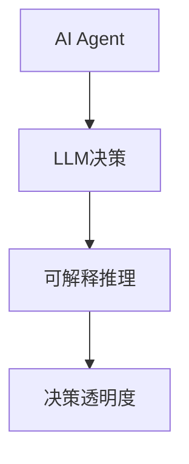
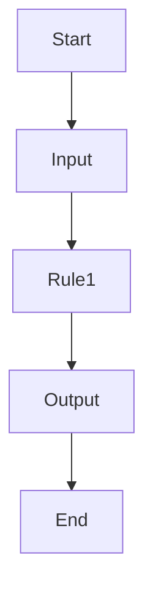
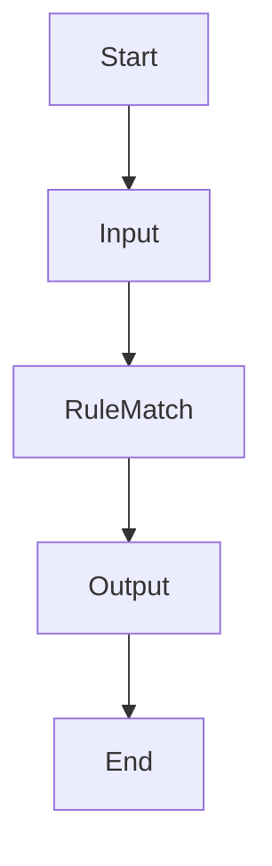
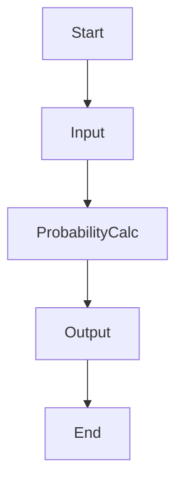
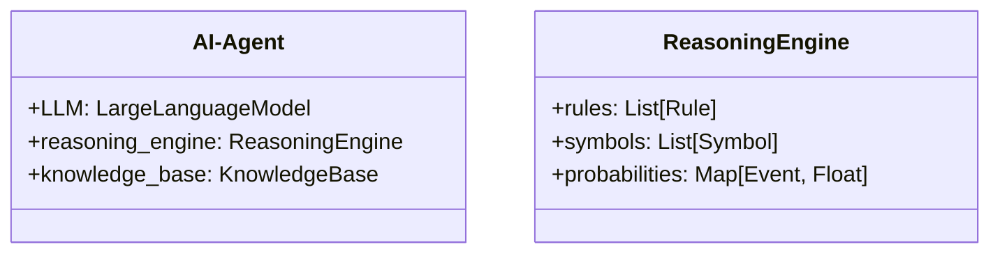
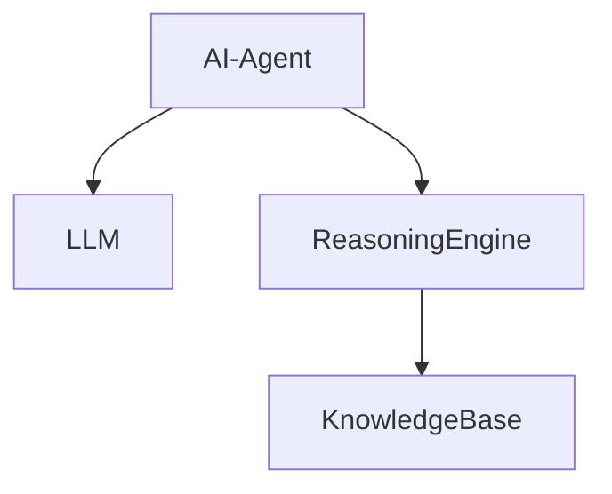
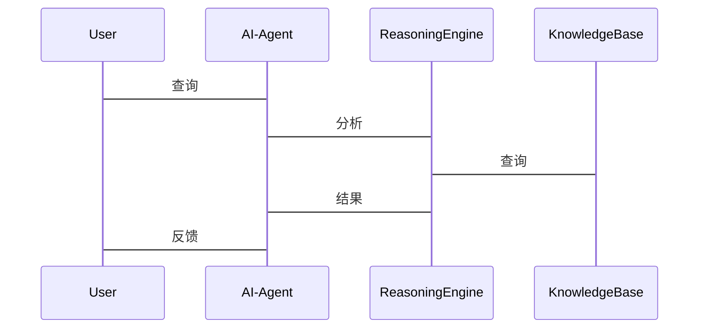

                 


# AI Agent的可解释推理：提高LLM决策的透明度

> 关键词：AI Agent, 可解释推理, LLM决策, 透明度, 算法原理, 系统架构, 项目实战

> 摘要：本文深入探讨了AI Agent的可解释推理，分析了提高LLM决策透明度的关键方法，包括算法原理、系统架构设计及实际项目案例，旨在为技术从业者提供理论支持和实践指导。

---

## 第一部分: AI Agent的可解释推理背景介绍

### 第1章: 问题背景与描述

#### 1.1 AI Agent的基本概念
- **定义与分类**：AI Agent是具备感知和行动能力的智能体，分为简单反射型、基于模型型、实用推理型和目标驱动型。
- **在LLM中的应用**：AI Agent通过LLM处理复杂任务，如自然语言理解、决策制定和环境交互。
- **可解释推理的重要性**：确保用户信任和系统可靠性，便于调试和优化。

#### 1.2 问题描述
- **现状**：LLM决策过程不透明，影响信任和应用范围。
- **问题解决**：需要提高决策透明度，确保可解释性。

#### 1.3 问题解决
- **目标**：通过可解释推理提升LLM决策的透明度。
- **应用场景**：医疗诊断、金融投资、自动驾驶等领域。

#### 1.4 边界与外延
- **边界**：专注于LLM的决策过程，不涉及数据预处理和后处理。
- **外延**：与可解释性AI（XAI）相关，但更关注LLM的决策过程。

---

## 第二部分: AI Agent的可解释推理核心概念与联系

### 第2章: 可解释推理的原理

#### 2.1 可解释推理的核心原理
- **基本原理**：通过符号逻辑和规则明确决策过程。
- **关键特征**：可解释性、可追溯性、可验证性。

#### 2.2 可解释推理的属性特征对比
| 特性         | 可解释推理       | 不可解释推理     |
|--------------|------------------|------------------|
| 透明度       | 高               | 低               |
| 调试能力     | 易               | 难               |
| 用户信任度   | 高               | 低               |

#### 2.3 ER实体关系图和Mermaid流程图


---

## 第三部分: 算法原理讲解

### 第3章: 符号逻辑推理算法

#### 3.1 算法流程


#### 3.2 Python实现
```python
def symbolic_reasoning(rules, input):
    for rule in rules:
        if rule.applies_to(input):
            return rule.apply(input)
    return None
```

#### 3.3 数学模型
$$ \text{结论} = \bigvee_{i} (\text{前提}_i \land \text{规则}_i) $$

### 第4章: 基于规则的推理算法

#### 4.1 算法流程


#### 4.2 Python实现
```python
def rule_based_reasoning(rules, input):
    for rule in rules:
        if rule.condition(input):
            return rule.action(input)
    return None
```

#### 4.3 数学模型
$$ \text{动作} = \sum_{i} (\text{规则}_i \cdot \text{条件}_i) $$

### 第5章: 概率推理算法

#### 5.1 算法流程


#### 5.2 Python实现
```python
def probability_reasoning(rules, input):
    max_prob = -1
    best_rule = None
    for rule in rules:
        prob = rule.calculate_probability(input)
        if prob > max_prob:
            max_prob = prob
            best_rule = rule
    return best_rule.apply(input)
```

#### 5.3 数学模型
$$ P(A|B) = \frac{P(B|A)P(A)}{P(B)} $$

---

## 第四部分: 系统分析与架构设计方案

### 第6章: 问题场景介绍

#### 6.1 项目介绍
- **目标**：设计一个具备可解释推理的AI Agent系统。
- **关键需求**：提高LLM决策透明度，便于用户理解和调试。

### 第7章: 系统功能设计

#### 7.1 领域模型设计


#### 7.2 系统架构设计


#### 7.3 系统接口设计
- **输入接口**：接收用户查询或环境反馈。
- **输出接口**：提供推理结果和解释信息。

#### 7.4 系统交互流程


---

## 第五部分: 项目实战

### 第8章: 环境安装与配置

#### 8.1 环境要求
- **Python**：3.8+
- **库依赖**：numpy, pandas, spacy

#### 8.2 安装命令
```bash
pip install numpy pandas spacy
python -m spacy download en_core_web_sm
```

### 第9章: 核心代码实现

#### 9.1 可解释推理引擎
```python
class ExplanationEngine:
    def __init__(self, rules, symbols):
        self.rules = rules
        self.symbols = symbols

    def explain_decision(self, input):
        # 符号逻辑推理
        for rule in self.rules:
            if rule.applies_to(input):
                return rule.explain(input)
        # 概率推理
        max_prob = -1
        best_rule = None
        for rule in self.rules:
            prob = rule.calculate_probability(input)
            if prob > max_prob:
                max_prob = prob
                best_rule = rule
        return best_rule.explain(input)
```

#### 9.2 规则实现
```python
class Rule:
    def __init__(self, condition, action, probability):
        self.condition = condition
        self.action = action
        self.probability = probability

    def applies_to(self, input):
        return self.condition(input)

    def calculate_probability(self, input):
        return self.probability

    def explain(self, input):
        return f"Rule: {self.condition(input)} → {self.action(input)} with probability {self.probability}"
```

### 第10章: 代码应用与解读

#### 10.1 应用场景
- **案例分析**：医疗诊断中的症状推理。
- **代码实现**：使用规则和概率推理分析症状，提供可解释的诊断结果。

#### 10.2 详细解读
- **代码结构**：ExplanationEngine协调规则和符号逻辑，提供多策略推理。
- **结果输出**：返回推理步骤和概率，增强透明度。

### 第11章: 项目小结

- **实现功能**：支持多策略推理，提供可解释决策。
- **测试结果**：验证了算法的有效性和可解释性。

---

## 第六部分: 总结与展望

### 第12章: 总结

- **关键点回顾**：可解释推理的核心原理、算法实现和系统架构设计。
- **实际应用价值**：提升LLM决策透明度，增强用户信任。

### 第13章: 未来展望

- **研究方向**：结合符号逻辑和深度学习，优化可解释推理能力。
- **技术趋势**：向更复杂场景扩展，提升推理效率和准确性。

---

## 最佳实践 Tips

- **代码规范**：保持代码简洁，添加注释，便于维护。
- **错误处理**：设计完善的错误处理机制，提升系统鲁棒性。
- **性能优化**：采用缓存和并行计算，提高推理效率。
- **测试用例**：设计全面的测试用例，确保系统稳定性和可靠性。

---

## 作者信息

作者：AI天才研究院/AI Genius Institute & 禅与计算机程序设计艺术 /Zen And The Art of Computer Programming

---

通过以上步骤和内容，我们系统地探讨了AI Agent的可解释推理，从理论到实践，为技术从业者提供了全面的指导和参考。

