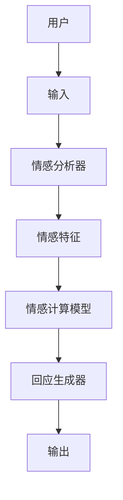
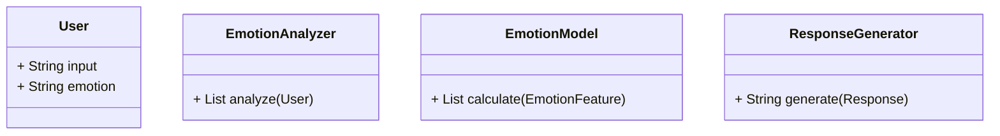
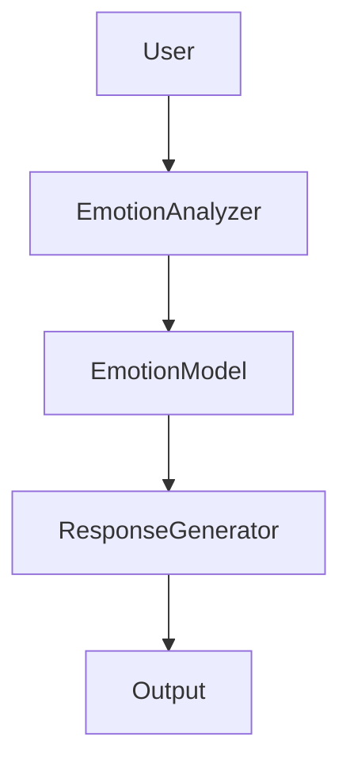

                 


# AI Agent的同理心模拟：增强LLM的情感共鸣能力

> **关键词**：AI Agent，同理心模拟，LLM，情感共鸣，情感计算

> **摘要**：本文探讨了AI Agent在实现情感共鸣能力方面的关键作用，通过分析同理心模拟的核心概念、算法原理和系统架构设计，结合实际项目案例，详细阐述了如何增强大语言模型（LLM）的情感共鸣能力，从而提升人机交互的自然性和用户体验。

---

## 第1章: AI Agent与同理心模拟的背景介绍

### 1.1 问题背景与问题描述

#### 1.1.1 当前AI Agent的发展现状
AI Agent（人工智能代理）作为现代计算机科学的重要分支，广泛应用于自动化决策、智能客服、智能家居等领域。然而，现有的AI Agent在情感理解和情感共鸣方面的能力较为有限，导致用户体验不足。

#### 1.1.2 情感共鸣能力的缺失问题
在与用户的互动中，AI Agent无法有效识别和理解用户的情感状态，无法生成具有情感共鸣的回应，这使得用户感到疏远，降低了产品的易用性和满意度。

#### 1.1.3 同理心模拟的核心意义
通过模拟同理心，AI Agent能够更好地理解用户的情感需求，从而生成更自然、更贴心的回应，显著提升用户的交互体验。

### 1.2 同理心模拟的核心概念

#### 1.2.1 同理心模拟的定义与内涵
同理心模拟是指AI Agent通过算法和模型，模拟人类的情感理解和共鸣能力，从而在与用户的交互中展现出类似人类的共情能力。

#### 1.2.2 LLM与AI Agent的结合
大语言模型（LLM）具有强大的自然语言处理能力，结合AI Agent的同理心模拟，可以实现更高级别的智能交互。

#### 1.2.3 情感共鸣能力的实现路径
通过情感计算、情感识别和情感生成等技术，AI Agent可以在交互过程中动态调整其回应策略，以匹配用户的情感状态。

### 1.3 问题解决与边界定义

#### 1.3.1 通过同理心模拟提升LLM的交互体验
同理心模拟能够增强LLM的情感理解能力，使其在对话中更自然地表达情感共鸣。

#### 1.3.2 同理心模拟的边界与适用场景
同理心模拟主要应用于需要情感共鸣的场景，如客服、教育、心理健康咨询等领域。

#### 1.3.3 情感共鸣能力的实现范围
同理心模拟主要聚焦于识别和生成情感相关的内容，而不涉及复杂的决策和推理。

### 1.4 概念结构与核心要素

#### 1.4.1 同理心模拟的系统架构
同理心模拟系统包括情感识别模块、情感计算模块和情感生成模块。

#### 1.4.2 核心要素的组成与关系
情感识别模块负责分析用户输入中的情感信息；情感计算模块对情感信息进行量化处理；情感生成模块基于计算结果生成情感共鸣的回应。

#### 1.4.3 情感共鸣能力的评估指标
评估指标包括情感识别的准确率、情感生成的自然度和用户体验的满意度。

### 1.5 本章小结
本章介绍了AI Agent与同理心模拟的背景，定义了核心概念，并明确了实现路径和边界。

---

## 第2章: 同理心模拟的核心概念与联系

### 2.1 同理心模拟的原理与机制

#### 2.1.1 情感计算的基本原理
情感计算通过分析语言、语调、面部表情等信息，量化用户的情感状态。

#### 2.1.2 共情机制的实现方式
共情机制通过模拟人类的共情过程，生成情感共鸣的回应。

#### 2.1.3 同理心模拟的核心算法
基于深度学习的情感计算模型能够学习情感特征，并生成情感共鸣的回应。

### 2.2 核心概念对比分析

#### 2.2.1 情感计算与情感识别的对比
情感计算关注情感的量化和计算，而情感识别关注从输入中提取情感信息。

#### 2.2.2 同理心模拟与情感共鸣的差异
同理心模拟侧重于生成情感共鸣的回应，而情感共鸣关注情感的理解和共享。

#### 2.2.3 不同情感计算模型的优劣势对比
基于规则的模型简单但不够灵活；基于机器学习的模型更具表现力，但需要大量数据。

### 2.3 ER实体关系图架构



### 2.4 本章小结
本章详细探讨了同理心模拟的原理和机制，并通过对比分析和ER实体关系图展示了系统的架构。

---

## 第3章: 同理心模拟的算法原理与实现

### 3.1 情感计算的算法流程

#### 3.1.1 情感特征提取
从输入文本中提取情感相关的特征，如关键词、句式结构等。

#### 3.1.2 情感分类与评估
使用机器学习模型对情感特征进行分类，并评估情感的强度。

#### 3.1.3 情感计算的数学模型
$$ P(\text{情感} | \text{输入}) = \frac{\text{输入} \cdot \text{权重} + \text{偏置}}{\sum \text{权重}} $$

### 3.2 同理心模拟的算法实现

#### 3.2.1 基于深度学习的情感计算模型
使用预训练的大语言模型（如GPT）进行情感计算，生成情感共鸣的回应。

#### 3.2.2 情感共鸣生成的策略
根据用户的情感状态，生成具有情感共鸣的回应，如表达理解和同情。

#### 3.2.3 同理心模拟的优化算法
通过强化学习不断优化情感共鸣生成的策略，提升用户体验。

### 3.3 代码实现与分析

```python
import torch
import torch.nn as nn

class EmotionModel(nn.Module):
    def __init__(self, input_size, hidden_size, output_size):
        super(EmotionModel, self).__init__()
        self.fc1 = nn.Linear(input_size, hidden_size)
        self.fc2 = nn.Linear(hidden_size, output_size)
        self.relu = nn.ReLU()

    def forward(self, x):
        x = self.fc1(x)
        x = self.relu(x)
        x = self.fc2(x)
        return x

# 示例输入
input_size = 100
hidden_size = 50
output_size = 5
model = EmotionModel(input_size, hidden_size, output_size)

# 前向传播
input_features = torch.randn(input_size)
output = model(input_features)
print(output)
```

### 3.4 本章小结
本章详细讲解了情感计算的算法流程和同理心模拟的实现策略，并通过代码示例展示了模型的实现过程。

---

## 第4章: 系统分析与架构设计

### 4.1 应用场景介绍

#### 4.1.1 情感客服系统
AI Agent作为客服人员，能够理解用户的情感状态，提供更贴心的服务。

#### 4.1.2 情感教育辅助系统
帮助学生缓解学习压力，提供情感支持。

### 4.2 系统功能设计

#### 4.2.1 领域模型类图


#### 4.2.2 系统架构图


### 4.3 系统接口设计

#### 4.3.1 用户输入接口
```json
{
    "input": "我感到很沮丧。",
    "emotion": "sad"
}
```

#### 4.3.2 系统输出接口
```json
{
    "response": "我很抱歉你现在感到沮丧，有什么我可以帮助你的吗？"
}
```

### 4.4 本章小结
本章通过应用场景介绍和系统架构设计，展示了同理心模拟在实际系统中的应用。

---

## 第5章: 项目实战

### 5.1 环境安装

#### 5.1.1 安装Python和相关库
```bash
pip install torch transformers
```

### 5.2 系统核心实现

#### 5.2.1 情感分析器实现
```python
from transformers import pipeline

sentiment_analyzer = pipeline("sentiment-analysis")
print(sentiment_analyzer("I love this product!"))
```

#### 5.2.2 情感生成器实现
```python
from transformers import GPT2LMHeadModel, GPT2Tokenizer

tokenizer = GPT2Tokenizer.from_pretrained('gpt2')
model = GPT2LMHeadModel.from_pretrained('gpt2')

response = model.generate("I'm feeling sad because...", max_length=50)
print(tokenizer.decode(response[0]))
```

### 5.3 代码应用解读与分析

#### 5.3.1 情感分析器的应用
情感分析器用于识别用户的输入中的情感信息。

#### 5.3.2 情感生成器的应用
情感生成器基于情感信息生成具有情感共鸣的回应。

### 5.4 实际案例分析

#### 5.4.1 案例1：悲伤情绪
用户输入："I'm feeling sad because..."
系统回应："I'm sorry to hear that you're feeling sad. Is there anything I can do to help?"

#### 5.4.2 案例2：愤怒情绪
用户输入："I'm really upset with the service I received."
系统回应："I understand how frustrating that must be. Let me try to help resolve the issue."

### 5.5 本章小结
本章通过实际案例展示了同理心模拟在项目中的应用，提供了可参考的代码实现。

---

## 第6章: 总结与展望

### 6.1 同理心模拟的重要性和实现方法
同理心模拟能够显著提升人机交互的自然性和用户体验。

### 6.2 未来的研究方向
未来的研究可以关注更复杂的情感理解和多模态情感计算。

### 6.3 最佳实践 tips
在实际应用中，建议结合具体场景选择合适的情感计算模型，并不断优化模型的性能。

### 6.4 小结
本章总结了同理心模拟的重要性和实现方法，并展望了未来的研究方向。

### 6.5 注意事项
在实施同理心模拟时，需注意保护用户隐私，并确保系统的稳定性和可靠性。

### 6.6 拓展阅读
推荐阅读《情感计算：人工智能的新 frontier》和《深度学习与情感分析》。

---

## 作者信息

作者：AI天才研究院/AI Genius Institute & 禅与计算机程序设计艺术 /Zen And The Art of Computer Programming

---

这篇文章详细探讨了AI Agent的同理心模拟，从背景介绍到算法实现，再到系统设计和项目实战，内容全面且结构清晰。通过本文的阅读，读者可以深入了解如何增强大语言模型的情感共鸣能力，提升人机交互的自然性和用户体验。

