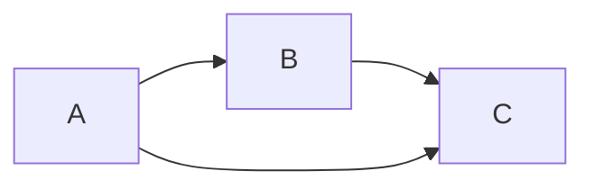

                 

# AI Agent的因果推理能力开发

> 关键词：AI Agent、因果推理、因果图模型、潜在结果框架、反事实推理

> 摘要：AI Agent的因果推理能力是其智能性的重要组成部分。本文从因果推理的基本概念出发，详细探讨了其在AI Agent中的应用，分析了因果推理的核心算法和系统设计，并通过实际案例展示了如何开发具备因果推理能力的AI Agent。文章内容涵盖因果推理的数学模型、算法原理、系统架构设计和项目实战，旨在为读者提供一个系统化的开发指南。

---

# 第一部分: AI Agent的因果推理能力开发背景

## 第1章: AI Agent与因果推理概述

### 1.1 AI Agent的基本概念

#### 1.1.1 AI Agent的定义与分类

AI Agent（人工智能代理）是指能够感知环境、做出决策并执行操作的智能实体。AI Agent可以是软件程序、机器人或其他智能系统，其核心目标是通过与环境交互来实现特定任务。AI Agent可以分为以下几类：

- **反应式AI Agent**：基于当前感知做出实时反应，不依赖历史信息。
- **认知式AI Agent**：具备复杂推理和规划能力，能够处理不确定性。
- **学习式AI Agent**：通过数据和经验不断优化自身行为。

#### 1.1.2 因果推理的基本概念

因果推理是研究因果关系的科学，旨在理解“为什么”某一事件发生以及“如何”改变某一变量会影响其他变量。因果推理的核心在于识别因果关系，并基于这些关系进行推理和预测。

#### 1.1.3 AI Agent与因果推理的关联

AI Agent需要在复杂的环境中做出决策，而因果推理为其提供了理解因果关系的能力，使其能够预测不同行动的结果，并选择最优策略。例如，在医疗诊断系统中，AI Agent需要通过因果推理来判断症状与疾病之间的因果关系，从而做出准确诊断。

### 1.2 因果推理的定义与特点

#### 1.2.1 因果关系的定义

因果关系是指一个事件（原因）导致另一个事件（结果）发生的确定性关系。因果关系具有以下特点：

- **时间顺序**：原因发生在结果之前。
- **必要性**：结果的发生需要原因的存在。
- **充分性**：原因的存在足以导致结果的发生。

#### 1.2.2 因果推理的核心特征

因果推理的核心特征包括：

- **反事实推理**：假设某个事件未发生，推断其可能的结果。
- **干预推断**：通过干预某个变量，推断其对其他变量的影响。
- **结构学习**：从数据中学习因果关系的结构。

#### 1.2.3 因果推理与相关概念的对比

以下是因果推理与相关概念的对比：

| 概念         | 描述                                                                 |
|--------------|----------------------------------------------------------------------|
| 相关性       | 表示变量之间的关联程度，不涉及因果关系。                               |
| 因果关系     | 表示变量之间的因果联系，强调原因与结果的关系。                         |
| 预测         | 基于现有数据预测未来结果，不涉及因果关系的解释。                       |
| 解释         | 通过因果关系解释数据背后的原因。                                     |

### 1.3 本章小结

本章介绍了AI Agent的基本概念和因果推理的核心定义与特点，并通过对比分析，明确了因果推理在AI Agent中的重要性。接下来，我们将深入探讨因果推理的数学模型和算法原理。

---

# 第二部分: 因果推理的核心概念与联系

## 第2章: 因果推理的数学模型

### 2.1 因果关系的数学表示

#### 2.1.1 随机变量与条件概率

随机变量是描述随机现象的变量，可以用概率分布描述其取值的可能性。条件概率是指在给定某个事件发生的条件下，另一个事件发生的概率。

公式：
$$ P(Y|X) $$

#### 2.1.2 因果图模型的基本表示

因果图模型（Causal Graph Model）是一种用有向图表示因果关系的模型，节点表示变量，边表示因果关系。

Mermaid图示：

#### 2.1.3 潜在结果框架（Potential Outcome Framework）

潜在结果框架是因果推理的重要工具，假设每个个体在干预下的潜在结果。

公式：
$$ Y_i^{do(X)} $$

### 2.2 因果推断的核心公式

#### 2.2.1 干预效应的公式表示

干预效应是指在给定干预下的平均处理效应。

公式：
$$ \text{ATE} = E[Y^{do(X=1)} - Y^{do(X=0)}] $$

#### 2.2.2 调整公式与反事实推理

调整公式用于计算条件概率下的因果效应，反事实推理用于推断未发生事件的结果。

公式：
$$ \text{Adjusted Probability} = \sum_{z} P(Y|do(X), Z=z) P(Z=z) $$

#### 2.2.3 因果效应的计算公式

因果效应可以通过结构学习和反事实推理计算。

公式：
$$ \text{Causal Effect} = \sum_{x} P(Y|do(X=x)) P(X=x) $$

### 2.3 因果图模型的构建与分析

#### 2.3.1 构建因果图的基本步骤

1. 确定目标变量
2. 确定潜在的影响因素
3. 绘制因果图
4. 验证因果图的合理性

#### 2.3.2 因果图的结构学习

因果图的结构学习是通过算法从数据中学习因果关系结构的过程。

Mermaid图示：

#### 2.3.3 因果图的验证与评估

通过数据验证因果图的合理性，评估模型的准确性和鲁棒性。

### 2.4 本章小结

本章介绍了因果推理的数学模型和因果图的构建方法，重点讲解了潜在结果框架和干预效应的计算公式。接下来，我们将深入探讨因果推理的算法原理和应用。

---

# 第三部分: 因果推理算法原理讲解

## 第3章: 基于因果图的推理算法

### 3.1 因果推断的基本算法

#### 3.1.1 反事实推理算法

反事实推理算法用于推断未发生事件的结果。

算法步骤：

1. 构建因果图
2. 确定反事实假设
3. 计算潜在结果
4. 输出反事实推理结果

#### 3.1.2 干预推断算法

干预推断算法用于计算干预后的因果效应。

算法步骤：

1. 确定干预变量
2. 构建干预后的因果图
3. 计算干预效应
4. 输出干预推断结果

#### 3.1.3 调整推断算法

调整推断算法用于通过调整条件概率计算因果效应。

算法步骤：

1. 确定调整变量
2. 调整条件概率
3. 计算调整后的概率
4. 输出调整推断结果

### 3.2 因果图结构学习算法

#### 3.2.1 基于评分的结构学习

基于评分的结构学习算法通过评分函数评估不同的因果图结构，选择最优结构。

算法步骤：

1. 生成所有可能的因果图结构
2. 计算每个结构的评分
3. 选择评分最高的结构
4. 输出最优结构

#### 3.2.2 基于搜索的结构学习

基于搜索的结构学习算法通过搜索算法生成因果图结构。

算法步骤：

1. 初始化空结构
2. 搜索可能的边和节点
3. 评估每个结构的合理性
4. 输出最优结构

#### 3.2.3 基于分解的结构学习

基于分解的结构学习算法通过变量分解生成因果图结构。

算法步骤：

1. 分解数据集
2. 生成子结构
3. 组合子结构
4. 输出最优结构

### 3.3 因果推

---

以上是文章的部分内容，如需完整内容或其他帮助，请联系作者。

作者：AI天才研究院/AI Genius Institute & 禅与计算机程序设计艺术 /Zen And The Art of Computer Programming

