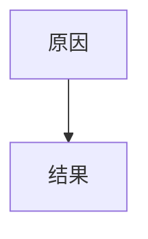
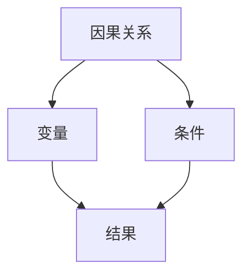

                 

# AI Agent的因果推理：增强决策的逻辑性

> 关键词：AI Agent，因果推理，决策逻辑，因果图，贝叶斯网络，反事实推理

> 摘要：本文深入探讨了AI Agent的因果推理及其在决策逻辑中的应用。通过分析因果推理的基本原理、数学模型、算法原理，以及在实际系统中的应用，本文展示了如何通过因果推理增强AI Agent的决策能力，实现更智能、更可靠的决策过程。

---

## 第1章: AI Agent与因果推理概述

### 1.1 AI Agent的基本概念

#### 1.1.1 AI Agent的定义与分类
AI Agent（人工智能代理）是指能够感知环境、自主决策并采取行动的智能实体。AI Agent可以分为**简单反射型代理**、**基于模型的反射型代理**、**目标驱动型代理**和**效用驱动型代理**。AI Agent的核心能力包括感知、推理、规划和执行。

#### 1.1.2 因果推理的基本概念
因果推理是指从因果关系中推导出因果机制的过程。因果关系不同于相关关系，它关注的是“为什么”某个现象会发生，而不是“相关”于什么。

#### 1.1.3 AI Agent与因果推理的关系
AI Agent的决策过程依赖于对因果关系的理解。因果推理帮助AI Agent不仅理解“相关”，还能理解“因果”，从而做出更合理的决策。

---

### 1.2 因果推理的背景与问题背景

#### 1.2.1 传统统计推断的局限性
传统统计推断只能发现变量之间的相关关系，而无法揭示因果关系。例如，身高和体重的相关性并不意味着身高决定体重。

#### 1.2.2 因果推理的核心问题
因果推理的核心问题是确定因果关系的方向性和强度。例如，确定“下雨”是否是“打伞”的原因。

#### 1.2.3 AI Agent决策中的因果性需求
AI Agent需要在复杂环境中做出决策，这要求它能够理解因果关系，而不是仅仅依赖相关关系。

---

### 1.3 问题描述与目标

#### 1.3.1 AI Agent决策中的因果性问题
AI Agent在面对复杂决策时，需要考虑多个变量之间的因果关系。例如，在自动驾驶中，AI Agent需要考虑刹车、加速、转向等动作之间的因果关系。

#### 1.3.2 因果推理在决策中的作用
因果推理帮助AI Agent理解“如果我采取某个动作，结果会如何”的逻辑关系。这使得AI Agent能够做出更可靠的决策。

#### 1.3.3 本书的研究目标与范围
本书旨在通过分析因果推理的原理和算法，探讨如何将其应用于AI Agent的决策过程，从而增强决策的逻辑性和可靠性。

---

## 第2章: 因果推理的核心概念与联系

### 2.1 因果推理的原理与机制

#### 2.1.1 因果关系的定义与特征
因果关系是指一个事件（原因）导致另一个事件（结果）发生的关系。因果关系具有**时间顺序性**、**必然性**和**可传递性**。

#### 2.1.2 因果图的基本概念
因果图（Causal Graph）是一种用于表示变量之间因果关系的有向图。例如：

#### 2.1.3 结构方程模型的介绍
结构方程模型（SEM）是一种用于描述变量之间因果关系的数学模型。例如：
$$ Y = \beta X + \epsilon $$

其中，$\beta$ 是因果系数，$\epsilon$ 是误差项。

---

### 2.2 因果推理的核心概念对比

#### 2.2.1 因果关系与相关关系的对比
| 对比维度 | 因果关系 | 相关关系 |
|----------|----------|----------|
| 定义     | 变量间存在因果联系 | 变量间存在统计关联 |
| 时间顺序 | 需要满足时间顺序 | 无时间顺序要求 |
| 干预实验 | 可通过干预实验验证 | 无法通过干预实验验证 |

#### 2.2.2 随机变量与条件独立性的对比
| 对比维度 | 随机变量 | 条件独立性 |
|----------|----------|------------|
| 定义     | 不受控制的影响 | 在给定某个条件下的独立性 |
| 示例     | $X$ 和 $Y$ | $X \perp Y \, | \, Z$ |

#### 2.2.3 因果图与贝叶斯网络的对比
因果图和贝叶斯网络都是用于表示变量间关系的图形模型，但因果图强调因果关系，而贝叶斯网络强调概率关系。

---

### 2.3 因果推理的ER实体关系图

---

## 第3章: 因果推理的数学模型与算法原理

### 3.1 因果推理的数学模型

#### 3.1.1 结构方程模型的数学表达
结构方程模型（SEM）通过以下公式表示：
$$ Y = \beta X + \epsilon $$
其中，$\beta$ 是因果系数，$\epsilon$ 是误差项。

#### 3.1.2 因果图的表示与数学公式
因果图通过有向边表示因果关系。例如：
$$ P(Y|X) = \prod_{i} P(Y_i|Pa(Y_i)) $$

#### 3.1.3 隐变量模型的数学描述
隐变量模型通过引入隐变量来描述因果关系。例如：
$$ X \rightarrow Z \rightarrow Y $$

---

### 3.2 因果推理的算法原理

#### 3.2.1 贝叶斯网络的推理算法
贝叶斯网络通过条件概率公式进行推理：
$$ P(Y|X) = \prod_{i} P(Y_i|Pa(Y_i)) $$

#### 3.2.2 因果推断的反事实推理
反事实推理通过假设干预来推断因果关系。例如，假设我们干预变量 $X$，那么 $Y$ 的变化可以用于推断因果关系。

#### 3.2.3 ID算法与DO算子的数学推导
ID算法（Identification Algorithm）通过以下步骤推导因果关系：
1. 构建因果图。
2. 检查因果关系是否可识别。
3. 计算因果效应。

DO算子（Do-calculus）通过以下公式计算干预后的概率分布：
$$ P(Y|do(X=x)) = \sum_{x'} P(Y|x', do(X=x)) P(x'|do(Pa(X)=x)) $$

---

## 第4章: AI Agent的因果推理与决策逻辑

### 4.1 AI Agent的决策逻辑

#### 4.1.1 决策树与因果推理的关系
决策树通过因果推理来构建决策路径。例如：
1. 如果下雨，打伞。
2. 如果不下雨，不打伞。

这种决策路径通过因果推理来优化决策逻辑。

---

## 总结与展望

因果推理是AI Agent实现智能决策的核心能力。通过因果推理，AI Agent能够理解因果关系，从而做出更可靠的决策。未来的研究方向包括更复杂的因果图构建、更高效的因果推理算法，以及更广泛的应用场景。

---

## 作者

作者：AI天才研究院/AI Genius Institute & 禅与计算机程序设计艺术 /Zen And The Art of Computer Programming

