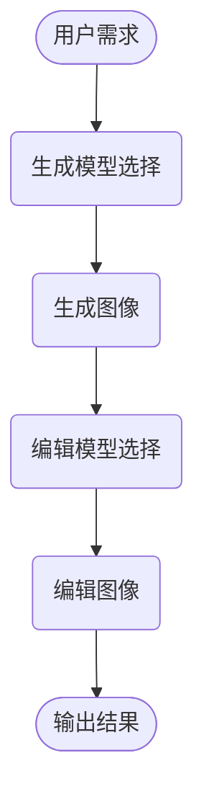
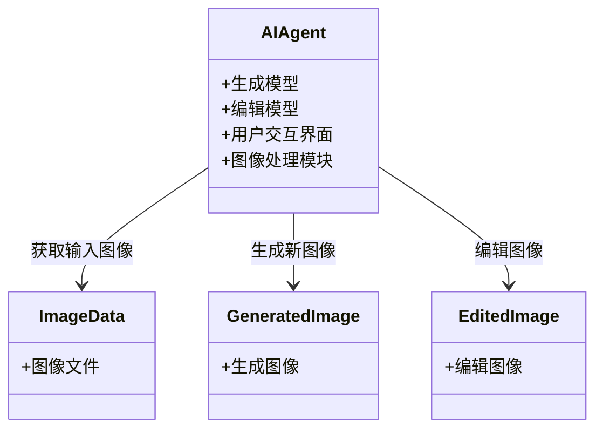
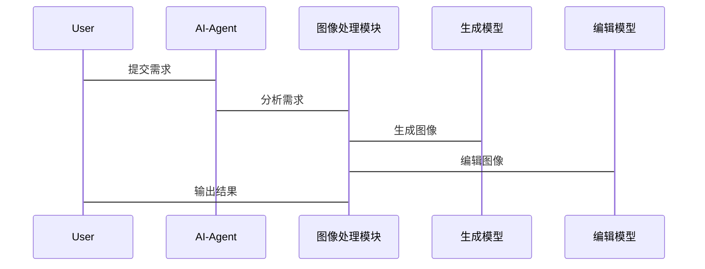

                 


# AI Agent的图像生成与编辑能力实现

> 关键词：AI Agent，图像生成，图像编辑，生成式AI，深度学习，计算机视觉

> 摘要：本文深入探讨AI Agent在图像生成与编辑中的实现方法，涵盖生成式AI的原理、图像编辑技术，以及AI Agent与图像生成编辑的结合。通过详细讲解算法原理、系统架构设计和项目实战，帮助读者全面理解AI Agent的图像生成与编辑能力。

---

## 第1章: AI Agent与图像生成编辑概述

### 1.1 AI Agent的基本概念
#### 1.1.1 什么是AI Agent
AI Agent（人工智能代理）是指能够感知环境、自主决策并执行任务的智能实体。它通过传感器获取信息，利用算法处理数据，并通过执行器与环境交互。

#### 1.1.2 AI Agent的核心特征
- **自主性**：能够在没有外部干预的情况下独立运作。
- **反应性**：能够实时感知环境并做出反应。
- **目标导向**：具备明确的目标，并采取行动以实现目标。
- **学习能力**：能够通过数据和经验不断优化自身性能。

#### 1.1.3 AI Agent的分类与应用场景
AI Agent可以根据智能水平分为**反应式AI Agent**和**认知式AI Agent**。反应式AI Agent主要基于当前感知做出反应，而认知式AI Agent则具备更高层次的推理和规划能力。应用场景包括图像生成、自然语言处理、机器人控制等。

### 1.2 图像生成与编辑的背景
#### 1.2.1 图像生成技术的发展历程
图像生成技术从早期的简单算法到现在的生成式AI，经历了巨大的变革。早期技术如计算机图形学主要依赖于规则生成图像，而生成式AI（如GAN和Diffusion模型）则通过深度学习实现更逼真的图像生成。

#### 1.2.2 图像编辑技术的演变
图像编辑技术从手动调整像素值发展到基于深度学习的智能编辑。现代图像编辑技术能够实现风格迁移、图像修复等复杂操作，极大地提升了图像处理的效率和质量。

#### 1.2.3 AI在图像生成编辑中的作用
AI通过深度学习模型，能够从大量数据中学习图像特征，并生成或编辑符合特定要求的图像。生成式AI在图像生成中的优势在于其能够创造出新的图像，而编辑式AI则能够对现有图像进行精准修改。

### 1.3 AI Agent与图像生成编辑的结合
#### 1.3.1 AI Agent在图像生成中的优势
AI Agent能够根据用户需求，自主选择合适的生成模型，并调整参数以生成高质量的图像。这种自主性和灵活性使得AI Agent在图像生成中表现出色。

#### 1.3.2 AI Agent在图像编辑中的应用
AI Agent能够通过分析图像内容，自动识别需要编辑的部分，并推荐合适的编辑方案。这使得图像编辑变得更加智能化和便捷。

#### 1.3.3 未来发展趋势
随着AI技术的不断进步，AI Agent在图像生成与编辑中的应用将更加广泛。生成式AI和编辑式AI的协同工作将实现更加复杂的图像处理任务。

---

## 第2章: AI Agent图像生成编辑的核心概念与联系

### 2.1 生成式AI的原理
#### 2.1.1 GAN模型的原理
生成对抗网络（GAN）由生成器和判别器组成。生成器通过对抗训练生成逼真的图像，而判别器则负责区分生成图像和真实图像。这种对抗过程使得生成器不断优化生成图像的质量。

#### 2.1.2 Diffusion模型的原理
Diffusion模型通过逐步添加噪声到数据中，并逐步去除噪声来生成图像。这种方法具有生成图像质量高、稳定性强的优点。

#### 2.1.3 其他生成模型简介
除GAN和Diffusion外，还包括变体自编码器（VAE）、风格化生成模型等。每种模型都有其独特的优缺点。

### 2.2 图像编辑技术的核心原理
#### 2.2.1 图像编辑的基本概念
图像编辑是指对图像进行修改或增强的过程，包括颜色调整、图像修复、风格迁移等。

#### 2.2.2 常见图像编辑技术
- **颜色调整**：通过改变图像的颜色值来实现亮度、对比度等调整。
- **图像修复**：通过填充或替换图像中的损坏部分来恢复图像质量。
- **风格迁移**：将一种图像的风格应用到另一种图像上。

#### 2.2.3 图像编辑的数学模型
图像编辑通常涉及图像的像素操作和特征提取。例如，风格迁移可以通过将目标图像的特征映射到源图像的风格上。

### 2.3 AI Agent与图像生成编辑的结合原理
#### 2.3.1 AI Agent如何驱动图像生成
AI Agent通过分析用户需求，选择合适的生成模型，并调整生成过程中的参数，以生成符合要求的图像。

#### 2.3.2 AI Agent如何实现图像编辑
AI Agent通过分析图像内容，识别需要编辑的部分，并推荐或执行编辑操作，以实现用户意图。

#### 2.3.3 生成式AI与编辑式AI的协同工作
生成式AI负责生成基础图像，编辑式AI则对生成的图像进行进一步调整和优化，以达到最佳效果。

### 2.4 核心概念对比表
| **概念**          | **生成式AI**           | **编辑式AI**             |
|--------------------|-----------------------|--------------------------|
| **核心任务**      | 生成新的图像          | 修改或优化现有图像       |
| **输入**          | 无或随机噪声          | 待编辑的图像             |
| **输出**          | 新图像                | 修改后的图像             |
| **应用场景**      | 图像生成              | 图像编辑                |
| **优缺点**        | 生成多样化，但可能缺乏细节控制 | 精细调整，但创新性有限 |

### 2.5 ER实体关系图
```mermaid
erDiagram
    actor User {
        <属性> 用户需求
    }
    class AIAgent {
        <属性> 生成模型
        <属性> 编辑模型
        <属性> 用户交互界面
    }
    class ImageData {
        <属性> 图像文件
    }
    class GeneratedImage {
        <属性> 生成图像
    }
    class EditedImage {
        <属性> 编辑图像
    }
    User --> AIAgent: 提交需求
    AIAgent --> ImageData: 获取输入图像
    AIAgent --> GeneratedImage: 生成新图像
    AIAgent --> EditedImage: 编辑图像
```

---

## 第3章: AI Agent图像生成编辑的算法原理

### 3.1 生成式AI的数学模型
#### 3.1.1 GAN模型的数学公式
生成对抗网络由生成器和判别器组成，其损失函数为：
$$ \text{生成器损失} = -\log(D(G(z))) $$
$$ \text{判别器损失} = -(\log(D(x)) + \log(1-D(G(z)))) $$

#### 3.1.2 Diffusion模型的数学公式
Diffusion模型通过逐步添加和去除噪声来实现图像生成：
$$ q(x_t | x_{t-1}) = \mathcal{N}(x_t; \mu_\theta(x_{t-1}), \sigma^2 I) $$

### 3.2 图像编辑算法的数学模型
#### 3.2.1 风格迁移算法
风格迁移通过将源图像的风格特征应用到目标图像上，其数学模型为：
$$ I_{\text{output}} = F(I_{\text{content}}, F_{\text{style}}) $$

#### 3.2.2 图像修复算法
图像修复算法通过填充缺失区域来恢复图像，常用的方法包括基于深度学习的修复网络：
$$ I_{\text{output}} = G(I_{\text{input}}) $$

### 3.3 生成式AI与编辑式AI的协同工作流程


---

## 第4章: AI Agent图像生成编辑的系统分析与架构设计

### 4.1 问题场景介绍
AI Agent需要实现图像生成与编辑功能，满足用户需求，同时具备良好的扩展性和灵活性。

### 4.2 系统功能设计
#### 4.2.1 领域模型设计


#### 4.2.2 系统架构设计


#### 4.2.3 接口设计
- **输入接口**：接收用户需求和图像数据。
- **输出接口**：输出生成或编辑后的图像。

#### 4.2.4 交互流程


---

## 第5章: AI Agent图像生成编辑的项目实战

### 5.1 环境配置
- **Python**：3.8+
- **深度学习框架**：TensorFlow或PyTorch
- **生成模型**：预训练的GAN或Diffusion模型
- **编辑模型**：风格迁移或图像修复模型

### 5.2 核心实现代码
#### 5.2.1 生成图像的代码示例
```python
import tensorflow as tf
from tensorflow.keras import layers

def build_generator():
    model = tf.keras.Sequential([
        layers.Dense(256, activation='relu'),
        layers.Dense(784, activation='sigmoid')
    ])
    return model

def build_discriminator():
    model = tf.keras.Sequential([
        layers.Dense(256, activation='relu'),
        layers.Dense(1, activation='sigmoid')
    ])
    return model

# 初始化模型
generator = build_generator()
discriminator = build_discriminator()
```

#### 5.2.2 图像编辑的代码示例
```python
import cv2
import numpy as np

def style_transfer(content_image, style_image):
    # 加载预训练的风格迁移模型
    model = load_style_model()
    return model.transfer(content_image, style_image)

# 使用示例
content = cv2.imread('content.jpg')
style = cv2.imread('style.jpg')
result = style_transfer(content, style)
cv2.imwrite('output.jpg', result)
```

### 5.3 实际案例分析
通过具体案例分析生成式AI和编辑式AI的协同工作，展示如何利用AI Agent实现复杂的图像生成与编辑任务。

---

## 第6章: 最佳实践

### 6.1 小结
AI Agent在图像生成与编辑中的应用前景广阔，通过生成式AI和编辑式AI的协同工作，能够实现更加智能化和个性化的图像处理。

### 6.2 注意事项
- **数据质量**：确保训练数据的多样性和代表性。
- **模型优化**：定期优化生成和编辑模型，提升生成图像的质量和编辑的精准度。
- **用户隐私**：注意用户数据的隐私保护，确保合规性。

### 6.3 拓展阅读
建议读者进一步学习生成式AI和图像处理技术，探索更多AI Agent的应用场景。

---

## 作者
作者：AI天才研究院/AI Genius Institute  
联系邮箱：contact@ai-genius.org  
GitHub：https://github.com/ai-genius-institute

---

通过以上结构，我为您构建了一篇详细的关于“AI Agent的图像生成与编辑能力实现”的技术博客文章。文章内容涵盖了从背景介绍到算法原理，再到系统设计和项目实战的各个方面，旨在为读者提供全面的技术见解。希望这篇文章对您有所帮助！

