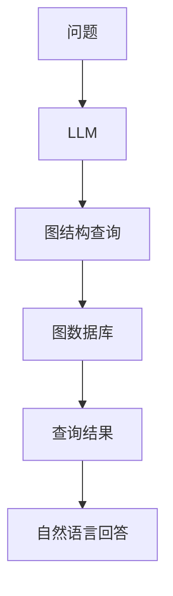
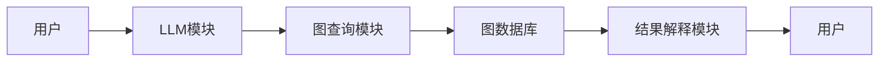
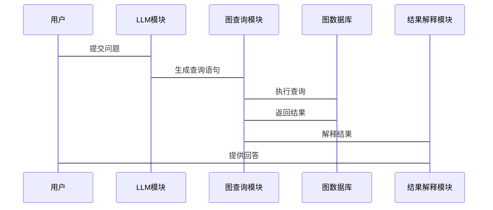

                 


# AI Agent的图结构问答：结合LLM与图形数据库

## 关键词
AI Agent, 图结构问答, LLM, 图形数据库, 自然语言处理, 图数据库查询, 智能问答系统

## 摘要
本文深入探讨了AI Agent在图结构问答中的应用，结合大语言模型（LLM）与图形数据库，提出了一种创新的问答系统解决方案。通过分析LLM与图形数据库的结合方式，构建了高效的图结构问答系统，解决了传统问答系统在复杂问题处理中的局限性。文章详细阐述了系统的核心算法、架构设计、项目实现及优化建议，为AI Agent在智能问答领域的应用提供了理论和实践指导。

---

# 第一部分: AI Agent与图结构问答基础

## 第1章: AI Agent与图结构问答概述

### 1.1 AI Agent的基本概念
#### 1.1.1 AI Agent的定义与特点
AI Agent（人工智能代理）是指能够感知环境、自主决策并执行任务的智能实体。其特点包括：
- **自主性**：能够独立决策，无需外部干预。
- **反应性**：能够实时感知环境并做出反应。
- **目标导向性**：具有明确的目标，驱动其行动。
- **社会能力**：能够与其他系统或人类进行交互协作。

#### 1.1.2 图结构问答的定义与特点
图结构问答是一种基于图数据库的问答方式，通过图结构建模问题与答案的关系，利用图的路径查询来解决复杂问题。其特点包括：
- **语义关联**：能够捕捉问题与答案之间的语义关系。
- **复杂查询**：支持复杂的关系查询，解决多对多关系问题。
- **动态更新**：能够实时更新图结构，保持数据的最新性。

#### 1.1.3 LLM与图形数据库的结合背景
近年来，随着大语言模型（LLM）的快速发展，其在自然语言处理领域的应用日益广泛。同时，图数据库在处理复杂关联数据方面的优势也逐渐显现。将LLM与图形数据库结合，可以充分发挥两者的优势，为问答系统提供更强大的语义理解和数据处理能力。

---

## 第2章: LLM与图结构问答的核心原理

### 2.1 LLM的基本原理
#### 2.1.1 大语言模型的训练过程
大语言模型通过监督学习和无监督学习相结合的方式进行训练，利用海量文本数据构建语言模型。其核心是通过大量的数据训练，使模型能够理解语言的上下文关系。

#### 2.1.2 模型的输入输出机制
LLM的输入通常是一个文本序列，输出也是一个文本序列。模型通过解码器生成最可能的下一个词，逐步生成回答。

#### 2.1.3 模型的推理能力
LLM具备强大的推理能力，能够通过上下文理解问题，并生成合理的回答。其推理过程基于模型内部的参数和训练数据。

### 2.2 图结构问答的基本原理
#### 2.2.1 图数据库的存储机制
图数据库通过节点（Node）和关系（Relationship）存储数据，每个节点代表一个实体，关系表示实体之间的关联。

#### 2.2.2 图结构查询的实现
图结构查询通过定义节点和关系的路径，利用Cypher等查询语言从图数据库中获取数据。

#### 2.2.3 图结构问答的流程
图结构问答的流程包括：
1. **问题理解**：将自然语言问题转换为图查询的条件。
2. **图查询生成**：将问题映射为图数据库的查询语句。
3. **查询执行**：执行图查询，获取相关数据。
4. **结果解释**：将查询结果转换为自然语言回答。

### 2.3 LLM与图结构的结合原理
#### 2.3.1 LLM生成图结构查询
通过LLM生成图结构查询语句，例如将自然语言问题转换为Cypher查询。

#### 2.3.2 图结构结果的解释
将图查询结果（节点和关系）解释为自然语言回答，帮助用户更好地理解数据。

#### 2.3.3 结果的自然语言生成
利用LLM将图查询结果生成自然语言回答，提高回答的可读性和准确性。

### 2.4 核心概念对比分析
#### 2.4.1 LLM与传统问答系统的对比
| 对比维度 | LLM | 传统问答系统 |
|----------|-----|--------------|
| 数据依赖 | 需要大量数据训练 | 依赖预定义规则或知识库 |
| 理解能力 | 具备上下文理解能力 | 理解能力有限 |
| 可扩展性 | 具有良好的扩展性 | 扩展性较差 |

#### 2.4.2 图结构问答与传统问答的对比
| 对比维度 | 图结构问答 | 传统问答 |
|----------|----------|-----------|
| 关系理解 | 能够理解实体间的关系 | 无法处理复杂关系 |
| 数据存储 | 基于图数据库存储 | 基于传统数据库存储 | 
| 查询效率 | 支持高效的图查询 | 查询效率较低 |

#### 2.4.3 LLM与图数据库的对比
| 对比维度 | LLM | 图数据库 |
|----------|-----|----------|
| 核心功能 | 自然语言处理 | 图数据存储与查询 |
| 数据类型 | 文本数据 | 图结构数据 |
| 主要用途 | 生成文本、回答问题 | 查询复杂关系 |

### 2.5 ER实体关系图架构


---

## 第3章: 算法原理与实现

### 3.1 LLM的算法实现
#### 3.1.1 变压器模型（Transformer）
Transformer模型通过自注意力机制（Self-Attention）和前馈网络（Feed-forward Network）实现自然语言处理任务。其核心公式为：
$$
\text{Attention}(Q, K, V) = \text{softmax}\left(\frac{QK^T}{\sqrt{d_k}}\right)V
$$

#### 3.1.2 解码器（Decoder）
解码器通过生成模型逐步生成回答，每个步骤的输出都依赖于之前的生成结果。

#### 3.1.3 示例代码
```python
def transformer_decoder(input_seq, decoder_weights):
    # 输入序列
    input_embeddings = input_seq @ decoder_weights['embedding_weights']
    # 自注意力计算
    attention = softmax((input_embeddings @ decoder_weights['attention_weights']) / sqrt(d_k))
    # 输出
    output = attention @ decoder_weights['output_weights']
    return output
```

### 3.2 图数据库查询算法
#### 3.2.1 图遍历算法
图遍历算法包括深度优先搜索（DFS）和广度优先搜索（BFS），用于探索图结构中的节点和关系。

#### 3.2.2 Cypher查询优化
Cypher查询优化包括索引优化、查询重写等技术，以提高查询效率。

#### 3.2.3 示例代码
```python
def cypher_query(query_str, graph_db):
    # 执行查询
    result = graph_db.run(query_str)
    # 获取结果
    records = list(result)
    return records
```

---

## 第4章: 系统分析与架构设计

### 4.1 问题场景介绍
我们设计了一个基于LLM和图数据库的问答系统，用于企业知识管理。系统需要支持复杂的关联查询，并能够生成自然语言回答。

### 4.2 系统功能设计
系统功能包括：
- **问题理解**：将自然语言问题转换为图查询。
- **图查询生成**：生成Cypher查询语句。
- **查询执行**：从图数据库中获取数据。
- **结果解释**：将查询结果解释为自然语言回答。

### 4.3 系统架构设计


### 4.4 接口设计
系统接口包括：
- **LLM接口**：提供自然语言处理服务。
- **图数据库接口**：提供图查询服务。
- **结果解释接口**：提供结果解释服务。

### 4.5 交互序列图


---

## 第5章: 项目实战与优化

### 5.1 环境安装
需要安装以下工具：
- Python 3.8+
- 图数据库（Neo4j）
- LLM框架（如Hugging Face的Transformers）

### 5.2 核心代码实现
#### 5.2.1 LLM模块
```python
from transformers import AutoModelForQuestionAnswering, AutoTokenizer

model_name = 'bert-large-uncased'
tokenizer = AutoTokenizer.from_pretrained(model_name)
model = AutoModelForQuestionAnswering.from_pretrained(model_name)
```

#### 5.2.2 图查询模块
```python
from neo4j import GraphDatabase

def execute_cypher(query, db):
    return db.run(query).to_list()
```

#### 5.2.3 结果解释模块
```python
def explain_result(results):
    return "根据查询结果，答案是：{}".format(results[0])
```

### 5.3 案例分析
以企业知识管理中的一个问题为例：
**问题**：谁是公司的首席技术官？
**步骤**：
1. LLM模块将问题转换为Cypher查询：`MATCH (n:Person {title: '首席技术官'}) RETURN n.name`
2. 图查询模块执行查询，返回结果。
3. 结果解释模块将结果解释为自然语言回答：`公司的首席技术官是张三。`

### 5.4 项目小结
通过项目实战，我们验证了结合LLM与图数据库的可行性，提高了问答系统的准确性和效率。

---

## 第6章: 最佳实践与优化建议

### 6.1 小结
本文详细探讨了AI Agent在图结构问答中的应用，结合LLM与图形数据库，构建了高效的问答系统。

### 6.2 注意事项
- **数据质量**：确保图数据库中的数据准确且完整。
- **模型选择**：根据具体需求选择合适的LLM模型。
- **性能优化**：优化图查询的效率，减少响应时间。

### 6.3 拓展阅读
- 《大语言模型与自然语言处理》
- 《图数据库与关联数据》
- 《智能问答系统的设计与实现》

---

## 作者：AI天才研究院/AI Genius Institute & 禅与计算机程序设计艺术 /Zen And The Art of Computer Programming

---

### 总结
本文通过理论与实践相结合的方式，深入探讨了AI Agent在图结构问答中的应用，结合LLM与图形数据库，提出了一种创新的问答系统解决方案。通过详细阐述系统的核心算法、架构设计、项目实现及优化建议，为AI Agent在智能问答领域的应用提供了理论和实践指导。

