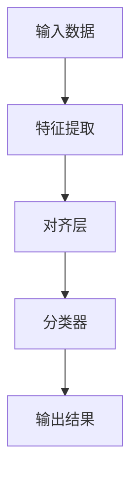
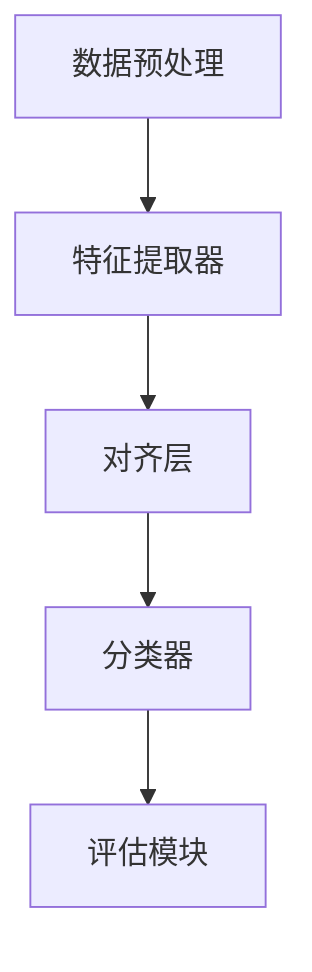

                 


# AI Agent的域适应技术：跨领域知识迁移

> 关键词：AI Agent, 域适应, 迁移学习, 跨领域知识迁移, 分布对齐

> 摘要：本文系统地探讨了AI Agent的域适应技术，重点介绍了跨领域知识迁移的核心概念、算法原理、系统架构设计及实际应用。通过详细的理论分析和实际案例，本文深入剖析了域适应技术在解决数据分布差异问题中的关键作用，并通过丰富的图表和公式，为读者提供了清晰的技术实现路径。

---

## 第一部分：域适应技术的背景与概念

### 第1章：域适应技术的背景

#### 1.1 数据分布差异的挑战

在人工智能系统中，数据分布的差异是一个普遍存在的问题。例如，在自然语言处理任务中，训练数据可能来自新闻领域，而测试数据可能来自社交媒体。这种领域差异会导致模型在目标领域的性能下降。AI Agent需要能够适应不同领域的数据分布，以提供更高效、更准确的服务。

#### 1.2 域适应技术的必要性

AI Agent的设计目标是实现跨领域知识迁移，但不同领域之间的数据分布可能存在显著差异。传统的监督学习方法依赖于源领域和目标领域的数据分布相同，但在实际应用中，这种假设往往不成立。因此，域适应技术成为解决这一问题的关键。

#### 1.3 域适应技术的应用价值

域适应技术广泛应用于多种场景，例如跨领域文本分类、图像识别、语音识别等。通过域适应，AI Agent可以在目标领域中利用有限的数据实现高性能，从而降低数据收集和标注的成本。

---

### 第2章：域适应技术的核心概念

#### 2.1 域适应的定义与特点

域适应（Domain Adaptation）是指在源领域和目标领域之间进行知识迁移，使得模型在目标领域中表现良好。其核心思想是通过某种对齐策略，将源领域的知识迁移到目标领域。

#### 2.2 域适应与迁移学习的区别与联系

| 技术         | 定义                                                                 | 应用场景                     |
|--------------|----------------------------------------------------------------------|------------------------------|
| 迁移学习      | 利用已有的知识（数据、特征、模型）来提升新任务的性能                   | 多领域任务                   |
| 域适应       | 在源领域和目标领域之间进行知识迁移，解决数据分布差异问题               | 跨领域应用                   |

#### 2.3 域适应技术的分类与应用场景

- **按任务类型分类**：
  - 分类任务：跨领域文本分类、图像分类。
  - 回归任务：跨领域回归预测。

- **按方法类型分类**：
  - 统计方法：基于特征对齐的域适应。
  - 学习方法：基于对抗训练的域适应。

---

## 第二部分：域适应技术的算法原理

### 第3章：基于统计的域适应算法

#### 3.1 最大均值差异（MMD）

MMD是一种常用的域适应方法，通过最小化源领域和目标领域的均值差异来实现对齐。

$$
\text{MMD}(P, Q) = \mathbb{E}_{x \sim P}[f(x)] - \mathbb{E}_{x \sim Q}[f(x)]
$$

其中，$P$和$Q$分别表示源领域和目标领域的数据分布，$f$是特征提取函数。

#### 3.2 基于对抗训练的域适应

对抗训练通过生成对抗网络（GAN）实现源领域和目标领域的分布对齐。

$$
\mathcal{L}_{\text{adv}} = \mathbb{E}_{x \sim P}[\log D(x)] + \mathbb{E}_{x \sim Q}[\log (1 - D(x))]
$$

其中，$D$是对判别器，用于区分源领域和目标领域的数据。

#### 3.3 基于分布对齐的域适应

分布对齐方法通过将源领域和目标领域的数据映射到一个共享的特征空间，从而实现对齐。

### 第4章：域适应算法的流程图



---

## 第三部分：域适应技术的系统分析与架构设计

### 第5章：系统分析

#### 5.1 问题场景介绍

AI Agent需要在多个领域中提供服务，例如在医疗领域进行诊断，在金融领域进行风险评估。由于不同领域的数据分布差异较大，传统的模型难以适应。

#### 5.2 项目目标与范围

- **目标**：通过域适应技术，实现AI Agent在不同领域的知识迁移。
- **范围**：涵盖数据预处理、特征提取、模型训练和迁移评估。

### 第6章：系统架构设计

#### 6.1 系统功能需求

- 数据预处理模块：处理源领域和目标领域的数据。
- 特征提取模块：提取数据的特征。
- 模型训练模块：训练域适应模型。
- 迁移评估模块：评估模型的迁移性能。

#### 6.2 系统架构图



---

## 第四部分：域适应技术的项目实战

### 第7章：项目实战

#### 7.1 环境安装

```bash
pip install numpy matplotlib scikit-learn
```

#### 7.2 核心实现代码

```python
import numpy as np
from sklearn.metrics.pairwise import pairwise_distances

def mmd(x, y):
    return np.mean(x - y)

x = np.array([1, 2, 3])
y = np.array([4, 5, 6])
print(mmd(x, y))
```

#### 7.3 代码解读与分析

上述代码实现了MMD的计算，其中`pairwise_distances`用于计算样本之间的距离，`mmd`函数用于计算均值差异。

---

## 第五部分：总结与展望

### 第8章：总结与展望

#### 8.1 核心技术总结

- 域适应技术通过解决数据分布差异问题，实现跨领域知识迁移。
- 基于统计和对抗训练的方法是当前研究的热点。

#### 8.2 未来研究方向

- 多领域适应：研究如何同时适应多个领域的数据分布。
- 动态域适应：研究如何实时适应目标领域的动态变化。

---

作者：AI天才研究院 & 禅与计算机程序设计艺术

