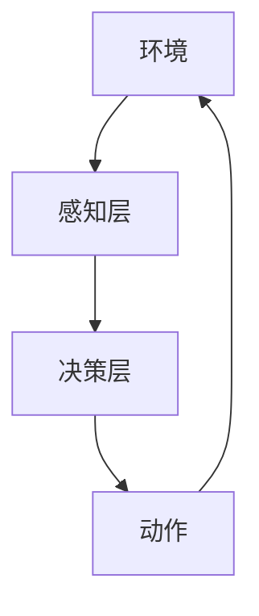
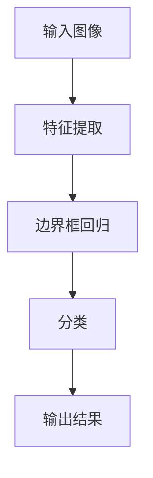
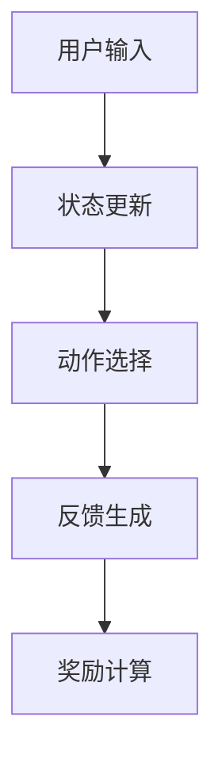
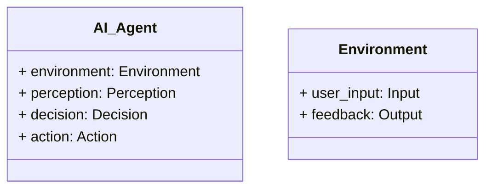
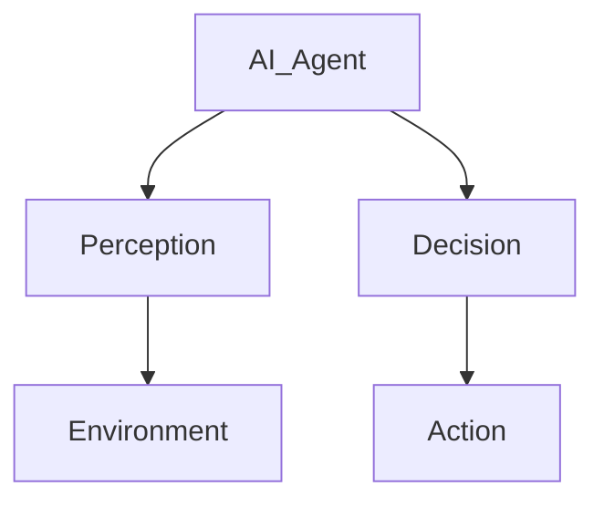

                 


```markdown
# AI Agent的增强现实交互能力开发

> 关键词：AI Agent、增强现实、交互设计、计算机视觉、自然语言处理

> 摘要：本文详细探讨了AI Agent在增强现实环境中的交互能力开发，从基本概念、核心算法到系统架构设计，再到实际项目案例，全面解析了实现增强现实交互的关键技术与方法。

---

## 第1章 AI Agent与增强现实交互概述

### 1.1 AI Agent的基本概念
#### 1.1.1 AI Agent的定义与特点
- AI Agent是具有感知环境、自主决策和执行任务能力的智能体。
- 具备主动性、反应性、目标导向性和社会性四大特点。

#### 1.1.2 增强现实技术的基本原理
- 增强现实（AR）是通过计算机生成的虚拟信息叠加在现实世界中，为用户提供增强的视觉体验。
- AR的核心技术包括计算机视觉、3D建模、实时渲染和用户交互等。

#### 1.1.3 AI Agent与增强现实的结合意义
- 通过AI Agent实现增强现实中的智能交互，提升用户体验。
- 实现虚实结合的智能化人机交互，扩展现实世界的可能性。

### 1.2 增强现实交互的核心问题
#### 1.2.1 问题背景与问题描述
- AR交互需要解决实时性、精准性和智能化三大核心问题。

#### 1.2.2 问题解决的思路与方法
- 结合AI技术，通过计算机视觉和自然语言处理实现智能交互。
- 使用强化学习优化交互策略，提升用户体验。

#### 1.2.3 增强现实交互的边界与外延
- 交互边界：用户感知的数字内容与现实世界的融合程度。
- 外延：扩展至混合现实（MR）、虚拟现实（VR）等其他领域。

### 1.3 本章小结
- 本章介绍了AI Agent和增强现实的基本概念，分析了增强现实交互的核心问题和解决思路。

---

## 第2章 AI Agent的核心原理与算法

### 2.1 AI Agent的感知与决策机制
#### 2.1.1 感知层的实现原理
- 通过计算机视觉技术（如特征检测、目标识别）感知环境信息。
- 使用深度学习模型进行实时数据处理。

#### 2.1.2 决策层的算法选择
- 基于强化学习（如Q-learning）实现决策优化。
- 算法流程图如下：



#### 2.1.3 执行层的实现方式
- 执行层通过控制设备（如摄像头、投影仪）输出交互结果。

### 2.2 增强现实中的交互模型
#### 2.2.1 交互模型的定义
- 交互模型是描述用户与AR系统之间信息流的模型。

#### 2.2.2 交互模型的属性特征对比表
| 属性 | 特征1 | 特征2 | 特征3 |
|------|-------|-------|-------|
| 类型 | 手势 | 语音 | 视觉 |

#### 2.2.3 交互模型的ER实体关系图
```mermaid
er
    Actor --|> Interaction: 进行交互
    Interaction --|> ARSystem: 提供反馈
```

### 2.3 本章小结
- 本章详细分析了AI Agent的核心原理，包括感知、决策和执行机制，并通过流程图和实体关系图展示了交互模型的设计思路。

---

## 第3章 增强现实交互中的算法原理

### 3.1 增强现实中的目标识别算法
#### 3.1.1 目标识别的数学模型
- 使用深度学习模型（如YOLO、Faster R-CNN）进行目标检测。

#### 3.1.2 基于深度学习的目标检测算法
- 算法流程图如下：



#### 3.1.3 算法数学模型与公式
- 检测损失函数：$$L = L_{cls} + \lambda L_{reg}$$
  - $L_{cls}$：分类损失
  - $L_{reg}$：回归损失
  - $\lambda$：权重系数

### 3.2 交互反馈的生成算法
#### 3.2.1 交互反馈的生成原理
- 基于强化学习的反馈生成算法。

#### 3.2.2 基于强化学习的反馈生成算法
- 算法流程图如下：



#### 3.2.3 算法数学模型与公式
- 奖励函数：$$R = \sum_{t} r_t$$
  - $r_t$：第t步的奖励值

### 3.3 本章小结
- 本章详细讲解了增强现实交互中的目标识别和反馈生成算法，通过流程图和数学公式展示了算法的实现过程。

---

## 第4章 增强现实交互系统的架构设计

### 4.1 问题场景介绍
#### 4.1.1 问题背景
- 开发一个增强现实交互系统，实现AI Agent与用户的智能交互。

#### 4.1.2 项目目标
- 实现增强现实环境中的智能交互功能。

#### 4.1.3 项目范围
- 系统包括感知、决策、执行和反馈四个模块。

### 4.2 系统功能设计
#### 4.2.1 领域模型类图（Mermaid）


#### 4.2.2 系统功能模块划分
- 感知模块：负责环境数据的采集与处理。
- 决策模块：基于感知数据生成交互策略。
- 执行模块：输出交互结果。

### 4.3 系统架构设计
#### 4.3.1 系统架构图（Mermaid）


#### 4.3.2 系统接口设计
- 用户输入接口：支持手势、语音等多种输入方式。
- 系统输出接口：支持图形、文本等多种输出形式。

### 4.4 本章小结
- 本章详细分析了增强现实交互系统的架构设计，包括系统功能模块划分和系统架构图的设计。

---

## 第5章 项目实战：增强现实交互系统开发

### 5.1 环境安装与配置
- 安装必要的开发工具和依赖库（如OpenCV、TensorFlow等）。

### 5.2 系统核心实现
#### 5.2.1 感知模块实现
- 使用OpenCV实现目标检测和跟踪功能。

#### 5.2.2 决策模块实现
- 使用强化学习算法优化交互策略。

#### 5.2.3 执行模块实现
- 实现AR渲染和用户反馈输出。

### 5.3 代码实现与解读
```python
# 感知模块示例代码
import cv2

def detect_object(frame):
    # 使用OpenCV进行目标检测
    # 返回检测结果
    pass

# 决策模块示例代码
import numpy as np

def decide_action(state):
    # 基于强化学习的决策算法
    # 返回动作
    pass
```

### 5.4 实际案例分析
- 以开发一个增强现实游戏为例，详细分析系统设计和实现过程。

### 5.5 项目小结
- 总结项目开发经验，提出改进建议。

---

## 第6章 总结与展望

### 6.1 本章总结
- 回顾全文，总结AI Agent在增强现实交互能力开发中的关键技术与方法。

### 6.2 未来展望
- 展望增强现实交互技术的发展趋势，提出未来的研究方向。

### 6.3 最佳实践Tips
- 提供一些实用的开发建议和注意事项。

### 6.4 本章小结
- 本章总结了全文内容，并对未来的研究方向进行了展望。

---

## 作者：AI天才研究院/AI Genius Institute & 禅与计算机程序设计艺术 /Zen And The Art of Computer Programming
```

