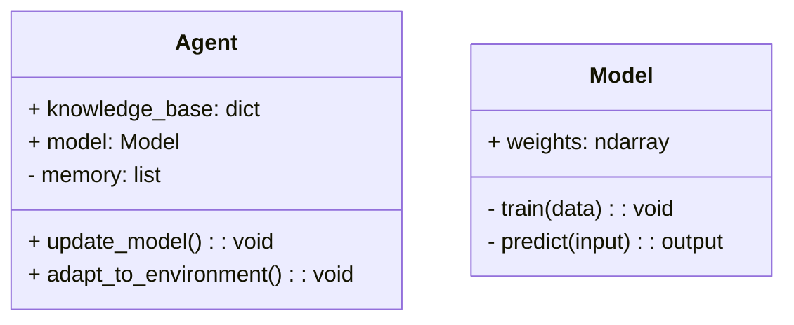
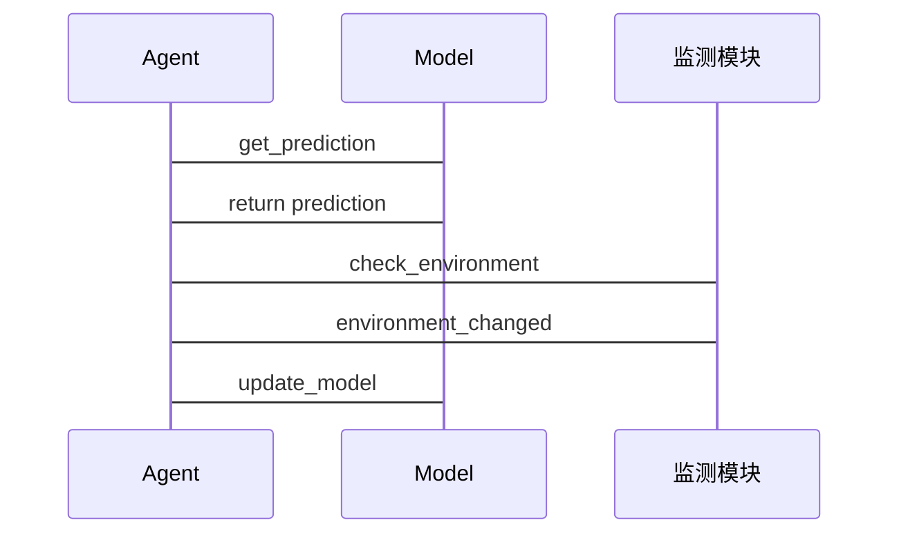

                 


# AI Agent的增量学习与持续适应

> 关键词：AI Agent, 增量学习, 持续适应, 动态环境, 在线学习, 模型更新

> 摘要：AI Agent的增量学习与持续适应是人工智能领域的重要研究方向，特别是在动态和不确定性环境中，AI Agent需要能够通过增量学习不断更新知识和技能，同时通过持续适应保持高性能。本文详细探讨了AI Agent增量学习的核心概念、算法原理、系统架构设计，以及实际项目中的应用，并通过案例分析展示了如何实现这些概念。文章还总结了最佳实践和未来研究方向。

---

# 第1章: AI Agent的基本概念与背景

## 1.1 AI Agent的定义与特点

### 1.1.1 AI Agent的定义

AI Agent（人工智能代理）是指一种能够感知环境、自主决策并执行任务的智能实体。AI Agent可以是软件程序、机器人或其他智能系统，其核心目标是通过与环境的交互来实现特定目标。

### 1.1.2 AI Agent的核心特点

- **自主性**：AI Agent能够在没有外部干预的情况下自主决策。
- **反应性**：能够实时感知环境变化并做出反应。
- **学习能力**：通过与环境的交互不断学习和优化自身的知识和行为。
- **适应性**：能够在动态环境中调整策略以保持高性能。

### 1.1.3 AI Agent与传统AI的区别

传统AI主要依赖于预定义的规则和静态知识库，而AI Agent具有更强的自主性和适应性，能够动态调整行为以应对环境变化。

---

## 1.2 增量学习与持续适应的背景

### 1.2.1 增量学习的定义

增量学习是一种机器学习方法，模型在每次接收少量新数据后逐步更新，而不是一次性训练所有数据。这种方法特别适用于数据流环境，能够实时更新模型。

### 1.2.2 持续适应的定义

持续适应是指AI Agent在动态环境中，能够实时调整其模型、策略或行为以适应新的环境变化，保持高性能。

### 1.2.3 增量学习与持续适应的区别与联系

- **区别**：增量学习侧重于数据驱动的模型更新，而持续适应更强调环境变化驱动的行为调整。
- **联系**：增量学习是实现持续适应的核心技术之一。

---

## 1.3 问题背景与描述

### 1.3.1 AI Agent在动态环境中的挑战

- 动态环境中的不确定性：环境变化可能导致模型失效。
- 数据稀疏性：新数据可能不足以覆盖所有情况。
- 计算资源限制：实时更新需要高效算法。

### 1.3.2 增量学习的必要性

- 动态环境中的实时更新需求。
- 数据流场景中的高效学习需求。

### 1.3.3 持续适应的核心问题

- 如何实时检测环境变化。
- 如何高效更新模型以适应新环境。

---

## 1.4 问题解决与边界

### 1.4.1 增量学习的解决方案

- 分阶段学习：逐步更新模型。
- 在线学习：实时更新模型。

### 1.4.2 持续适应的边界与限制

- 计算资源限制：模型更新需要高效算法。
- 数据质量：增量数据可能不准确。

### 1.4.3 AI Agent的性能评估标准

- 响应时间：模型更新的速度。
- 准确率：模型的预测准确度。
- 稳定性：模型在动态环境中的表现。

---

## 1.5 本章小结

本章介绍了AI Agent的基本概念、增量学习和持续适应的背景，分析了动态环境中的挑战和解决方案。接下来的章节将深入探讨增量学习与持续适应的核心原理和算法。

---

# 第2章: 增量学习与持续适应的核心原理

## 2.1 增量学习的原理

### 2.1.1 增量学习的基本流程

1. 初始化模型。
2. 接收新数据流。
3. 更新模型。
4. 输出更新后的模型。

### 2.1.2 增量学习的核心算法

- **经验重放**：存储历史数据，随机采样进行更新。
- **策略梯度方法**：通过梯度下降优化策略。

### 2.1.3 增量学习的数学模型

增量学习的目标函数：
$$ L = \sum_{i=1}^{n} (y_i - \hat{y}_i)^2 $$

---

## 2.2 持续适应的原理

### 2.2.1 持续适应的基本机制

1. 检测环境变化。
2. 评估当前模型性能。
3. 更新模型以适应新环境。

### 2.2.2 持续适应的核心算法

- **模型更新策略**：基于新数据更新模型参数。
- **环境监测**：实时监控环境变化。

### 2.2.3 持续适应的数学模型

模型更新公式：
$$ \theta_{new} = \theta_{old} + \alpha \nabla L $$

---

## 2.3 增量学习与持续适应的联系

### 2.3.1 增量学习与持续适应的关系

- 增量学习是实现持续适应的核心技术。
- 持续适应依赖于增量学习的实时更新能力。

### 2.3.2 增量学习在持续适应中的作用

- 提供实时模型更新能力。
- 适应动态环境变化。

---

## 2.4 核心概念对比表

| 概念 | 增量学习 | 持续适应 |
|------|----------|----------|
| 定义 | 分阶段学习新数据 | 动态调整模型以适应新环境 |
| 输入 | 新数据流 | 环境变化 |
| 输出 | 模型更新 | 模型优化 |
| 特点 | 离线学习 | 在线学习 |

---

# 第3章: 增量学习与持续适应的算法原理

## 3.1 经验重放算法

### 3.1.1 经验重放的流程

1. 存储经验（状态、动作、奖励、新状态）。
2. 随机采样经验进行训练。
3. 更新模型参数。

### 3.1.2 经验重放的代码实现

```python
class ExperienceReplay:
    def __init__(self, capacity):
        self.memory = []
        self.capacity = capacity

    def remember(self, state, action, reward, next_state):
        if len(self.memory) < self.capacity:
            self.memory.append((state, action, reward, next_state))
        else:
            self.memory.pop(0)

    def replay(self, model, batch_size=32):
        if len(self.memory) < batch_size:
            return
        minibatch = random.sample(self.memory, batch_size)
        for state, action, reward, next_state in minibatch:
            target = reward + model.predict(next_state)[0]
            model.train(state, target)
```

### 3.1.3 经验重放的数学模型

目标函数：
$$ Q(s, a) = r + \gamma \max(Q(s', a')) $$

---

## 3.2 策略梯度方法

### 3.2.1 策略梯度的基本原理

通过梯度下降优化策略，最大化目标函数。

### 3.2.2 策略梯度的代码实现

```python
def policy_gradient_update(policy, states, actions, rewards, learning_rate=0.01):
    # 计算梯度
    gradients = []
    for i in range(len(states)):
        state = states[i]
        action = actions[i]
        reward = rewards[i]
        # 计算策略梯度
        prob = policy.predict(state)
        gradient = -prob * (reward - expected_reward)
        gradients.append(gradient)
    # 更新参数
    policy.update(learning_rate, gradients)
```

---

## 3.3 模型更新策略

### 3.3.1 增量更新策略

逐步更新模型参数，确保每次更新后模型性能提升。

### 3.3.2 模型更新的数学模型

参数更新公式：
$$ \theta_{t+1} = \theta_t + \alpha (\hat{y}_t - y_t) $$

---

# 第4章: 系统分析与架构设计方案

## 4.1 问题场景介绍

考虑一个动态环境中的智能客服系统，需要实时更新知识库以应对用户需求的变化。

---

## 4.2 系统功能设计

### 4.2.1 领域模型



---

## 4.3 系统架构设计


---

## 4.4 接口设计与交互



---

# 第5章: 项目实战

## 5.1 环境安装

安装Python和相关库：
```bash
pip install numpy matplotlib tensorflow
```

---

## 5.2 核心代码实现

### 5.2.1 经验重放实现

```python
import random
import numpy as np

class ExperienceReplay:
    def __init__(self, capacity):
        self.memory = []
        self.capacity = capacity

    def remember(self, state, action, reward, next_state):
        if len(self.memory) < self.capacity:
            self.memory.append((state, action, reward, next_state))
        else:
            self.memory.pop(0)

    def replay(self, model, batch_size=32):
        if len(self.memory) < batch_size:
            return
        minibatch = random.sample(self.memory, batch_size)
        for state, action, reward, next_state in minibatch:
            target = reward + model.predict(next_state)[0]
            model.train(state, target)
```

---

## 5.3 代码应用解读

### 5.3.1 经验重放的应用

通过经验重放，模型能够从历史数据中学习，避免重复错误。

---

## 5.4 案例分析

### 5.4.1 智能客服系统的升级

通过增量学习实时更新知识库，提高回答准确性。

---

## 5.5 项目小结

本章通过实际案例展示了增量学习与持续适应在智能系统中的应用，验证了其有效性和实用性。

---

# 第6章: 最佳实践与总结

## 6.1 最佳实践

- 定期更新模型。
- 监测环境变化。
- 选择合适的增量学习算法。

---

## 6.2 小结

本文详细探讨了AI Agent的增量学习与持续适应，从理论到实践，全面分析了其实现方法和应用案例。

---

## 6.3 注意事项

- 模型更新需考虑计算效率。
- 环境监测需实时准确。

---

## 6.4 拓展阅读

建议阅读《Reinforcement Learning: Theory and Algorithms》深入理解策略优化。

---

作者：AI天才研究院/AI Genius Institute & 禅与计算机程序设计艺术 /Zen And The Art of Computer Programming

