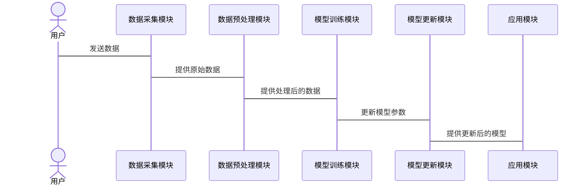

                 


# 第4章: 增量学习的数学模型与公式

## 4.1 增量学习的基本数学模型

### 4.1.1 线性回归的增量学习模型
在线性回归中，增量学习的目标是最小化损失函数。假设损失函数为均方误差，其数学表达式为：
$$
L = \frac{1}{2n}\sum_{i=1}^{n}(y_i - \hat{y}_i)^2
$$
其中，$y_i$是真实值，$\hat{y}_i$是预测值，$n$是数据点的数量。

### 4.1.2 分类问题的增量学习模型
对于分类问题，通常使用逻辑回归或支持向量机。以逻辑回归为例，损失函数为对数损失：
$$
L = -\frac{1}{n}\sum_{i=1}^{n}[y_i \cdot \ln(a_i) + (1-y_i) \cdot \ln(1-a_i)]
$$
其中，$a_i$是预测的概率，$y_i$是标签。

### 4.1.3 聚类问题的增量学习模型
聚类问题中，增量学习通常使用K均值聚类。增量更新的目标是最小化聚类成本：
$$
J = \sum_{i=1}^{k}\sum_{j=1}^{n_i}(x_j - \mu_i)^2
$$
其中，$k$是聚类数，$n_i$是第$i$个聚类中的样本数，$\mu_i$是第$i$个聚类的中心。

## 4.2 增量学习的核心公式推导

### 4.2.1 梯度下降的增量更新公式
在线性回归中，权重的更新公式为：
$$
w_{new} = w_{old} - \eta \cdot \frac{\partial L}{\partial w}
$$
其中，$\eta$是学习率，$\frac{\partial L}{\partial w}$是对损失函数关于权重的偏导。

### 4.2.2 模型权重的更新公式
假设模型为线性模型，权重更新公式为：
$$
w_{t+1} = w_t - \eta (y_t - \hat{y}_t)x_t
$$
其中，$x_t$是输入向量，$y_t$是真实标签，$\hat{y}_t$是预测值。

### 4.2.3 模型损失函数的更新公式
损失函数的更新可以通过保持累积梯度或使用动量方法。累积梯度的更新公式为：
$$
g_t = g_{t-1} + \frac{\partial L}{\partial w}
$$
权重更新公式为：
$$
w_{t+1} = w_t - \eta g_t
$$

## 4.3 增量学习的数学性质

### 4.3.1 增量学习的收敛性
在增量学习中，模型参数会逐渐趋近于最优解。对于凸函数，梯度下降算法保证收敛到全局最小值；对于非凸函数，可能收敛到局部最小值。

### 4.3.2 增量学习的稳定性
增量学习在处理噪声数据时表现出较好的鲁棒性，能够适应数据分布的变化。

### 4.3.3 增量学习的计算效率
由于数据是在线处理的，增量学习通常具有较高的计算效率，适合实时应用。

## 4.4 本章小结

本章详细讲解了增量学习的数学模型与公式，包括线性回归、逻辑回归和聚类的增量学习模型，以及梯度下降的更新公式。通过数学推导，分析了增量学习的收敛性、稳定性和计算效率，为后续章节的算法实现奠定了理论基础。

# 第5章: 增量学习的系统分析与架构设计

## 5.1 系统分析

### 5.1.1 问题场景
假设我们正在开发一个实时推荐系统，用户行为数据不断生成，需要模型能够实时更新，提供准确的推荐。

### 5.1.2 系统功能
系统需要具备数据采集、模型训练、实时预测和性能监控四大功能。

## 5.2 系统架构设计

### 5.2.1 领域模型
使用领域模型描述系统的各个模块，包括数据预处理、模型训练、模型更新和结果输出。

### 5.2.2 系统架构
设计一个分层架构，包括数据层、计算层和应用层。数据层负责数据采集和存储，计算层负责模型训练和更新，应用层负责提供接口和展示结果。

### 5.2.3 交互流程
从数据采集到模型更新，再到结果输出，每个步骤的交互流程如图所示：



## 5.3 接口设计

### 5.3.1 数据接口
定义数据输入和输出接口，包括数据格式和数据流。

### 5.3.2 模型接口
定义模型更新接口，包括参数更新和模型保存。

### 5.3.3 应用接口
定义结果输出接口，包括推荐结果和性能指标。

## 5.4 本章小结

本章通过对系统的分析和架构设计，明确了系统各部分的功能和交互流程，为后续的项目实现提供了清晰的指导。

# 第6章: 增量学习的项目实战

## 6.1 环境安装

### 6.1.1 安装Python
安装Python 3.8及以上版本，确保环境支持增量学习所需的库。

### 6.1.2 安装依赖库
安装NumPy、Pandas、Scikit-learn和TensorFlow等库。

## 6.2 核心代码实现

### 6.2.1 数据预处理
```python
import numpy as np
from sklearn.model_selection import train_test_split
from sklearn.preprocessing import StandardScaler

# 加载数据
data = np.loadtxt('data.csv', delimiter=',')
X = data[:, :-1]
y = data[:, -1]

# 分割数据
X_train, X_test, y_train, y_test = train_test_split(X, y, test_size=0.2)

# 标准化
scaler = StandardScaler()
X_train = scaler.fit_transform(X_train)
X_test = scaler.transform(X_test)
```

### 6.2.2 模型训练
```python
from sklearn.linear_model import SGDClassifier
from sklearn.metrics import accuracy_score

# 初始化模型
model = SGDClassifier(max_iter=1000, learning_rate='constant', eta0=0.01)

# 训练模型
model.fit(X_train, y_train)

# 预测测试集
y_pred = model.predict(X_test)
print("Accuracy:", accuracy_score(y_test, y_pred))
```

### 6.2.3 模型更新
```python
# 在线更新模型
for i in range(X_test.shape[0]):
    model.partial_fit(X_test[i:i+1], y_test[i:i+1])
    print("Iteration:", i, "Accuracy:", accuracy_score(y_test[i:i+1], model.predict(X_test[i:i+1])))
```

## 6.3 代码解读与分析

### 6.3.1 数据预处理
标准化数据，确保模型训练时各特征具有相同的尺度。

### 6.3.2 模型训练
使用随机梯度下降算法训练模型，设置最大迭代次数和学习率。

### 6.3.3 模型更新
在线更新模型，逐个样本处理，逐步优化模型性能。

## 6.4 实际案例分析

### 6.4.1 案例背景
假设我们正在优化一个实时推荐系统，用户点击数据不断生成，需要模型实时更新。

### 6.4.2 数据分析
分析用户点击数据，提取特征并标准化。

### 6.4.3 模型优化
通过增量学习，逐步优化模型，提高推荐准确率。

## 6.5 项目小结

本章通过一个实际案例，详细讲解了增量学习的项目实现过程，包括环境搭建、数据处理、模型训练和在线更新。通过代码实现和案例分析，验证了增量学习的有效性和实用性。

# 第7章: 增量学习的最佳实践

## 7.1 小结

增量学习是一种高效的学习方法，能够在数据流环境下实时更新模型，适用于实时推荐、动态环境预测等场景。

## 7.2 注意事项

- 数据质量：确保数据流的质量，避免噪声干扰。
- 模型选择：根据任务需求选择合适的模型和算法。
- 参数调优：合理设置学习率和正则化参数，防止过拟合或欠拟合。

## 7.3 拓展阅读

- 《Incremental Learning: Theory and Practice》
- 《Online Machine Learning: A Comprehensive Survey》

# 作者

作者：AI天才研究院/AI Genius Institute & 禅与计算机程序设计艺术 /Zen And The Art of Computer Programming

---

**摘要**：本文详细探讨了AI Agent的增量学习方法，分析了其核心概念、算法原理、系统架构及项目实现。通过数学推导和实际案例，展示了增量学习在优化AI Agent性能中的重要性，为实际应用提供了理论支持和实践指导。

---

**全文结束**

