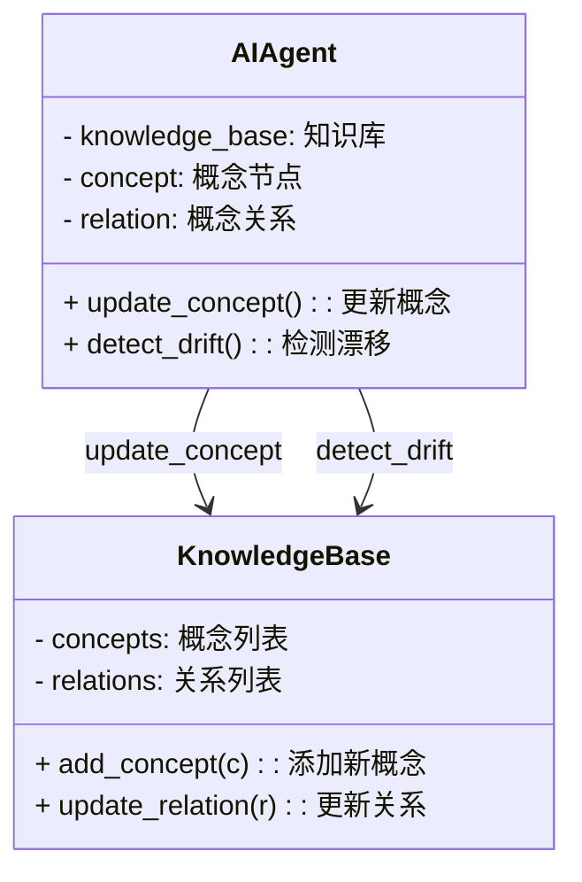

                 


# AI Agent的增量式概念形成与知识重构

> 关键词：AI Agent, 增量式学习, 概念形成, 知识重构, 概念漂移, 动态知识更新

> 摘要：本文探讨AI Agent如何通过增量式方法形成概念并重构知识。首先介绍背景，涵盖问题背景、概念漂移和增量式学习的重要性。接着深入分析核心概念，包括概念形成的原理、属性对比和ER图。然后讲解算法原理，涉及漂移检测、更新策略和数学模型。之后进行系统分析与架构设计，展示系统功能、类图和架构图。最后通过项目实战，提供环境安装、代码实现和案例分析，总结最佳实践。

---

## 第一部分: 背景介绍

### 第1章: 问题背景与概念介绍

#### 1.1 问题背景

AI Agent在动态环境中需要不断更新知识以适应变化。增量式概念形成允许AI Agent逐步构建和更新知识，而非一次性学习，从而提高效率和适应性。概念漂移是动态环境中知识变化的关键挑战，AI Agent必须检测并响应这些变化。

#### 1.2 问题描述

AI Agent在处理复杂任务时，面临知识库更新和概念变化的问题。传统方法依赖静态知识库，无法处理动态变化。增量式概念形成允许AI Agent在运行中更新知识，适应新数据和环境变化。

#### 1.3 解决方法

增量式学习通过逐步更新知识，适应概念漂移。AI Agent采用动态知识更新策略，实时调整知识库，保持对环境变化的敏感性。概念形成与知识重构结合，确保AI Agent在变化中维持高效运作。

#### 1.4 边界与外延

增量式概念形成关注实时更新和概念变化检测，边界包括数据流、概念漂移检测和知识更新频率。外延涉及机器学习、知识图谱和自然语言处理等领域。

#### 1.5 概念结构与核心要素

- **概念节点**：知识的基本单元。
- **概念关系**：概念间的联系。
- **知识库**：存储概念及其关系的结构。
- **更新机制**：检测和响应概念变化的方法。

---

## 第二部分: 核心概念与联系

### 第2章: 核心概念与联系

#### 2.1 增量式概念形成的原理

增量式概念形成通过在线学习逐步构建知识。AI Agent在接收到新数据时，更新现有概念或引入新概念，确保知识库反映当前环境。概念漂移检测算法识别知识变化，触发更新机制。

#### 2.2 概念属性特征对比

表2-1展示了概念形成与知识重构的关键属性对比：

| 属性       | 概念形成                | 知识重构                |
|------------|------------------------|-------------------------|
| 输入        | 新数据点               | 新数据与现有知识         |
| 输出        | 新概念或更新概念       | 优化后的知识结构        |
| 方法        | 分割数据或调整模型     | 重新组织知识结构        |
| 目标        | 建立新概念或更新旧概念  | 提高知识的整体性与连贯性|

#### 2.3 ER实体关系图

ER图展示了AI Agent、概念节点和关系之间的关联：

```mermaid
er
  actor: AI Agent
  concept: 概念节点
  relation: 概念关系
  knowledge_base: 知识库
  actor --> concept: 获取新知识
  concept --> relation: 建立关系
  concept --> knowledge_base: 更新知识库
```

---

## 第三部分: 算法原理与数学模型

### 第3章: 算法原理与数学模型

#### 3.1 增量式学习算法概述

增量式学习算法实时处理数据流，逐步更新模型。核心挑战在于处理概念漂移，保持模型准确性。数学模型涉及概率论和图论，用于概念更新和相似性计算。

#### 3.2 概念漂移检测算法

- **窗口滑动法**：维护滑动窗口，检测数据分布变化。
- **统计显著性检验**：使用统计测试检测数据分布差异。
- **基于聚类的概念漂移检测**：通过聚类变化识别概念漂移。

#### 3.3 数学公式与模型

- 概念更新的概率模型：
  $$ P(c|e) = \frac{P(e|c)P(c)}{P(e)} $$
  
- 基于图的相似性计算：
  $$ sim(c1, c2) = \frac{w(c1,c2)}{\sqrt{w(c1,c1)w(c2,c2)}} $$

---

## 第四部分: 系统分析与架构设计

### 第4章: 系统分析与架构设计

#### 4.1 问题场景与系统目标

AI Agent在动态环境中需要实时更新知识，确保准确性和高效性。系统目标包括知识表示、更新机制和推理引擎设计。

#### 4.2 系统功能设计

- **知识表示**：使用图结构表示概念及其关系。
- **更新机制**：检测概念漂移，触发知识更新。
- **推理引擎**：基于更新的知识进行推理和决策。

#### 4.3 领域模型与架构图

领域模型展示了系统功能模块及其交互：



---

## 第五部分: 项目实战

### 第5章: 项目实战

#### 5.1 环境安装

安装Python和以下库：
- `numpy`
- `scikit-learn`
- `networkx`
- `mermaid`

#### 5.2 核心代码实现

```python
import numpy as np
from sklearn.cluster import KMeans
from sklearn.metrics import pairwise_distances

def detect_drift(data, model):
    # 计算数据分布变化
    current_dist = model.predict(data)
    previous_dist = model.predict(previous_data)
    drift = np.sum(current_dist != previous_dist) / len(data)
    return drift > 0.1

def update_concept(new_data, knowledge_base):
    # 更新概念
    concepts = knowledge_base['concepts']
    relations = knowledge_base['relations']
    # 添加新概念
    concepts.append(new_concept)
    # 更新关系
    relations.append(new_relation)
```

#### 5.3 案例分析与代码解读

案例：假设AI Agent处理社交媒体数据，检测用户兴趣变化。当用户行为模式变化超过阈值，系统更新知识库中的兴趣节点和关系。

---

## 第六部分: 最佳实践与总结

### 第6章: 最佳实践

#### 6.1 小结

增量式概念形成与知识重构是AI Agent适应动态环境的关键。通过实时更新知识，AI Agent能有效应对概念漂移，保持高效运作。

#### 6.2 注意事项

- 定期检测概念漂移，避免模型过时。
- 设计高效的更新机制，减少计算开销。
- 结合领域知识，优化概念形成过程。

#### 6.3 拓展阅读

建议阅读相关领域的最新研究，关注增量式学习和动态知识图谱的进展。

---

作者：AI天才研究院 & 禅与计算机程序设计艺术

