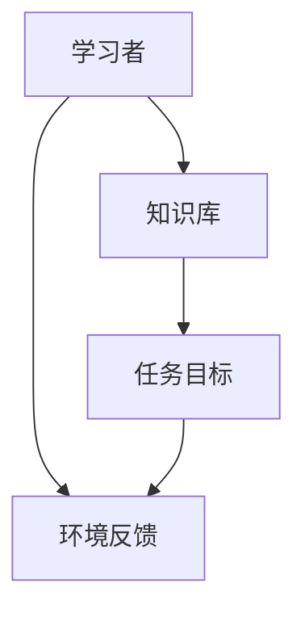
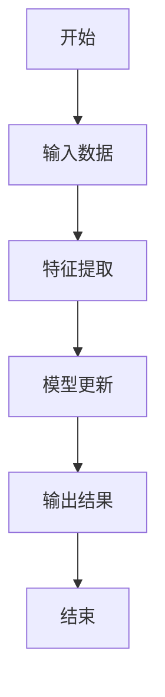
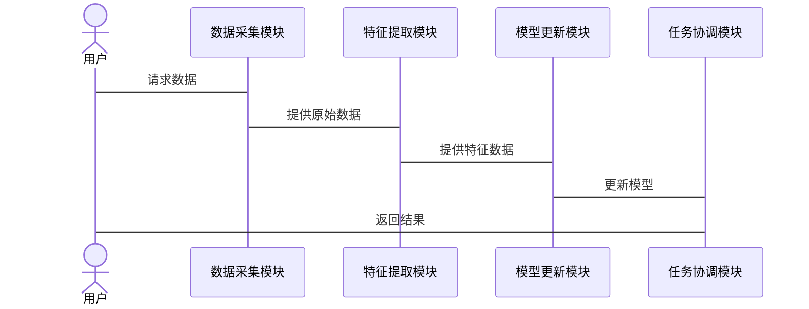

                 


# AI Agent的增量式终身学习框架

**关键词**：AI Agent、增量式学习、终身学习、机器学习、深度学习

**摘要**：本文详细探讨了AI Agent的增量式终身学习框架，从背景、核心概念、算法原理、系统架构到项目实战，全面分析了增量式终身学习的实现方法与应用场景。通过具体案例分析和代码实现，展示了如何构建一个能够持续学习和适应动态环境的AI Agent系统。

---

## 第一部分: AI Agent的增量式终身学习框架概述

### 第1章: AI Agent与终身学习概述

#### 1.1 AI Agent的基本概念
##### 1.1.1 AI Agent的定义与分类
AI Agent（智能体）是指能够感知环境、自主决策并采取行动的实体。AI Agent可以分为简单反射型Agent、基于模型的反射型Agent、目标驱动型Agent和效用驱动型Agent。增量式学习是AI Agent在动态环境中持续优化自身行为的核心能力。

##### 1.1.2 终身学习的基本概念
终身学习（Lifelong Learning）是一种机器学习范式，旨在使模型能够持续学习新任务，同时保持对之前任务的良好性能。增量式学习是终身学习的重要组成部分，强调在新数据流不断输入的情况下，逐步优化模型。

##### 1.1.3 增量式学习的核心思想
增量式学习的核心思想是通过不断接收新的数据样本或任务，逐步更新模型参数，以适应环境的变化。与一次性学习相比，增量式学习具有实时性、连续性和动态性特点。

#### 1.2 AI Agent的增量式学习背景
##### 1.2.1 传统机器学习的局限性
传统机器学习方法通常基于静态数据集，无法适应动态变化的环境。增量式学习弥补了这一不足，使AI Agent能够在实时环境中持续进化。

##### 1.2.2 动态环境下的学习需求
在现实场景中，环境通常是动态变化的，新的任务和数据不断出现。AI Agent需要具备持续学习的能力，才能在复杂环境中保持高效运作。

##### 1.2.3 终身学习的必要性
终身学习是AI Agent在实际应用中的必然要求。通过不断学习新知识，AI Agent能够更好地适应用户需求和环境变化，提升用户体验和系统性能。

#### 1.3 增量式终身学习的框架目标
##### 1.3.1 实时更新与适应性
增量式学习的目标是实现实时更新，使AI Agent能够在新数据输入时快速调整模型。

##### 1.3.2 知识的持续积累与优化
通过增量式学习，AI Agent能够不断积累新知识，并对已有知识进行优化，提升整体性能。

##### 1.3.3 多任务学习的兼容性
增量式学习框架应支持多任务学习，使AI Agent能够同时处理多个任务，并在任务之间共享知识。

#### 1.4 本章小结
本章介绍了AI Agent和终身学习的基本概念，分析了增量式学习的背景和必要性，并提出了增量式终身学习的框架目标。

---

### 第2章: 增量式终身学习的核心概念与联系

#### 2.1 核心概念原理
##### 2.1.1 知识表示与更新机制
知识表示是增量式学习的关键。通过将新知识与已有知识进行融合，模型能够逐步优化。更新机制通常包括参数更新和模型结构更新两种方式。

##### 2.1.2 经验回放与策略优化
经验回放（Experience Replay）是一种常用的技术，通过存储过去的经验，使模型能够从历史数据中学习。策略优化则通过不断调整策略参数，使模型在新任务中表现更优。

##### 2.1.3 模型的可解释性与稳定性
可解释性是增量式学习的重要特性，能够帮助用户理解模型的决策过程。稳定性则是指模型在连续更新过程中保持性能一致的能力。

#### 2.2 核心概念属性对比表
| 概念       | 增量式学习         | 一次性学习         |
|------------|--------------------|--------------------|
| 数据输入    | 流式数据           | 静态数据集         |
| 更新方式    | 实时更新           | 一次性训练         |
| 适应性      | 高                | 低                |
| 知识积累    | 是                | 否                |

#### 2.3 ER实体关系图


#### 2.4 本章小结
本章详细阐述了增量式终身学习的核心概念，包括知识表示、经验回放和策略优化，并通过对比表和ER图进一步明确了相关概念之间的联系。

---

### 第3章: 增量式终身学习的算法原理

#### 3.1 算法流程图


#### 3.2 算法实现代码
```python
def incremental_learning_model():
    # 初始化模型
    model = initialize_model()
    while True:
        # 获取新数据
        new_data = get_new_data()
        # 特征提取
        features = extract_features(new_data)
        # 模型更新
        model.update(features)
        # 输出结果
        output = model.predict(features)
        print(output)
```

#### 3.3 数学模型与公式
##### 3.3.1 损失函数
$$ L = \sum_{i=1}^{n} (y_i - \hat{y}_i)^2 $$

##### 3.3.2 更新规则
$$ \theta_{new} = \theta_{old} - \eta \cdot \frac{\partial L}{\partial \theta} $$

#### 3.4 本章小结
本章通过流程图和代码示例，详细讲解了增量式终身学习的算法实现，并通过数学公式分析了模型更新的原理。

---

### 第4章: 系统架构与设计方案

#### 4.1 问题场景介绍
##### 4.1.1 动态环境下的任务需求
在动态环境中，AI Agent需要能够实时感知变化并快速调整策略。

##### 4.1.2 多任务学习的场景分析
多任务学习场景中，AI Agent需要同时处理多个任务，并在任务之间共享知识。

##### 4.1.3 系统的实时性要求
系统需要具备高实时性，能够在新数据输入时快速响应。

#### 4.2 系统功能
##### 4.2.1 数据采集与预处理
系统需要实时采集数据，并进行特征提取和数据清洗。

##### 4.2.2 模型更新与优化
基于增量式学习算法，系统能够实时更新模型参数，提升性能。

##### 4.2.3 任务分配与协调
系统能够根据环境变化动态分配任务，并协调多个任务之间的执行顺序。

#### 4.3 系统架构设计
##### 4.3.1 系统组件
- 数据采集模块
- 特征提取模块
- 模型更新模块
- 任务协调模块

##### 4.3.2 系统交互流程


#### 4.4 本章小结
本章详细分析了AI Agent增量式终身学习系统的架构设计，包括系统组件和交互流程。

---

## 第二部分: 项目实战

### 第5章: 增量式终身学习框架的实现

#### 5.1 项目介绍
##### 5.1.1 项目背景
本文将通过智能家居环境下的增量式学习框架实现，展示如何构建一个能够持续学习和适应环境变化的AI Agent系统。

##### 5.1.2 项目目标
本项目旨在实现一个增量式终身学习框架，使其能够在动态环境下实时更新模型，提升性能。

#### 5.2 系统核心实现
##### 5.2.1 环境安装
```bash
pip install numpy scikit-learn tensorflow
```

##### 5.2.2 核心代码实现
```python
class IncrementalLearningAgent:
    def __init__(self):
        self.model = self._build_model()
        self.data_buffer = []

    def _build_model(self):
        # 模型构建代码
        pass

    def update(self, new_data):
        # 数据预处理
        features = self._extract_features(new_data)
        # 模型更新
        self.model.fit(features, labels)
        self.data_buffer.append(new_data)

    def predict(self, input_data):
        # 预测结果
        return self.model.predict(input_data)
```

##### 5.2.3 代码应用解读
通过对上述代码的分析，可以看到增量式学习框架的核心在于模型的实时更新和数据的持续积累。

#### 5.3 案例分析
##### 5.3.1 数据预处理
在智能家居场景中，需要将传感器数据和用户行为数据进行融合，提取有用的特征。

##### 5.3.2 模型优化
通过不断更新模型参数，提升分类准确率和响应速度。

#### 5.4 本章小结
本章通过具体案例分析，展示了增量式终身学习框架的实现过程，包括环境安装、代码实现和模型优化。

---

## 第三部分: 总结与展望

### 第6章: 总结与展望

#### 6.1 总结
本文详细探讨了AI Agent的增量式终身学习框架，从背景、核心概念、算法原理到系统架构和项目实战，全面分析了增量式终身学习的实现方法与应用场景。

#### 6.2 未来展望
未来的研究方向包括更高效的增量式学习算法、多任务学习的优化以及模型压缩与部署优化。

---

## 注意事项
1. **数据质量**：增量式学习对数据质量要求较高，需注意数据清洗和特征工程。
2. **模型稳定性**：在实时更新过程中，需确保模型的稳定性和一致性。
3. **资源限制**：在资源受限的环境中，需优化模型更新的效率。

---

## 最佳实践 Tips
1. **持续学习**：定期更新模型，保持其适应性。
2. **数据多样性**：引入多样化的数据，提升模型的泛化能力。
3. **模型评估**：定期评估模型性能，及时调整参数。

---

## 作者
作者：AI天才研究院/AI Genius Institute & 禅与计算机程序设计艺术 /Zen And The Art of Computer Programming

