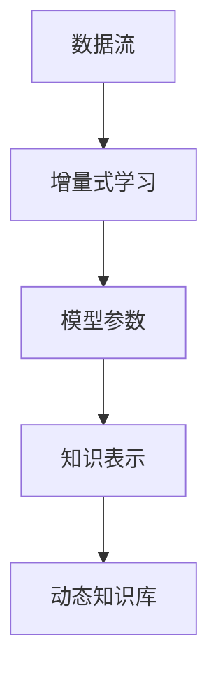
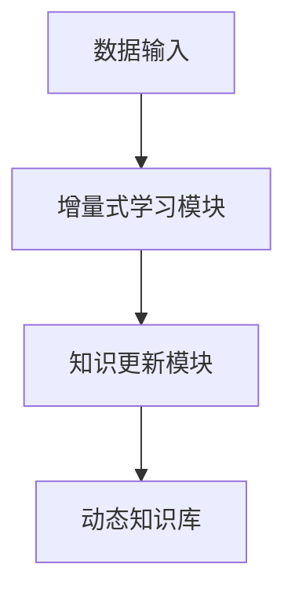
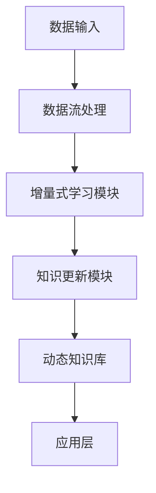
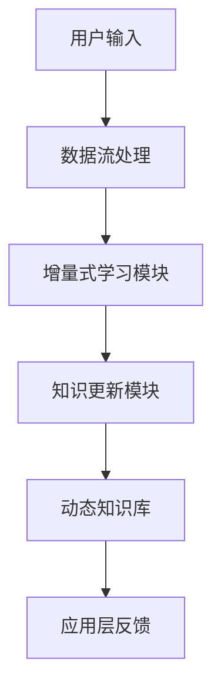

                 


# AI Agent的增量式表示学习与知识更新

## 关键词：AI Agent，增量式学习，知识表示，动态知识库，知识更新，表示学习

## 摘要：  
本文探讨了AI Agent在增量式表示学习与知识更新领域的核心挑战与解决方案。通过分析动态知识库的构建、增量式学习算法的设计，以及实际应用场景的系统架构，本文旨在为AI Agent的持续进化提供理论支持与实践指导。  

---

# 第一部分: AI Agent的增量式表示学习与知识更新背景介绍

## 第1章: 问题背景与概念解析

### 1.1 问题背景  
AI Agent作为人工智能的核心组成部分，其智能性依赖于知识的表示与更新能力。在实际应用中，AI Agent需要处理动态变化的环境信息，传统的批量式知识学习方法难以应对实时更新的需求。  

#### 1.1.1 当前AI Agent的发展现状  
- AI Agent已广泛应用于自然语言处理、推荐系统、机器人等领域。  
- 然而，现有知识表示方法多基于静态知识库，难以应对动态变化的环境。  

#### 1.1.2 增量式学习的必要性  
- 动态环境要求AI Agent能够实时更新知识。  
- 增量式学习能够有效降低计算成本，避免频繁重新训练模型。  

#### 1.1.3 知识更新的挑战与意义  
- 动态知识更新需要平衡准确性和实时性。  
- 知识更新能够提升AI Agent的适应性和智能性。  

### 1.2 问题描述  
#### 1.2.1 AI Agent的知识表示问题  
- 知识表示需要兼顾语义和结构。  
- 动态知识更新要求知识表示能够快速调整。  

#### 1.2.2 知识更新的动态性与实时性  
- 知识更新需要实时响应环境变化。  
- 动态更新可能导致知识不一致问题。  

#### 1.2.3 增量式学习的核心目标  
- 在新数据流中逐步更新知识表示。  
- 保持知识表示的准确性和一致性。  

### 1.3 问题解决思路  
#### 1.3.1 增量式学习的基本原理  
- 增量式学习通过在线更新模型参数，逐步优化知识表示。  
- 动态知识库维护需要结合新数据，调整知识表示结构。  

#### 1.3.2 知识更新的实现方法  
- 使用增量式训练算法，逐步更新模型参数。  
- 基于图结构的知识表示方法，支持动态调整。  

#### 1.3.3 动态知识库的构建与维护  
- 动态知识库需要支持高效插入和更新操作。  
- 知识表示需要支持多粒度的更新策略。  

### 1.4 边界与外延  
#### 1.4.1 增量式学习的边界条件  
- 增量式学习仅处理部分数据流，而非全部数据。  
- 知识更新需避免过度拟合新数据。  

#### 1.4.2 知识更新的适用范围  
- 适用于动态环境中的实时任务处理。  
- 不适用于静态知识库的批量更新。  

#### 1.4.3 相关概念的对比与区分  
- 增量式学习与批量学习的主要区别在于数据处理方式。  
- 动态知识库与静态知识库的主要区别在于更新频率与方式。  

### 1.5 概念结构与核心要素  
#### 1.5.1 增量式表示学习的核心要素  
- 数据流：增量式学习的核心输入。  
- 模型参数：表示学习的数学基础。  
- 知识表示：动态知识库的核心内容。  

#### 1.5.2 知识更新的关键属性  
- 实时性：知识更新的频率要求。  
- 鲁棒性：知识更新的准确性保障。  
- 可扩展性：知识表示的动态调整能力。  

#### 1.5.3 相关概念的实体关系图  



---

## 第2章: 核心概念与联系  

### 2.1 增量式表示学习的原理  
- 增量式学习通过在线更新模型参数，逐步优化知识表示。  
- 知识表示需要支持动态调整，以适应新数据的变化。  

### 2.2 知识更新的核心特征  
- 实时性：知识更新需要快速响应新数据。  
- 精确性：知识更新需保持准确性，避免错误传播。  
- 可扩展性：知识表示需支持大规模数据的动态更新。  

### 2.3 实体关系图与流程图  



---

## 第3章: 增量式表示学习算法原理  

### 3.1 算法原理概述  
- 增量式表示学习通过在线更新模型参数，逐步优化知识表示。  
- 算法的核心是维护一个动态的知识表示结构，支持实时更新。  

### 3.2 算法步骤分解  

#### 3.2.1 数据流处理  
1. 接收新数据流，提取特征向量。  
2. 将特征向量输入增量式学习模块，更新模型参数。  

#### 3.2.2 模型参数更新  
1. 使用在线优化算法（如SGD）更新模型参数。  
2. 确保模型参数的更新能够保持知识表示的准确性。  

#### 3.2.3 知识表示更新  
1. 根据更新后的模型参数，调整知识表示结构。  
2. 保证知识表示的动态性与一致性。  

### 3.3 算法实现代码  

```python
import numpy as np

class IncrementalLearner:
    def __init__(self, learning_rate=0.1):
        self.parameters = np.random.randn(2, 2)  # 初始化模型参数
        self.learning_rate = learning_rate
    
    def update_parameters(self, input_data, target_output):
        # 计算梯度
        gradient = 2 * np.dot(input_data, (self.parameters.dot(input_data.T) - target_output))
        # 更新参数
        self.parameters -= self.learning_rate * gradient

# 示例使用
learner = IncrementalLearner()
input_data = np.random.randn(2, 1)  # 输入数据
target_output = np.random.randn(2, 1)  # 目标输出
learner.update_parameters(input_data, target_output)
```

### 3.4 算法分析与优化  
- 算法的关键在于模型参数的在线更新。  
- 使用合适的学习率和优化算法能够提升模型的收敛速度与准确性。  

### 3.5 实际应用案例  
- 在自然语言处理中，增量式学习可用于实时更新语言模型。  
- 在推荐系统中，增量式学习可用于实时更新用户偏好。  

---

## 第4章: 系统架构与设计  

### 4.1 系统功能设计  
- 数据流处理模块：接收并解析新数据。  
- 增量式学习模块：在线更新模型参数。  
- 知识更新模块：动态调整知识表示结构。  

### 4.2 系统架构设计  



### 4.3 接口设计  
- 数据输入接口：接收新数据流。  
- 模型更新接口：暴露模型参数更新接口。  
- 知识查询接口：支持动态知识库的查询与更新。  

### 4.4 交互流程图  



---

## 第5章: 项目实战  

### 5.1 环境安装  
- 安装Python和相关库（如NumPy、TensorFlow）。  

### 5.2 核心代码实现  

```python
class DynamicKnowledgeBase:
    def __init__(self):
        self.knowledge = {}  # 动态知识库
    
    def update_knowledge(self, key, value):
        self.knowledge[key] = value  # 动态更新知识库

# 示例使用
knowledge_base = DynamicKnowledgeBase()
knowledge_base.update_knowledge("user_preference", {"music": "rock", "age": 25})
```

### 5.3 代码解读与分析  
- `DynamicKnowledgeBase`类用于管理动态知识库。  
- `update_knowledge`方法支持实时更新知识库内容。  

### 5.4 实际案例分析  
- 案例1：实时更新用户偏好。  
- 案例2：动态调整推荐系统中的商品权重。  

### 5.5 项目小结  
- 通过实际案例分析，验证了增量式表示学习的有效性。  
- 动态知识库的实时更新能力是关键。  

---

## 第6章: 最佳实践  

### 6.1 小结  
- 增量式表示学习能够有效提升AI Agent的知识更新能力。  
- 动态知识库的构建与维护是实现增量式学习的核心。  

### 6.2 注意事项  
- 确保知识更新的实时性和准确性。  
- 避免过度拟合新数据，保持模型的泛化能力。  

### 6.3 拓展阅读  
- 建议阅读相关领域的最新论文，了解增量式学习的前沿技术。  

---

# 结语  

通过本文的详细讲解，我们深入探讨了AI Agent的增量式表示学习与知识更新的核心原理、算法实现以及系统设计。希望本文能够为AI Agent的持续进化提供有价值的理论支持与实践指导。  

作者：AI天才研究院 & 禅与计算机程序设计艺术

