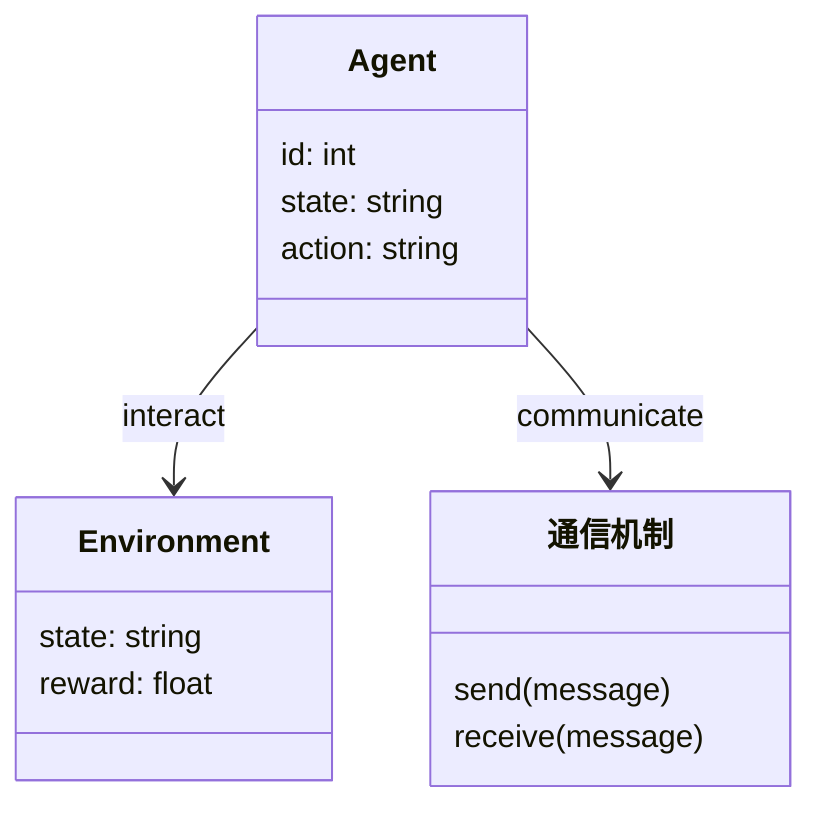
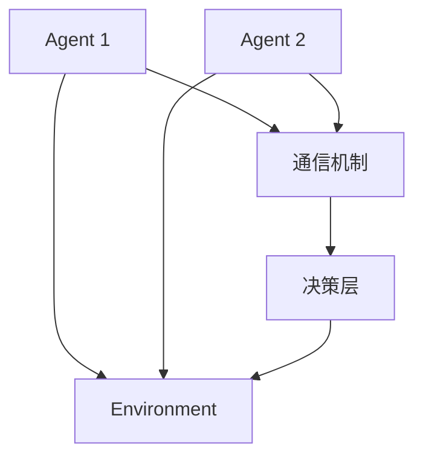

                 


# AI Agent的多Agent协作与竞争学习系统

> **关键词**：AI Agent, 多Agent系统, 协作学习, 竞争学习, 多智能体强化学习, 纳什均衡

> **摘要**：本文详细探讨了AI Agent在多Agent协作与竞争学习系统中的应用。首先介绍了AI Agent的基本概念和多Agent系统的架构，接着深入分析了协作与竞争学习的核心算法，包括多智能体强化学习和纳什均衡。随后，通过实际案例分析了系统的应用场景，并提供了详细的系统设计与实现方案。最后，总结了当前研究的成果与未来的发展方向。

---

# 第1章: AI Agent与多Agent系统基础

## 1.1 AI Agent的基本概念

### 1.1.1 什么是AI Agent
AI Agent（人工智能代理）是一种能够感知环境、自主决策并采取行动的智能实体。它可以是一个软件程序，也可以是物理设备，其核心目标是通过与环境的交互实现特定任务。AI Agent通常具备以下特征：
- **自主性**：能够在没有外部干预的情况下运行。
- **反应性**：能够根据环境反馈实时调整行为。
- **目标导向性**：以目标为导向，优化决策过程。

### 1.1.2 AI Agent的特点与分类
AI Agent可以根据智能水平、行为方式和应用场景进行分类：
- **基于规则的Agent**：通过预定义的规则进行决策。
- **基于模型的Agent**：使用状态表示和推理机制进行决策。
- **强化学习Agent**：通过与环境的交互，基于奖励机制优化行为策略。

### 1.1.3 多Agent系统的基本概念
多Agent系统是由多个AI Agent组成的分布式系统，这些Agent可以协作或竞争以完成复杂的任务。多Agent系统的核心在于Agent之间的通信与协调，以及系统整体的优化。

---

## 1.2 多Agent协作与竞争的基本原理

### 1.2.1 协作与竞争的定义
- **协作**：多个Agent为了共同目标而合作，最大化整体收益。
- **竞争**：多个Agent为了有限资源而竞争，最大化自身收益。

### 1.2.2 多Agent协作与竞争的场景
- **协作场景**：如智能交通系统中，多个Agent协调以优化交通流量。
- **竞争场景**：如游戏中，多个Agent竞争资源或目标。

### 1.2.3 协作与竞争的边界与外延
- 协作和竞争并非完全对立，而是可以在一定程度上相互转换。例如，适度的竞争可以促进协作效率的提高。

---

## 1.3 多Agent协作与竞争学习系统的核心要素

### 1.3.1 系统架构
- **分层架构**：将系统分为决策层、执行层和感知层。
- **分布式架构**：Agent之间通过通信机制协作或竞争。
- **混合架构**：结合分层和分布式架构，兼顾全局和局部优化。

### 1.3.2 Agent之间的通信机制
- **通信协议**：定义Agent之间的信息交换规则。
- **信息传递方式**：包括直接通信和间接通信。
- **通信模型**：如广播模型、点对点模型。

### 1.3.3 学习机制
- **协作学习**：通过共享信息优化整体策略。
- **竞争学习**：通过竞争优化个体策略。
- **综合学习**：结合协作与竞争，动态调整策略。

---

## 1.4 本章小结
本章介绍了AI Agent的基本概念、多Agent系统的架构以及协作与竞争的基本原理。通过分析协作与竞争的定义、场景和边界，为后续章节的算法和系统设计奠定了基础。

---

# 第2章: 多Agent协作与竞争的系统架构

## 2.1 多Agent协作与竞争的系统架构

### 2.1.1 分层架构
分层架构将系统分为多个层次，每个层次负责不同的功能：
- **决策层**：制定全局策略。
- **执行层**：具体执行任务。
- **感知层**：收集环境信息。

### 2.1.2 分布式架构
分布式架构强调Agent之间的平等协作，通过通信机制实现信息共享。

### 2.1.3 混合架构
混合架构结合分层和分布式架构，适用于复杂任务。

---

## 2.2 Agent之间的通信机制

### 2.2.1 通信协议
通信协议定义了Agent之间的信息交换规则，常见的协议包括HTTP、WebSocket等。

### 2.2.2 信息传递方式
- **直接通信**：Agent之间直接交换信息。
- **间接通信**：通过中间媒介传递信息。

### 2.2.3 通信模型
- **广播模型**：所有Agent接收相同信息。
- **点对点模型**：特定Agent之间通信。

---

## 2.3 学习机制

### 2.3.1 协作学习
协作学习通过共享信息优化整体策略，常见的协作学习算法包括多智能体Q-learning。

### 2.3.2 竞争学习
竞争学习通过竞争优化个体策略，常见的竞争学习算法包括纳什均衡。

### 2.3.3 综合学习
综合学习动态调整协作与竞争策略，以适应复杂环境。

---

## 2.4 本章小结
本章详细介绍了多Agent协作与竞争的系统架构，包括分层架构、分布式架构和混合架构，并分析了Agent之间的通信机制和学习机制。

---

# 第3章: 多Agent协作学习算法

## 3.1 多智能体强化学习（MARL）

### 3.1.1 MARL的基本概念
多智能体强化学习（Multi-Agent Reinforcement Learning, MARL）是研究多个智能体协作学习的领域，目标是通过协作最大化整体奖励。

### 3.1.2 多智能体Q-learning算法
多智能体Q-learning算法通过多个智能体协作更新Q值表，实现全局优化。

### 3.1.3 多智能体策略梯度算法
多智能体策略梯度算法通过优化策略参数，实现协作学习。

---

## 3.2 协作学习的数学模型

### 3.2.1 Q-learning公式
$$ Q(s, a) = Q(s, a) + \alpha (r + \max Q(s', a') - Q(s, a)) $$

### 3.2.2 策略梯度公式
$$ \nabla \theta \log \pi(a|s) \cdot Q(s, a) $$

### 3.2.3 协作学习的收敛性分析
通过数学推导，分析多智能体协作学习的收敛性。

---

## 3.3 本章小结
本章介绍了多智能体强化学习（MARL）的基本概念和算法，包括Q-learning和策略梯度算法，并分析了协作学习的数学模型。

---

# 第4章: 多Agent竞争学习算法

## 4.1 竞争学习的基本概念

### 4.1.1 竞争学习的定义
竞争学习是多个智能体为了有限资源而竞争的过程，目标是通过竞争优化个体策略。

### 4.1.2 竞争学习的场景
竞争学习常见于游戏、资源分配等领域。

### 4.1.3 竞争学习的优缺点
竞争学习可以提高个体能力，但可能导致系统不稳定。

---

## 4.2 竞争学习的数学模型

### 4.2.1 纳什均衡
纳什均衡是竞争学习中的一个关键概念，表示系统达到稳定状态的条件。

### 4.2.2 囚徒困境
囚徒困境是竞争学习中的一个典型场景，分析了个体理性与集体理性的冲突。

### 4.2.3 竞争学习的数学公式
$$ \text{纳什均衡条件}：\forall i, u_i(a_i, a_{-i}) \geq u_i(a'_i, a_{-i}) $$

---

## 4.3 本章小结
本章介绍了竞争学习的基本概念和数学模型，包括纳什均衡和囚徒困境，并分析了竞争学习的优缺点。

---

# 第5章: 多Agent协作与竞争学习系统的系统分析与架构设计

## 5.1 问题场景介绍

### 5.1.1 协作场景分析
以智能交通系统为例，分析多Agent协作的场景。

### 5.1.2 竞争场景分析
以游戏AI为例，分析多Agent竞争的场景。

---

## 5.2 系统功能设计

### 5.2.1 领域模型设计
使用Mermaid绘制领域模型类图，展示系统功能模块之间的关系。



---

## 5.3 系统架构设计

### 5.3.1 架构设计
使用Mermaid绘制系统架构图，展示系统的主要组件及其关系。



---

## 5.4 本章小结
本章通过实际案例分析了多Agent协作与竞争学习系统的应用场景，并设计了系统的功能模块和架构。

---

# 第6章: 项目实战

## 6.1 环境安装

### 6.1.1 安装依赖
安装必要的Python库，如TensorFlow、PyTorch等。

## 6.2 系统核心实现

### 6.2.1 协作学习实现
实现多智能体Q-learning算法，代码如下：

```python
import numpy as np

class Agent:
    def __init__(self, state_space, action_space):
        self.state_space = state_space
        self.action_space = action_space
        self.Q = np.zeros((state_space, action_space))

    def act(self, state):
        return np.argmax(self.Q[state])

    def update(self, state, action, reward, next_state):
        self.Q[state, action] += reward

# 多智能体协作学习
agents = [Agent(state_space, action_space) for _ in range(num_agents)]
while True:
    state = environment.get_state()
    actions = [agent.act(state) for agent in agents]
    rewards = environment.get_reward(actions)
    for i in range(num_agents):
        agent.update(state, actions[i], rewards[i], next_state)
```

### 6.2.2 竞争学习实现
实现纳什均衡算法，代码如下：

```python
def nash_equilibrium(Q):
    for i in range(num_agents):
        for j in range(num_agents):
            if Q[i][j] < Q[i][i]:
                Q[i][j] = Q[i][i]
    return Q

Q = np.array([[0.3, 0.2], [0.2, 0.3]])
Q = nash_equilibrium(Q)
print(Q)
```

---

## 6.3 实际案例分析

### 6.3.1 智能交通系统
分析多Agent协作学习在智能交通系统中的应用，展示系统的实际效果。

### 6.3.2 游戏AI
分析多Agent竞争学习在游戏AI中的应用，展示系统的实际效果。

---

## 6.4 本章小结
本章通过实际项目展示了多Agent协作与竞争学习系统的实现，包括环境安装、核心算法实现和实际案例分析。

---

# 第7章: 总结与展望

## 7.1 总结
总结全文的主要内容，强调多Agent协作与竞争学习系统的重要性。

## 7.2 未来展望
展望未来的研究方向，包括更复杂的协作与竞争场景、更高效的算法设计等。

---

## 7.3 最佳实践 tips

### 7.3.1 系统设计注意事项
- 确保Agent之间的通信机制高效可靠。
- 合理设计协作与竞争的平衡点。

### 7.3.2 拓展阅读
推荐相关领域的书籍和论文，供读者深入学习。

---

# 作者：AI天才研究院/AI Genius Institute & 禅与计算机程序设计艺术 /Zen And The Art of Computer Programming

---

**本文版权归作者所有，转载请注明出处！**

