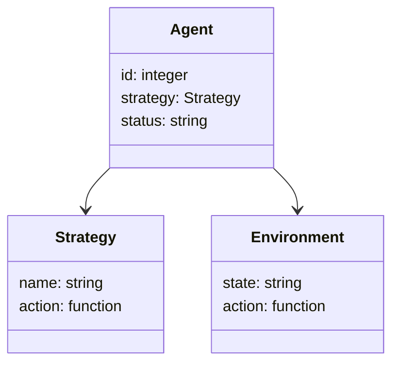

                 


# AI Agent的多Agent博弈：策略学习与优化

## 关键词：
- AI Agent
- 多Agent博弈
- 策略学习
- 策略优化
- 纳什均衡
- 强化学习

## 摘要：
本文系统探讨了AI Agent在多Agent博弈中的策略学习与优化问题。通过分析多Agent博弈的核心概念、算法原理、数学模型、系统架构以及实际应用案例，深入剖析了多Agent博弈中的策略优化方法，并提供了详细的实现步骤和代码示例。文章最后总结了多Agent博弈研究的重要意义和未来发展方向。

---

## 第1章: AI Agent的概述

### 1.1 AI Agent的基本概念

#### 1.1.1 什么是AI Agent
AI Agent（人工智能代理）是指在计算机系统中，能够感知环境并采取行动以实现目标的实体。Agent可以是软件程序、机器人或其他智能系统，具备自主性、反应性、目标导向性和社交能力等特征。

#### 1.1.2 AI Agent的特征与分类
AI Agent的特征包括：
- **自主性**：能够在没有外部干预的情况下独立运作。
- **反应性**：能够感知环境并实时调整行为。
- **目标导向性**：以实现特定目标为导向。
- **社交能力**：能够与其他Agent或人类进行交互和协作。

AI Agent的分类：
- **简单反射Agent**：基于当前感知做出反应。
- **基于模型的反射Agent**：利用内部模型和知识进行决策。
- **目标导向Agent**：根据目标选择最优行动。
- **效用导向Agent**：通过最大化效用函数来优化决策。

#### 1.1.3 AI Agent的应用场景
AI Agent广泛应用于以下领域：
- 智能助手（如Siri、Alexa）
- 自动驾驶系统
- 游戏AI
- 智能客服
- 智慧城市中的交通管理

---

### 1.2 多Agent系统的基本概念

#### 1.2.1 多Agent系统的定义
多Agent系统（Multi-Agent System, MAS）是由多个相互作用的Agent组成的系统，这些Agent通过通信和协作完成复杂的任务。多Agent系统具有分布性、协作性和动态性等特点。

#### 1.2.2 多Agent系统的特点
- **分布性**：多个Agent独立运行，共同完成任务。
- **协作性**：Agent之间通过协作提高整体性能。
- **动态性**：环境和Agent的状态不断变化。
- **复杂性**：多个Agent的交互可能导致复杂的行为。

#### 1.2.3 多Agent系统的优势
- **任务分解**：将复杂任务分解为多个子任务，由不同Agent完成。
- **容错性**：单个Agent故障不会导致整个系统崩溃。
- **适应性**：多个Agent能够灵活调整以适应环境变化。

---

### 1.3 多Agent博弈的背景与意义

#### 1.3.1 博弈论与多Agent系统的关系
博弈论研究多个主体在竞争或合作环境中的决策行为。多Agent系统可以看作是博弈论的一种实现形式，其中每个Agent都是一个参与者。

#### 1.3.2 多Agent博弈的应用领域
- **游戏AI**：如多人在线游戏中的智能NPC。
- **经济模拟**：模拟市场中的买卖行为。
- **自动驾驶**：车辆之间的博弈与协作。
- **智能交通系统**：协调交通流量。

#### 1.3.3 多Agent博弈的研究意义
- **提高决策效率**：通过博弈论优化Agent的决策过程。
- **增强系统智能**：多个Agent协作能够实现更复杂的任务。
- **模拟现实场景**：多Agent博弈可以模拟现实中的竞争与合作现象。

---

## 第2章: 多Agent博弈的核心概念

### 2.1 多Agent博弈的模型与框架

#### 2.1.1 博弈模型的基本要素
博弈模型通常包括以下要素：
- **参与者**：参与博弈的个体。
- **策略**：参与者可能采取的行动。
- **收益**：每个策略组合带来的结果。
- **规则**：博弈的进行方式和约束条件。

#### 2.1.2 多Agent博弈的框架
多Agent博弈的框架包括：
- **环境**：博弈的背景和条件。
- **Agent**：参与者。
- **通信**：Agent之间的信息交换。
- **决策**：Agent根据信息做出选择。

#### 2.1.3 多Agent博弈的数学表达
多Agent博弈可以用以下数学模型表示：
- $A = \{A_1, A_2, ..., A_n\}$：表示多个Agent。
- $S_i$：表示Agent $A_i$的策略空间。
- $R_i(s_1, s_2, ..., s_n)$：表示策略组合 $(s_1, s_2, ..., s_n)$ 下Agent $A_i$的收益。

---

### 2.2 多Agent博弈中的策略与决策

#### 2.2.1 策略的定义与分类
- **策略**：Agent在特定情况下选择行动的规则。
- **静态策略**：策略在博弈过程中不变。
- **动态策略**：策略根据环境变化而调整。

#### 2.2.2 多Agent博弈中的决策过程
决策过程包括：
1. **感知环境**：收集相关信息。
2. **分析信息**：评估不同策略的效果。
3. **选择策略**：基于分析结果做出决策。
4. **执行行动**：采取选定的行动。

#### 2.2.3 策略优化的目标与方法
- **目标**：最大化个体收益或整体收益。
- **方法**：基于强化学习、进化算法等。

---

### 2.3 多Agent博弈中的纳什均衡

#### 2.3.1 纳什均衡的定义
纳什均衡是指在博弈中，每个Agent的策略都是最优的，即在给定其他Agent策略的情况下，单个Agent无法通过单方面改变策略而获得更高的收益。

#### 2.3.2 纳什均衡的求解过程
1. **确定所有可能的策略组合**。
2. **检查每个策略组合是否为纳什均衡**。
3. **选择最优纳什均衡**。

---

## 第3章: 多Agent博弈的算法原理

### 3.1 强化学习在多Agent博弈中的应用

#### 3.1.1 强化学习的基本原理
强化学习通过Agent与环境的交互，学习最优策略。Agent通过试错获得经验，并根据奖励信号调整策略。

#### 3.1.2 多Agent强化学习的挑战
- **策略冲突**：多个Agent可能采取冲突的行动。
- **通信复杂性**：Agent之间需要高效通信。
- **计算复杂性**：多Agent系统的计算需求较高。

#### 3.1.3 基于强化学习的多Agent博弈算法
- **分布式强化学习**：每个Agent独立学习。
- **集中式强化学习**：由中央控制器协调多个Agent。

---

### 3.2 纳什均衡与策略优化

#### 3.2.1 纳什均衡的数学推导
纳什均衡的定义可以用以下公式表示：
$$
对于所有i，\forall A_i \in A, s_i \in S_i, R_i(s) \geq R_i(s_i', s_{-i})
$$
其中，$s$ 是纳什均衡策略，$s_i'$ 是Agent $A_i$的其他策略，$s_{-i}$ 表示其他Agent的策略。

#### 3.2.2 多Agent博弈中的策略优化
策略优化的目标是最优化每个Agent的收益函数：
$$
\max_{s_i} R_i(s)
$$

---

## 第4章: 多Agent博弈的数学模型与公式

### 4.1 多Agent博弈的基本数学模型

#### 4.1.1 博弈模型的数学表示
多Agent博弈可以用以下数学模型表示：
- $A = \{A_1, A_2, ..., A_n\}$：表示多个Agent。
- $S_i$：表示Agent $A_i$的策略空间。
- $R_i(s_1, s_2, ..., s_n)$：表示策略组合 $(s_1, s_2, ..., s_n)$ 下Agent $A_i$的收益。

#### 4.1.2 多Agent博弈的收益函数
收益函数可以表示为：
$$
R_i(s_1, s_2, ..., s_n) = \sum_{j=1}^n \alpha_{ij} s_j
$$
其中，$\alpha_{ij}$ 是权重系数。

---

### 4.2 纳什均衡的数学推导

#### 4.2.1 纳什均衡的定义公式
纳什均衡的定义可以用以下公式表示：
$$
对于所有i，\forall A_i \in A, s_i \in S_i, R_i(s) \geq R_i(s_i', s_{-i})
$$

#### 4.2.2 纳什均衡的求解过程
求解纳什均衡的过程包括：
1. 确定所有可能的策略组合。
2. 检查每个策略组合是否为纳什均衡。
3. 选择最优纳什均衡。

---

## 第5章: 多Agent博弈的系统架构设计

### 5.1 问题场景介绍
假设我们正在设计一个多Agent博弈系统，用于模拟城市交通中的车辆博弈行为。

---

### 5.2 系统功能设计

#### 5.2.1 领域模型（Mermaid 类图）


#### 5.2.2 系统架构（Mermaid 架构图）


---

## 第6章: 多Agent博弈的项目实战

### 6.1 环境安装
安装Python和相关库（如NumPy、Matplotlib、Gym等）。

### 6.2 核心代码实现

#### 6.2.1 多Agent强化学习代码
```python
import numpy as np

class Agent:
    def __init__(self, state_space, action_space):
        self.state_space = state_space
        self.action_space = action_space
        self.Q = np.zeros((state_space, action_space))

    def act(self, state):
        return np.argmax(self.Q[state])

    def update(self, state, action, reward):
        self.Q[state, action] += reward

# 初始化环境
env = Environment(state_space=5, action_space=2)
agents = [Agent(env.state_space, env.action_space)]

# 训练过程
for episode in range(100):
    state = env.reset()
    done = False
    while not done:
        action = agents[0].act(state)
        next_state, reward, done = env.step(action)
        agents[0].update(state, action, reward)
        state = next_state
```

#### 6.2.2 纳什均衡代码
```python
def nash_equilibrium(A, payoff):
    n = len(A)
    strategies = [agent.strategy for agent in A]
    return strategies

# 示例
A = [Agent1, Agent2]
strategies = nash_equilibrium(A, payoff_matrix)
```

### 6.3 实际案例分析
以“囚徒困境”为例，分析多Agent博弈中的纳什均衡。

---

## 第7章: 总结与展望

### 7.1 总结
本文系统探讨了AI Agent在多Agent博弈中的策略学习与优化问题，分析了多Agent博弈的核心概念、算法原理、数学模型、系统架构以及实际应用案例。

### 7.2 展望
未来，随着AI技术的发展，多Agent博弈将在更多领域得到应用，如自动驾驶、智能交通系统等。研究者们将继续优化多Agent博弈的算法，提高系统的智能性和协作性。

---

## 作者：AI天才研究院 & 禅与计算机程序设计艺术

---

以上是《AI Agent的多Agent博弈：策略学习与优化》的完整目录和内容框架。如需进一步扩展或调整，请随时告知！

