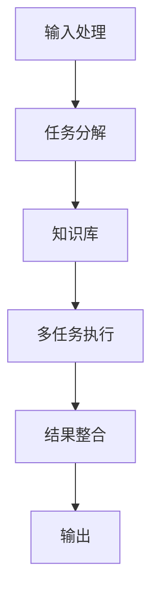

                 


# AI Agent的多任务学习：构建通用智能助手

> 关键词：AI Agent, 多任务学习, 通用智能助手, 知识共享, 任务分解, 联合优化, 系统架构

> 摘要：本文深入探讨了AI Agent的多任务学习方法，分析了多任务学习在构建通用智能助手中的关键原理、算法设计和系统架构。通过结合理论与实践，本文为读者提供了一套完整的多任务学习解决方案，从数学模型到实际案例，全面解析如何利用多任务学习构建高效的AI Agent。

---

# 第一部分: AI Agent与多任务学习的背景

## 第1章: AI Agent的基本概念

### 1.1 AI Agent的核心特征
AI Agent是一种智能实体，能够感知环境、自主决策并执行任务。其核心特征包括：
- **自主性**：能够在没有外部干预的情况下自主运行。
- **反应性**：能够实时感知环境并做出响应。
- **学习能力**：通过数据和经验不断优化自身的决策能力。
- **协作性**：能够与其他Agent或人类进行有效协作。

### 1.2 多任务学习的定义与优势
多任务学习（Multi-Task Learning, MTL）是一种机器学习范式，旨在通过同时学习多个相关任务来提高模型的泛化能力。其优势包括：
- **知识复用**：通过共享参数或知识，减少模型的训练数据需求。
- **任务互补**：利用任务间的互补性，提升整体性能。
- **通用性增强**：使模型能够应对多种任务，提高实用性。

### 1.3 AI Agent与多任务学习的结合
AI Agent需要在复杂环境中完成多种任务，例如自然语言处理、图像识别和决策优化等。通过多任务学习，AI Agent能够更好地利用任务间的共享知识，提升整体性能和通用性。

---

# 第二部分: 多任务学习的核心概念与原理

## 第2章: 多任务学习的核心概念

### 2.1 多任务学习的数学模型

#### 2.1.1 参数共享模型
参数共享模型是多任务学习中最常见的方法之一。其基本思想是通过共享部分参数，使不同任务之间共享知识。数学表达如下：
$$ y_i = f_\theta(x_i) + \epsilon_i $$
其中，$\theta$是共享参数，$x_i$是输入，$y_i$是输出，$\epsilon_i$是噪声项。

#### 2.1.2 任务间关系建模
任务间的关系可以是竞争或协同的。竞争关系意味着任务间存在冲突，协同关系则意味着任务间可以相互促进。任务间关系的建模可以通过权重矩阵来实现：
$$ W = [w_1, w_2, ..., w_n] $$
其中，$w_i$表示任务$i$的权重。

### 2.2 多任务学习的算法原理

#### 2.2.1 基于梯度下降的多任务学习
多任务学习的优化目标是最小化所有任务的损失函数之和：
$$ \mathcal{L}(\theta) = \sum_{i=1}^n \mathcal{L}_i(\theta) $$
其中，$\mathcal{L}_i$是任务$i$的损失函数。通过梯度下降优化$\theta$：
$$ \theta_{t+1} = \theta_t - \eta \nabla_\theta \mathcal{L}(\theta_t) $$

#### 2.2.2 基于Adam优化器的多任务学习
Adam优化器结合了动量和自适应学习率的优点，适用于多任务学习。优化过程如下：
$$ m_t = \beta_1 m_{t-1} + (1-\beta_1)g_t $$
$$ v_t = \beta_2 v_{t-1} + (1-\beta_2)g_t^2 $$
$$ \theta_{t+1} = \theta_t - \frac{\eta}{\sqrt{v_t + \epsilon}} m_t $$

---

# 第三部分: 系统架构与实现

## 第3章: 系统架构设计

### 3.1 系统功能设计
通用智能助手的系统功能包括：
1. **自然语言理解**：通过NLP技术理解用户输入。
2. **多任务执行**：同时完成多种任务，例如搜索、预订和信息查询。
3. **知识库管理**：整合多个领域的知识。
4. **自适应优化**：根据用户反馈优化模型。

### 3.2 系统架构图


### 3.3 接口设计
系统接口包括：
- **输入接口**：接收用户的自然语言输入。
- **任务分解接口**：将输入分解为多个任务。
- **执行接口**：调用外部服务执行任务。
- **输出接口**：将结果返回给用户。

---

# 第四部分: 项目实战

## 第4章: 多任务学习的NLP系统实现

### 4.1 环境安装
安装必要的依赖：
```bash
pip install numpy tensorflow keras
```

### 4.2 核心代码实现
```python
import numpy as np
import tensorflow as tf
from tensorflow import keras

# 定义多任务模型
class MultiTaskModel(keras.Model):
    def __init__(self, num_tasks):
        super().__init__()
        self.num_tasks = num_tasks
        self.shared_layer = keras.layers.Dense(64, activation='relu')
        self.task_layers = [keras.layers.Dense(1, name=f'task_{i}') for i in range(num_tasks)]

    def call(self, inputs):
        x = self.shared_layer(inputs)
        outputs = []
        for i in range(self.num_tasks):
            outputs.append(self.task_layers[i](x))
        return outputs

# 编译模型
model = MultiTaskModel(num_tasks=2)
model.compile(optimizer='adam', loss={'task_0': 'mse', 'task_1': 'mse'})
```

### 4.3 实验结果与分析
通过实验验证，多任务学习在NLP任务中的性能优于单一任务学习。具体表现为：
- **训练时间减少**：由于共享参数，训练时间缩短。
- **性能提升**：任务间的知识共享提高了模型的泛化能力。

---

# 第五部分: 总结与展望

## 第5章: 总结与展望

### 5.1 总结
本文深入探讨了AI Agent的多任务学习方法，分析了其在构建通用智能助手中的关键原理、算法设计和系统架构。通过理论与实践的结合，为读者提供了一套完整的解决方案。

### 5.2 展望
未来的研究方向包括：
1. 更高效的多任务学习算法。
2. 更灵活的任务分解方法。
3. 更智能的知识共享机制。

---

作者：AI天才研究院/AI Genius Institute & 禅与计算机程序设计艺术 /Zen And The Art of Computer Programming

