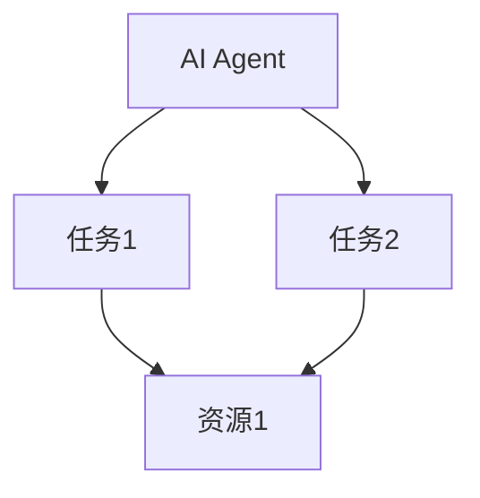
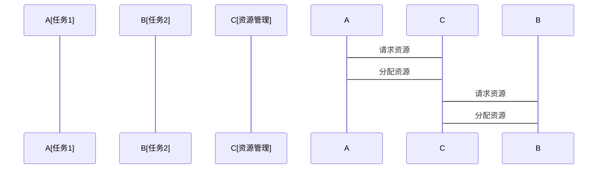
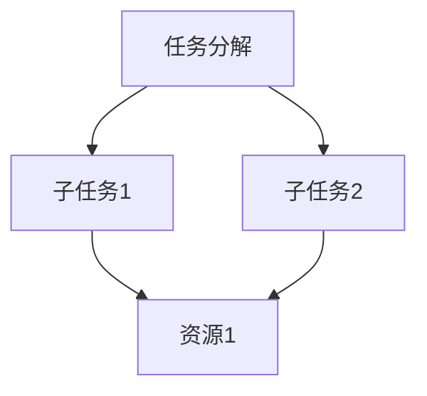
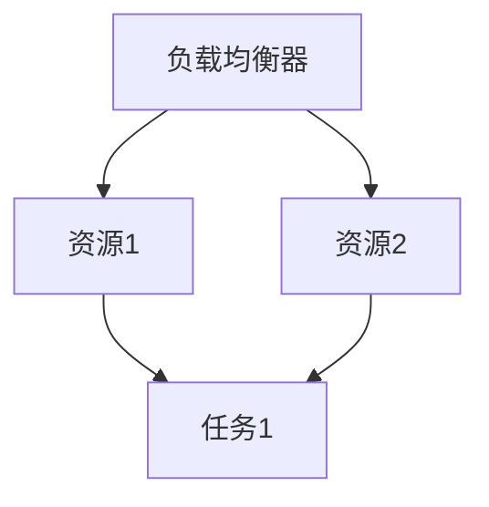

                 


---

# AI Agent的多任务并行处理技术

> 关键词：AI Agent, 多任务处理, 并行计算, 任务调度, 负载均衡, 系统架构

> 摘要：本文详细探讨了AI Agent在多任务并行处理中的技术实现，从基本原理到系统架构，从算法优化到实际应用，全面分析了多任务并行处理的关键技术。文章结合理论与实践，通过具体的案例和代码示例，帮助读者深入理解AI Agent的多任务并行处理技术。

---

# 第1章: AI Agent与多任务并行处理概述

## 1.1 AI Agent的基本概念

### 1.1.1 AI Agent的定义与特点

AI Agent（人工智能代理）是一种能够感知环境、自主决策并执行任务的智能实体。它具备以下特点：

- **自主性**：能够在没有外部干预的情况下自主决策。
- **反应性**：能够根据环境的变化动态调整行为。
- **目标导向性**：具有明确的目标，并为实现目标而行动。
- **学习能力**：能够通过经验改进自身的性能。

### 1.1.2 多任务并行处理的定义

多任务并行处理是指在同一时间段内同时执行多个任务，每个任务独立或协作地完成目标。其核心在于提高效率、资源利用率和响应速度。

### 1.1.3 AI Agent与传统单任务处理的区别

传统的单任务处理方式仅专注于完成单一任务，而AI Agent的多任务并行处理能够同时处理多个任务，通过任务分解、资源分配和负载均衡等技术实现高效运作。

## 1.2 多任务并行处理的重要性

### 1.2.1 提高效率的必要性

在现代应用场景中，如自动驾驶、智能推荐系统等，任务复杂度高，时间要求严格，多任务并行处理能够显著提高效率。

### 1.2.2 多任务并行处理的挑战

- **任务间的依赖性**：部分任务可能需要共享资源或数据，导致复杂的同步问题。
- **资源竞争**：多个任务同时使用有限的资源可能导致性能下降。
- **任务优先级管理**：需要合理分配资源以保证重要任务的优先执行。

### 1.2.3 未来发展的趋势

随着AI技术的不断进步，多任务并行处理将成为AI Agent的核心能力，应用场景将更加广泛。

## 1.3 本章小结

本章介绍了AI Agent的基本概念和多任务并行处理的重要性，为后续章节奠定了基础。

---

# 第2章: 多任务并行处理的原理与机制

## 2.1 多任务并行处理的基本原理

### 2.1.1 并行与串行的区别

- **串行**：任务按顺序执行，资源利用率低，效率低下。
- **并行**：多个任务同时执行，资源利用率高，效率提升。

### 2.1.2 多线程与多进程的原理

- **多线程**：多个线程共享同一内存空间，适合资源受限的场景。
- **多进程**：每个进程独立运行，适合任务隔离性要求高的场景。

### 2.1.3 并行计算中的任务分解

任务分解是并行计算的基础，将复杂任务分解为多个子任务，每个子任务独立执行，最终汇总结果。

## 2.2 多任务并行处理的机制

### 2.2.1 任务调度与资源分配

任务调度算法决定任务的执行顺序和资源分配，常见的调度算法包括轮转调度、优先级调度等。

### 2.2.2 同步与异步的实现

- **同步**：任务之间需要协调，等待一个任务完成后再执行下一个任务。
- **异步**：任务之间无需等待，提高并行效率。

### 2.2.3 负载均衡的原理

负载均衡算法通过动态分配任务，确保系统资源利用率最大化，避免资源瓶颈。

## 2.3 本章小结

本章详细讲解了多任务并行处理的基本原理和机制，为后续章节的技术实现提供了理论支持。

---

# 第3章: AI Agent的体系结构

## 3.1 AI Agent的体系结构类型

### 3.1.1 集中式架构

- **优点**：管理简单，任务协调性强。
- **缺点**：单点故障风险高，扩展性差。

### 3.1.2 分布式架构

- **优点**：高可用性，扩展性强。
- **缺点**：通信开销大，任务协调复杂。

### 3.1.3 混合式架构

- **优点**：结合集中式和分布式架构的优势。
- **缺点**：架构复杂，管理难度大。

### 3.1.4 Mermaid图示例



## 3.2 多任务并行处理的通信机制

### 3.2.1 任务间通信的实现

任务间通信通过消息传递机制实现，确保任务之间能够共享数据和协调执行。

### 3.2.2 数据共享与同步

通过共享内存或分布式数据库实现数据共享，同步机制确保数据一致性。

### 3.2.3 锁机制与队列管理

锁机制用于防止任务间的资源竞争，队列管理用于任务的有序处理。

### 3.2.4 Mermaid图示例



## 3.3 本章小结

本章分析了AI Agent的体系结构及其通信机制，为系统实现提供了架构参考。

---

# 第4章: 多任务并行处理的算法优化

## 4.1 并行计算算法的基本原理

### 4.1.1 串行算法的并行化

通过任务分解将串行算法转化为并行算法，减少执行时间。

### 4.1.2 并行计算中的粒度划分

任务粒度越小，并行效率越高，但粒度过小可能导致额外开销增加。

### 4.1.3 并行计算的加速比分析

加速比是串行执行时间与并行执行时间的比值，公式为：

$$ R = \frac{T_{\text{serial}}}{T_{\text{parallel}}} $$

### 4.1.4 Mermaid图示例



## 4.2 负载均衡算法的设计

### 4.2.1 负载均衡的定义与目标

负载均衡旨在合理分配任务，确保系统资源利用率最大化。

### 4.2.2 负载均衡算法的实现

- **静态负载均衡**：任务固定分配到特定资源。
- **动态负载均衡**：根据资源使用情况动态调整任务分配。

### 4.2.3 负载均衡的数学模型

负载均衡的目标是最小化系统响应时间，公式为：

$$ \text{响应时间} = \max_{i} \left( \frac{T_i}{C_i} \right) $$

其中，\( T_i \) 是任务i的执行时间，\( C_i \) 是资源i的处理能力。

### 4.2.4 Mermaid图示例



## 4.3 本章小结

本章详细讲解了并行计算算法和负载均衡算法的设计，为系统实现提供了理论支持。

---

# 第5章: 多任务并行处理的系统实现

## 5.1 系统环境配置

### 5.1.1 硬件配置

- **多核处理器**：支持多线程和多进程。
- **分布式系统**：支持任务的分布执行。

### 5.1.2 软件配置

- **操作系统**：支持多线程和多进程的调度。
- **编程语言**：如Python、Java等。

## 5.2 代码实现

### 5.2.1 Python代码示例

```python
import threading

def task1():
    print("Task 1 is running")
    # 模拟任务执行
    import time
    time.sleep(2)
    print("Task 1 completed")

def task2():
    print("Task 2 is running")
    import time
    time.sleep(2)
    print("Task 2 completed")

thread1 = threading.Thread(target=task1)
thread2 = threading.Thread(target=task2)

thread1.start()
thread2.start()

thread1.join()
thread2.join()
```

### 5.2.2 代码解读

- **多线程**：通过`threading`模块创建线程，实现任务并行执行。
- **同步与异步**：使用`join()`方法实现线程同步。

## 5.3 调试与优化

### 5.3.1 调试技巧

- 使用调试工具跟踪任务执行情况。
- 添加日志输出，便于问题排查。

### 5.3.2 优化策略

- 合理分配任务粒度，避免资源竞争。
- 优化锁机制，减少同步开销。

## 5.4 本章小结

本章通过实际代码示例，展示了多任务并行处理的系统实现过程。

---

# 第6章: 多任务并行处理的实际应用

## 6.1 应用场景分析

### 6.1.1 推荐系统

AI Agent通过多任务并行处理，同时分析用户行为和数据，提供个性化推荐。

### 6.1.2 自动驾驶

AI Agent同时处理环境感知、路径规划和决策控制等任务，确保安全高效。

## 6.2 项目实战

### 6.2.1 项目介绍

设计一个基于Python的多任务并行处理的推荐系统，实现用户行为分析和个性化推荐。

### 6.2.2 系统功能设计

- **用户行为分析**：收集用户的点击、浏览数据。
- **个性化推荐**：基于协同过滤算法，推荐用户可能感兴趣的内容。

### 6.2.3 系统实现

```python
import threading
import time

def analyze_behavior(user_id):
    print(f"Analyzing behavior for user {user_id}")
    time.sleep(2)
    print(f"Behavior analysis completed for user {user_id}")

def generate_recommendation(user_id):
    print(f"Generating recommendations for user {user_id}")
    time.sleep(2)
    print(f"Recommendations generated for user {user_id}")

# 创建并执行线程
thread1 = threading.Thread(target=analyze_behavior, args=(1,))
thread2 = threading.Thread(target=generate_recommendation, args=(1,))

thread1.start()
thread2.start()

thread1.join()
thread2.join()
```

### 6.2.4 实际案例分析

通过具体案例分析，展示多任务并行处理的实际价值和应用效果。

## 6.3 本章小结

本章通过实际应用场景和项目实战，展示了多任务并行处理技术的广泛应用。

---

# 第7章: 挑战与未来展望

## 7.1 当前面临的挑战

### 7.1.1 任务之间的依赖性

任务间的依赖可能导致复杂的同步问题，影响系统性能。

### 7.1.2 资源竞争问题

有限的资源可能导致任务间的竞争，降低系统效率。

### 7.1.3 任务调度优化

如何实现高效的动态任务调度，是一个重要的研究方向。

## 7.2 未来展望

### 7.2.1 新算法与新技术

探索更高效的并行计算算法和分布式技术。

### 7.2.2 智能化任务调度

结合AI技术，实现智能化的任务调度和资源分配。

### 7.2.3 应用领域扩展

多任务并行处理技术将应用于更多领域，如智慧城市、智能医疗等。

## 7.3 本章小结

本章总结了当前面临的技术挑战，并展望了未来的发展方向。

---

# 结论

多任务并行处理技术是AI Agent的核心能力之一，通过合理分解任务、优化算法、设计高效的系统架构，可以显著提高系统的效率和性能。未来，随着AI技术的不断发展，多任务并行处理技术将更加智能化和高效化。

---

# 作者

作者：AI天才研究院 & 禅与计算机程序设计艺术

--- 

这篇文章通过系统化的分析和详细的代码示例，全面探讨了AI Agent的多任务并行处理技术，希望对读者有所帮助。

