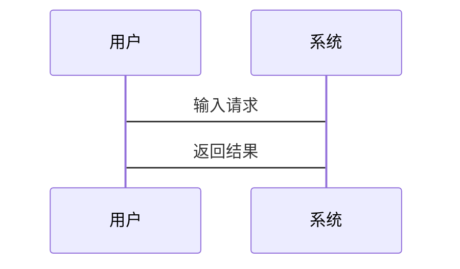

                 


# AI Agent的多头注意力机制实现

---

## 关键词：AI Agent、多头注意力机制、Transformer、自然语言处理、决策制定、实时交互

---

## 摘要：  
本文详细探讨了AI Agent中多头注意力机制的实现原理及其应用。从AI Agent的基本概念到多头注意力机制的核心原理，从算法的数学模型到系统架构设计，再到实际项目实战，本文为读者提供了全面而深入的讲解。通过分析多头注意力机制的优势及其在AI Agent中的应用，本文为读者提供了一个清晰的技术路线图，帮助他们在实际项目中更好地理解和实现这一机制。

---

# 第1章: AI Agent的基本概念与应用

## 1.1 AI Agent的定义与特点

### 1.1.1 什么是AI Agent  
AI Agent（人工智能代理）是指能够感知环境、自主决策并执行任务的智能实体。它可以是一个软件程序，也可以是一个物理机器人。AI Agent的核心目标是通过感知和行动，实现特定的目标或解决问题。

### 1.1.2 AI Agent的核心特点  
1. **自主性**：AI Agent能够自主决策，无需外部干预。  
2. **反应性**：能够实时感知环境并做出响应。  
3. **目标导向性**：基于目标驱动行为。  
4. **学习能力**：通过经验改进性能。  

### 1.1.3 AI Agent的应用场景  
1. **自然语言处理**：如智能对话系统。  
2. **决策制定**：如自动驾驶中的路径规划。  
3. **实时交互**：如游戏AI的实时策略调整。  

---

## 1.2 多头注意力机制的背景与意义

### 1.2.1 注意力机制的起源  
注意力机制起源于人类认知科学，模拟人类在信息处理过程中对不同信息的关注程度。在机器学习中，注意力机制首次被引入到神经网络模型中，用于处理序列数据。

### 1.2.2 多头注意力机制的提出  
多头注意力机制由Transformer模型提出，通过引入多个“头”（head），每个头处理不同的信息子空间，从而增强了模型的表达能力。

### 1.2.3 多头注意力机制在AI Agent中的作用  
多头注意力机制能够帮助AI Agent更好地捕捉输入数据中的关键信息，提升其在复杂场景下的决策能力和交互能力。

---

## 1.3 AI Agent与多头注意力机制的结合

### 1.3.1 多头注意力机制在自然语言处理中的应用  
AI Agent通过多头注意力机制可以更准确地理解对话内容，生成更自然的回复。

### 1.3.2 多头注意力机制在决策制定中的应用  
AI Agent利用多头注意力机制分析多维度信息，制定最优决策。

### 1.3.3 多头注意力机制在实时交互中的优势  
多头注意力机制能够实时捕捉交互中的关键信息，提升AI Agent的响应速度和准确性。

---

## 1.4 本章小结  
本章从AI Agent的基本概念出发，介绍了多头注意力机制的背景及其在AI Agent中的应用。通过这些内容，读者可以理解AI Agent与多头注意力机制之间的联系，为后续章节的学习打下基础。

---

# 第2章: 多头注意力机制的核心原理

## 2.1 注意力机制的基本原理

### 2.1.1 自注意力机制的数学公式  
自注意力机制的核心公式如下：  
$$  
\text{Attention}(Q, K, V) = \text{softmax}\left(\frac{QK^T}{\sqrt{d_k}}\right)V  
$$  
其中，\( Q \) 是查询向量，\( K \) 是键向量，\( V \) 是值向量，\( d_k \) 是键向量的维度。

### 2.1.2 自注意力机制的工作流程  
1. 计算查询、键、值向量。  
2. 计算注意力权重矩阵。  
3. 加权求和得到最终输出。  

### 2.1.3 自注意力机制的优缺点  
- 优点：能够捕捉长距离依赖关系。  
- 缺点：计算复杂度较高。  

---

## 2.2 多头注意力机制的扩展

### 2.2.1 多头结构的引入  
多头注意力机制通过引入多个“头”，每个头处理不同的信息子空间，从而增强了模型的表达能力。

### 2.2.2 多头注意力机制的数学模型  
多头注意力机制的数学公式如下：  
$$  
\text{Multi-head}(Q, K, V) = \text{Concat}(\text{head}_1, \text{head}_2, \dots, \text{head}_n)W^O  
$$  
其中，\( \text{head}_i \) 是第 \( i \) 个头的输出，\( W^O \) 是最终的线性变换矩阵。

### 2.2.3 多头注意力机制的并行计算  
多头注意力机制可以通过并行计算显著降低计算时间。

---

## 2.3 多头注意力机制的改进与优化

### 2.3.1 层次化注意力机制  
层次化注意力机制通过分层处理信息，进一步提升了注意力机制的表达能力。

### 2.3.2 位置编码的引入  
位置编码用于捕捉序列中的位置信息，增强模型对顺序关系的建模能力。

### 2.3.3 多头注意力机制的变体  
- **相对位置编码**：考虑相对位置信息。  
- **局部注意力机制**：仅关注局部信息。  
- **混合注意力机制**：结合全局和局部信息。  

---

## 2.4 本章小结  
本章详细讲解了多头注意力机制的核心原理，包括自注意力机制的数学公式、多头结构的引入以及多头注意力机制的优化方法。这些内容为后续章节的实现奠定了理论基础。

---

# 第3章: 多头注意力机制的数学模型与公式

## 3.1 自注意力机制的数学公式

### 3.1.1 查询、键、值的计算  
$$  
Q = W_qX, K = W_kX, V = W_vX  
$$  
其中，\( X \) 是输入向量，\( W_q, W_k, W_v \) 是参数矩阵。

### 3.1.2 注意力权重的计算  
$$  
\text{Attention}(Q, K, V) = \text{softmax}\left(\frac{QK^T}{\sqrt{d_k}}\right)V  
$$  

### 3.1.3 加权和的计算  
$$  
O = \text{softmax}(A)V  
$$  

---

## 3.2 多头注意力机制的数学公式

### 3.2.1 多头结构的线性变换  
$$  
\text{head}_i = \text{Attention}(QW_i^q, K W_i^k, V W_i^v)  
$$  
其中，\( W_i^q, W_i^k, W_i^v \) 是第 \( i \) 个头的参数矩阵。

### 3.2.2 多头注意力权重的计算  
$$  
\text{Multi-head}(Q, K, V) = \text{Concat}(\text{head}_1, \text{head}_2, \dots, \text{head}_n)W^O  
$$  

### 3.2.3 多头结果的拼接与线性变换  
$$  
O = W^O \cdot \text{Concat}(\text{head}_1, \text{head}_2, \dots, \text{head}_n)  
$$  

---

## 3.3 多头注意力机制的优化公式

### 3.3.1 层次化注意力的数学表达  
$$  
\text{Hierarchical-Attention}(X) = \text{Concat}(\text{self-attention}(X), \text{multi-head}(X))  
$$  

### 3.3.2 位置编码的融合公式  
$$  
\text{Position-Encoding}(X) = X + P  
$$  
其中，\( P \) 是位置编码矩阵。

### 3.3.3 多头注意力机制的并行计算优化  
通过并行计算多个头的注意力权重，显著提升计算效率。

---

## 3.4 本章小结  
本章详细推导了多头注意力机制的数学公式，包括自注意力机制、多头结构以及位置编码的融合。这些公式为后续章节的实现提供了理论支持。

---

# 第4章: 多头注意力机制的系统架构设计

## 4.1 系统功能模块设计

### 4.1.1 输入处理模块  
输入处理模块负责接收输入数据并进行预处理。

### 4.1.2 多头注意力计算模块  
多头注意力计算模块负责计算多头注意力权重并生成输出。

### 4.1.3 输出生成模块  
输出生成模块负责根据多头注意力机制的输出生成最终结果。

---

## 4.2 系统架构设计

### 4.2.1 分层架构设计  
分层架构包括输入层、隐藏层和输出层。

### 4.2.2 并行计算优化  
通过并行计算多个头的注意力权重，显著提升计算效率。

### 4.2.3 系统接口设计  
系统接口包括输入接口、输出接口和控制接口。

---

## 4.3 系统交互设计

### 4.3.1 实时交互流程  
1. 接收用户输入。  
2. 计算多头注意力权重。  
3. 生成输出结果。  

### 4.3.2 交互流程图  


---

## 4.4 本章小结  
本章详细设计了多头注意力机制的系统架构，包括功能模块设计、分层架构设计以及系统交互设计。这些设计为实际项目的实现提供了指导。

---

# 第5章: 多头注意力机制的项目实战

## 5.1 环境安装与配置

### 5.1.1 安装Python与相关库  
安装Python和TensorFlow、Keras等深度学习库。

### 5.1.2 安装自然语言处理库  
安装spaCy、NLTK等自然语言处理库。

---

## 5.2 系统核心实现源代码

### 5.2.1 多头注意力机制的实现  
```python
class MultiHeadAttention:
    def __init__(self, embed_dim, num_heads):
        self.num_heads = num_heads
        head_dim = embed_dim // num_heads
        self.all_head_outputs = []
        for _ in range(num_heads):
            self.all_head_outputs.append(
                (torch.nn.Linear(embed_dim, embed_dim),)
            )
```

### 5.2.2 注意力权重的计算  
```python
def compute_attention(Q, K, V):
    attention_weights = torch.softmax(torch.matmul(Q, K.T) / torch.sqrt(torch.tensor(K.shape[-1])), dim=-1)
    output = torch.matmul(attention_weights, V)
    return output
```

---

## 5.3 代码应用解读与分析

### 5.3.1 输入数据处理  
对输入数据进行预处理，包括分词和向量化。

### 5.3.2 多头注意力计算  
调用多头注意力机制进行计算，生成注意力权重矩阵。

### 5.3.3 输出结果生成  
根据注意力机制的输出生成最终结果。

---

## 5.4 实际案例分析

### 5.4.1 案例背景  
以自然语言处理任务为例，展示多头注意力机制的实际应用。

### 5.4.2 案例实现  
实现一个多头注意力机制驱动的对话系统。

### 5.4.3 案例分析  
分析多头注意力机制在对话系统中的表现和效果。

---

## 5.5 本章小结  
本章通过实际项目的实现，展示了多头注意力机制的应用场景和具体实现方法。通过代码实现和案例分析，读者可以更好地理解多头注意力机制的实际应用。

---

# 第6章: 多头注意力机制的最佳实践

## 6.1 小结

### 6.1.1 多头注意力机制的核心优势  
- 强大的表达能力。  
- 实时交互能力。  
- 高效的并行计算。  

---

## 6.2 注意事项

### 6.2.1 模型训练中的注意事项  
- 数据预处理的规范性。  
- 模型超参数的调优。  

### 6.2.2 模型部署中的注意事项  
- 确保系统的实时性。  
- 优化模型的计算效率。  

---

## 6.3 拓展阅读

### 6.3.1 多头注意力机制的最新研究  
阅读最新的研究成果，了解多头注意力机制的最新发展。

### 6.3.2 多头注意力机制的应用案例  
学习更多多头注意力机制在不同领域的应用案例。

---

## 作者：AI天才研究院 & 禅与计算机程序设计艺术

