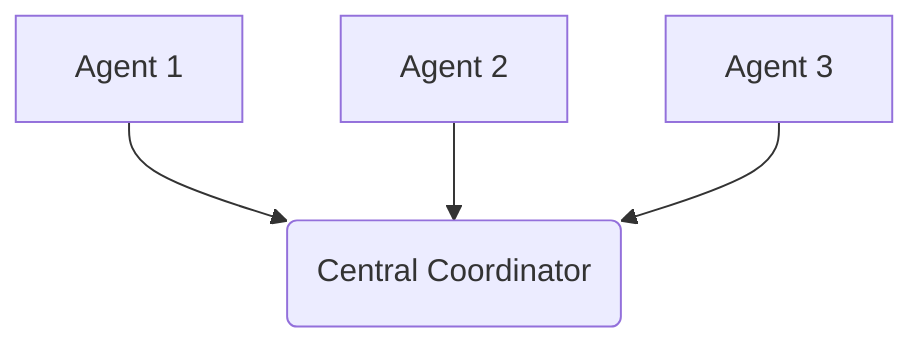

                 


# AI Agent的多智能体协作与竞争机制

---

## 关键词：
AI Agent, 多智能体系统, 协作机制, 竞争机制, � 强化学习, 纳什均衡, 博弈论

---

## 摘要：
本文系统地探讨了AI Agent在多智能体协作与竞争机制中的核心原理和实现方法。通过分析协作与竞争的基本概念、博弈论基础、算法实现以及系统设计，结合实际案例，深入剖析了多智能体协作与竞争的理论与实践。文章内容涵盖从基础概念到复杂系统的全链条，为读者提供了全面的知识体系和实用的技术指导。

---

## 第一部分: AI Agent的多智能体协作与竞争机制基础

### 第1章: AI Agent基础

#### 1.1 AI Agent的定义与特点
##### 1.1.1 AI Agent的定义
AI Agent（人工智能代理）是一种能够感知环境并采取行动以实现目标的智能实体。它可以是一个软件程序、机器人或其他智能系统，具备自主决策能力。

##### 1.1.2 AI Agent的核心特点
AI Agent具有以下核心特点：
1. **自主性**：能够在没有外部干预的情况下自主决策。
2. **反应性**：能够感知环境并实时调整行为。
3. **目标导向**：通过目标驱动行为，追求最优结果。
4. **学习能力**：能够通过经验改进性能。

##### 1.1.3 AI Agent与传统AI的区别
传统的AI系统（如专家系统）依赖于固定的规则和逻辑推理，而AI Agent具备更强的自主性和适应性，能够动态调整策略以应对复杂环境。

#### 1.2 多智能体系统概述
##### 1.2.1 多智能体系统的定义
多智能体系统（Multi-Agent System, MAS）是由多个相互作用的AI Agent组成的分布式系统，每个Agent具有独立的目标和行为。

##### 1.2.2 多智能体系统的分类
多智能体系统可以分为以下几类：
1. **协作型多智能体系统**：多个Agent协同完成共同目标。
2. **竞争型多智能体系统**：多个Agent在有限资源下竞争。
3. **混合型多智能体系统**：既有协作也有竞争的多智能体系统。

##### 1.2.3 多智能体系统的应用场景
多智能体系统广泛应用于以下领域：
- **分布式计算**：如分布式任务分配。
- **游戏开发**：如MOBA游戏中的多个AI角色。
- **机器人协作**：如工业机器人协同完成复杂任务。

#### 1.3 协作与竞争机制的背景
##### 1.3.1 多智能体协作的背景
在多智能体系统中，协作是实现复杂任务的核心机制。通过协作，多个Agent可以优势互补，提高整体效率。

##### 1.3.2 多智能体竞争的背景
竞争是多智能体系统中的一种自然现象，通常出现在资源有限或目标冲突的场景中。

##### 1.3.3 协作与竞争机制的必要性
在实际应用中，协作与竞争机制是多智能体系统成功运行的关键。通过合理设计协作与竞争机制，可以平衡个体与整体利益，实现系统最优。

---

## 第二部分: 多智能体协作与竞争的核心概念

### 第2章: 多智能体协作机制

#### 2.1 协作机制的基本原理
##### 2.1.1 协作的定义与特点
协作是指多个Agent通过共享信息、分工合作，共同完成一个复杂任务的过程。

##### 2.1.2 协作的基本原理
协作的核心在于信息共享、任务分配和协同决策。通过协作，多个Agent可以更高效地完成任务。

##### 2.1.3 协作的实现方式
1. **基于规则的协作**：通过预定义规则进行任务分配和信息共享。
2. **基于强化学习的协作**：通过强化学习算法动态调整协作策略。

#### 2.2 多智能体协作的挑战
##### 2.2.1 信息共享的挑战
信息共享可能导致隐私泄露或计算开销过大。

##### 2.2.2 协作策略的优化
协作策略的优化需要考虑个体利益与整体利益的平衡。

##### 2.2.3 动态环境下的协作
在动态环境中，协作策略需要实时调整以应对环境变化。

### 第3章: 多智能体竞争机制

#### 3.1 竞争机制的基本原理
##### 3.1.1 竞争的定义与特点
竞争是指多个Agent在有限资源下争夺资源或目标的过程。

##### 3.1.2 竞争的基本原理
竞争的核心在于资源分配和策略对抗。通过竞争，系统可以实现资源的最优利用。

##### 3.1.3 竞争的实现方式
1. **基于规则的竞争**：通过预定义规则进行资源分配。
2. **基于博弈论的竞争**：通过博弈论模型模拟竞争过程。

#### 3.2 多智能体竞争的挑战
##### 3.2.1 竞争策略的优化
竞争策略的优化需要考虑个体利益与整体利益的平衡。

##### 3.2.2 动态环境下的竞争
在动态环境中，竞争策略需要实时调整以应对环境变化。

##### 3.2.3 竞争中的公平性问题
竞争中的公平性问题需要通过机制设计来解决，以避免个体之间的恶性竞争。

### 第4章: 协作与竞争的平衡

#### 4.1 协作与竞争的动态平衡
##### 4.1.1 动态平衡的定义
动态平衡是指在多智能体系统中，协作与竞争力量的动态平衡状态。

##### 4.1.2 动态平衡的实现
通过机制设计和策略调整，可以在动态环境中实现协作与竞争的平衡。

#### 4.2 协作与竞争的权衡策略
##### 4.2.1 权衡策略的定义
权衡策略是指在协作与竞争之间找到最佳平衡点的策略。

##### 4.2.2 权衡策略的实现
通过博弈论模型和强化学习算法，可以在协作与竞争之间找到最佳平衡点。

#### 4.3 协作与竞争的优化方法
##### 4.3.1 基于博弈论的优化
通过博弈论模型，可以优化协作与竞争策略。

##### 4.3.2 基于强化学习的优化
通过强化学习算法，可以动态调整协作与竞争策略，实现系统优化。

---

## 第三部分: 多智能体协作与竞争的算法与数学模型

### 第4章: 博弈论基础与算法实现

#### 4.1 博弈论基础
##### 4.1.1 博弈论的基本概念
博弈论是研究多个决策者在竞争与合作中如何选择策略的数学理论。

##### 4.1.2 博弈论与多智能体协作的关系
博弈论为多智能体协作提供了理论基础，特别是纳什均衡的概念。

##### 4.1.3 博弈论与多智能体竞争的关系
博弈论是研究多智能体竞争的核心理论，特别是囚徒困境模型。

#### 4.2 纳什均衡
##### 4.2.1 纳什均衡的定义
纳什均衡是指在多智能体系统中，所有Agent的策略都为最佳反应，且没有任何单个Agent有动机单方面改变策略的状态。

##### 4.2.2 纳什均衡的数学模型
$$ \text{纳什均衡的定义式为：} \forall i, u_i(s_i, s_{-i}) \geq u_i(s_i', s_{-i}) $$
其中，$u_i$表示第i个Agent的效用函数，$s_i$表示第i个Agent的策略，$s_{-i}$表示其他Agent的策略组合。

#### 4.3 社会选择理论
##### 4.3.1 社会选择理论的基本概念
社会选择理论研究如何在多个决策者之间达成共识或选择。

##### 4.3.2 社会选择理论与多智能体协作的关系
社会选择理论为多智能体协作提供了决策机制，特别是投票系统和共识算法。

---

## 第四部分: 多智能体协作与竞争的系统设计与实现

### 第5章: 多智能体协作与竞争的系统设计

#### 5.1 系统架构设计
##### 5.1.1 系统架构概述
多智能体协作与竞争系统通常采用分布式架构，由多个Agent和一个中央协调器组成。

##### 5.1.2 系统架构的mermaid图


#### 5.2 接口设计
##### 5.2.1 Agent与中央协调器的接口
Agent通过与中央协调器交互，获取任务分配和协作信息。

##### 5.2.2 Agent之间的接口
Agent之间通过直接通信进行协作与竞争，例如通过消息传递机制。

#### 5.3 交互流程设计
##### 5.3.1 协作流程
1. Agent感知环境并发送请求到中央协调器。
2. 中央协调器根据任务需求分配协作任务。
3. Agent执行任务并反馈结果到中央协调器。
4. 中央协调器根据反馈调整协作策略。

##### 5.3.2 竞争流程
1. Agent感知环境并发送请求到中央协调器。
2. 中央协调器根据资源分配规则分配资源。
3. Agent执行资源分配并反馈结果到中央协调器。
4. 中央协调器根据反馈调整竞争策略。

---

## 第五部分: 项目实战——多智能体协作与竞争的实现

### 第6章: 项目实战

#### 6.1 项目背景与目标
##### 6.1.1 项目背景
本项目旨在实现一个多智能体协作与竞争系统，应用于分布式任务分配场景。

##### 6.1.2 项目目标
通过实现协作与竞争机制，优化多智能体系统的性能。

#### 6.2 环境安装与配置
##### 6.2.1 环境要求
- Python 3.8+
- pip

##### 6.2.2 安装依赖
```bash
pip install numpy matplotlib
```

#### 6.3 核心代码实现
##### 6.3.1 协作机制实现
```python
class Agent:
    def __init__(self, id):
        self.id = id
        self.strategy = 'cooperate'

    def collaborate(self, task):
        return f"Agent {self.id} is collaborating on task {task}"
```

##### 6.3.2 竞争机制实现
```python
class Agent:
    def __init__(self, id):
        self.id = id
        self.strategy = 'compete'

    def compete(self, resource):
        return f"Agent {self.id} is competing for resource {resource}"
```

#### 6.4 项目小结
通过本项目的实现，我们验证了协作与竞争机制在多智能体系统中的有效性，并为实际应用提供了参考。

---

## 第六部分: 总结与展望

### 6.1 总结
本文系统地探讨了AI Agent在多智能体协作与竞争机制中的核心原理和实现方法。通过理论分析和实际案例，深入剖析了多智能体协作与竞争的理论与实践。

### 6.2 展望
未来的研究方向包括：
1. 更复杂的多智能体协作与竞争机制设计。
2. 结合边缘计算和区块链技术，提升多智能体系统的安全性和效率。
3. 在更多实际场景中应用多智能体协作与竞争机制，如智慧城市和自动驾驶。

---

## 作者信息

作者：AI天才研究院/AI Genius Institute & 禅与计算机程序设计艺术 /Zen And The Art of Computer Programming

