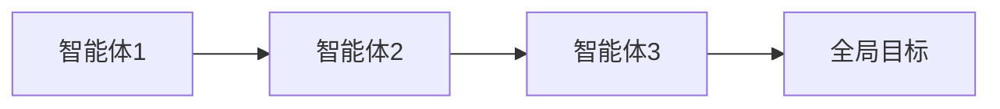
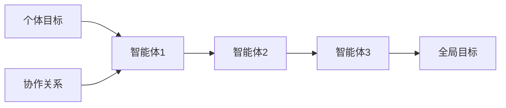
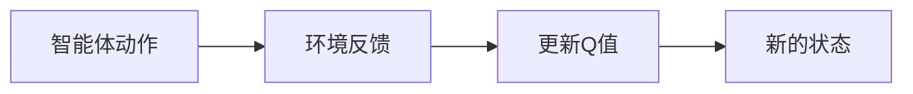
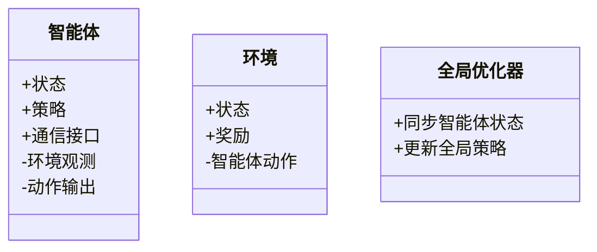
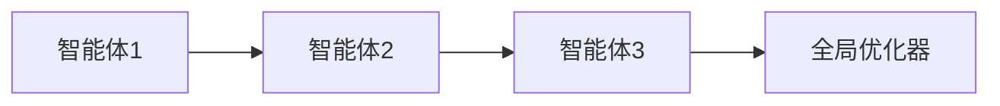

                 


# AI Agent的多智能体协作学习技术

> 关键词：AI Agent，多智能体协作学习，强化学习，分布式计算，系统架构设计

> 摘要：本文详细探讨了AI Agent的多智能体协作学习技术，从核心概念、算法原理、系统设计到项目实战，全面解析了多智能体协作学习的实现方法与应用场景。通过具体案例分析和系统架构设计，深入浅出地展示了如何构建高效的多智能体协作学习系统。

---

# 第一部分: AI Agent的多智能体协作学习概述

## 第1章: AI Agent与多智能体协作学习概述

### 1.1 AI Agent的基本概念

#### 1.1.1 AI Agent的定义
AI Agent（人工智能代理）是指在计算机系统中，能够感知环境、自主决策并执行任务的智能实体。AI Agent可以是软件程序、机器人或其他智能系统，其核心目标是通过与环境交互来实现特定任务。

#### 1.1.2 AI Agent的核心属性与特征
AI Agent具有以下核心属性：
- **自主性**：能够在没有外部干预的情况下独立运行。
- **反应性**：能够感知环境并实时调整行为。
- **目标导向性**：具有明确的目标，并根据目标驱动行为。
- **学习能力**：能够通过经验改进自身性能。

#### 1.1.3 AI Agent的分类与应用场景
AI Agent可以根据功能和应用场景分为以下几类：
1. **简单反射型Agent**：基于当前输入做出反应，如PID控制器。
2. **基于模型的反射型Agent**：利用内部模型进行决策，如专家系统。
3. **目标驱动型Agent**：基于目标进行规划和行动，如自动驾驶系统。
4. **实用驱动型Agent**：通过效用函数优化决策，如推荐系统。

应用场景包括自动驾驶、智能助手、机器人协作等。

---

### 1.2 多智能体协作学习的基本概念

#### 1.2.1 多智能体系统的定义与特点
多智能体系统是由多个智能体组成的分布式系统，智能体之间通过协作完成复杂任务。其特点包括：
- **分布式性**：智能体独立运行，通过通信协作。
- **协作性**：智能体之间共享信息，共同完成任务。
- **动态性**：环境和任务可能动态变化。

#### 1.2.2 协作学习的基本原理
协作学习是指多个智能体通过共享知识和经验，共同提高学习效率和效果。其基本原理包括：
- **信息共享**：智能体之间交换观测、决策和经验。
- **任务分配**：根据智能体的能力和环境动态分配任务。
- **协调机制**：通过协商和协调确保智能体行为一致。

#### 1.2.3 多智能体协作学习的挑战与优势
**挑战**：
- **通信开销**：智能体之间频繁通信可能导致资源消耗。
- **同步问题**：如何保证智能体行为的同步与一致性。
- **安全性**：协作过程中可能面临信息泄露或攻击。

**优势**：
- **任务效率**：通过分工合作提高任务完成效率。
- **鲁棒性**：多个智能体协作能够提高系统的容错性和适应性。
- **扩展性**：易于扩展到更大规模的任务场景。

---

### 1.3 多智能体协作学习的背景与意义

#### 1.3.1 当前AI技术的发展趋势
当前AI技术正朝着多智能体协作方向发展，特别是在分布式系统和边缘计算领域，多智能体协作学习成为解决复杂问题的重要手段。

#### 1.3.2 多智能体协作学习的现实需求
在智能交通、智能制造、智能家居等领域，多智能体协作学习能够实现更高效的资源分配和任务执行。

#### 1.3.3 技术融合与创新的必要性
多智能体协作学习需要结合强化学习、分布式计算和边缘计算等技术，推动AI技术的融合创新。

---

### 1.4 本章小结

本章介绍了AI Agent和多智能体协作学习的基本概念、特点和应用场景，分析了协作学习的挑战与优势，并探讨了其在当前AI技术中的重要性。通过这些内容，读者可以对多智能体协作学习有一个全面的了解。

---

## 第2章: 多智能体协作学习的核心概念与联系

### 2.1 多智能体协作学习的理论基础

#### 2.1.1 分布式智能的基本原理
分布式智能是指通过多个智能体的协作完成复杂任务，其核心在于智能体之间的通信与协调。

#### 2.1.2 协作学习的数学模型
协作学习可以表示为一个优化问题，目标是最小化全局损失函数：
$$ L = \sum_{i=1}^{n} L_i(x_i) $$
其中，$L_i$表示第$i$个智能体的损失函数，$x_i$表示其参数。

#### 2.1.3 多智能体系统中的信息交换机制
信息交换机制是协作学习的核心，包括以下步骤：
1. 智能体感知环境并生成观测。
2. 智能体通过通信共享观测。
3. 智能体基于共享信息更新策略。
4. 重复上述过程直到任务完成。

---

### 2.2 多智能体协作学习的核心要素

#### 2.2.1 智能体的个体目标与全局目标
个体目标是智能体的局部优化目标，全局目标是整个系统的优化目标。个体目标与全局目标之间的平衡是协作学习的关键。

#### 2.2.2 协作关系的建模与分析
协作关系可以通过图论模型表示，例如：


#### 2.2.3 任务分配与角色分工
任务分配需要考虑智能体的能力和环境动态，常用方法包括基于角色的分工和基于任务的分工。

---

### 2.3 多智能体协作学习的实体关系图



---

### 2.4 本章小结

本章深入探讨了多智能体协作学习的理论基础和核心要素，通过信息交换机制和实体关系图展示了协作学习的内在联系，为后续算法实现奠定了基础。

---

## 第3章: 多智能体协作学习的算法原理

### 3.1 基于强化学习的协作算法

#### 3.1.1 强化学习的基本原理
强化学习通过智能体与环境的交互，学习最优策略以最大化累计奖励。

#### 3.1.2 多智能体强化学习的挑战
多智能体强化学习的挑战包括策略协调、通信开销和计算复杂度。

#### 3.1.3 基于Q-learning的多智能体协作算法
基于Q-learning的算法通过智能体之间的通信更新Q值：
$$ Q(s,a) = Q(s,a) + \alpha (r + \max_{a'} Q(s',a') - Q(s,a)) $$
其中，$\alpha$是学习率，$r$是奖励。

流程图如下：


---

### 3.2 分布式协作学习算法

#### 3.2.1 分布式计算的基本原理
分布式计算通过将任务分解到多个智能体并行执行，提高计算效率。

#### 3.2.2 分布式协作学习的实现机制
分布式协作学习需要解决任务分配、数据同步和结果整合问题。

#### 3.2.3 基于Distributed Reinforcement Learning的算法流程
基于分布式强化学习的算法流程如下：


---

### 3.3 联合学习与协作优化

#### 3.3.1 联合学习的基本概念
联合学习是指多个智能体通过共享数据或模型参数，共同优化学习目标。

#### 3.3.2 协作优化的数学模型
协作优化的目标是最小化以下损失函数：
$$ L = \sum_{i=1}^{n} L_i(x_i) $$
其中，$x_i$表示第$i$个智能体的参数。

#### 3.3.3 基于联邦学习的协作算法
基于联邦学习的算法通过隐私保护机制实现数据共享，具体流程如下：


---

### 3.4 本章小结

本章详细讲解了多智能体协作学习的算法原理，包括强化学习、分布式计算和联合学习的实现方法，并通过流程图展示了算法的执行步骤。

---

## 第4章: 多智能体协作学习的系统分析与架构设计

### 4.1 问题场景介绍

#### 4.1.1 多智能体协作学习的应用场景
多智能体协作学习广泛应用于自动驾驶、智能交通、智能制造等领域。

#### 4.1.2 项目介绍
以智能交通中的多车协作为例，设计一个多智能体协作学习系统，实现交通流量优化。

---

### 4.2 系统功能设计

#### 4.2.1 领域模型类图
领域模型类图如下：


---

### 4.3 系统架构设计

#### 4.3.1 系统架构图
系统架构图如下：


#### 4.3.2 系统接口设计
系统接口设计包括：
1. 智能体与环境的接口。
2. 智能体之间的通信接口。
3. 全局优化器与智能体的接口。

---

### 4.4 本章小结

本章通过实际案例分析，详细介绍了多智能体协作学习系统的功能设计和架构设计，并通过类图和流程图展示了系统的整体结构。

---

## 第5章: 多智能体协作学习的项目实战

### 5.1 环境安装与配置

#### 5.1.1 安装依赖
安装Python、TensorFlow、Keras等依赖库。

#### 5.1.2 配置环境
配置多智能体协作学习的运行环境，包括网络通信和分布式计算框架。

---

### 5.2 系统核心实现

#### 5.2.1 智能体类实现
```python
class Agent:
    def __init__(self, id):
        self.id = id
        self.state = None
        self.policy = None
```

#### 5.2.2 环境类实现
```python
class Environment:
    def __init__(self):
        self.state = None
        self.reward = None
```

#### 5.2.3 全局优化器实现
```python
class GlobalOptimizer:
    def __init__(self):
        self.agents = []
```

---

### 5.3 代码应用解读与分析

#### 5.3.1 智能体协作流程
智能体协作流程如下：
1. 智能体感知环境并生成观测。
2. 智能体通过通信共享观测。
3. 智能体基于共享信息更新策略。
4. 重复上述过程直到任务完成。

---

### 5.4 项目小结

本章通过具体案例分析，展示了多智能体协作学习的实现过程，并通过代码示例帮助读者理解系统的实现细节。

---

## 第6章: 总结与展望

### 6.1 全书总结

本文详细探讨了AI Agent的多智能体协作学习技术，从核心概念、算法原理到系统设计和项目实战，全面解析了多智能体协作学习的实现方法与应用场景。

---

### 6.2 技术展望

未来，多智能体协作学习将在以下方向继续发展：
1. **更高效的通信机制**：减少通信开销，提高协作效率。
2. **更智能的任务分配**：基于智能体的能力和环境动态动态调整任务分配。
3. **更安全的协作机制**：增强系统安全性，防止信息泄露和攻击。

---

## 附录: 最佳实践 Tips

1. **性能优化**：通过减少通信频率和优化算法复杂度提高系统性能。
2. **安全性考虑**：在协作过程中确保数据安全和隐私保护。
3. **可扩展性设计**：设计易于扩展的系统架构，支持更多智能体的接入。

---

## 参考文献

1. Russell, S., & Norvig, P. (2010). Artificial Intelligence: A Modern Approach.
2. Lafferty, J., & Lebanon, G. (2007). A statistical approach to text classification via Dirichlet multinomial regression.

---

## 作者

作者：AI天才研究院/AI Genius Institute & 禅与计算机程序设计艺术 /Zen And The Art of Computer Programming

---

通过本文，读者可以全面了解AI Agent的多智能体协作学习技术，并掌握其实现方法与应用技巧。希望本文能为相关领域的研究和实践提供有价值的参考。

