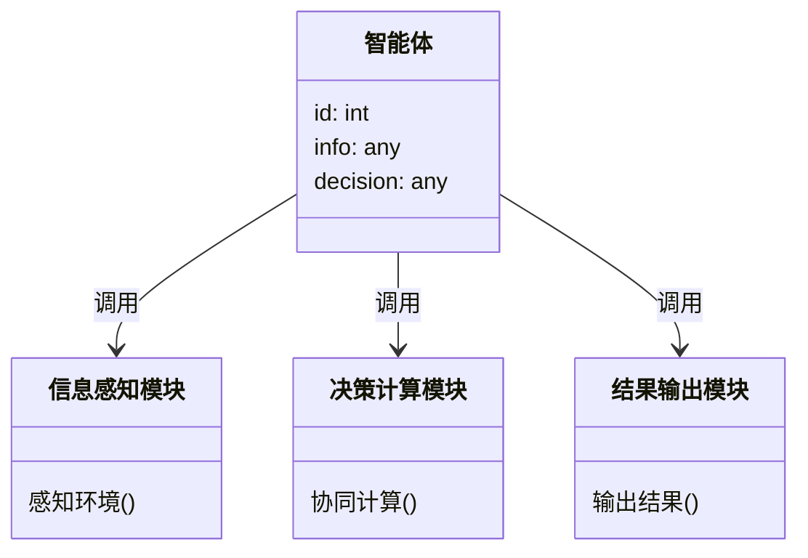
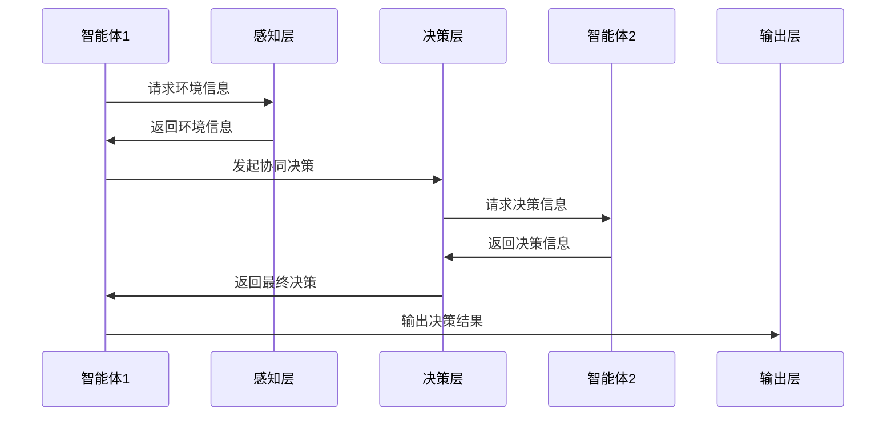

                 


# AI Agent的多智能体协同决策机制

> 关键词：多智能体系统，协同决策，分布式计算，一致性算法，博弈论模型

> 摘要：本文详细探讨了AI Agent在多智能体系统中的协同决策机制，从背景介绍、核心概念、算法原理到系统架构和项目实战，结合实际案例分析和最佳实践，为读者提供全面而深入的指导。

---

## 第1章: 多智能体协同决策机制的背景与概念

### 1.1 问题背景与描述

#### 1.1.1 多智能体系统的发展背景
随着人工智能技术的飞速发展，单智能体的决策方式已无法满足复杂场景的需求。多智能体系统通过多个智能体的协同工作，能够更高效地解决复杂问题，如自动驾驶、机器人协作、分布式计算等。

#### 1.1.2 协同决策问题的提出
在多智能体系统中，每个智能体都具有一定的自主性，但需要通过协同决策来实现整体目标。这涉及到信息共享、任务分配、冲突解决等多个方面。

#### 1.1.3 多智能体系统的核心特征
- **分布性**：智能体分布在不同的节点或位置，独立决策。
- **协作性**：智能体之间需要协同工作，共同完成任务。
- **动态性**：系统中环境和任务可能随时变化。

### 1.2 问题解决与边界

#### 1.2.1 多智能体协同决策的解决方案
通过分布式计算、一致性算法和博弈论模型，实现智能体之间的信息共享与协调。

#### 1.2.2 系统的边界与外延
- **边界**：系统内部的智能体协同决策，外部与用户或环境交互。
- **外延**：系统可能扩展到更大的网络或与其他系统集成。

#### 1.2.3 核心概念与关键要素
- **智能体**：具有感知和决策能力的实体。
- **协同决策**：智能体之间通过信息共享和协调，共同完成任务。

### 1.3 概念结构与核心要素

#### 1.3.1 智能体的定义与属性
智能体是具有自主性、反应性、目标导向和社交能力的实体。

#### 1.3.2 协同决策的机制与过程
通过信息共享、任务分配、冲突解决等机制，实现协同决策。

#### 1.3.3 多智能体系统的核心要素
- **信息共享**：智能体之间的信息传递与同步。
- **任务分配**：根据智能体的能力分配任务。
- **协调机制**：解决冲突，确保协同工作。

## 第2章: 多智能体协同决策的核心概念与联系

### 2.1 核心概念与原理

#### 2.1.1 分布式智能与集中式决策
分布式智能通过多个智能体的协同实现整体目标，而集中式决策则由一个中心节点统一决策。

#### 2.1.2 协作与竞争的关系
智能体之间需要在协作中竞争资源，以达到最优决策。

#### 2.1.3 多智能体系统中的信息共享与协调
信息共享是协同决策的基础，而协调机制确保智能体之间的一致性。

### 2.2 核心概念属性对比表

| 智能体类型 | 决策方式 | 信息共享 | 协调机制 |
|------------|----------|----------|----------|
| 单一智能体 | 独立决策 | 无共享   | 无协调   |
| 多智能体   | 协同决策 | 高共享   | 高协调   |

### 2.3 ER实体关系图

```mermaid
actor: 智能体
role: 决策者
```

### 2.4 本章小结
本章介绍了多智能体协同决策的核心概念，分析了分布式智能与集中式决策的关系，以及协作与竞争的动态平衡。

---

## 第3章: 多智能体协同决策的算法原理

### 3.1 协同决策算法原理

#### 3.1.1 分布式计算
通过分布式计算实现智能体之间的信息共享与协同。

#### 3.1.2 一致性算法
确保多个智能体之间的决策一致性。

#### 3.1.3 博弈论模型
通过博弈论模型解决智能体之间的竞争与协作问题。

### 3.2 分布式计算实现

#### 3.2.1 分布式计算流程
1. 智能体感知环境，获取信息。
2. 通过通信协议共享信息。
3. 执行分布式计算，做出决策。

#### 3.2.2 分布式计算的实现代码

```python
import threading

class Agent:
    def __init__(self, id):
        self.id = id
        self.info = None

    def set_info(self, info):
        self.info = info

    def get_info(self):
        return self.info

# 创建多个智能体实例
agents = [Agent(i) for i in range(5)]

# 模拟分布式计算
def distributed_computation(agent_id):
    agent = agents[agent_id]
    # 获取其他智能体的信息
    info = [a.get_info() for a in agents if a.id != agent_id]
    # 执行计算
    result = sum(info)  # 示例计算
    agent.set_info(result)

# 启动分布式计算
for i in range(5):
    threading.Thread(target=distributed_computation, args=(i,)).start()
```

### 3.3 一致性算法实现

#### 3.3.1 一致性算法的数学模型
$$ \text{一致性} = \frac{\sum_{i=1}^{n} |v_i - v_{\text{avg}}|}{n \times v_{\text{avg}}} $$

其中，\( v_i \) 是智能体i的决策值，\( v_{\text{avg}} \) 是平均值。

#### 3.3.2 一致性算法的实现代码

```python
import random

def一致性算法(n=5):
    agents = [random.random() for _ in range(n)]
    avg = sum(agents) / n
   一致性 = sum(abs(v - avg) for v in agents) / (n * avg)
    return 一致性

一致性算法(5)
```

### 3.4 博弈论模型实现

#### 3.4.1 博弈论模型的数学公式
$$ \text{纳什均衡} = \{ (a_i, a_j) | \forall i, j, a_i \text{是最佳反应} \} $$

#### 3.4.2 博弈论模型的实现代码

```python
def 纳什均衡(n=3):
    矩阵 = [[0, 1, 2], [1, 2, 0], [2, 0, 1]]
    nash = []
    for i in range(n):
        for j in range(n):
            if 矩阵[i][j] == max(矩阵[i]):
                nash.append( (i,j) )
    return nash

纳什均衡(3)
```

### 3.5 本章小结
本章详细讲解了多智能体协同决策的算法原理，包括分布式计算、一致性算法和博弈论模型，并通过代码示例进行了阐述。

---

## 第4章: 多智能体协同决策的系统架构设计

### 4.1 系统分析与架构设计

#### 4.1.1 问题场景介绍
设计一个多智能体协同决策系统，用于自动驾驶场景中的路径规划与决策。

#### 4.1.2 系统功能设计

##### 4.1.2.1 系统功能模块
- **信息感知模块**：获取环境信息。
- **决策计算模块**：执行协同决策。
- **结果输出模块**：输出决策结果。

##### 4.1.2.2 系统功能设计的类图



#### 4.1.3 系统架构设计

##### 4.1.3.1 系统架构图

```mermaid
container 多智能体系统 {
    智能体1
    智能体2
    智能体3
    信息共享层
}
```

#### 4.1.4 系统接口设计

##### 4.1.4.1 系统接口描述
- **感知接口**：智能体感知环境信息。
- **决策接口**：智能体之间协同决策。
- **输出接口**：输出决策结果。

##### 4.1.4.2 系统接口交互图



### 4.2 本章小结
本章详细分析了多智能体协同决策系统的架构设计，包括功能模块、类图和接口设计，为实际开发提供了指导。

---

## 第5章: 多智能体协同决策的项目实战

### 5.1 项目实战

#### 5.1.1 环境安装
安装必要的库，如`threading`、`mermaid`等。

#### 5.1.2 核心代码实现

##### 5.1.2.1 智能体类实现

```python
class Agent:
    def __init__(self, id):
        self.id = id
        self.info = None
        self.decision = None

    def set_info(self, info):
        self.info = info

    def get_info(self):
        return self.info

    def decide(self):
        # 示例决策逻辑
        if self.info is not None:
            self.decision = self.info * 2
```

##### 5.1.2.2 协同决策实现

```python
import threading

def协同决策():
    agents = [Agent(i) for i in range(5)]
    for i in range(5):
        threading.Thread(target=agent.decide(), args=(i,)).start()
    return [a.decision for a in agents]

协同决策()
```

#### 5.1.3 案例分析
在自动驾驶场景中，多个智能体协同决策，完成路径规划和避障。

#### 5.1.4 项目小结
通过实际案例分析，验证了多智能体协同决策机制的有效性。

---

## 第6章: 多智能体协同决策的最佳实践

### 6.1 最佳实践

#### 6.1.1 小结
总结全文内容，强调多智能体协同决策的重要性。

#### 6.1.2 注意事项
- **信息共享**：确保信息的安全性和准确性。
- **任务分配**：根据智能体的能力合理分配任务。
- **冲突解决**：设计有效的冲突解决机制。

#### 6.1.3 拓展阅读
推荐相关书籍和论文，进一步深入学习。

---

## 作者

作者：AI天才研究院/AI Genius Institute & 禅与计算机程序设计艺术 /Zen And The Art of Computer Programming

