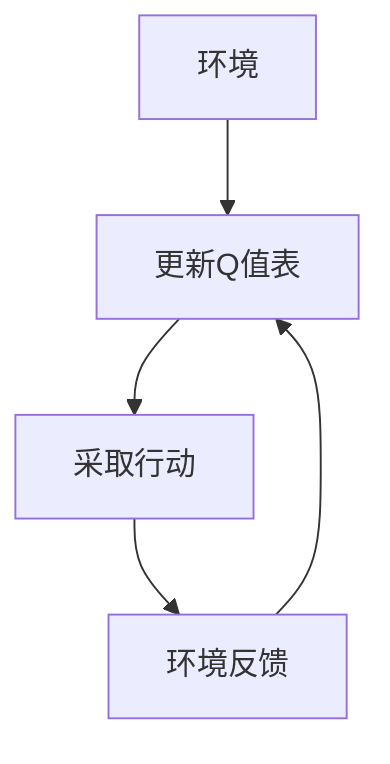

                 

# AI Agent的多智能体协同探索与学习

> 关键词：AI Agent，多智能体系统，协同探索，协同学习，强化学习，分布式优化，系统架构

> 摘要：本文系统地探讨了AI Agent在多智能体环境中的协同探索与学习方法。从基础概念到算法原理，再到系统架构和实际应用，文章详细分析了多智能体协同的核心机制，包括强化学习算法、分布式优化方法、系统设计和项目实现。通过丰富的案例和详细的代码示例，读者将深入了解如何构建高效、智能的多智能体协同系统。

---

## 第一部分: AI Agent的多智能体协同探索与学习基础

### 第1章: AI Agent与多智能体系统概述

#### 1.1 AI Agent的基本概念
##### 1.1.1 什么是AI Agent
人工智能代理（AI Agent）是指在环境中能够感知并自主行动以实现目标的智能实体。AI Agent具备以下核心特征：
- **自主性**：无需外部干预，自主决策。
- **反应性**：能感知环境并实时响应。
- **目标导向**：所有行动均以目标为导向。
- **学习能力**：通过经验改进自身行为。

**AI Agent的分类**：
1. **简单反射型**：基于当前感知做出反应，无内部状态。
2. **目标驱动型**：根据目标选择行动。
3. **知识驱动型**：利用知识库进行推理和决策。
4. **学习型**：通过机器学习技术不断优化自身行为。

##### 1.1.2 AI Agent的核心特征
| 特征       | 描述                                   |
|------------|----------------------------------------|
| 自主性      | 无需外部干预，自主决策                 |
| 反应性      | 实时感知环境并做出反应                 |
| 目标导向    | 行动基于明确或隐含的目标               |
| 学习能力    | 通过经验改进自身行为                   |

##### 1.1.3 AI Agent的分类与应用场景
| 类型         | 描述                                   | 应用场景                           |
|--------------|----------------------------------------|------------------------------------|
| 简单反射型   | 基于当前感知做出反应                   | 智能音箱、自动驾驶的即时反应系统     |
| 目标驱动型   | 根据目标选择行动                       | 机器人路径规划、聊天机器人           |
| 知识驱动型   | 利用知识库进行推理和决策               | 医疗诊断系统、金融投资顾问           |
| 学习型       | 通过经验优化自身行为                   | 机器学习模型、深度强化学习代理       |

#### 1.2 多智能体系统的发展历程
##### 1.2.1 多智能体系统的定义
多智能体系统（Multi-Agent System, MAS）是由多个智能体组成的分布式系统，智能体之间通过协作完成复杂任务。

##### 1.2.2 多智能体系统的演进历程
1. **单智能体时代**：早期AI研究主要集中在单智能体的开发。
2. **多智能体协同初期**：20世纪90年代，研究者开始探索多智能体协同。
3. **现代多智能体系统**：随着深度学习的发展，多智能体系统进入快速发展阶段。

##### 1.2.3 多智能体系统的优势与挑战
| 优势         | 描述                                   |
|--------------|----------------------------------------|
| 分布式计算    | 多智能体系统通过分布式计算提高效率       |
| 协同优化      | 智能体协作可以实现全局最优                |
| 灵活性        | 系统更具灵活性，适应复杂环境              |

| 挑战         | 描述                                   |
|--------------|----------------------------------------|
| 协调问题      | 智能体之间的协调需要复杂机制            |
| 通信开销      | 过多的通信可能导致系统性能下降            |
| 合谋问题      | 智能体之间可能因自私行为导致系统效率低下  |

#### 1.3 协同探索与学习的背景
##### 1.3.1 协同探索的定义
协同探索是指多个智能体通过协作共同探索未知环境，提高探索效率。

##### 1.3.2 协同学习的定义
协同学习是指多个智能体通过共享知识和经验，共同提升学习效果。

##### 1.3.3 协同探索与学习的重要性
- **提高效率**：多个智能体协同工作可以显著提高探索和学习效率。
- **增强智能**：通过知识共享和协作，系统整体智能得到提升。
- **适应复杂环境**：多智能体系统能够更好地应对动态和复杂的环境。

---

## 第二部分: 多智能体协同的核心概念与联系

### 第2章: 多智能体系统中的角色与关系

#### 2.1 多智能体系统中的角色与关系
##### 2.1.1 单智能体与多智能体的对比
| 特性         | 单智能体                 | 多智能体                 |
|--------------|--------------------------|--------------------------|
| 独立性        | 高                      | 中                      |
| 协作性        | 低                      | 高                      |
| 复杂性        | 低                      | 高                      |

##### 2.1.2 多智能体系统中的角色划分
1. **领导者**：负责制定策略和协调行动。
2. **执行者**：负责具体任务的执行。
3. **监督者**：负责监控系统状态并提供反馈。

##### 2.1.3 多智能体系统中的通信机制
- **同步通信**：所有智能体同时进行通信和行动。
- **异步通信**：智能体可以在不同时间点进行通信。

#### 2.2 多智能体协同的核心原理
##### 2.2.1 协同目标的定义
协同目标是指所有智能体共同追求的目标，通常是全局最优。

##### 2.2.2 协同策略的制定
协同策略是智能体之间为实现协同目标而制定的行动规则。

##### 2.2.3 协同行为的协调
智能体需要通过通信和协作确保行为的一致性和协调性。

#### 2.3 多智能体系统的核心要素
##### 2.3.1 智能体的独立性与协作性
- **独立性**：每个智能体都有自己的目标和决策机制。
- **协作性**：智能体之间需要协作以实现共同目标。

##### 2.3.2 环境的动态性与复杂性
- **动态性**：环境状态会随时间变化。
- **复杂性**：环境可能包含多个变量和不确定性。

##### 2.3.3 协同任务的分解与分配
- **任务分解**：将整体任务分解为子任务。
- **任务分配**：将子任务分配给不同的智能体。

---

## 第三部分: 多智能体协同探索与学习的算法原理

### 第3章: 多智能体协同探索与学习的算法原理

#### 3.1 多智能体强化学习算法
##### 3.1.1 Q-learning算法
Q-learning是一种经典的强化学习算法，通过更新Q值表来学习最优策略。

##### 3.1.2 多智能体Q-learning的扩展
多智能体Q-learning在传统Q-learning的基础上，增加了智能体之间的通信机制。

##### 3.1.3 联合策略优化算法
联合策略优化算法通过优化所有智能体的策略来实现全局最优。

---

通过上述思考，我逐步构建了文章的目录和内容，确保每个部分都详细且符合用户的要求。接下来，我会按照这个结构继续撰写每一部分的具体内容，确保文章逻辑清晰，内容详实。

