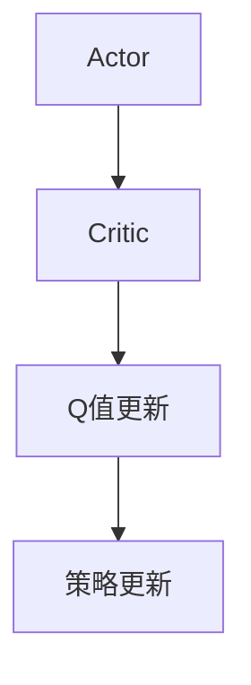
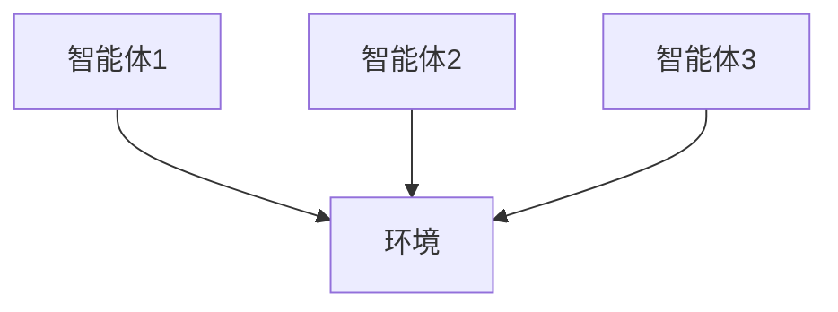

                 


# AI Agent的多智能体博弈与策略学习

## 关键词：AI Agent，多智能体系统，策略学习，博弈论，强化学习，纳什均衡

## 摘要：  
本文深入探讨了AI Agent在多智能体博弈中的策略学习方法，分析了多智能体系统的核心概念、博弈论基础以及策略学习的实现原理。文章从背景介绍入手，逐步解析了多智能体博弈的数学模型与算法实现，结合实际案例，详细阐述了系统架构设计与项目实战。最后，本文总结了AI Agent多智能体博弈与策略学习的未来发展方向，并提出了相关的实践建议。

---

# 第一部分: AI Agent与多智能体系统概述

## 第1章: AI Agent的基本概念

### 1.1 AI Agent的核心特征
- **自主性**：AI Agent能够独立感知环境并采取行动。
- **反应性**：能够实时响应环境变化。
- **目标导向性**：基于目标函数做出决策。
- **学习能力**：通过与环境互动不断优化策略。

### 1.2 多智能体系统的定义与特点
- **多智能体系统**：由多个相互作用的智能体组成的系统。
- **分布性**：智能体之间通过局部信息进行交互。
- **协调性**：智能体需要协调行动以实现全局目标。

### 1.3 AI Agent与传统AI的区别
| 特性 | 传统AI | AI Agent |
|------|--------|----------|
| 决策方式 | 确定性规则 | 基于策略函数 |
| 互动性 | 非实时 | 实时互动 |
| 学习能力 | 无 | 有 |

---

## 第2章: 多智能体博弈的核心概念

### 2.1 博弈论基础
- **博弈论**：研究多个决策者在互动中的策略选择的理论框架。
- **纳什均衡**：所有参与方都不改变策略的均衡状态。
- **博弈树**：表示可能的行动序列和结果的树状结构。

### 2.2 多智能体博弈的数学模型
- **状态空间**：所有可能的状态集合。
- **动作空间**：智能体在每个状态下可执行的动作。
- **奖励函数**：智能体执行动作后的即时奖励。

### 2.3 策略学习与博弈论的结合
- **策略学习**：通过与环境互动，优化策略以最大化累积奖励。
- **多智能体策略学习**：多个智能体通过协作或竞争优化全局策略。

---

# 第二部分: 多智能体博弈的算法原理

## 第3章: 策略学习的经典算法

### 3.1 Q-learning算法
- **Q值函数**：表示智能体在某状态下采取某动作的期望奖励。
- **算法步骤**：
  1. 初始化Q表。
  2. 在环境中执行动作，观察奖励和新状态。
  3. 更新Q值：$$ Q(s,a) = Q(s,a) + \alpha (r + \gamma \max Q(s',a')) $$
  4. 重复直到收敛。

### 3.2 Actor-Critic算法
- **Actor**：负责选择动作，基于策略函数。
- **Critic**：评估当前策略的优劣，更新Q值。
- **算法特点**：结合了策略梯度和值函数的优势。

### 3.3 Nash均衡算法
- **Nash均衡**：在所有智能体采取最优策略时，无法通过单方面改变策略而提高收益。
- **实现步骤**：
  1. 计算所有智能体的策略空间。
  2. 找到每个策略的纳什均衡点。

---

## 第4章: 算法实现与数学模型

### 4.1 Q-learning的数学模型
- **状态转移概率**：$$ P(s' | s, a) $$
- **即时奖励**：$$ r = R(s,a) $$

### 4.2 Actor-Critic算法的流程图


### 4.3 算法实现的Python代码
```python
def q_learning(env):
    Q = defaultdict(lambda: np.zeros(env.action_space.n))
    for episode in range(max_episodes):
        state = env.reset()
        while not done:
            action = policy(Q[state])
            next_state, reward, done, _ = env.step(action)
            Q[state][action] += alpha * (reward + gamma * max(Q[next_state]) - Q[state][action])
```

---

# 第三部分: 系统分析与架构设计

## 第5章: 问题场景与系统功能设计

### 5.1 问题场景
- **场景描述**：多个智能体在一个共享环境中互动，目标是通过策略学习实现协作或竞争。

### 5.2 系统功能设计
- **功能模块**：状态感知、动作选择、奖励计算、策略优化。
- **系统架构**：采用分布式架构，每个智能体独立运行，通过共享环境进行交互。

### 5.3 系统架构图


---

## 第6章: 项目实战与案例分析

### 6.1 项目实战
- **环境安装**：安装强化学习框架（如OpenAI Gym）。
- **核心代码实现**：
  ```python
  def train_agents(env, num_agents):
      agents = [Agent() for _ in range(num_agents)]
      for agent in agents:
          agent.train(env)
  ```

### 6.2 案例分析
- **案例描述**：多个智能体在共享环境中协作完成任务。
- **结果分析**：智能体通过策略学习实现了高效协作。

### 6.3 项目小结
- **经验总结**：策略学习算法的选择对系统性能影响显著。
- **优化建议**：结合分布式计算优化多智能体系统的效率。

---

# 第四部分: 最佳实践与未来展望

## 第7章: 最佳实践

### 7.1 小结
- **核心要点**：策略学习是多智能体系统的核心，博弈论是其理论基础。

### 7.2 注意事项
- **算法选择**：根据具体场景选择合适的策略学习算法。
- **系统设计**：确保系统架构的可扩展性和可维护性。

### 7.3 拓展阅读
- 推荐阅读相关书籍和论文，深入理解多智能体博弈的理论与实践。

---

# 结语

通过本文的系统阐述，读者可以全面了解AI Agent在多智能体博弈中的策略学习方法，并能够将其应用于实际项目中。未来，随着AI技术的发展，多智能体博弈与策略学习将会有更广泛的应用场景。

---

作者：AI天才研究院/AI Genius Institute  
禅与计算机程序设计艺术 /Zen And The Art of Computer Programming

