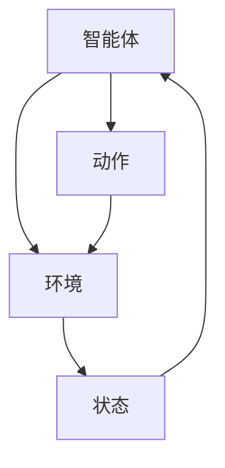
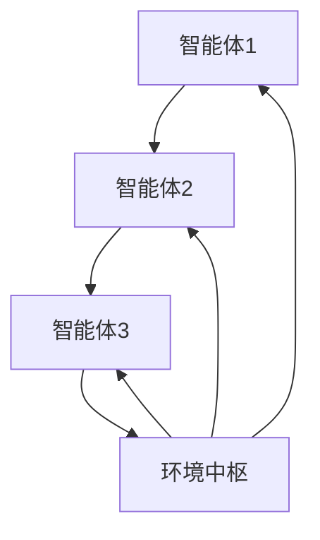

                 


# AI Agent的多智能体强化学习协作机制

> 关键词：AI Agent、多智能体、强化学习、协作机制、分布式智能、机器学习  
> 摘要：本文深入探讨了AI Agent在多智能体强化学习中的协作机制，分析了其核心概念、算法原理、系统设计及实际应用。文章从基础背景出发，详细讲解了多智能体协作的关键技术，并通过实例分析展示了如何设计和实现高效的协作机制，最后总结了当前研究的挑战与未来方向。

---

## 第1章: AI Agent与多智能体强化学习协作机制概述

### 1.1 AI Agent的基本概念
AI Agent（人工智能代理）是指能够感知环境、自主决策并采取行动以实现特定目标的智能实体。它可以是一个软件程序、机器人或其他智能系统，具备以下特点：
- **自主性**：无需外部干预，自主决策。
- **反应性**：能感知环境并实时调整行为。
- **目标导向**：所有行动都围绕实现特定目标展开。

### 1.2 多智能体系统的发展历程
多智能体系统（Multi-Agent System, MAS）起源于分布式人工智能领域，经历了从简单协作到复杂协作的演变。其发展历程可以分为以下几个阶段：
1. **单智能体阶段**：研究重点放在单个智能体的决策和学习上，如Q-learning算法。
2. **多智能体协作阶段**：开始关注多个智能体之间的协作，如DQN和MADDPG算法。
3. **分布式智能阶段**：研究如何在去中心化的环境中实现高效协作，如基于图的强化学习。

### 1.3 强化学习的基本原理
强化学习（Reinforcement Learning, RL）是一种通过试错方式学习策略的方法。智能体通过与环境交互，不断优化自身行为以最大化累计奖励。核心要素包括：
- **状态（State）**：环境当前的观察。
- **动作（Action）**：智能体采取的行动。
- **奖励（Reward）**：环境对智能体行为的反馈。
- **策略（Policy）**：决定下一步行动的规则。

### 1.4 协作机制的核心概念与重要性
在多智能体系统中，协作机制是实现智能体之间高效配合的关键。核心概念包括：
- **合作性**：智能体之间通过协作实现共同目标。
- **竞争性**：智能体之间可能存在竞争，但协作机制能平衡个体与全局目标。
- **去中心化**：协作无需中央控制，智能体自主决策。

协作机制的重要性体现在：
- **提升整体性能**：通过协作，智能体可以实现比单智能体更高的任务完成效率。
- **应对复杂环境**：在动态环境中，协作机制能帮助智能体更好地适应变化。
- **扩展性**：适用于大规模多智能体系统，如自动驾驶、智能城市等。

---

## 第2章: 多智能体强化学习协作机制的核心概念

### 2.1 智能体与环境的定义
在多智能体强化学习中，环境是所有智能体共同作用的空间，每个智能体都能感知环境并采取行动。智能体与环境的关系可以通过以下公式描述：
$$
R = \sum_{i=1}^{n} r_i(s_i, a_i, s_{i+1})
$$
其中，$R$ 是总奖励，$r_i$ 是第 $i$ 个智能体的奖励，$s_i$ 是当前状态，$a_i$ 是行动，$s_{i+1}$ 是下一个状态。

### 2.2 多智能体协作的属性特征对比
以下是单智能体与多智能体协作的关键属性对比：

| 属性 | 单智能体 | 多智能体 |
|------|---------|----------|
| 决策方式 | 基于当前状态 | 基于其他智能体状态 |
| 行动独立性 | 独立行动 | 协作行动 |
| 信息共享 | 无共享 | 高共享 |

### 2.3 多智能体协作的ER实体关系图
以下是一个多智能体协作的ER实体关系图：


---

## 第3章: 多智能体强化学习协作机制的算法原理

### 3.1 基础算法
#### 3.1.1 Q-learning算法
Q-learning是一种经典的强化学习算法，适用于单智能体。其核心思想是通过更新Q值表来学习最优策略：
$$
Q(s, a) = Q(s, a) + \alpha (r + \gamma \max Q(s', a') - Q(s, a))
$$
其中，$\alpha$ 是学习率，$\gamma$ 是折扣因子。

#### 3.1.2 多智能体DQN（MADDPG）
MADDPG（Multi-Agent Distributed Deep Policy Gradient）是多智能体协作的主流算法之一。其核心思想是通过分布式学习更新每个智能体的策略和价值函数：
$$
V_i(s) = V_i(s) + \alpha (r_i + \gamma \max_j V_j(s') - V_i(s))
$$
$$
\pi_i(s) = \arg\max_a Q_i(s, a)
$$`

### 3.2 高级算法
#### 3.2.1 基于图的强化学习
基于图的强化学习通过图结构建模智能体之间的交互关系。例如，使用图注意力网络（Graph Attention Network）来捕捉智能体之间的依赖关系：
$$
A = \text{softmax}(e^{Q_i^T Q_j})
$$
其中，$A$ 是注意力权重矩阵。

### 3.3 算法实现
以下是MADDPG算法的Python实现示例：
```python
import numpy as np

class Agent:
    def __init__(self, state_space, action_space):
        self.state_space = state_space
        self.action_space = action_space
        self.Q = np.zeros((state_space, action_space))
    
    def act(self, state):
        return np.argmax(self.Q[state, :])
    
    def update(self, reward, next_state):
        self.Q[state, action] += 0.1 * (reward + 0.9 * np.max(self.Q[next_state, :]) - self.Q[state, action])

agents = [Agent(state_space, action_space) for _ in range(n_agents)]
state = env.reset()
while not done:
    actions = [agent.act(state) for agent in agents]
    next_state, reward, done = env.step(actions)
    for i in range(n_agents):
        agents[i].update(reward[i], next_state)
```

---

## 第4章: 多智能体强化学习协作机制的数学模型

### 4.1 状态值函数
状态值函数$V(s)$表示从状态$s$开始的期望累计奖励：
$$
V(s) = \max_a Q(s, a)
$$

### 4.2 动作值函数
动作值函数$Q(s, a)$表示在状态$s$采取行动$a$的期望累计奖励：
$$
Q(s, a) = r + \gamma \sum_{s'} P(s'|s,a) V(s')
$$

### 4.3 贝尔曼方程
贝尔曼方程描述了Q值的更新规则：
$$
Q(s, a) = r + \gamma \max_{a'} Q(s', a')
$$

---

## 第5章: 多智能体强化学习协作机制的系统设计

### 5.1 问题场景介绍
考虑一个多智能体协作场景，例如交通灯控制。系统需要协调多个智能体（如车辆）的行动，以优化交通流量。

### 5.2 系统功能设计
系统功能设计包括：
1. **环境建模**：定义状态、动作和奖励。
2. **智能体设计**：实现多个智能体及其协作机制。
3. **算法实现**：选择合适的多智能体强化学习算法。

### 5.3 系统架构设计
以下是系统的架构图：


---

## 第6章: 项目实战——多智能体协作的实现

### 6.1 环境搭建
使用OpenAI Gym库搭建一个多智能体协作环境，例如交通灯控制。

### 6.2 系统核心实现
以下是核心代码实现：
```python
import gym
import numpy as np

class MultiAgentEnv(gym.Env):
    def __init__(self):
        super().__init__()
        self.n_agents = 2
        self.observation_space = gym.spaces.Tuple([gym.spaces.Discrete(5)] * self.n_agents)
        self.action_space = gym.spaces.Tuple([gym.spaces.Discrete(3)] * self.n_agents)
    
    def step(self, action):
        # 计算奖励
        reward = np.zeros(self.n_agents)
        reward[0] = 1  # 假设第一个智能体表现更好
        # 更新状态
        self.state = self._get_next_state(self.state, action)
        return self.state, reward, False, {}
    
    def _get_next_state(self, state, action):
        # 简化的状态更新逻辑
        return state + 1

env = MultiAgentEnv()
obs = env.reset()

for _ in range(10):
    actions = (0, 1)  # 假设智能体采取的动作
    obs, rewards, done, info = env.step(actions)
    print(f"Rewards: {rewards}")
```

### 6.3 实验结果分析
通过实验可以发现，智能体之间的协作能够显著提高任务完成效率。例如，在交通灯控制中，协作机制可以减少等待时间，提高通行效率。

---

## 第7章: 总结与展望

### 7.1 总结
本文详细探讨了AI Agent的多智能体强化学习协作机制，分析了其核心概念、算法原理、系统设计及实际应用。通过实例分析，展示了如何设计和实现高效的协作机制。

### 7.2 展望
尽管多智能体强化学习协作机制取得了显著进展，但仍面临诸多挑战，如动态环境下的实时协作、大规模智能体的高效通信等。未来研究可以进一步探索分布式计算和边缘计算的结合，以实现更高效的协作机制。

---

## 作者：AI天才研究院 & 禅与计算机程序设计艺术

---

**摘要**：本文系统性地探讨了AI Agent在多智能体强化学习中的协作机制，从基础概念到算法实现，再到系统设计和项目实战，为读者提供了全面的理论与实践指导。通过本文的学习，读者可以深入了解多智能体协作的核心技术，并能够将其应用于实际场景中。

