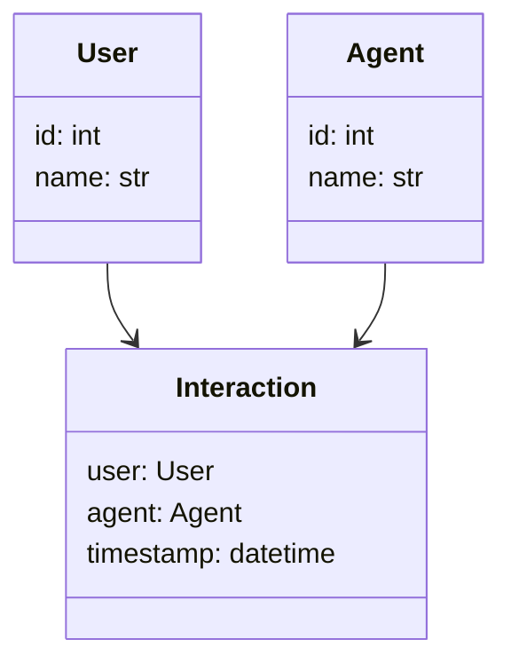
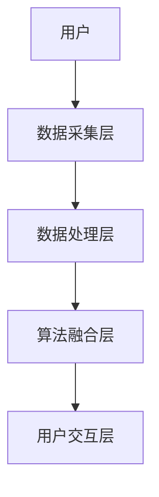

                 


# AI Agent的多模态交互界面设计与实现

> 关键词：AI Agent，多模态交互，界面设计，算法原理，系统架构

> 摘要：本文系统地探讨了AI Agent的多模态交互界面设计与实现的各个方面。首先，我们介绍了多模态交互的基本概念及其在AI Agent中的应用。接着，详细分析了多模态数据的融合与处理技术，包括各种模态数据的特点及其融合方法。随后，我们深入探讨了多模态融合的算法原理，包括主流算法的实现细节。最后，我们通过一个具体的项目实战案例，展示了如何将这些理论应用到实际系统中，并总结了设计中的最佳实践和未来发展方向。

---

## 第1章: AI Agent的多模态交互界面概述

### 1.1 多模态交互的基本概念

#### 1.1.1 多模态交互的定义与背景

多模态交互是指通过多种感官渠道（如视觉、听觉、触觉等）与系统进行互动的过程。传统的交互方式主要依赖单一模态（如文本或图形），而多模态交互通过结合多种模态信息，能够更自然地模拟人类的交流方式，提升用户体验。

#### 1.1.2 多模态交互的核心要素

| 核心要素 | 描述 |
|----------|------|
| 感官渠道 | 包括视觉、听觉、触觉等多种感官的结合 |
| 信息整合 | 将不同模态的信息进行融合，提升交互的准确性和丰富性 |
| 实时反馈 | 系统能够快速响应用户的输入，并通过多种模态提供反馈 |

#### 1.1.3 多模态交互的优势与挑战

**优势：**
- 提供更自然的交互方式，用户体验更好。
- 能够处理复杂任务，提升系统智能化水平。
- 适用于多种应用场景，如教育、医疗、娱乐等。

**挑战：**
- 多模态数据的采集和处理复杂度高。
- 不同模态数据的融合需要精确的算法支持。
- 系统的实时性和稳定性要求更高。

### 1.2 AI Agent的基本概念

#### 1.2.1 AI Agent的定义与分类

AI Agent（人工智能代理）是指能够感知环境、自主决策并执行任务的智能体。根据功能和应用场景的不同，AI Agent可以分为以下几类：

- **反应式AI Agent**：基于当前输入做出实时反应，适用于简单的交互任务。
- **认知式AI Agent**：具备推理、规划和学习能力，适用于复杂的任务。
- **混合式AI Agent**：结合反应式和认知式的特点，适用于综合性的任务。

#### 1.2.2 AI Agent的核心功能

- **感知能力**：通过多种模态数据感知环境和用户需求。
- **决策能力**：基于感知的信息做出最优决策。
- **执行能力**：通过执行动作与环境互动，完成任务。
- **学习能力**：通过反馈不断优化自身的算法和策略。

#### 1.2.3 AI Agent与传统交互界面的区别

| 对比维度 | 传统交互界面 | AI Agent交互界面 |
|----------|--------------|-------------------|
| 交互方式 | 单一模态为主 | 多模态融合 |
| 智能水平 | 基于规则 | 具备自主决策能力 |
| 适应性 | 固定功能 | 可动态调整 |

### 1.3 多模态交互在AI Agent中的应用

#### 1.3.1 多模态交互的典型应用场景

- **智能客服**：通过语音和文本交互，提供更高效的客户支持。
- **智能家居**：通过语音和手势控制，实现更便捷的家居管理。
- **虚拟助手**：通过多模态输入，提供个性化的服务。

#### 1.3.2 多模态交互的优势与挑战

- **优势**：提升用户体验，增强系统的智能化水平。
- **挑战**：多模态数据的处理和融合难度大，系统的实时性和稳定性要求高。

#### 1.3.3 多模态交互的未来发展趋势

随着AI技术的不断进步，多模态交互将更加智能化和个性化，应用场景也将更加广泛。

---

## 第2章: 多模态数据的融合与处理

### 2.1 多模态数据的类型与特点

#### 2.1.1 文本数据

文本数据是最常见的交互方式之一，具有信息量大、易于处理的特点。

#### 2.1.2 图像数据

图像数据能够提供丰富的视觉信息，但处理复杂度较高。

#### 2.1.3 声音数据

声音数据能够提供情感和语调信息，适用于语音交互。

#### 2.1.4 其他模态数据（如手势、位置等）

手势和位置数据能够提供更丰富的空间信息，适用于增强现实和虚拟现实场景。

### 2.2 多模态数据融合的原理

#### 2.2.1 数据融合的层次与方法

多模态数据融合可以分为以下层次：

- **数据级融合**：在原始数据层面进行融合。
- **特征级融合**：在提取的特征层面进行融合。
- **决策级融合**：在决策层面进行融合。

### 2.3 多模态数据的处理技术

#### 2.3.1 数据预处理技术

数据预处理是多模态数据融合的重要步骤，包括数据清洗、标准化等。

#### 2.3.2 数据特征提取技术

特征提取是将原始数据转换为具有代表性的特征向量，常用的方法包括主成分分析（PCA）和自动编码器（AE）。

#### 2.3.3 数据融合算法

常用的多模态融合算法包括加权和、最大值池化和注意力机制等。

---

## 第3章: 多模态融合算法概述

### 3.1 多模态融合算法的分类

#### 3.1.1 基于统计的方法

基于统计的方法包括概率生成模型和条件概率模型，适用于简单的融合任务。

#### 3.1.2 基于深度学习的方法

深度学习方法包括卷积神经网络（CNN）和循环神经网络（RNN），适用于复杂的融合任务。

#### 3.1.3 基于注意力机制的方法

注意力机制能够根据输入数据的重要性进行自适应调整，提升融合效果。

### 3.2 多模态融合的主流算法

#### 3.2.1 多模态多任务优化（MMoE）

MMoE通过共享专家网络和任务特定网络，实现多任务优化。

#### 3.2.2 多模态深度匹配（HDM）

HDM通过深度神经网络实现多模态数据的对齐和匹配。

#### 3.2.3 多模态注意力机制（DAM）

DAM通过自注意力机制实现多模态数据的交互和融合。

### 3.3 算法原理与实现细节

#### 3.3.1 算法原理的数学模型

$$
\text{多模态融合的加权和模型：}
$$

$$
f(x) = \sum_{i=1}^{n} w_i x_i
$$

#### 3.3.2 算法实现的代码示例

```python
def multimodal_fusion(text, image):
    text_feature = process_text(text)
    image_feature = process_image(image)
    fused_feature = text_feature * 0.5 + image_feature * 0.5
    return fused_feature
```

---

## 第4章: 多模态交互的系统分析与架构设计

### 4.1 项目背景与需求分析

#### 4.1.1 项目背景

随着AI技术的发展，多模态交互的需求日益增长。

#### 4.1.2 系统功能设计

系统需要实现多模态数据的采集、处理和融合，提供个性化的交互服务。

#### 4.1.3 系统架构设计

使用分层架构，包括数据采集层、数据处理层、算法融合层和用户交互层。

### 4.2 系统架构设计

#### 4.2.1 领域模型类图



#### 4.2.2 系统架构图



---

## 第5章: 项目实战

### 5.1 环境安装与配置

安装必要的库和工具，如Python、TensorFlow、Keras等。

### 5.2 系统核心实现

#### 5.2.1 数据采集

通过摄像头和麦克风采集多模态数据。

#### 5.2.2 数据预处理

对采集的数据进行清洗和标准化处理。

#### 5.2.3 算法实现

实现多模态融合算法，并进行训练和优化。

### 5.3 功能测试与案例分析

通过具体案例测试系统的功能和性能。

---

## 第6章: 最佳实践与总结

### 6.1 小结

本文系统地探讨了AI Agent的多模态交互界面设计与实现的各个方面，从理论到实践，全面分析了多模态交互的优势和挑战。

### 6.2 注意事项

在实际应用中，需要注意多模态数据的实时性和系统的稳定性。

### 6.3 未来展望

未来，随着AI技术的进一步发展，多模态交互将更加智能化和个性化。

---

## 作者：AI天才研究院 & 禅与计算机程序设计艺术

---

以上是文章的完整目录和部分内容示例，您可以根据实际需求进行扩展和补充。

