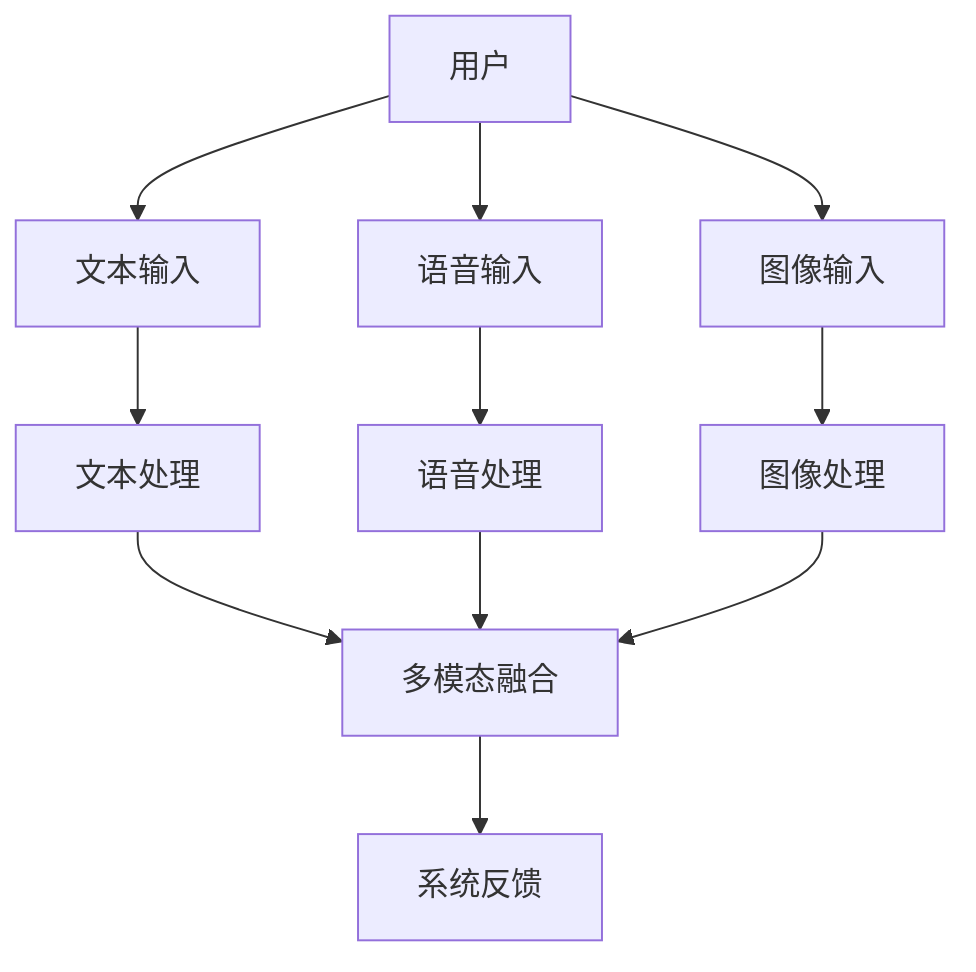
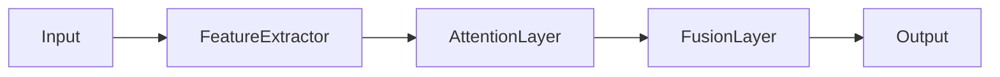
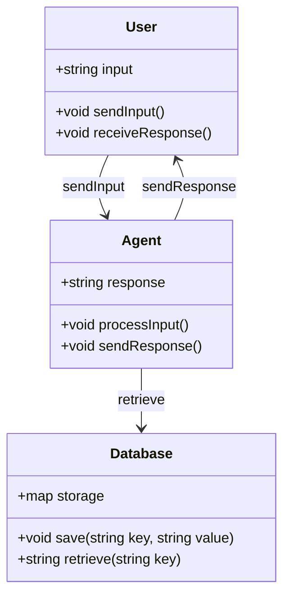
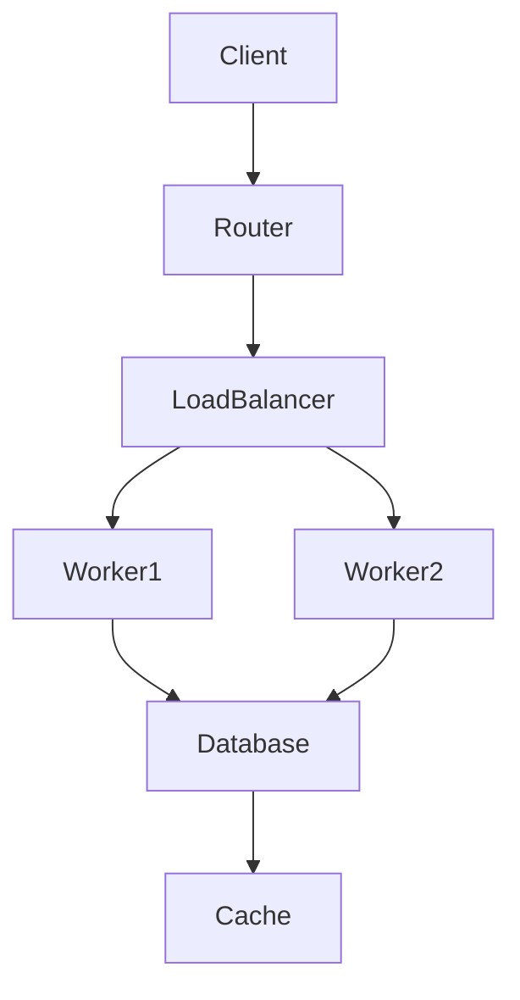
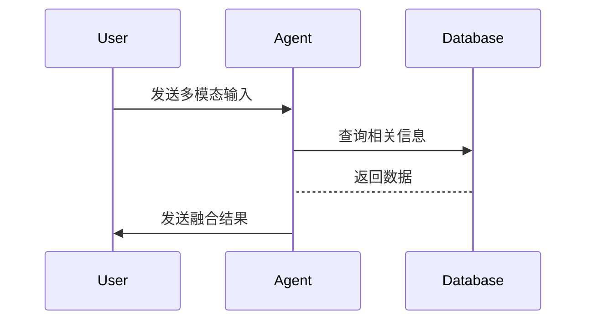

                 


# AI Agent的多模态交互设计

## 关键词
AI Agent, 多模态交互, 注意力机制, 多模态融合, 实时交互

## 摘要
AI Agent的多模态交互设计是实现人机高效协作的关键技术。通过整合文本、语音、图像等多种模态信息，AI Agent能够更准确地理解用户意图并提供个性化的服务。本文详细探讨了AI Agent的多模态交互设计的基础概念、核心算法、系统架构及实际应用，为读者提供了全面的技术指南。

---

# 第一部分: AI Agent的多模态交互设计基础

## 第1章: AI Agent的基本概念与背景

### 1.1 AI Agent的定义与类型
#### 1.1.1 什么是AI Agent
AI Agent（人工智能代理）是指能够感知环境、自主决策并执行任务的智能实体。它通过传感器获取信息，利用计算模型进行分析，并通过执行器与环境交互。

#### 1.1.2 AI Agent的类型
1. **简单反射型AI Agent**：基于预定义规则进行反应，适用于简单的决策任务。
2. **基于模型的AI Agent**：维护环境模型，能够预测未来状态并进行规划。
3. **目标驱动型AI Agent**：根据目标选择最优行动，适用于复杂任务。
4. **学习增强型AI Agent**：通过机器学习提升性能，适应复杂环境。

#### 1.1.3 AI Agent的核心特征
1. **自主性**：无需外部干预，自主决策。
2. **反应性**：实时感知并响应环境变化。
3. **目标导向性**：根据目标选择行动策略。
4. **学习能力**：通过经验优化性能。

### 1.2 多模态交互的必要性
#### 1.2.1 多模态交互的定义
多模态交互是指通过整合多种信息模态（如文本、语音、图像、视频等）进行信息传递和交互的方式。与单一模态相比，多模态交互能够提供更丰富的信息，提升交互的准确性和用户体验。

#### 1.2.2 多模态交互的优势
1. **信息互补性**：不同模态信息相互补充，提高理解精度。
2. **用户体验优化**：多样化的交互方式提升用户满意度。
3. **任务处理效率**：多模态信息处理能够提升任务执行效率。

#### 1.2.3 多模态交互的应用场景
1. **智能客服**：整合文本和语音信息，提供更精准的服务。
2. **智能家居**：通过语音和传感器数据实现智能化控制。
3. **医疗健康**：结合图像和语音信息，辅助医生进行诊断。

---

## 第2章: 多模态交互的核心概念与联系

### 2.1 多模态交互的原理
#### 2.1.1 多模态数据的采集与处理
1. **文本处理**：包括自然语言理解、实体识别等。
2. **语音处理**：包括语音识别、情感分析等。
3. **图像处理**：包括目标检测、图像分割等。

#### 2.1.2 多模态数据的融合机制
多模态数据融合可以分为**浅层融合**和**深层融合**：
- **浅层融合**：在特征层面进行融合，如将文本和语音特征拼接。
- **深层融合**：在模型内部进行融合，如通过注意力机制进行信息整合。

#### 2.1.3 多模态交互的实时性与延迟优化
多模态交互需要在实时场景中运行，因此需要考虑延迟问题。优化方法包括：
1. **并行处理**：通过多线程或分布式计算减少处理时间。
2. **模型轻量化**：减少模型复杂度，提升运行效率。

### 2.2 多模态交互的核心要素对比
#### 2.2.1 文本、语音、图像的特征对比

| 模态类型 | 特征描述 | 优势 | 展示形式 |
|----------|----------|------|----------|
| 文本      | 结构化、可分析 | 精度高、易于存储 | 文本数据 |
| 语音      | 时序性、情感性 | 信息丰富、易于分析 | 音频信号 |
| 图像      | 丰富性、视觉性 | 信息量大、直观 | 图像数据 |

#### 2.2.2 不同模态数据的处理流程

| 模态类型 | 处理流程 | 示例技术 |
|----------|----------|----------|
| 文本      | 分词、NER | Word2Vec、BERT |
| 语音      | 语音识别、声纹分析 | Kaldi、TensorFlow |
| 图像      | 目标检测、图像分割 | YOLO、Faster R-CNN |

#### 2.2.3 多模态交互的实体关系图



---

## 第3章: 多模态交互的算法原理

### 3.1 多模态融合算法
#### 3.1.1 多模态融合的基本思路
多模态融合的目标是将不同模态的信息整合到一个统一的表示中。常见的融合方式包括：
1. **早期融合**：在输入层进行融合。
2. **晚期融合**：在高层特征进行融合。
3. **混合融合**：结合早期和晚期融合的优势。

#### 3.1.2 多模态融合的主流算法
1. **多模态注意力网络（MM-Attention）**：通过自注意力机制对不同模态的信息进行加权融合。
2. **多模态变换器（MM-Transformer）**：在Transformer架构中整合多模态信息。

#### 3.1.3 基于注意力机制的多模态融合



### 3.2 多模态交互的数学模型
#### 3.2.1 注意力机制的数学公式
$$
\text{Attention}(Q, K, V) = \text{softmax}\left(\frac{QK^T}{\sqrt{d_k}}\right)V
$$

#### 3.2.2 多模态融合的数学表达
$$
\text{Fusion}(x_1, x_2) = \sigma(W_1x_1 + W_2x_2 + b)
$$

### 3.3 算法实现与优化
#### 3.3.1 算法实现的代码示例
```python
def attention(Q, K, V):
    d_k = K.shape[-1]
    scores = (Q @ K.T) / np.sqrt(d_k)
    scores = F.softmax(scores, dim=-1)
    output = (scores @ V).squeeze(1)
    return output

# 示例输入
Q = torch.randn(1, d_model)
K = torch.randn(n_heads, d_model)
V = torch.randn(n_heads, d_model)
output = attention(Q, K, V)
```

#### 3.3.2 优化技巧
1. **模型剪枝**：去除冗余参数，减少计算量。
2. **知识蒸馏**：通过教师模型指导学生模型，提升轻量化模型的性能。
3. **并行计算**：利用GPU加速计算，提升处理效率。

---

## 第4章: 系统分析与架构设计方案

### 4.1 问题场景介绍
在设计一个多模态AI Agent系统时，需要考虑以下问题：
1. **数据来源**：如何获取多模态数据？
2. **数据处理**：如何高效处理大规模数据？
3. **模型训练**：如何训练多模态模型？
4. **实时交互**：如何保证低延迟的实时响应？

### 4.2 系统功能设计
#### 4.2.1 领域模型设计



#### 4.2.2 系统架构设计



#### 4.2.3 系统接口设计
1. **输入接口**：接收多模态输入数据。
2. **处理接口**：调用处理模块进行数据解析和融合。
3. **输出接口**：生成并发送反馈信息。

#### 4.2.4 系统交互流程



---

## 第5章: 项目实战

### 5.1 环境搭建
1. **安装依赖**：安装必要的Python库，如TensorFlow、PyTorch、Keras等。
2. **配置环境**：设置GPU支持，优化计算资源。

### 5.2 核心代码实现
#### 5.2.1 数据预处理
```python
import numpy as np

def preprocess(data):
    # 文本处理
    text = data['text']
    # 语音处理
    audio = data['audio']
    # 图像处理
    image = data['image']
    return processed_data
```

#### 5.2.2 模型训练
```python
def train_model(model, optimizer, criterion, data_loader):
    for epoch in range(num_epochs):
        for batch in data_loader:
            outputs = model(batch)
            loss = criterion(outputs, batch['label'])
            loss.backward()
            optimizer.step()
            optimizer.zero_grad()
```

### 5.3 系统功能展示
1. **用户输入**：支持文本、语音、图像等多种输入方式。
2. **数据融合**：通过注意力机制融合多模态信息。
3. **系统反馈**：生成个性化的反馈信息，提升用户体验。

### 5.4 项目小结
通过本项目，我们成功实现了基于多模态交互的AI Agent系统，验证了多模态融合的有效性，并为后续研究提供了参考。

---

## 第6章: 最佳实践与小结

### 6.1 最佳实践
1. **数据预处理**：确保数据的高质量，减少噪声干扰。
2. **模型优化**：通过剪枝和蒸馏等技术提升模型性能。
3. **实时优化**：利用并行计算和缓存机制降低延迟。

### 6.2 小结
AI Agent的多模态交互设计是一项复杂但极具挑战性的任务。通过整合多种模态信息，AI Agent能够更准确地理解用户需求并提供高效的交互体验。未来的研究可以进一步探索更先进的算法和更高效的系统架构。

---

## 作者：AI天才研究院 & 禅与计算机程序设计艺术

---

通过以上目录大纲，我们可以看到《AI Agent的多模态交互设计》将从基础概念到实际应用，全面系统地介绍多模态交互设计的关键技术与实现方法。

