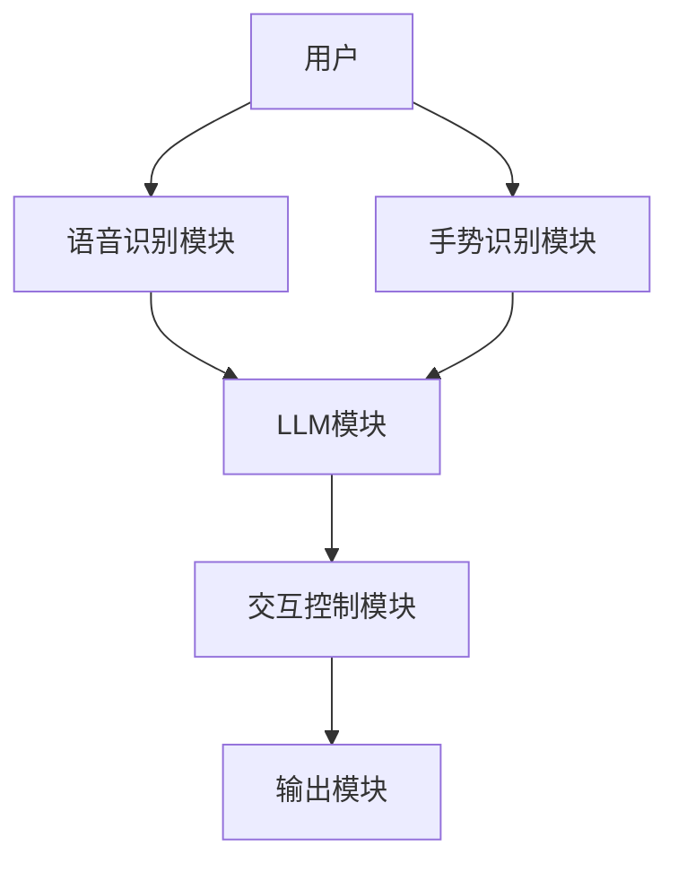
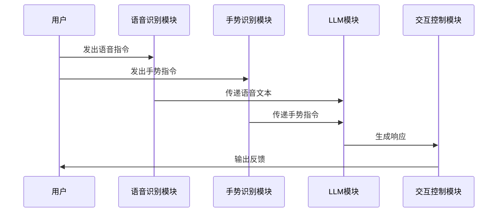

                 


# AI Agent的多模态交互：整合LLM与语音、手势识别

---

## 关键词：AI Agent, 多模态交互, LLM, 语音识别, 手势识别, 人机交互, 虚拟助手

---

## 摘要：  
本文探讨了AI Agent在多模态交互中的应用，重点分析了如何整合大语言模型（LLM）与语音、手势识别技术，实现更自然、更高效的用户交互。文章从AI Agent的基本概念出发，深入讲解了多模态交互的核心原理，分析了LLM与语音、手势识别的协同工作方式，并通过实际案例展示了如何构建一个多模态交互系统。最后，本文总结了当前技术的优势与挑战，并展望了未来的发展方向。

---

# 第1章: AI Agent与多模态交互概述

## 1.1 AI Agent的基本概念

### 1.1.1 AI Agent的定义与特点  
AI Agent（人工智能代理）是指能够感知环境、自主决策并执行任务的智能实体。它具备以下特点：  
1. **自主性**：能够在没有外部干预的情况下独立运行。  
2. **反应性**：能够实时感知环境并做出响应。  
3. **目标导向**：以实现特定目标为导向执行任务。  
4. **学习能力**：通过数据和经验不断优化自身性能。  

### 1.1.2 多模态交互的必要性  
多模态交互是指通过多种感官渠道（如视觉、听觉、触觉等）进行信息交换的方式。在AI Agent中引入多模态交互，可以显著提升用户体验，使其更加自然和便捷。例如，用户可以通过语音指令或手势动作与AI Agent交互，而AI Agent也可以通过视觉或语音反馈与用户互动。

### 1.1.3 LLM在多模态交互中的作用  
大语言模型（LLM）如GPT-3、PaLM等，具备强大的自然语言处理能力，能够理解上下文、推理意图，并生成自然的文本回复。在多模态交互中，LLM可以作为AI Agent的核心大脑，负责解析用户的输入（如语音或手势指令），并生成相应的输出（如文本、语音或动作）。

---

## 1.2 多模态交互的核心概念

### 1.2.1 多模态交互的定义与特点  
多模态交互是指通过多种信息模态（如文本、语音、图像、手势等）进行信息交换的方式。其主要特点包括：  
1. **多样性**：支持多种交互方式，满足不同用户的需求。  
2. **灵活性**：能够根据场景动态调整交互模态。  
3. **高效性**：通过结合多种模态信息，提升交互效率。  

### 1.2.2 LLM与多模态交互的关系  
LLM在多模态交互中扮演着核心角色。它不仅能够处理文本信息，还能与其他模态数据（如语音、图像）进行关联分析。例如，用户可以通过语音指令激活AI Agent，同时通过手势进一步细化指令，而LLM则负责理解这些指令并生成相应的响应。

### 1.2.3 多模态交互的优势与挑战  
- **优势**：  
  1. 提高用户体验：多模态交互更加自然，符合人类的交流习惯。  
  2. 提升系统理解能力：结合多种模态信息可以减少单一模态的局限性。  
  3. 扩展应用领域：多模态交互适用于更多复杂场景，如智能助手、机器人控制等。  
- **挑战**：  
  1. **技术复杂性**：整合多种模态数据需要复杂的算法和架构设计。  
  2. **数据融合**：如何有效融合语音、手势等多模态数据是一个难点。  
  3. **隐私与安全**：多模态交互可能涉及用户的敏感信息，需注意隐私保护。  

---

## 1.3 本章小结  
本章介绍了AI Agent的基本概念及其在多模态交互中的作用，并分析了多模态交互的核心概念、优势与挑战。接下来，我们将深入探讨LLM与语音、手势识别的结合方式，以及如何构建一个多模态交互系统。

---

# 第2章: LLM与语音、手势识别的结合

## 2.1 LLM与语音识别的结合

### 2.1.1 语音识别的基本原理  
语音识别是将人类语音信号转换为文本的技术。其核心步骤包括：  
1. **语音信号预处理**：如降噪、特征提取（如MFCC）。  
2. **模式匹配**：通过概率模型（如HMM）或深度学习模型（如CNN、Transformer）进行语音识别。  

### 2.1.2 LLM在语音交互中的应用  
LLM可以与语音识别技术结合，实现语音指令的理解与执行。例如，用户可以通过语音指令激活AI Agent，LLM负责解析指令并生成相应的文本或动作响应。

### 2.1.3 语音与LLM的协同工作流程  
1. **语音输入**：用户通过语音输入指令。  
2. **语音识别**：将语音转换为文本。  
3. **LLM解析**：LLM理解文本指令并生成响应。  
4. **语音输出**：AI Agent通过语音合成技术将响应输出给用户。  

---

## 2.2 LLM与手势识别的结合

### 2.2.1 手势识别的基本原理  
手势识别是通过计算机视觉技术识别人类手势动作的过程。其核心步骤包括：  
1. **图像采集**：获取用户的手势图像。  
2. **特征提取**：提取手势的关键特征（如手部姿势、运动轨迹）。  
3. **模式匹配**：通过机器学习或深度学习模型识别手势类别。  

### 2.2.2 LLM在手势交互中的应用  
LLM可以与手势识别技术结合，实现手势指令的理解与执行。例如，用户可以通过手势激活AI Agent，并通过手势进一步细化指令，而LLM负责解析这些手势指令并生成相应的响应。

### 2.2.3 手势与LLM的协同工作流程  
1. **手势输入**：用户通过手势输入指令。  
2. **手势识别**：将手势转换为可理解的指令。  
3. **LLM解析**：LLM理解指令并生成响应。  
4. **视觉输出**：AI Agent通过视觉反馈将响应展示给用户。  

---

## 2.3 LLM与语音、手势识别的协同优化

### 2.3.1 多模态数据的融合与关联  
为了实现语音与手势的协同优化，需要将两种模态数据进行关联分析。例如，当用户发出语音指令时，系统可以通过手势进一步确认指令的准确性。

### 2.3.2 多模态模型的设计与训练  
可以设计一个多模态模型，将语音和手势数据输入模型，通过联合训练的方式提升模型的多模态理解能力。

### 2.3.3 协同优化的优势  
通过协同优化，可以显著提升用户体验，使其在交互过程中更加自然和高效。例如，用户可以通过语音和手势的结合，实现更复杂的指令操作。

---

## 2.4 本章小结  
本章详细探讨了LLM与语音、手势识别的结合方式，并分析了协同优化的策略与优势。接下来，我们将从系统架构的角度，探讨如何实现一个多模态交互系统。

---

# 第3章: 多模态交互系统的架构设计

## 3.1 系统架构设计概述

### 3.1.1 系统功能模块划分  
一个多模态交互系统通常包含以下几个功能模块：  
1. **语音识别模块**：负责语音信号的采集与转换。  
2. **手势识别模块**：负责手势图像的采集与识别。  
3. **LLM模块**：负责指令的理解与响应生成。  
4. **交互控制模块**：负责协调各模块的协同工作。  

### 3.1.2 系统架构图  


---

## 3.2 系统功能设计

### 3.2.1 系统功能流程  
1. **用户输入**：用户通过语音或手势输入指令。  
2. **模态识别**：系统分别对语音和手势进行识别。  
3. **指令解析**：LLM模块解析用户的指令并生成响应。  
4. **输出反馈**：系统通过语音、文本或视觉方式将响应反馈给用户。  

### 3.2.2 功能流程图  


---

## 3.3 系统实现细节

### 3.3.1 语音识别的实现  
可以使用开源库如`SpeechRecognition`或`pydub`进行语音信号的处理，同时结合深度学习模型如Transformer进行语音识别。

### 3.3.2 手势识别的实现  
可以使用OpenCV或深度学习模型如YOLO或MediaPipe进行手势识别。

### 3.3.3 LLM的实现  
可以使用开源的大语言模型如GPT-2、GPT-3或PaLM，也可以使用API调用如OpenAI的API进行交互。

---

## 3.4 本章小结  
本章详细探讨了多模态交互系统的架构设计与实现细节。接下来，我们将通过一个实际案例，展示如何构建一个多模态交互系统。

---

# 第4章: 多模态交互系统的实现

## 4.1 项目背景与目标

### 4.1.1 项目背景  
随着AI技术的快速发展，多模态交互技术在智能助手、机器人控制等领域得到了广泛应用。本项目旨在通过整合LLM与语音、手势识别技术，构建一个高效、自然的多模态交互系统。

### 4.1.2 项目目标  
1. 实现语音与手势的协同识别。  
2. 构建一个多模态交互系统，支持多种交互方式。  
3. 提供高效的用户体验。

---

## 4.2 系统实现方案

### 4.2.1 系统模块划分  
1. **语音识别模块**：负责语音信号的采集与识别。  
2. **手势识别模块**：负责手势图像的采集与识别。  
3. **LLM模块**：负责指令的理解与响应生成。  
4. **交互控制模块**：负责协调各模块的协同工作。  

### 4.2.2 实现流程  
1. **环境搭建**：安装所需的库与工具（如Python、OpenCV、SpeechRecognition等）。  
2. **语音识别实现**：编写代码实现语音信号的采集与识别。  
3. **手势识别实现**：编写代码实现手势图像的采集与识别。  
4. **LLM集成**：将LLM模块集成到系统中，实现指令的理解与响应生成。  
5. **交互控制实现**：编写代码实现各模块的协同工作。  

---

## 4.3 代码实现与解读

### 4.3.1 语音识别代码示例  
```python
import speech_recognition as sr

r = sr.Recognizer()
mic = sr.Microphone()

with mic as source:
    audio = r.listen(source)
    text = r.recognize_google(audio)
    print("识别到的文本：", text)
```

### 4.3.2 手势识别代码示例  
```python
import cv2

cap = cv2.VideoCapture(0)
while True:
    ret, frame = cap.read()
    cv2.imshow('手势识别', frame)
    if cv2.waitKey(1) & 0xFF == ord('q'):
        break
cap.release()
cv2.destroyAllWindows()
```

### 4.3.3 LLM集成代码示例  
```python
import openai

client = openai.Client('your-api-key')
response = client.chat.completions.create(
    model="gpt-3.5-turbo",
    messages=[{
        "role": "user",
        "content": "请解释一下量子计算的基本原理。"
    }]
)
print(response.choices[0].message.content)
```

---

## 4.4 项目实战与优化

### 4.4.1 项目实战  
通过上述代码实现一个多模态交互系统，用户可以通过语音或手势激活AI Agent，并通过语音或手势与之交互。

### 4.4.2 系统优化  
1. **性能优化**：优化语音和手势识别的算法，提升系统的响应速度。  
2. **用户体验优化**：设计更加自然的交互界面，提升用户体验。  

---

## 4.5 本章小结  
本章通过实际案例展示了如何构建一个多模态交互系统，并提供了详细的代码实现与解读。接下来，我们将总结当前技术的优势与挑战，并展望未来的发展方向。

---

# 第5章: 总结与展望

## 5.1 本章总结  
本文详细探讨了AI Agent的多模态交互技术，分析了LLM与语音、手势识别的结合方式，并通过实际案例展示了如何构建一个多模态交互系统。通过本文的分析，我们可以看到，多模态交互技术在提升用户体验方面具有巨大潜力。

## 5.2 未来展望  
随着AI技术的不断发展，多模态交互技术将变得更加智能化和自然化。未来的研究方向包括：  
1. **多模态数据的深度融合**：进一步提升多模态数据的关联分析能力。  
2. **更高效的算法设计**：开发更高效的算法，提升系统的响应速度。  
3. **更加自然的交互方式**：探索更自然的交互方式，如脑机接口等。  

---

## 5.3 最佳实践 Tips  
- 在实际应用中，建议优先选择开源库与API进行快速开发。  
- 注意数据隐私与安全问题，确保用户的敏感信息不被泄露。  
- 在系统设计中，注重模块化设计，便于后续的优化与扩展。

---

## 5.4 本章小结  
本文总结了当前多模态交互技术的优势与挑战，并展望了未来的发展方向。通过本文的探讨，我们相信，多模态交互技术将在未来的AI应用中发挥更加重要的作用。

---

# 作者：AI天才研究院/AI Genius Institute & 禅与计算机程序设计艺术 /Zen And The Art of Computer Programming

