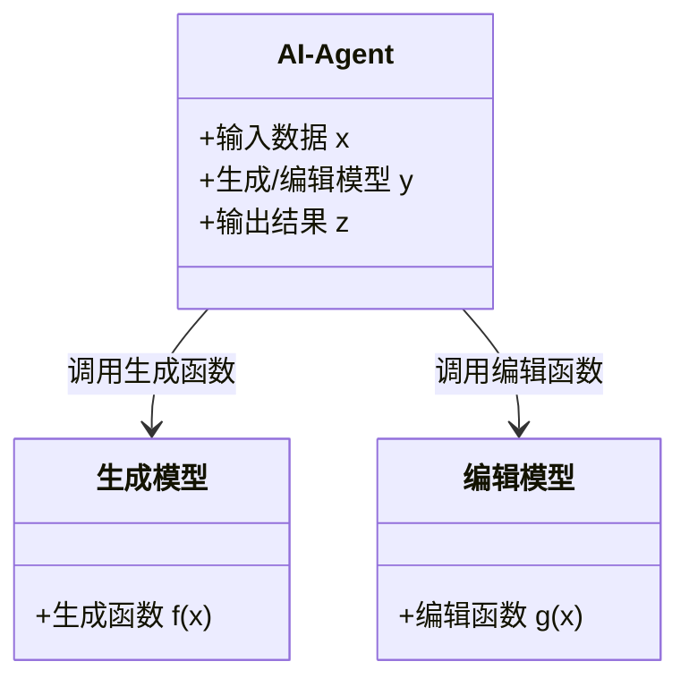
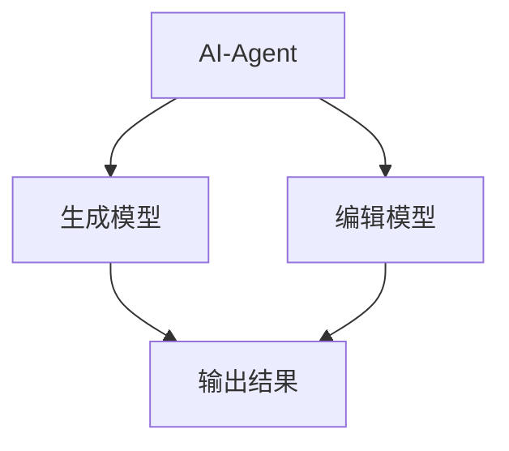
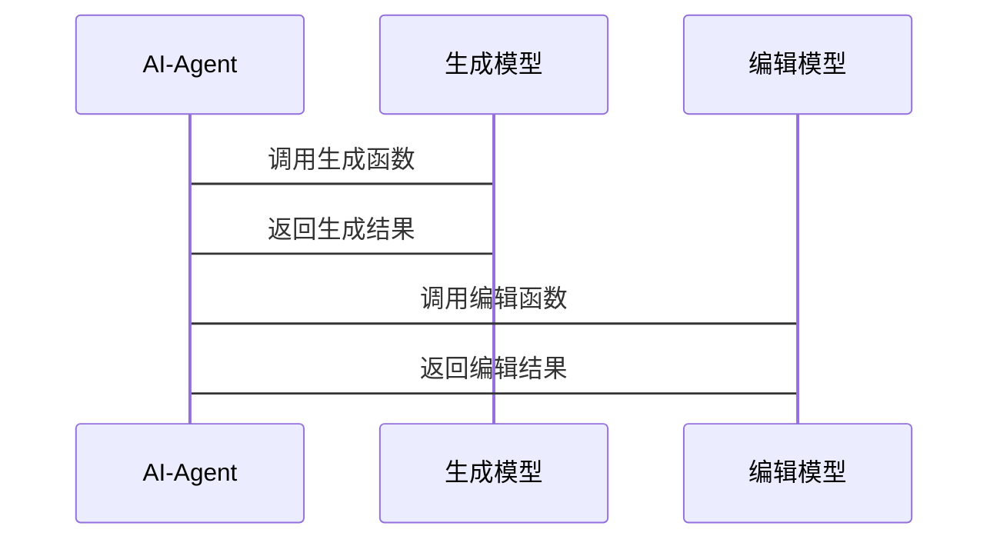

                 


# AI Agent的多模态内容生成与编辑系统

## 关键词：
- AI Agent
- 多模态内容生成
- 内容编辑系统
- 生成模型
- 编辑模型

## 摘要：
AI Agent通过整合多种模态的数据（如文本、图像、音频等），能够实现复杂的内容生成与编辑任务。本文将从AI Agent的基本概念出发，深入探讨多模态内容生成与编辑的核心算法、系统架构设计以及实际项目案例，帮助读者全面理解AI Agent在多模态内容生成与编辑中的应用与实现。

---

## 第1章 AI Agent与多模态内容生成概述

### 1.1 AI Agent的基本概念
#### 1.1.1 什么是AI Agent
AI Agent（人工智能代理）是一种智能实体，能够感知环境、自主决策并执行任务。它通常具备以下核心特征：
- **自主性**：能够在没有外部干预的情况下运行。
- **反应性**：能够根据环境输入动态调整行为。
- **目标导向**：基于预设目标执行任务。
- **学习能力**：通过数据和经验优化自身行为。

#### 1.1.2 AI Agent的核心特征
| 特征         | 描述                           |
|--------------|--------------------------------|
| 自主性       | 能够独立运行                   |
| 反应性       | 根据环境反馈调整行为           |
| 目标导向     | 为实现特定目标而行动           |
| 学习能力     | 通过经验优化行为               |

#### 1.1.3 AI Agent的应用场景
AI Agent广泛应用于多个领域，包括：
- **智能助手**：如Siri、Alexa等。
- **自动驾驶**：通过传感器数据做出驾驶决策。
- **推荐系统**：基于用户行为推荐内容。

### 1.2 多模态内容生成的定义与特点
#### 1.2.1 多模态数据的定义
多模态数据指的是整合了多种数据类型的输入，例如：
- **文本**：如书籍、文章。
- **图像**：如照片、图表。
- **音频**：如音乐、语音。

#### 1.2.2 多模态内容生成的优势
- **丰富性**：结合多种数据类型，生成更丰富的内容。
- **准确性**：通过多模态数据的融合，提高生成内容的准确性。
- **适应性**：能够根据不同的输入模态调整生成策略。

#### 1.2.3 多模态内容生成的应用领域
- **媒体生成**：如视频生成、图像生成。
- **教育领域**：如个性化学习内容生成。
- **医疗领域**：如医疗报告生成。

---

## 第2章 多模态内容生成的核心算法

### 2.1 生成模型的基本原理
#### 2.1.1 生成模型的分类
生成模型主要分为两类：
- **基于规则的生成模型**：通过预设的规则生成内容。
- **基于学习的生成模型**：通过机器学习模型（如神经网络）生成内容。

#### 2.1.2 生成模型的变量关系图
$$x \rightarrow y \rightarrow z$$
其中：
- $x$ 表示输入数据。
- $y$ 表示生成的中间状态。
- $z$ 表示最终生成的输出。

#### 2.1.3 生成模型的数学模型
$$P(y|x) = \text{生成模型}$$

### 2.2 编辑模型的算法实现
#### 2.2.1 编辑模型的基本原理
编辑模型通过调整已有的内容生成新的输出。例如：
- **图像编辑**：调整亮度、对比度等。
- **文本编辑**：修改句子结构。

#### 2.2.2 编辑模型的变量关系
$$x \rightarrow y \rightarrow z$$
其中：
- $x$ 表示输入数据。
- $y$ 表示编辑的中间状态。
- $z$ 表示最终编辑的输出。

#### 2.2.3 编辑模型的数学模型
$$P(y|x) = \text{编辑模型}$$

---

## 第3章 AI Agent驱动的多模态生成与编辑

### 3.1 AI Agent在生成过程中的角色
#### 3.1.1 AI Agent作为生成模型的控制器
AI Agent负责协调生成模型的输入和输出，确保生成内容符合预期目标。

#### 3.1.2 AI Agent作为编辑模型的协调者
AI Agent通过分析输入和生成结果，调整编辑模型的参数，以优化生成内容的质量。

#### 3.1.3 AI Agent在生成与编辑中的决策逻辑
AI Agent通过分析输入数据和生成结果，选择最优的生成或编辑策略。

### 3.2 多模态生成与编辑的协同算法
#### 3.2.1 协同生成的数学模型
$$P(y|x) = \text{协同生成模型}$$

#### 3.2.2 协同编辑的数学模型
$$P(y|x) = \text{协同编辑模型}$$

---

## 第4章 系统架构与实现

### 4.1 系统功能设计
#### 4.1.1 领域模型类图


#### 4.1.2 系统架构图


### 4.2 系统接口设计
- **输入接口**：接收多模态输入数据。
- **输出接口**：输出生成或编辑后的结果。
- **控制接口**：AI Agent通过控制接口协调生成和编辑过程。

### 4.3 系统交互序列图


---

## 第5章 项目实战

### 5.1 环境安装
安装必要的库：
```bash
pip install numpy tensorflow keras
```

### 5.2 核心实现代码
#### 生成模型实现
```python
import numpy as np
import tensorflow as tf

def generate(x):
    # 生成模型的实现
    y = tf.keras.layers.Dense(128, activation='relu')(x)
    z = tf.keras.layers.Dense(10, activation='softmax')(y)
    return z
```

#### 编辑模型实现
```python
def edit(x):
    # 编辑模型的实现
    y = tf.keras.layers.Dense(128, activation='relu')(x)
    z = tf.keras.layers.Dense(10, activation='softmax')(y)
    return z
```

### 5.3 案例分析
以图像生成为例：
1. **输入**：一张图片。
2. **生成**：生成一张新的图片。
3. **编辑**：根据生成的图片进行调整，如改变颜色。

---

## 第6章 总结与展望

### 6.1 总结
本文详细介绍了AI Agent在多模态内容生成与编辑中的应用，包括核心概念、算法原理和系统架构设计。

### 6.2 最佳实践
- 在实际应用中，建议结合具体场景选择合适的生成和编辑模型。
- 定期更新模型以适应新的数据和需求。

### 6.3 展望
未来，随着AI技术的不断发展，AI Agent在多模态内容生成与编辑中的应用将更加广泛和智能化。

---

## 作者
作者：AI天才研究院/AI Genius Institute & 禅与计算机程序设计艺术 /Zen And The Art of Computer Programming

