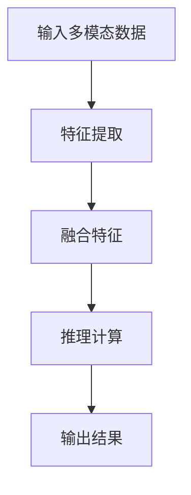

                 


# AI Agent的多模态场景理解与推理

---

## 关键词：
AI Agent, 多模态场景, 场景理解, 推理算法, 系统架构, 项目实战

---

## 摘要：
本文深入探讨AI Agent在多模态场景下的理解与推理能力，结合多模态数据的融合、理解模型的构建、推理算法的设计，以及系统的架构与实现。文章从背景介绍、数据基础、模型构建、算法原理、系统设计到项目实战，层层剖析，为读者提供全面而系统的知识框架，帮助理解AI Agent在多模态场景中的应用与未来发展。

---

## 第一章：AI Agent的基本概念与多模态场景的理解

### 1.1 AI Agent的定义与核心特征
AI Agent（智能体）是指在计算机系统中能够感知环境并采取行动以实现目标的实体。其核心特征包括自主性、反应性、目标导向性和社交能力。AI Agent能够通过传感器或数据源获取信息，并根据预设目标或用户需求做出决策和行动。

#### 1.1.1 多模态数据的定义
多模态数据指的是来自不同感官或数据源的信息，如文本、图像、语音、视频、地理位置等。这些数据类型具有互补性，能够提供更全面的环境信息。

### 1.2 多模态场景的理解与应用
多模态场景理解是AI Agent的核心任务之一，涉及从多源数据中提取、融合和理解信息，以实现对复杂场景的全面认知。例如，在自动驾驶场景中，AI Agent需要同时处理视觉、雷达和GPS等多种数据，以准确识别道路状况、交通信号和周围车辆。

---

## 第二章：多模态数据的基础

### 2.1 多模态数据的类型与特点
多模态数据可以分为以下几种类型：
- **文本数据**：包括自然语言文本、对话记录等。
- **图像数据**：包括照片、视频帧等视觉信息。
- **语音数据**：包括语音信号、音频片段等。
- **地理位置数据**：包括GPS坐标、地图信息等。
- **时间序列数据**：包括传感器数据、用户行为数据等。

### 2.2 多模态数据的融合方法
数据融合是将不同模态的数据进行整合，以提高信息理解和决策能力的过程。常见的融合方法包括：
- **特征级融合**：在特征提取阶段将不同模态的特征向量进行融合。
- **决策级融合**：在决策阶段结合不同模态的输出结果进行综合判断。
- **混合级融合**：结合特征级和决策级的融合方法，综合考虑多模态信息。

---

## 第三章：AI Agent的多模态理解模型

### 3.1 多模态理解模型的构建
多模态理解模型旨在将不同模态的数据进行整合，提取其中的语义信息，并建立模态间的关联关系。常见的模型架构包括：
- **模态编码器**：将每种模态的数据转换为统一的向量表示。
- **融合模块**：将不同模态的向量进行融合，生成全局表示。
- **解码器**：根据融合后的表示生成最终的语义理解结果。

### 3.2 多模态理解模型的实现
以视觉和文本融合为例，可以通过以下步骤实现：
1. **图像特征提取**：使用卷积神经网络（CNN）提取图像的视觉特征。
2. **文本特征提取**：使用词嵌入模型（如Word2Vec）提取文本的语义特征。
3. **特征融合**：将图像和文本特征进行融合，生成统一的向量表示。
4. **语义理解**：通过全连接层或Transformer结构进一步提取高层语义信息。

---

## 第四章：多模态场景推理的算法原理

### 4.1 推理算法的定义
推理是基于已有的知识和信息，推导出新的结论或预测未来状态的过程。在多模态场景下，推理需要结合多种数据源的信息，进行联合分析和决策。

### 4.2 推理算法的数学模型
基于概率论的推理模型是常见的方法之一，例如贝叶斯网络。贝叶斯网络通过构建条件概率分布，描述变量间的依赖关系，并通过概率传播进行推理。

### 4.3 推理算法的流程图
以下是一个多模态推理算法的Mermaid流程图示例：



---

## 第五章：AI Agent的系统架构设计

### 5.1 系统整体架构
AI Agent的多模态推理系统通常包括以下几个模块：
- **数据输入模块**：接收多模态数据输入。
- **数据处理模块**：对数据进行预处理和特征提取。
- **推理计算模块**：基于特征进行推理和决策。
- **结果输出模块**：输出推理结果或触发相应动作。

### 5.2 系统接口设计
- **输入接口**：支持多种数据源的接入，如摄像头、麦克风、传感器等。
- **输出接口**：提供推理结果的输出方式，如文本、语音、动作指令等。

---

## 第六章：项目实战与案例分析

### 6.1 项目环境配置
- **开发环境**：建议使用Python 3.8及以上版本。
- **开发工具**：推荐使用PyCharm或VS Code。
- **依赖库安装**：需要安装TensorFlow、Keras、OpenCV、Numpy等库。

### 6.2 核心代码实现
以下是一个多模态推理的Python代码示例：

```python
import numpy as np
import tensorflow as tf
from tensorflow.keras import layers

# 定义多模态特征融合模型
class MultiModalFusion(tf.keras.Model):
    def __init__(self):
        super(MultiModalFusion, self).__init__()
        self.text_encoder = layers.Dense(128, activation='relu')
        self.img_encoder = layers.Dense(128, activation='relu')
        self.fusion = layers.Dense(64, activation='relu')
        self.classifier = layers.Dense(1, activation='sigmoid')

    def call(self, inputs):
        text_features = self.text_encoder(inputs[0])
        img_features = self.img_encoder(inputs[1])
        fused = tf.keras.layers.concatenate([text_features, img_features])
        output = self.fusion(fused)
        output = self.classifier(output)
        return output

# 初始化模型
model = MultiModalFusion()
model.compile(optimizer='adam', loss='binary_crossentropy', metrics=['accuracy'])

# 训练模型
model.fit([text_data, img_data], labels, epochs=10, batch_size=32)
```

### 6.3 案例分析
以一个智能家居场景为例，AI Agent需要根据用户的语音指令和环境传感器数据，推理用户的意图并执行相应的操作，如调节室温、开启灯光等。

---

## 第七章：最佳实践与总结

### 7.1 小结
本文从AI Agent的基本概念出发，详细探讨了多模态场景的理解与推理能力，包括数据融合、模型构建、算法设计和系统实现等关键环节。

### 7.2 注意事项
- 数据质量和多样性对推理性能有重要影响，需注意数据预处理和清洗。
- 在实际应用中，需考虑系统的实时性和响应速度，优化推理算法的效率。

### 7.3 拓展阅读
- 推荐阅读《Deep Learning》（Ian Goodfellow等著）和《Probabilistic Graphical Models》（David Koller等著）以深入理解相关理论。

---

## 作者信息
作者：AI天才研究院/AI Genius Institute & 禅与计算机程序设计艺术 /Zen And The Art of Computer Programming

---

通过以上结构，文章详细探讨了AI Agent在多模态场景下的理解与推理能力，结合理论与实践，为读者提供了全面的知识框架。

