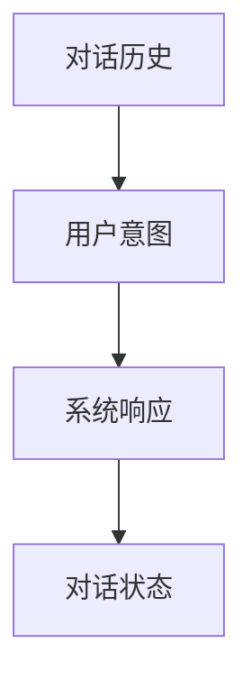
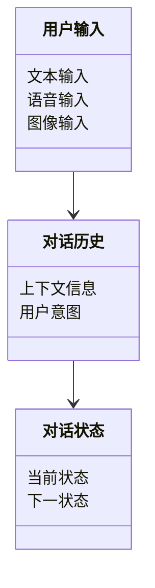
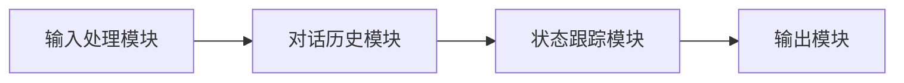
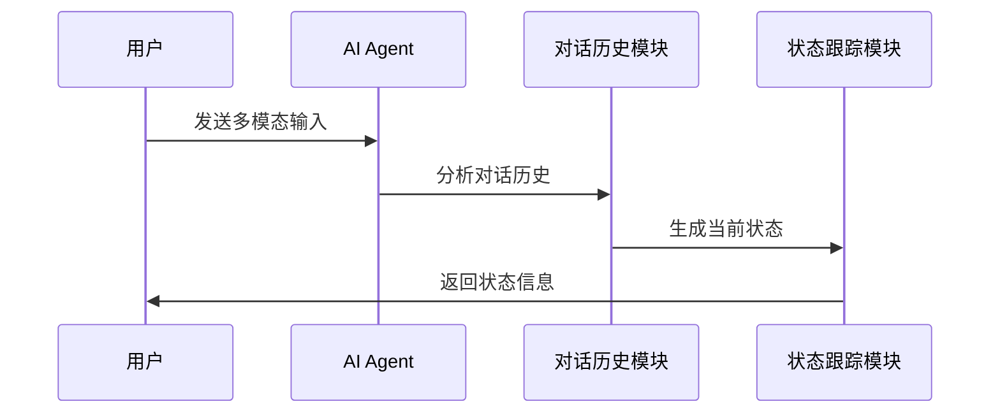

                 


# AI Agent的多模态对话状态跟踪

## 关键词：AI Agent, 多模态对话, 对话状态跟踪, 自然语言处理, 机器学习

## 摘要：  
AI Agent的多模态对话状态跟踪是当前人工智能领域的研究热点。随着对话系统从单一模态向多模态发展，如何有效跟踪对话状态成为实现高效人机交互的核心挑战。本文将从理论基础、算法原理、系统架构到实际应用，全面解析AI Agent的多模态对话状态跟踪技术。通过分析多模态数据的融合方法、对话历史的建模方式以及深度学习模型的应用，为读者呈现一个系统化、实用化的技术框架。

---

## 第一部分: 多模态对话状态跟踪的背景与概念

### 第1章: 多模态对话的背景与应用

#### 1.1 多模态数据的定义与特点
- **多模态数据**：指同时包含文本、语音、图像、视频等多种数据形式的信息。
- **特点**：信息互补性强、数据量大、处理复杂度高。

#### 1.2 多模态对话的应用场景
- 智能客服：通过文本和语音交互提供服务。
- 智能助手：结合语音和图像识别实现多任务处理。
- 智能教育：通过多模态数据提供个性化的学习支持。

#### 1.3 多模态对话的挑战
- 数据异构性：不同模态的数据格式和特征差异大。
- 计算复杂度：多模态数据的处理需要更高的计算资源。
- 信息融合：如何有效整合多种模态信息是关键。

### 第2章: AI Agent的基本概念

#### 2.1 AI Agent的定义
- AI Agent：具有感知环境、自主决策和执行任务能力的智能体。
- 核心功能：感知、推理、决策、执行。

#### 2.2 多模态对话中的AI Agent
- AI Agent需要处理多模态输入并生成多模态输出。
- 对话状态跟踪是AI Agent实现智能交互的基础。

### 第3章: 多模态对话状态跟踪的核心概念

#### 3.1 对话状态的定义
- 对话状态：对话过程中系统对当前对话内容的语义理解和上下文信息的表示。
- 包括用户意图、对话历史、上下文信息等。

#### 3.2 多模态数据在对话中的作用
- 文本：提供对话内容的语义信息。
- 语音：传递语气、情感信息。
- 图像：提供视觉辅助信息。
- 视频：结合动作、表情等信息增强对话理解。

#### 3.3 状态跟踪的目标
- 准确捕捉对话中的关键信息。
- 维持对话的连贯性和一致性。
- 支持后续对话的智能生成。

---

## 第二部分: 多模态对话状态跟踪的核心概念与联系

### 第4章: 多模态数据的融合方法

#### 4.1 多模态数据的融合方式
- **特征级融合**：将不同模态的特征向量进行合并。
- **决策级融合**：在决策阶段整合不同模态的信息。
- **晚期融合**：在处理后期进行信息整合。

#### 4.2 多模态数据的特征对比
| 模态 | 特征维度 | 信息密度 | 处理复杂度 |
|------|----------|----------|------------|
| 文本 | 词向量、语义向量 | 高 | 低 |
| 语音 | 音调、语速、情感特征 | 中 | 中 |
| 图像 | 图像特征向量 | 高 | 高 |
| 视频 | 多帧图像特征 | 高 | 高 |

#### 4.3 ER实体关系图


---

## 第三部分: 多模态对话状态跟踪的算法原理

### 第5章: 基于规则的对话状态跟踪

#### 5.1 基于规则的方法
- **规则定义**：通过预定义的规则匹配对话内容。
- **实现步骤**：
  1. 分析对话内容。
  2. 匹配预定义的规则。
  3. 输出对应的状态。

#### 5.2 优缺点分析
- 优点：简单易实现，适用于规则明确的场景。
- 缺点：难以处理复杂场景，规则维护成本高。

### 第6章: 统计模型方法

#### 6.1 统计模型的原理
- 基于概率的对话状态跟踪。
- 使用朴素贝叶斯模型进行分类。

#### 6.2 实现步骤
- 数据预处理：文本分词、特征提取。
- 建模：训练概率模型。
- 预测：根据输入生成状态。

#### 6.3 优缺点分析
- 优点：能够处理复杂场景，泛化能力强。
- 缺点：依赖于数据质量，模型性能受数据偏差影响。

### 第7章: 深度学习模型

#### 7.1 神经网络的结构
- 使用循环神经网络（RNN）或Transformer模型处理对话序列。

#### 7.2 注意力机制的应用
- 通过注意力机制捕捉对话中的关键信息。

#### 7.3 Transformer模型的使用
- 采用多层Transformer结构，增强对话上下文的理解能力。

#### 7.4 优缺点分析
- 优点：能够处理长距离依赖关系，模型表达能力强。
- 缺点：计算资源消耗大，训练时间长。

---

## 第四部分: 多模态对话状态跟踪的数学模型与公式

### 第8章: 对话状态的概率表示

#### 8.1 条件概率公式
$$ P(state|input) = \frac{P(input|state)P(state)}{P(input)} $$

#### 8.2 贝叶斯网络的应用
- 构建贝叶斯网络模型，表示状态与输入之间的关系。

### 第9章: 多模态融合的加权和模型

#### 9.1 加权和模型
$$ f(x) = \sum_{i=1}^{n} w_i x_i $$

#### 9.2 注意力机制的数学表达
$$ \text{Attention}(Q, K, V) = \text{softmax}\left(\frac{QK^T}{\sqrt{d_k}}\right)V $$

---

## 第五部分: 系统分析与架构设计

### 第10章: 系统功能设计

#### 10.1 领域模型


#### 10.2 系统架构设计


### 第11章: 系统接口设计

#### 11.1 系统接口
- 输入接口：接收多模态数据。
- 输出接口：输出对话状态信息。

#### 11.2 系统交互流程


---

## 第六部分: 项目实战

### 第12章: 环境配置与代码实现

#### 12.1 环境配置
- Python 3.8+
- PyTorch 1.9+
- transformers库

#### 12.2 核心代码实现

```python
import torch
from transformers import AutoTokenizer, AutoModelForSeq2Seq

tokenizer = AutoTokenizer.from_pretrained('t5-base')
model = AutoModelForSeq2Seq.from_pretrained('t5-base')

def process_input(input_text):
    inputs = tokenizer(input_text, return_tensors='pt')
    outputs = model.generate(inputs.input_ids)
    return tokenizer.decode(outputs[0], skip_special_tokens=True)
```

---

## 第七部分: 总结与扩展

### 第13章: 总结与最佳实践

#### 13.1 核心总结
- 多模态对话状态跟踪是AI Agent实现智能交互的关键技术。
- 深度学习模型在复杂场景中表现优异。
- 系统设计需要综合考虑数据融合、模型选择和计算资源。

#### 13.2 最佳实践
- 数据预处理是关键，确保数据质量和一致性。
- 模型选择要根据具体场景灵活调整。
- 系统优化需要关注计算效率和资源分配。

### 第14章: 未来展望与拓展阅读

#### 14.1 未来展望
- 更高效的多模态融合方法。
- 更智能的对话状态预测模型。
- 更广泛的应用场景探索。

#### 14.2 拓展阅读
- 《Deep Learning for NLP》
- 《Multi-Modal Dialogue Systems》
- 《Probabilistic Graphical Models》

---

## 作者：AI天才研究院/AI Genius Institute & 禅与计算机程序设计艺术 /Zen And The Art of Computer Programming

