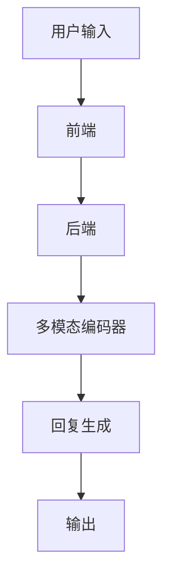

                 


# AI Agent的多模态对话系统：整合视觉和语言理解

## 关键词：AI Agent，多模态对话系统，视觉理解，语言理解，自然语言处理，深度学习

## 摘要：本文深入探讨了AI Agent在多模态对话系统中的应用，重点分析了如何整合视觉和语言理解。文章从背景、核心概念、算法原理、系统架构到实战应用，全面解析了多模态对话系统的构建与优化。通过详细的技术分析和实例，本文为读者提供了从理论到实践的完整指南。

---

## 第一部分: 多模态对话系统的背景与概念

### 第1章: 多模态对话系统的背景与概念

#### 1.1 多模态对话系统的背景

- **1.1.1 从单模态到多模态对话的演进**  
  传统对话系统主要依赖文本或语音输入，难以处理复杂场景。随着技术进步，多模态对话系统逐渐成为研究热点，能够整合视觉、语言等多种模态信息，提升对话的准确性和用户体验。

- **1.1.2 AI Agent在对话系统中的角色**  
  AI Agent作为多模态对话系统的主体，负责接收输入、处理信息并生成输出。它需要具备跨模态理解和生成能力，能够协调多种模态数据完成对话任务。

- **1.1.3 多模态对话系统的定义与特点**  
  多模态对话系统是指能够同时处理和利用多种模态信息（如文本、图像、语音等）的对话系统。其特点是信息丰富、交互自然、理解能力强。

#### 1.2 多模态对话系统的应用背景

- **1.2.1 当前对话系统的局限性**  
  传统单模态对话系统在处理复杂问题时表现不足，例如无法理解上下文中的视觉信息，导致对话不够流畅。

- **1.2.2 多模态技术的引入动机**  
  通过整合视觉和语言信息，多模态对话系统能够提供更精准的理解和生成，提升用户体验。

- **1.2.3 多模态对话系统的潜在价值**  
  在教育、医疗、客服等领域，多模态对话系统能够提供更智能的服务，例如通过图像识别辅助诊断。

#### 1.3 多模态对话系统的边界与外延

- **1.3.1 系统边界分析**  
  多模态对话系统的核心功能包括输入处理、信息理解、对话生成和输出。其边界在于如何高效整合多种模态信息。

- **1.3.2 外延与相关技术的联系**  
  多模态对话系统与计算机视觉、自然语言处理、语音识别等领域密切相关，通过整合这些技术实现多模态交互。

- **1.3.3 核心要素组成分析**  
  系统由输入模块、处理模块和输出模块组成，每个模块负责不同的任务，协同工作以实现对话目标。

#### 1.4 本章小结

本章介绍了多模态对话系统的背景、定义、特点及其应用价值，为后续内容奠定了基础。

---

## 第二部分: 多模态对话系统的核心概念与联系

### 第2章: 多模态对话系统的概念与原理

#### 2.1 多模态数据处理原理

- **2.1.1 视觉与语言模态的特征分析**  
  视觉模态包括图像、视频等，语言模态包括文本、语音等。不同模态具有不同的特征，例如图像具有空间信息，文本具有语义信息。

- **2.1.2 多模态数据融合方法**  
  数据融合可以通过早期融合和晚期融合实现。早期融合将不同模态的数据在低级特征阶段进行整合，晚期融合则在高级语义阶段进行整合。

- **2.1.3 对话生成的多模态特征利用**  
  在对话生成阶段，多模态特征可以用于生成更准确和丰富的回复。

#### 2.2 跨模态理解的核心原理

- **2.2.1 跨模态理解的定义**  
  跨模态理解是指系统能够理解不同模态的数据，并在它们之间建立关联。

- **2.2.2 跨模态理解的关键技术**  
  包括跨模态注意力机制、跨模态对比学习等，这些技术能够增强系统对不同模态信息的理解能力。

- **2.2.3 跨模态理解的数学模型**  
  例如，跨模态注意力机制可以表示为：
  $$\alpha_i = \frac{e^{q_i^T w_i}}{\sum_j e^{q_j^T w_j}}$$
  其中，$\alpha_i$ 是第i个模态的注意力权重，$q_i$ 是查询向量，$w_i$ 是权重参数。

#### 2.3 多模态对话系统的整体架构

- **2.3.1 系统模块划分**  
  系统通常包括输入模块、处理模块和输出模块。

- **2.3.2 模块之间的关系与交互**  
  输入模块接收多模态数据，处理模块整合并理解数据，输出模块生成回复。

- **2.3.3 系统的输入输出流程**  
  输入：多模态数据（如文本和图像）；输出：整合了视觉和语言信息的回复。

#### 2.4 本章小结

本章详细讲解了多模态数据处理、跨模态理解以及对话系统整体架构，为后续算法分析奠定了基础。

---

## 第三部分: 多模态对话系统的算法原理

### 第3章: 多模态对话系统的算法流程

#### 3.1 多模态编码器的设计

- **3.1.1 视觉模态编码器**  
  使用卷积神经网络（CNN）或视觉变换器（ViT）对图像进行编码，生成视觉特征向量。

- **3.1.2 语言模态编码器**  
  使用BERT或GPT等模型对文本进行编码，生成语言特征向量。

- **3.1.3 跨模态编码器的设计**  
  跨模态编码器将视觉和语言特征向量进行融合，生成多模态编码。

#### 3.2 多模态解码器的设计

- **3.2.1 对话生成的解码器**  
  使用生成对抗网络（GAN）或变换器模型生成回复文本。

- **3.2.2 跨模态信息的融合方法**  
  通过交叉注意力机制将视觉信息融入语言生成过程。

- **3.2.3 解码器的训练策略**  
  使用端到端训练方法，优化多模态特征的生成能力。

#### 3.3 多模态对话系统的整体算法

- **3.3.1 算法整体流程**  
  1. 接收输入（文本和图像）；  
  2. 通过编码器生成多模态特征；  
  3. 解码器生成回复文本；  
  4. 输出回复。

- **3.3.2 算法的数学模型**  
  多模态编码器可以表示为：
  $$z = f_{\text{encode}}(x_{\text{text}}, x_{\text{image}})$$
  其中，$x_{\text{text}}$ 是文本输入，$x_{\text{image}}$ 是图像输入，$f_{\text{encode}}$ 是编码器函数。

- **3.3.3 算法的优化方法**  
  使用交叉熵损失函数优化生成回复的准确性和流畅性。

#### 3.4 本章小结

本章详细介绍了多模态对话系统的编码和解码过程，及其数学模型和优化策略。

---

## 第四部分: 多模态对话系统的数学模型与公式

### 第4章: 多模态对话系统的数学模型

#### 4.1 多模态编码器的数学表示

- **4.1.1 视觉模态编码器**  
  使用CNN提取图像特征：
  $$f_{\text{CNN}}(x_{\text{image}}) = \{v_1, v_2, ..., v_n\}$$
  其中，$v_i$ 是第i个视觉特征向量。

- **4.1.2 语言模态编码器**  
  使用BERT提取文本特征：
  $$f_{\text{BERT}}(x_{\text{text}}) = \{t_1, t_2, ..., t_m\}$$
  其中，$t_j$ 是第j个语言特征向量。

- **4.1.3 跨模态编码器**  
  跨模态编码器将视觉和语言特征融合：
  $$z = \text{融合}(v_i, t_j)$$

#### 4.2 跨模态注意力机制

- **4.2.1 跨模态注意力公式**  
  跨模态注意力机制可以表示为：
  $$\alpha_i = \frac{\exp(w_i^T z)}{\sum_j \exp(w_j^T z)}$$
  其中，$w_i$ 是注意力权重，$z$ 是多模态编码。

- **4.2.2 注意力权重的应用**  
  通过注意力权重加权融合不同模态的信息，生成最终的回复向量。

#### 4.3 多模态对话系统的损失函数

- **4.3.1 交叉熵损失函数**  
  损失函数可以表示为：
  $$L = -\sum_{i=1}^n y_i \log p_i$$
  其中，$y_i$ 是真实标签，$p_i$ 是生成概率。

---

## 第五部分: 多模态对话系统的系统分析与架构设计

### 第5章: 多模态对话系统的系统分析

#### 5.1 系统应用场景

- **5.1.1 教育领域**  
  例如，智能辅导系统可以通过图像识别和自然语言理解为学生提供个性化指导。

- **5.1.2 医疗领域**  
  医疗对话系统可以结合医学图像和文本信息，辅助医生进行诊断。

- **5.1.3 客服领域**  
  客服机器人可以结合客户提供的图像信息，提供更精准的服务。

#### 5.2 系统功能设计

- **5.2.1 领域模型设计**  
  领域模型包括用户输入、系统处理和输出模块。

- **5.2.2 系统架构设计**  
  系统架构通常包括前端和后端，前端接收用户输入，后端处理并生成回复。

- **5.2.3 接口与交互流程**  
  系统通过API接口接收输入，处理后通过HTTP返回回复。

#### 5.3 系统架构图

使用Mermaid绘制系统架构图：



---

## 第六部分: 多模态对话系统的项目实战

### 第6章: 多模态对话系统的项目实战

#### 6.1 环境搭建与安装

- **6.1.1 安装Python和相关库**  
  使用Python 3.8及以上版本，安装PyTorch、Hugging Face Transformers等库。

#### 6.2 系统核心实现

- **6.2.1 多模态编码器实现**  
  使用PyTorch实现多模态编码器，融合文本和图像特征。

- **6.2.2 对话生成实现**  
  使用生成对抗网络或变换器模型生成回复文本。

#### 6.3 代码应用解读与分析

- **6.3.1 多模态编码器代码示例**  
  ```python
  import torch
  class MultiModalEncoder(torch.nn.Module):
      def __init__(self):
          super().__init__()
          self.text_encoder = TextEncoder()
          self.image_encoder = ImageEncoder()
      def forward(self, text_input, image_input):
          text_feat = self.text_encoder(text_input)
          image_feat = self.image_encoder(image_input)
          fused_feat = torch.cat([text_feat, image_feat], dim=-1)
          return fused_feat
  ```

- **6.3.2 对话生成代码示例**  
  ```python
  import torch
  class DialogGenerator(torch.nn.Module):
      def __init__(self):
          super().__init__()
          self.decoder = DialogDecoder()
      def forward(self, fused_feat):
          output = self.decoder(fused_feat)
          return output
  ```

#### 6.4 实际案例分析

- **6.4.1 案例1**  
  用户输入文本“这个图片中的花卉是什么？”和相关花卉图像，系统通过图像识别和文本理解生成回复“这是一朵玫瑰花”。

- **6.4.2 案例2**  
  用户输入“如何制作蛋糕？”和相关步骤图像，系统生成详细的制作步骤。

#### 6.5 项目小结

本章通过实际项目展示了多模态对话系统的搭建和实现过程，为读者提供了实践指导。

---

## 第七部分: 多模态对话系统的最佳实践与未来展望

### 第7章: 多模态对话系统的最佳实践

#### 7.1 数据预处理与优化

- **7.1.1 数据清洗与标注**  
  确保多模态数据的质量，例如去除噪声和标注不一致的数据。

- **7.1.2 数据增强技术**  
  使用数据增强技术提高模型的泛化能力，例如图像旋转、文本替换等。

#### 7.2 模型调优与优化

- **7.2.1 超参数优化**  
  使用网格搜索或随机搜索优化模型参数。

- **7.2.2 模型压缩与轻量化**  
  通过知识蒸馏等技术减少模型大小，提高推理速度。

#### 7.3 系统优化与扩展

- **7.3.1 系统性能优化**  
  使用并行计算和分布式训练提高训练效率。

- **7.3.2 系统扩展与应用**  
  将系统应用于更多场景，例如智能家居、自动驾驶等领域。

#### 7.4 未来研究方向

- **7.4.1 更多模态的整合**  
  例如，整合触觉、嗅觉等更多模态信息。

- **7.4.2 模型可解释性研究**  
  提高模型的可解释性，增强用户信任。

- **7.4.3 对话系统的实时性优化**  
  优化系统响应速度，提升用户体验。

#### 7.5 本章小结

本章总结了多模态对话系统的优化方法和未来发展方向，为读者提供了进一步研究的思路。

---

## 第八部分: 总结与展望

### 第8章: 总结与展望

#### 8.1 全文总结

本文系统地介绍了AI Agent的多模态对话系统，从背景、核心概念、算法原理到系统架构和实战应用，为读者提供了全面的知识体系。

#### 8.2 未来展望

随着技术进步，多模态对话系统将更加智能化和人性化，应用场景也将更加广泛。未来的研究将集中在模型可解释性、多模态数据处理效率和系统实时性优化等方面。

---

## 作者：AI天才研究院/AI Genius Institute & 禅与计算机程序设计艺术 /Zen And The Art of Computer Programming

