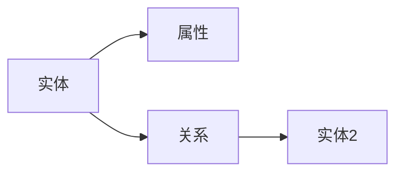
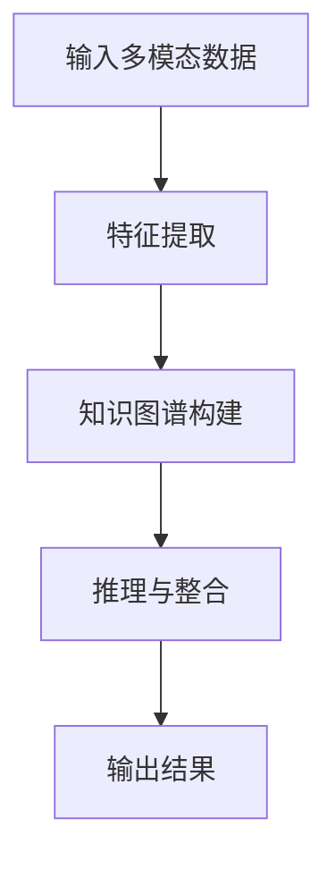

                 


# AI Agent的多模态常识推理与知识整合

## 关键词：AI Agent, 多模态数据, 常识推理, 知识整合, 知识图谱, 图神经网络, 多模态融合

## 摘要：本文详细探讨了AI Agent在多模态常识推理与知识整合领域的核心概念、算法原理和系统架构。通过分析多模态数据的特点、常识推理的挑战以及知识图谱的构建方法，结合实际项目案例，展示了如何通过先进的算法和技术实现高效的多模态常识推理与知识整合，为AI Agent的发展提供了理论和实践指导。

---

## 第一部分: AI Agent与多模态常识推理概述

### 第1章: AI Agent的基本概念与问题背景

#### 1.1 AI Agent的基本概念

AI Agent（智能体）是指在计算机系统中能够感知环境并采取行动以实现目标的实体。它具备自主性、反应性、目标导向性和社会性等特性。AI Agent可以是软件程序、机器人或其他智能系统，广泛应用于自动驾驶、智能助手、推荐系统等领域。

**多模态数据**是指包含多种类型的数据，如文本、图像、语音、视频等。多模态数据的整合能够提供更全面的信息，帮助AI Agent更好地理解和处理复杂任务。

**常识推理**是指AI系统在处理信息时，能够基于常识知识库进行逻辑推理，理解事物之间的关系和属性。常识推理是实现智能问答、语义理解等任务的关键技术。

#### 1.2 问题背景与意义

随着AI技术的快速发展，AI Agent在各个领域的应用越来越广泛。然而，现有的AI Agent在处理复杂任务时仍然面临诸多挑战，特别是在多模态数据的整合与常识推理方面。多模态数据的复杂性要求AI Agent能够有效融合不同类型的感知信息，而常识推理则需要系统具备丰富的背景知识和逻辑推理能力。

**多模态数据整合**的难点在于不同模态数据的特征提取和有效融合。例如，图像数据和文本数据的特征空间差异较大，如何在统一的框架下进行有效融合是一个关键问题。

**常识推理**的核心挑战在于如何构建和应用常识知识库。现有的知识图谱虽然包含了大量的结构化知识，但在动态变化的场景中难以实时更新和适应。

#### 1.3 问题描述与解决思路

多模态常识推理与知识整合的问题可以归结为以下几点：

1. **数据异构性**：不同模态的数据格式和特征空间差异较大，如何实现有效的数据融合是一个技术难题。
2. **常识覆盖不足**：现有的常识知识库可能无法覆盖所有可能的场景，如何动态扩展知识库是一个挑战。
3. **推理效率**：在处理复杂任务时，常识推理需要高效地进行跨模态信息处理和逻辑推理，这对算法的效率提出了较高的要求。

为了解决这些问题，我们可以采用以下思路：

- **多模态数据融合**：通过设计有效的特征提取和融合方法，将不同模态的数据转化为统一的表示形式，以便进行联合推理。
- **动态知识图谱构建**：基于实时数据和用户反馈，动态更新知识图谱，增强系统的适应性。
- **高效推理算法**：采用图神经网络和注意力机制等深度学习技术，提升常识推理的效率和准确性。

---

## 第二部分: 核心概念与联系

### 第2章: 多模态常识推理的核心概念与联系

#### 2.1 核心概念原理

**多模态数据**：多模态数据的整合需要考虑各个模态数据的特点。例如，文本数据具有语义丰富性，图像数据具有空间特征，语音数据具有时序特性。如何将这些不同特性的数据有效地融合起来，是多模态数据处理的关键。

**常识推理**：常识推理的核心是基于常识知识库进行逻辑推理。例如，知道“鸟会飞”这一常识，可以推断出“鸵鸟是鸟，但不会飞”的例外情况。

**知识整合**：知识整合的目标是将不同来源、不同形式的知识进行统一管理和应用。例如，将文本数据中的实体关系与知识图谱中的结构化数据进行整合，提升系统的知识表达能力。

#### 2.2 核心概念对比分析

以下是多模态数据、常识推理和知识整合的对比分析：

| 概念       | 描述                                                                 |
|------------|----------------------------------------------------------------------|
| 多模态数据   | 包含多种类型的数据，如文本、图像、语音等，具有异构性特征。             |
| 常识推理     | 基于常识知识库进行逻辑推理，解决日常问题中的推理任务。               |
| 知识整合     | 将不同来源、不同形式的知识进行统一管理和应用，提升系统的知识容量。   |

#### 2.3 ER实体关系图架构

以下是多模态常识推理的ER实体关系图：



该图展示了实体、属性和关系之间的关联关系，实体之间的关系可以通过属性进行进一步描述。例如，实体“人”具有属性“年龄”，并通过关系“朋友”与其他实体“朋友”相连。

---

## 第三部分: 算法原理

### 第3章: 多模态常识推理的算法原理

#### 3.1 多模态数据融合算法

**基于注意力机制的多模态融合**：通过注意力机制对不同模态的数据进行加权融合，突出重要信息。例如，在图像描述生成任务中，可以将图像特征和文本特征通过注意力机制进行融合，生成更准确的图像描述。

**多模态特征的加权融合方法**：根据各模态数据的重要性，对其进行加权融合。例如，在语音识别任务中，可以将语音特征和文本上下文特征进行加权融合，提升识别准确率。

**跨模态对比学习**：通过对比学习的方法，将不同模态的数据映射到相同的特征空间，实现跨模态信息的对齐。例如，在图像-文本匹配任务中，可以通过对比学习将图像特征和文本特征对齐，提升匹配准确率。

#### 3.2 常识推理算法

**基于知识图谱的推理算法**：通过知识图谱中的结构信息，进行路径推理和属性推理。例如，通过知识图谱可以推理出“鸟会飞”这一常识，但具体到某个实体（如“鸵鸟”）时，可能需要考虑例外情况。

**基于语言模型的推理算法**：利用预训练语言模型（如BERT、GPT）进行常识推理。例如，在问答任务中，可以通过语言模型生成符合常识的答案。

**基于图神经网络的推理算法**：通过图神经网络对知识图谱中的实体和关系进行建模，进行高效的推理。例如，在复杂的关系推理任务中，图神经网络可以有效地捕捉实体之间的复杂关系。

#### 3.3 算法流程图

以下是多模态常识推理的算法流程图：



该流程图展示了从输入多模态数据到输出结果的整个过程，包括特征提取、知识图谱构建、推理与整合等关键步骤。

---

## 第四部分: 系统分析与架构设计方案

### 第4章: 知识整合与图谱构建

#### 4.1 知识图谱的构建方法

**数据抽取与清洗**：从多模态数据中提取实体、属性和关系信息，并进行清洗和标准化处理。例如，从文本数据中提取实体关系，从图像数据中提取实体属性。

**实体识别与链接**：通过命名实体识别（NER）和实体链接技术，将数据中的实体与知识图谱中的实体进行映射。例如，将文本中的“北京”映射到知识图谱中的“北京”实体。

**关系抽取与构建**：通过自然语言处理技术，从文本数据中抽取实体关系，并将其添加到知识图谱中。例如，从文本“小明是学生”中抽取“小明”和“学生”之间的关系。

#### 4.2 知识图谱的存储与管理

**图数据库的选择**：根据知识图谱的规模和复杂性，选择合适的图数据库。例如，使用Neo4j进行小型知识图谱的存储，使用RDF数据库进行大规模知识图谱的存储。

**知识图谱的索引优化**：通过索引技术优化知识图谱的查询效率。例如，使用前缀树索引优化实体的查找速度。

**知识图谱的动态更新**：根据实时数据和用户反馈，动态更新知识图谱。例如，当发现新的实体关系时，及时更新知识图谱。

---

## 第五部分: 项目实战

### 第5章: 项目实战与案例分析

#### 5.1 项目环境安装

为了进行多模态常识推理与知识整合的开发，首先需要安装以下环境和工具：

- **Python**：建议使用Python 3.8及以上版本。
- **深度学习框架**：如TensorFlow、PyTorch等。
- **知识图谱构建工具**：如Neo4j、RDF4J等。
- **自然语言处理库**：如spaCy、NLTK等。

#### 5.2 核心代码实现

以下是多模态常识推理与知识整合的核心代码实现：

```python
import tensorflow as tf
from tensorflow.keras import layers

# 多模态数据融合模型
class MultiModalFusion(tf.keras.Model):
    def __init__(self, embedding_dim=128):
        super(MultiModalFusion, self).__init__()
        self.embedding_dim = embedding_dim
        self.text_encoder = layers.Dense(embedding_dim, activation='relu')
        self.image_encoder = layers.Dense(embedding_dim, activation='relu')
        self.attention = layers.Attention()

    def call(self, inputs):
        text_features = self.text_encoder(inputs[0])
        image_features = self.image_encoder(inputs[1])
        fused_features = self.attention([text_features, image_features])
        return fused_features

# 基于知识图谱的推理模型
class KnowledgeInference(tf.keras.Model):
    def __init__(self, vocab_size=10000):
        super(KnowledgeInference, self).__init__()
        self.embedding = layers.Embedding(vocab_size, 64)
        self.gcn = layers.GraphConvolution(output_dim=128)

    def call(self, inputs):
        word_embeddings = self.embedding(inputs)
        gcn_output = self.gcn([word_embeddings, adjacency_matrix])
        return gcn_output
```

#### 5.3 案例分析与小结

通过上述代码实现，我们可以构建一个多模态常识推理与知识整合的系统。例如，在一个智能问答系统中，用户可以通过输入文本和图像信息，系统能够基于多模态数据进行融合和常识推理，生成准确的答案。

---

## 第六部分: 总结与展望

### 第6章: 总结与展望

#### 6.1 总结

本文详细探讨了AI Agent在多模态常识推理与知识整合领域的核心概念、算法原理和系统架构。通过分析多模态数据的特点、常识推理的挑战以及知识图谱的构建方法，结合实际项目案例，展示了如何通过先进的算法和技术实现高效的多模态常识推理与知识整合。

#### 6.2 展望

未来的研究方向包括：

1. **动态知识图谱构建**：如何实时更新知识图谱，适应快速变化的环境。
2. **跨模态推理的高效性**：如何进一步提升跨模态推理的效率和准确性。
3. **多模态数据的实时处理**：如何在实时数据流中高效地进行多模态数据的融合和推理。

---

## 作者：AI天才研究院 & 禅与计算机程序设计艺术

